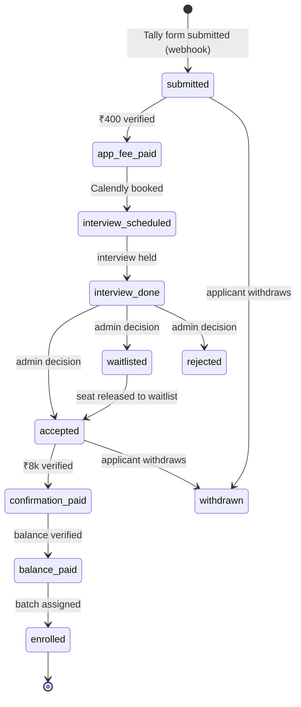
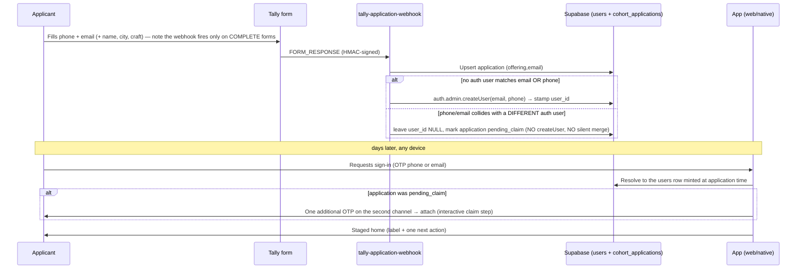

# LevelUp Live Cohorts — Product Requirements Document

*Doc 01 of the cohort product docs set · authored 2026-07-17 on the live-cohort program.*
*Audience is dual on purpose: a founder new to PM/design/engineering should be able to read this top to bottom and understand the product, and an Opus 4.8 engineering crew should be able to build against the numbered requirements and be graded on their acceptance criteria. Where a term is jargon, it is defined inline the first time it appears.*

**How to read this document**
- **Grounding, not invention.** Every factual claim and every requirement cites a source file in this repo. If a claim has no citation, treat it as a bug in this doc.
- **RAHUL DECISION blocks** mark every scope choice Rahul has not confirmed. Each carries a recommended default so the crew is never blocked, but the recommendation is a recommendation — Rahul can veto any of them before the relevant build phase.
- **Tier tags** (`🔴 Tier 1 / 🟡 Tier 2 / 🟢 Tier 3`) follow `CLAUDE.md`'s change-risk model, which gates on *blast radius, not diff size*. Access-control, RLS, payments, auth, routing, and Supabase-migration items are always 🔴 Tier 1 and require the bugfix council + adversarial suite + Rahul's written sign-off before shipping.
- **REQ-IDs** are stable handles. A build brief (`design/briefs/rooms-N.md`, per `ORCHESTRATION.md`) references them; the QA gate checks their acceptance criteria; a review is graded against them. Do not renumber them.
- **Recurring terms** (defined once here because they appear across many requirements):
  - **champagne** — the single system-wide primary-action accent (the app's one "voice" button colour, held constant across every SKU so the room accent is the only per-cohort variable; `ROOMS-BACKLOG.md` global hard rules). "One primary (champagne) button per state" is a grep-checkable rule, not a decoration.
  - **the P5-T7 token map** — the semantic colour-token system landed in design-vision phase P5 task T7: components read named tokens (`--accent`, `--canvas`, status tokens), never raw `green/amber/blue/orange` literals. "On the P5-T7 token map" means "uses tokens, zero raw colour classes" (grep-checkable).
  - **`tapTick()`** — the room's client-side analytics event emitter that fires the seven room events (`ROOMS-BACKLOG.md` R4-T4); "fires `tapTick()`" means "emits the corresponding room event."

**Companion docs (read alongside this one):**
- `design/cohorts/COHORT-LOGIC.md` — the as-is business logic, the entity/RPC inventory, the ranked gaps G1–G10, and the latent `get_cohort_progress` LEFT JOIN bug.
- `design/cohorts/funnel/{FUNNEL-DATA-AUDIT.md, TALLY-UX-ANALYSIS.md, APPLICATION-WALKTHROUGH.md}` — the measured funnel reality this PRD is built to fix.
- `design/cohorts/ROOMS-ARCHITECTURE.md` + `ROOMS-BACKLOG.md` + `migrations-draft/*.sql` — the room/theming/feature-matrix/RLS design and its execution plan (phases R0–R4). This PRD is the *what*; the backlog is the *how*.
- `design/cohorts/CRO-SUGGESTIONS.md` — Fable's 15 conversion additions and the scope resolution this PRD honors.
- `design/cohorts/FLOW-FEEDBACK-R1.md` — Rahul's binding round-1 feedback (the copy/vocabulary/UX rules §6 below encodes).
- The approved flow spec: **The Student Journey v2** (12 stages / 41 screens / 2 storyboards), the visual source of truth this PRD's requirements are written against.
- `design/community-v2/COMMONS-DIRECTIONS.md` — the *global* commons (a separate program); this PRD's community scope is the *in-room* community only (§4).

---

## 1. Problem & the measured stakes

LevelUp runs a real, revenue-generating live-cohort business — multi-week programs (Filmmaking, Creator Academy, an unlaunched AI cohort, plus Forge SKUs) sold through an application funnel and delivered over ~12 live weeks. **Two things are simultaneously true and both are expensive:**

**1. The funnel leaks catastrophically, and the leak is measured.** The blended abandon rate across the live application forms is **~81%** (`design/cohorts/funnel/TALLY-UX-ANALYSIS.md` §3, ≈19% blended completion). Completion collapses almost monotonically with form length: **91%** at 7 fields, **26%** at 25 fields, **14%** at 44 fields (ibid §1). On the main live form (`VE | EXP`, form `nWLkyk`), three "walls" account for ~64% of all abandonment — Q3 (405 stalls), Q13 (459 stalls, the single biggest), Q17 (423 stalls) (ibid §4). Crucially, **~69% of abandoners already handed over both a phone number and an email before quitting** (ibid §4) — they are recoverable, and today almost nothing recovers them.

**2. The delivery product is a homework tracker, not a cohort.** Once a student pays, the flagship experience is one route named "My Cohort" wearing the app's default chrome — no place, no people, no live-ness, and no ending (`design/cohorts/COHORT-LOGIC.md` §3, gaps G1–G5). The live session is a Zoom link that appears only in its final 60 minutes; the recording is promised by email and **never rendered in the product** (ibid G2); batch-mates are invisible; the arc simply stops when weeks archive (ibid G5).

**3. The system-of-record is not the app.** The single most consequential fact: **across 199 recent Razorpay payments, 0 carried an application id, offering id, or order id** (`design/cohorts/funnel/FUNNEL-DATA-AUDIT.md` §2). The live funnel actually runs **Tally → TeleCRM → hardcoded Razorpay links**, stitched together by phone/email only, with no hard key. The app's `cohort_applications` pipeline — clean, complete code — is a *parallel, largely-dormant track*. The intermediate states (`interview_scheduled`, `accepted`, `rejected`) have no writer anywhere in the codebase (ibid §2). So the app cannot today show a user where they are in their own funnel.

**The stakes in one line:** every point of application completion recovered is worth roughly 1–2 points of paid enrollment at these volumes (`TALLY-UX-ANALYSIS.md` §6, rec 9–10); and every cohort delivered as "a place with people" instead of "a portal" is the difference between a one-time ₹40k sale and an alumnus who refers the next three (`COHORT-LOGIC.md` §3, G5). This product exists to fix both halves at once.

---

## 2. Vision, north-star metric & guardrails

**Vision.** *A LevelUp application is a threshold you cross, and a LevelUp cohort is a room you enter, live in, and keep.* The funnel converts because it is honest, personal, and short; the room retains because it is a place with people, a live heartbeat, and a real ending. One identity carries a person from the first Tally field to the alumni room, and the app — not Tally, TeleCRM, or WhatsApp — is where they live.

### 2.1 The single north-star metric

> **North star: Blended application→enrolled conversion rate** — of everyone who *starts* a live-cohort application in a period, the share who reach `cohort_applications.status = 'enrolled'`.

It is the one number that moves only when the *whole* product works: a shorter honest form lifts the top, the identity spine and reminder ladder recover abandoners, the interview/decision ceremonies convert the middle, and the locked-future/confirmation flow closes the bottom. Baseline is effectively unmeasurable today because the app is not the system of record (`FUNNEL-DATA-AUDIT.md` §5, gap 5) — so **establishing this metric at all is itself a first deliverable.** That deliverable is not prose: it is **REQ-RECON-1** (§5.1), the phone/email read-and-reconcile path that turns the app into a first-party observer of funnel stage. Without REQ-RECON-1 the NSM collapses to in-app completion rate, because the money still flows through hardcoded Razorpay links that carry no app id (`FUNNEL-DATA-AUDIT.md` §2). The NSM is therefore gated on REQ-RECON-1 shipping first — this is called out in the v1 build order (§4.0) and Risk R1.

**The NSM is a lagging metric — it needs a leading proxy.** Application→enrolled spans a ~12-week, three-payment journey across external systems, so the number only reads out after a review batch closes; it is useless for weekly iteration. The team steers weekly by two **leading proxies** that move within days and predict the NSM: **form-complete rate** (top-of-funnel, moves the day a form change ships) and **fee-paid→interview-held rate** (mid-funnel intent quality). Both are defined in §7 and are the first numbers the reconciliation path (REQ-RECON-1) makes observable.

> **RAHUL DECISION — NSM-1: confirm the north-star metric and its leading proxies.**
> **Recommended default:** blended application→enrolled conversion rate as the single north star, with *enrolled students per review batch* (volume) and *cohort completion rate* (certificate-eligible %) as co-primary guardrails, and **form-complete rate** + **fee-paid→interview-held rate** as the two leading proxies steered between batches. Alternative framings Rahul may prefer: (a) enrolled-students-per-batch as the primary (volume-first), or (b) cohort completion rate as the primary (retention/moat-first, per the alumni insight in `COHORT-LOGIC.md` §3 G5). Recommendation: keep conversion as the north star because it is the metric the funnel work most directly moves and the one whose baseline the identity spine unlocks; carry the other two as guardrails so we never win conversion by degrading quality, and steer by the proxies so we are not blind between batch closes.

### 2.2 Guardrail metrics (a win on the north star must not regress these)

| Guardrail | Why it guards | Source |
|---|---|---|
| Cohort **completion rate** (certificate-eligible ≥ attendance threshold, default 85%) | Converting people we then fail to deliver to is a hollow win | `COHORT-LOGIC.md` §2 (`user_is_certificate_eligible`) |
| **Weekly room engagement** (share of enrolled members active in the room per week) | The room must become the place, or WhatsApp stays the product | `ROOMS-ARCHITECTURE.md` §8 R-D5 (>60% target for WhatsApp sunset) |
| **Fee-paid → interview-held rate / interview no-show rate** | The guardrail friction-removal most endangers: CRO-1 (pay-first, qualify-after) and any cut to the essay/quiz signal can raise *completion* while filling the top with lower-intent ₹400 payers who then no-show — a classic CRO false win. The essay is "doing useful work as a commitment gate and quality signal" (`TALLY-UX-ANALYSIS.md` §5), so a completion win must not tank show-rate. | `TALLY-UX-ANALYSIS.md` §5; `FUNNEL-DATA-AUDIT.md` §3 (`No show` status); §7 |
| **Refund / payment-dispute rate** | "Money in daylight" (§6) means fewer disputes, not conversion bought with confusion | v2 Rule 03; `CRO-SUGGESTIONS.md` #14 (payment ledger) |
| **Perf budget held** — 60fps scroll on mid-range Android, no new `backdrop-filter`, CLS < 0.02 | A themed room that stutters betrays the premium claim | `ROOMS-ARCHITECTURE.md` §4, §7.2; `CLAUDE.md` (the Android `clip` outage) |
| **Zero cross-room / cross-tenant leakage** | A member of room A must be structurally unable to read room B | `ROOMS-ARCHITECTURE.md` §6.3; `ROOMS-BACKLOG.md` R0-T4 |
| **Notification restraint** — max 1 touch/day, 4/application, quiet hours honored | A funnel that trains people to mute you has lost the premium claim | v2 Stage 03 ladder; `FLOW-FEEDBACK-R1.md` §3 |

**On numeric targets.** The honest position is that most funnel targets cannot be set until REQ-RECON-1 establishes a first-party baseline (the NSM is "effectively unmeasurable today," §2.1). So §7 carries *baselines* everywhere and *provisional* targets only where the audit already gives a defensible anchor — and every provisional target is RAHUL-DECISION-flagged (TARGET-1, §8.1) rather than asserted. The crew instruments the event set first; the first batch after REQ-RECON-1 sets the real targets. The one target inherited unchanged is >60% weekly room engagement (the WhatsApp-sunset bar, R-D5).

---

## 3. Personas

The product serves five people. Each requirement in §5 names the persona(s) it serves.

**P1 — The Applicant (Aarav).** Came from a Meta/YouTube ad, mid-intent, on a mid-range Android phone. Identified only by phone + email (`FUNNEL-DATA-AUDIT.md` §1). Wants: to understand the program, feel it's worth ₹40k, and not fill a 22-page form. Fails today by: hitting Wall 2 and vanishing as a recoverable-but-unrecovered partial. Never meets a signup screen — ever (`FLOW-FEEDBACK-R1.md` §1).

**P2 — The Converted Student (also Aarav, later).** Paid the ₹8k confirmation, enrolled into a batch. Wants: to know what this week asks of him, join the live session in one tap, get feedback that lands, see who else is in the room, and finish with something he can show an employer. Fails today by: opening "My Cohort," finding a homework tracker with no people and a broken recording promise (`COHORT-LOGIC.md` §3, G1/G2/G4).

**P3 — The Mentor / Instructor (Priya).** A working practitioner who teaches the live sessions and reviews the week's work on Saturday. Wants: one surface showing who submitted, who showed up, and a way to deliver feedback — oral in session or published to the record — per student, per week. Fails today by: three separate admin pages (`AdminCohortSubmissions`, `AdminCohortAttendance`, `AdminSchedule`) and no delivery choice (v2 Stage 11).

**P4 — The BD Interviewer / Admissions Interviewer (Arjun).** Internally a Business Development Associate (sales). **Never a mentor, never a counselor** (`FLOW-FEEDBACK-R1.md` §16/point 7). Conducts the 15-minute admissions conversation by Google Meet or phone (the student's choice). Wants: the applicant to arrive prepared and to be reachable at the chosen modality. Presented to the applicant by real first name, no bio, with a selectivity figure ("accepts about 24% of the applicants he interviews").

**P5 — The Admin (Rahul / ops).** Configures offerings, batches, weeks, and room theming; records interview outcomes and acceptances; enrolls and assigns batches. Wants: a new cohort with its own look and vocabulary to cost *one config row and zero deploys* (`ROOMS-ARCHITECTURE.md` §1). Fails today by: intermediate funnel states having no writer, and per-cohort identity requiring code (ibid; `FUNNEL-DATA-AUDIT.md` §2).

---

## 4. Scope

Scope follows the resolution in `design/cohorts/CRO-SUGGESTIONS.md` §"Scope resolution":

- **Flow Vision v2 = the approved baseline** for screens and flows (its R1 changelog already reflects Rahul's feedback).
- **CRO structural bets #1, #2, #3 = IN as recommended scope**, each carried below under an explicit RAHUL DECISION banner so Rahul can veto before build.
- **CRO #4–#15 = a prioritized fast-follow / phase-2 backlog** (§4.3), not assumed into v1.
- Anything that would silently commit Rahul to unconfirmed scope is flagged, not buried.

### 4.0 The v1 cut line — build order (what ships first, and why)

"IN v1" (§4.1) is twelve stages plus rooms R0–R4 (25 tasks, 8 Tier-1) — too much to build as one undifferentiated block, and a linear reader would start at Stage 01 while a backlog-driven reader would start at rooms R0. Those are different populations: the funnel (Stages 01–06) serves the **81%-leak, not-yet-converted** applicant; the room backbone (R0, 5 Tier-1 migrations on the login/enrolment path) serves the **already-converted** student (a retention play). Given 0/199 payments touch the app pipeline, the first dollar of value is making the leak *measurable and recoverable*, at low blast radius, with zero room schema. So v1 ships in three slices, in this order:

| Slice | Contains | Why first / why here | Blast radius |
|---|---|---|---|
| **Slice 1 — Make the funnel observable & recoverable** | REQ-RECON-1 (reconciliation read path) · Stage 01 identity spine (REQ-IDENT-1..4) · Stage 02 straight-ship form-shortening (REQ-APP-3) · Stage 03/04 reminder ladder + open loop (REQ-INSTALL-*, REQ-LOOP-*) · staged-applicant home | Turns the NSM from unmeasurable to measurable, recovers the ~69% contactable abandoners, captures the biggest measured lever (form length) — **without one line of room schema.** Auth + reconciliation are the only Tier-1 items. | Auth (contained), Tally-config (Tier-3) |
| **Slice 2 — Convert the middle** | Stage 05 interview (on-success booking REQ-INT-0, modality, ledger) · Stage 06 decision (reveal, card, claim, public page) — **with the PNG+WebM decision artifact, not the server render worker** | Rides Slice 1's now-observable states; each is a conversion ceremony on the already-recovered applicant. No room dependency. | Calendly webhook (net-new, named) |
| **Slice 3 — Deliver the room** | Rooms R0 backbone → R1–R4 (Stages 07–12): themed shell, weeks/sessions/recordings/assignments, in-room commons, vocabulary, mentor desk, finish | The retention/moat play. R0 is 5 Tier-1 migrations on the enrolment path — highest blast radius, so it goes **last**, after the funnel proves value, not first. | 🔴 Tier 1 (R0 migrations/RLS) |

Slices 1 and 2 lean only on the existing pipeline + the spine and can begin immediately; Slice 3 is the `ROOMS-BACKLOG.md` R0–R4 sequence and starts in parallel *only if* Tier-1 review bandwidth allows — but its promotion never precedes Slice 1. Fast-follow (§4.3) begins after Slice 1 is live and instrumented.

> **RAHUL DECISION — BUILD-1: confirm the three-slice v1 order (funnel-first, rooms-last).**
> **Recommended default:** ship Slice 1 → 2 → 3 as above. Rationale: with 0/199 payments in the app pipeline, the cheapest, lowest-blast-radius win is funnel measurability + abandoner recovery, and it unblocks the NSM baseline that everything else is graded against. The room backbone is higher-value-per-student but serves the already-converted and carries the heaviest Tier-1 stack, so it earns its place last. Alternative Rahul may prefer: run Slice 3's R0 backbone in true parallel from day one (more reviewer load, faster room GA) — acceptable, but Slice 1 still promotes first.

### 4.1 IN — v1 scope (the approved v2 baseline, twelve stages)

The twelve v2 stages, each a delivery layer on tables that already exist; the application→payment pipeline stays byte-for-byte untouched (`ROOMS-ARCHITECTURE.md` §1 goal 5; v2 "Approval scope"):

1. **The Identity Spine** — Tally form → webhook auto-provisions the account (no signup screen) → staged applicant → OTP sign-in on phone (exists) or email (new). Closes the phone/email join at the source (`FLOW-FEEDBACK-R1.md` §1; `COHORT-LOGIC.md` G9).
2. **The Application** — unchanged Tally intake; the 100-word essay becomes reviewer-only (`FLOW-FEEDBACK-R1.md` §4).
3. **Install & the Web Path** — web app is the landing; everything finishes on web; install nudged only at two value moments (`FLOW-FEEDBACK-R1.md` §2/3).
4. **The Open Loop** — abandon/re-entry states, the kept copy lines, the deadline-anchored reminder ladder (`FLOW-FEEDBACK-R1.md` §3/5/6/9a).
5. **The Interview** — modality choice (Meet/phone), interviewer title + selectivity, the batch ledger as honest FOMO, one-reschedule guardrail (`FLOW-FEEDBACK-R1.md` §7/8/9b/9c).
6. **The Decision** — sealed reveal → full-viewport animation → **shareable artifact (v1 = PNG floor + on-device WebM; the server-rendered MP4 worker is fast-follow, per REQ-DEC-3 / RENDER-1 / §8.1 — NOT v1)** → acceptance card → claim/enrollment flows → public admission page (`FLOW-FEEDBACK-R1.md` §9d–9h). *(Flow 6D's storyboard shows the server render worker as the primary mechanism with on-device WebM as fallback; that is inverted for v1 — the on-device WebM/PNG is the v1 floor, served immediately within a 60s post-accept budget, and the "ready before the student opens" server pre-render is the fast-follow path, since it needs a net-new chromium+ffmpeg host that exists on neither deploy target.)*
7. **The Locked Future** — seat numbers removed everywhere; the real room shown veiled with per-module locks for the `accepted` (pre-payment) tier via the redacted preview RPC; a designed unlock at `confirmation_paid` that grants a **scoped pre_start-lobby membership** (`pre_member`), not the full room — full-member access begins at `enrolled` (MEMBER-1 recommended default, `02-STATE-MACHINE.md` §3.4 / `03-DATA-MODEL-ERD.md` §4.6a) (`FLOW-FEEDBACK-R1.md` §9i).
8. **The Cohort Room** — six surfaces at product fidelity: today/this-week spine, session-as-a-moment, timed-unlock assignments, recordings shelf with resume, the record with recovery, picks/wins/resources (`FLOW-FEEDBACK-R1.md` §9j; `ROOMS-ARCHITECTURE.md` §7).
9. **The Room's Commons** — the in-room community: standing channels, threads with mentor-distinct replies + helped-marks, stated separation from the global commons (`FLOW-FEEDBACK-R1.md` §9m).
10. **One Room, Many Tongues** — per-SKU vocabulary as a config key; three programs from three config rows (`FLOW-FEEDBACK-R1.md` §9k/9l).
11. **The Mentor's Desk** — one Saturday surface; oral-vs-published delivery toggle; seat numbers removed.
12. **The Finish** — transcript → verifiable certificate → alumni room (never deleted) (`COHORT-LOGIC.md` §3 G5).

Plus the three structural CRO bets, each a RAHUL DECISION:

> **RAHUL DECISION — CRO-1: Invert the funnel — pay first, qualify after.**
> **This decision covers only the radical *inversion* — moving the essay/quiz/portfolio to *after* the ₹400. It does NOT cover simple form-shortening, which is committed straight to v1 as REQ-APP-3 (see the note below).** CRO-1 shrinks the pre-payment Tally form to ~5 fields (name, phone, email, craft, availability), frames the ₹400 as *reserving a review slot*, and gates qualification behind payment (`CRO-SUGGESTIONS.md` #1). **Recommended: IN, as a Tally-side A/B against the v2 baseline — not a hard replacement, and NOT counted as validated in v1.** Two honest caveats the crew must plan for: (1) the approved v2 Stage 02 shows the essay *before* the ₹400 gate; CRO-1 reverses that order, so v2 Stage 02 stays the control until the test reads. (2) The cost is **not** "near-zero app-engineering." Today `tally-application-webhook` extracts bio/essay from the *single* Tally form by label-fuzzy-match and provisions/links on `(offering, email)` (`COHORT-LOGIC.md` §1 step 2). Moving qualification post-payment requires either a **second Tally form** (new webhook mapping + changed provisioning timing, since the account now mints from a 5-field pre-pay form) or an **in-app post-payment intake** — real webhook/schema work, not just reordering. Because CRO-1's validation depends on the fast-follow A/B harness (§4.3 #15), treat it as a v1-*prepared*, fast-follow-*validated* bet. `🟡 Tier 2` (Tally + Razorpay config *plus* a second-form/intake mapping — not a no-op).
>
> **Note — the straight-ship form-shortening is NOT gated on this A/B.** The single largest measured loss is form-length abandonment (`TALLY-UX-ANALYSIS.md` §1: 91%→26%→14% by length; Walls 2/3 at Q13/Q17 bracket ~44% of abandonment, and the 4 quiz questions "collect no qualification signal at all," ibid §4/§5). Its cheapest fixes — progress bar, split the 9-field page 5, make Q7/Q9 optional, cut the quiz block from 4 questions to 1–2, shorten to ~12–14 fields, fix stale dates (audit recs 1–7) — are near-zero-engineering Tally-builder changes that do **not** touch field *order* or the payment gate, so they carry none of CRO-1's inversion risk. They are committed to v1 as **REQ-APP-3** and ship as a straight change, independent of any A/B infrastructure. This resolves the circular-scope trap where "the biggest lever is parked outside v1 as a deferred test."

> **RAHUL DECISION — CRO-2: Interview slots on the ₹400 success screen.**
> Put the three soonest interview slots as one-tap buttons on the payment-success page (`CRO-SUGGESTIONS.md` #2). **Recommended: IN — and note it is already largely the v2 baseline:** v2 Stage 05-A stages "receipt → booking, one motion" on the confirmation screen. Recommendation: treat CRO-2 as *absorbed into* v2 Stage 05 and hold it as the second named A/B (embed slots vs. link out). `🟡 Tier 2`.

> **RAHUL DECISION — CRO-3: Certificates with honors tiers.**
> Compute Distinction / Merit / Completion from attendance + submissions, and surface a live "academic standing" line in the room from week 1 (`CRO-SUGGESTIONS.md` #3). **Recommended: IN as a Stage-08/Stage-12 addition — but only because it now carries a provisional threshold default (STANDING-1, §5.8), without which it would be un-buildable.** The tiers are undefined numbers otherwise: an engineer literally cannot compute the standing line, and shipping "live academic standing from week 1" with undefined cutoffs is premature. STANDING-1 supplies default cutoffs so the crew is never blocked (honouring this doc's default-for-everything rule); Rahul tunes them before Stage-08 build. The v2 baseline shows the attendance record, recovery, and a single certificate-eligibility gate (v2 Stage 08-E, Stage 12) but *not* honors tiers. Add tiers as a computed standing (registrar language, no gamification, per §6) because it turns the most shareable artifact into a 12-week attendance engine. Certificate copy must reframe recordings as *recovery that protects standing*, not a substitute for attending. `🟡 Tier 2` (new computed view over existing attendance/submission tables). **If Rahul declines to set cutoffs, the fallback is: ship the single eligibility gate in v1 and defer the tiered standing line to fast-follow** — not ship undefined tiers.

### 4.2 The in-room community boundary (what "community" means in this PRD)

Two communities exist in the wider design and they are deliberately different:
- **The room's commons (IN — Stage 09):** cohort-scoped, entitlement-gated, invisible to outsiders, themed to the room. This is the community this PRD specifies (`FLOW-FEEDBACK-R1.md` §9m; `ROOMS-ARCHITECTURE.md` §5 `feed`/`announcements`).
- **The global commons (OUT of this PRD — a separate program):** the app-wide, craft-agnostic community (`design/community-v2/COMMONS-DIRECTIONS.md`, recommended Direction B "The Exchange"). It is a dependency/coordination point (§9), not in this doc's scope. Its only intersection: the in-room feed's post primitives should share component DNA with the commons' primitives (`ROOMS-BACKLOG.md` R3-T3), and a member may *explicitly* re-share a win from the room to the global commons — nothing crosses by default (v2 Stage 09-C).

### 4.3 FAST-FOLLOW — CRO #4–#15, prioritized

Documented as phase-2 backlog, not v1 scope (`CRO-SUGGESTIONS.md` §"Scope resolution"). Priority is Fable's ranking blended with build cost:

| Prio | CRO # | Item | Note |
|---|---|---|---|
| 1 | #15 | Name & run the first three A/B tests (fee inversion, success-page slot embed, essay before/after) | The **A/B assignment/measurement harness** itself is fast-follow — so CRO-1 and CRO-2 are v1-*prepared* but fast-follow-*validated*. This is honest, because REQ-APP-3 already ships the biggest form-length lever straight in v1 without needing the harness. Needs the §7 events. |
| 2 | #4 | The reminder link *is* the login → the **exact unfinished field** (unified magic link across Tally + app) | Extends the Stage-01 spine + Stage-03 ladder. v1 already recovers both pools more cheaply (REQ-INSTALL-1: Tally's native save-and-resume link for form-stage abandoners + app-authenticated deep-link for app-stage); #4 unifies them into one field-precise magic link. |
| 3 | #10 | Assignment Zero (one 30-min micro-assignment before day one) | **Highest-leverage retention fast-follow** — "whoever skips it skips week 3," the cheapest known lever on completion (a named guardrail). Rides Stage-07 pre-start + the R2 submission primitive, so it cannot precede Slice 3's room; recommend shipping it *first* once R2 lands, ahead of later room polish. |
| 4 | #12 | The dailies wall (weekly submissions visible to the cohort; mentor highlights three) | Partly in v2 Stage 08-F picks; the full wall is fast-follow |
| 5 | #7 | Interview prep pack as a selectivity device | Partly in v2 Stage 05-D prep sheet; formalize as a post-booking note |
| 6 | #13 | Every artifact carries a door (tracked "applications open" line on card/cert/video) | Partly in v2 (public admission page, alumni referral); make the tracking universal |
| 7 | #14 | The payment ledger (one screen: every rupee, what it unlocked, what remains) | Trust artifact; leans on the staged-payment stamps that already exist |
| 8 | #5 | "₹400 credited toward tuition if accepted" (reframe fee → deposit) | Pricing decision; see RAHUL DECISION FEE-1 |
| 9 | #11 | The cohort map (confirmed students as dots on an India map) | Belonging; heavier build, no data blocker |
| 10 | #8 | Lapsed ≠ lost (acceptance stays valid for the next batch) | Policy + copy; removes deadline resentment |
| 11 | #9 | Confirmation-fee EMI / UPI-autopay at the euphoria moment | Payments surface; coordinate with Razorpay capabilities |
| 12 | #6 | Honest scarcity always (real batch caps + review-batch close) | Partly in v2 (batch ledger, deadline copy); make caps real & surfaced |

> **RAHUL DECISION — FEE-1: Credit the ₹400 toward tuition if accepted?**
> `CRO-SUGGESTIONS.md` #5 argues to actually credit it (rounding error vs. conversion lift at these fee sizes). **Recommended: yes, credit it, and reflect it in the payment ledger (fast-follow #14) and the enrollment-details screen (v2 Stage 06-G).** Deferred to fast-follow, not v1.

### 4.4 OUT — explicitly not in this product

- **The global app-wide commons** — separate program (`design/community-v2/`). (§4.2)
- **Any change to the application → staged-payment pipeline.** The staged checkout, statuses, webhooks, and — critically — the `ApplicationStatus.tsx:319,337` `isIOS()` staged-payment revenue guard are sacred. Nothing in this product touches them (`COHORT-LOGIC.md` "Standing guard"; `ROOMS-BACKLOG.md` global hard rules). `🔴 Tier 1 (do-not-touch)`
- **Realtime chat, typing indicators, presence dots** in the room commons v1 — async threads only (`ROOMS-ARCHITECTURE.md` §8 R-D1; v2 Stage 09-C).
- **DMs, follow, member-profile drilldown** inside rooms v1 (`ROOMS-BACKLOG.md` R3-T2).
- **A public demo-day showcase page** — members + alumni only in v1 (`ROOMS-ARCHITECTURE.md` §8 R-D6).
- **Native video upload in posts** — link embeds + images only (mirrors `COMMONS-DIRECTIONS.md` R-C6).
- **VdoCipher FairPlay playback in the iOS WKWebView** — a known native gap; recordings on iOS are constrained until the FairPlay cert + plugin land (`CLAUDE.md` iOS DRM note). Design the recordings shelf to degrade gracefully on iOS.
- **Replacing Tally, TeleCRM, or Razorpay-links as external systems** — the spine *reads/reconciles* them; it does not rip them out in v1 (`FUNNEL-DATA-AUDIT.md` §6).

---

## 5. Functional requirements

Grouped by journey stage. Each requirement carries: user-facing **Behavior**, a QA-checkable **Acceptance** criterion, the **v2 screen** it implements, the **persona(s)** it serves, and a **source**. Tier tags gate the build per `CLAUDE.md`.

Legend for statuses referenced below — the live status machine `cohort_applications.status` (`FUNNEL-DATA-AUDIT.md` §2; migration `20260413100000`):

*Note for the crew:* the intermediate transitions (`interview_scheduled`, `interview_done`, `accepted`, `rejected`) **have no writer in the codebase today** (`FUNNEL-DATA-AUDIT.md` §2). Making the app the writer of these — or reconciling them from TeleCRM/Calendly/Razorpay by phone/email — is the central engineering theme of Stages 01, 05, and 06.

### 5.1 Stage 01 — The Identity Spine `🔴 Tier 1 (auth)`

Serves P1, P5. Implements v2 Stage 01 (rail map + screens 1A/1B). Sources: `FLOW-FEEDBACK-R1.md` §1; `COHORT-LOGIC.md` G9; `FUNNEL-DATA-AUDIT.md` §2/§5/§6.

The spine, as a sequence:

*Two facts the crew must design against, both from `FUNNEL-DATA-AUDIT.md`:* (1) **The Tally webhook fires only on `FORM_RESPONSE` = completed submissions; partials never reach it** (§2). So the webhook cannot mint the `application_started` denominator — that comes from REQ-RECON-1's Tally-partials read, not this webhook. (2) **The collision branch cannot be resolved at webhook time** — provisioning runs server-to-server with no user present, so it can neither `createUser` (unique-constraint conflict) nor surface an interactive claim step (the `guest-create-order` 403 guard is interactive, for a human at checkout). On collision the webhook must therefore *defer*: leave `user_id` NULL, flag the row `pending_claim`, and let the first interactive OTP sign-in run the claim/verify step. REQ-IDENT-1/2 acceptance is written against this deferred path.

**REQ-IDENT-1 — Auto-provision the account from the webhook.** `🔴 Tier 1`
- Behavior: When a Tally `FORM_RESPONSE` arrives and **no Supabase `auth.users` row** matches the form's email *or* phone, the webhook mints one via `auth.admin.createUser({ email, phone, email_confirm:false, phone_confirm:false })` — a single passwordless auth user carrying **both** identifiers, exactly the `guest-create-order` provisioning surface (`supabase/functions/guest-create-order/index.ts`). Because both identifiers live on the one auth user, a later OTP on *either* channel resolves to the same `auth.uid`. `cohort_applications.user_id` is stamped to that uid. No password, no signup screen is ever shown to the applicant.
- Acceptance: Given a completed Tally submission for an email+phone with no existing auth user, exactly one `auth.users` row is created with both `email` and `phone` populated and `cohort_applications.user_id` stamped to its uid; re-delivering the same `tally_response_id` creates no duplicate (idempotent on `tally_response_id`). The auth surface is `auth.users` (not a shadow profile row). No user-facing signup screen exists in any flow (grep).
- Implements: Spine 2 / Spine 3. Source: `FLOW-FEEDBACK-R1.md` §1; reuse the proven `guest-create-order` provisioning pattern (`COHORT-LOGIC.md`; v2 Spine 2).

**REQ-IDENT-2 — Bind phone and email; defer collisions to an interactive claim.** `🔴 Tier 1`
- Behavior: Provisioning binds both phone and email to the one auth user so a later OTP on *either* channel resolves to the same uid. If the phone or email **already belongs to a different auth user** (typo / shared family number), the webhook does **not** create or merge — it leaves `cohort_applications.user_id` NULL and flags the row `pending_claim` (the collision cannot be resolved server-to-server; see the sequence note above). At the applicant's first interactive OTP sign-in, the app runs a claim/verify step — one additional OTP on the second channel — and only then attaches the application. Never a silent merge.
- Acceptance: (a) An email-keyed application and a subsequent phone-OTP sign-in with the same phone resolve to one auth user (no orphan). (b) A collision leaves the webhook run with `user_id` NULL + `pending_claim` set and **creates/merges no auth user**. (c) At sign-in, the `pending_claim` application surfaces the claim/verify step (reusing the guest-checkout 403 mismatch guard pattern) and, on a correct second-channel OTP, attaches **in-flow with no human intervention** (no admin/support action is required to complete it — checkable by driving the flow end-to-end with zero out-of-band steps).
- Implements: Stage 01 "the one honest engineering note." Source: `COHORT-LOGIC.md` G9; `FUNNEL-DATA-AUDIT.md` §5 gap 1; `guest-create-order/index.ts:118-127` (interactive 403 guard).

**REQ-IDENT-3 — OTP sign-in on phone or email.** `🔴 Tier 1`
- Behavior: The sign-in screen offers a Phone tab (today's MSG91 flow, untouched) and an Email tab (new six-digit email code) so both channels feel identical. No password is requested from a person who never chose one.
- Acceptance: Phone-OTP sign-in behaves byte-identically to production (`verify-msg91-otp`). Email-OTP sign-in mints a session for a valid code and rejects an invalid/expired one. No password field appears anywhere in the applicant flow.
- Implements: Screen 1A. Source: v2 Spine 4; `FLOW-FEEDBACK-R1.md` §1.

> **RAHUL DECISION — OTP-1: Ship email OTP in v1?**
> Email OTP is the one net-new auth path in the spine (today email means magic-link/password). **Recommended: yes, v1 — it is what makes "one door, two keys" true and closes the join for email-first applicants.** It is a 🔴 Tier-1 auth change: bugfix council + adversarial suite + Rahul sign-off before ship. If deferred, the spine still works via phone OTP + magic-link email, at the cost of a less symmetric door.

**REQ-IDENT-4 — The staged applicant home.** `🟡 Tier 2`
- Behavior: A signed-in applicant's home leads with one label chip (`applicant · draft` / `fee pending` / `in review` / `decision ready`) and exactly one next action, both derived directly from `cohort_applications.status` — no new state machine.
- Acceptance: For each of the four sub-states, home renders the correct label chip and a single primary (champagne) action mapping to that status; changing the underlying status changes the surface with no other code change.
- Implements: Screen 1B. Source: v2 Spine 3/5; §6 Rule 01 (one obvious action per state).

**REQ-RECON-1 — Reconcile funnel stage by phone/email; make the NSM measurable.** `🔴 Tier 1` **(the north-star linchpin — Slice 1)**
- Why this is a numbered requirement, not prose: the NSM (§2.1), the staged-applicant home (REQ-IDENT-4), the "completed-no-fee" recovery (REQ-INSTALL-3, §7 Fee-gate row), and the interview ledger (REQ-INT-3) all assume the app knows a user's funnel stage. Today it does not — the live money runs through hardcoded Razorpay links (0/199 carry an app id) and the intermediate states have no writer (`FUNNEL-DATA-AUDIT.md` §2). Without this requirement the NSM silently collapses to in-app completion rate. It is therefore the **first** thing Slice 1 ships.
- Behavior: A server-side reconciliation path keyed on the **logged-in user's phone + email** (exactly the join the whole funnel already runs on) reads the three external systems the app can query and derives the user's funnel stage, per the stage→CTA table in `FUNNEL-DATA-AUDIT.md` §6:
  - **Tally (phone/email):** completed submission? partial, and furthest question reached? → produces `application_started` (the NSM denominator, which the completion-only webhook cannot see) and the "resume your application" signal.
  - **TeleCRM (phone/email_1):** the lead `status` (`Fee Link Sent` / `Application Fee Paid` / `Interview Scheduled` / `Interview completed` / `No show` / `Converted`) and `mql`.
  - **Razorpay (contact/email):** captured ₹400 / ₹8k / balance amounts (amount = product, `FUNNEL-DATA-AUDIT.md` §4).
  - It writes the derived stage onto `cohort_applications` for the states the app can own, and produces the two signals that are **invisible today**: the **"completed form, fee not paid" positive marker** (essay-present-in-Tally/TeleCRM **minus** a matching captured ₹400 — the warmest recoverable lead, `FUNNEL-DATA-AUDIT.md` §5 gap 2) and the **contactable-partial marker** (~377 such leads sit in TeleCRM `NEW` now, gap 3).
- Acceptance:
  - Given a fixture user whose phone/email matches a TeleCRM `Application Fee Paid` lead with no `Interview Scheduled`, the reconciler resolves stage = fee-paid-no-interview and the home renders "book your interview"; the six §6 stage→CTA mappings each resolve to the specified CTA.
  - **Join completeness is instrumented and asserted:** the reconciler records the share of Tally starts (and of captured ₹400 payments) that resolve to a `user_id`, and the **orphan rate is surfaced as a health metric** (target set after the first batch; the audit's ~10% orphan, `FUNNEL-DATA-AUDIT.md` §5 gap 1, is the provisional watch line). A run where join completeness drops below the watch line raises a visible alert rather than silently under-counting the NSM.
  - The "completed-no-fee" marker fires for a fixture with essay-present + no captured ₹400, and clears when a matching ₹400 appears; the contactable-partial marker fires for a phone+email partial with no completion.
  - Read-only against external systems (no writes to Tally/TeleCRM/Razorpay); secrets referenced by name only (`CLAUDE.md` secret rules).
- Implements: Enables the NSM (§2.1), REQ-IDENT-4 home states, REQ-INSTALL-3 recovery nudges, and REQ-INT-3 ledger. Source: `FUNNEL-DATA-AUDIT.md` §5/§6; Open Q1 (§8.2) picks whether the app becomes *writer* or stays *reconciler* — v1 default is reconciler-plus-owns-what-it-controls (payments, room).

### 5.2 Stage 02 — The Application `🟢 Tier 3 (Tally-side) / 🔴 for the webhook`

Serves P1, P5. Implements v2 Stage 02 (screens 2A/2B/2C). Sources: `FLOW-FEEDBACK-R1.md` §4; `TALLY-UX-ANALYSIS.md`; `FUNNEL-DATA-AUDIT.md` §2.

**REQ-APP-1 — The essay is reviewer-only, everywhere.** `🟢 Tier 3` (copy/policy)
- Behavior: The 100-word "why" remains the admission signal a human reads, but its freeform text is **never surfaced back to the applicant in any UI** — not in re-entry, not in the letter, not on any card. All downstream personalization uses structured fields only (name, craft, cohort, city, quiz answers).
- Acceptance: Grep of all applicant-facing surfaces returns zero renders of the essay/`bio` freeform field. Every personalization instance (Stages 04-B, 06-B, 06-C) reads only structured columns.
- Implements: Screens 2B, 4B, 6B, 6C. Source: `FLOW-FEEDBACK-R1.md` §4.

**REQ-APP-2 — Contact captured at step one, pipeline untouched.** `🔴 Tier 1 (do-not-touch)`
- Behavior: Phone + email land at step one of the existing Tally form; the ₹400 staged checkout (`type=app_fee`), server-side verification, and status advance stay byte-for-byte as shipped.
- Acceptance: The staged checkout and `ApplicationStatus.tsx:319,337` `isIOS()` guard are unmodified (diff = 0). Contact fields are present before any quiz wall so partials are recoverable.
- Implements: Screens 2A/2C. Source: `COHORT-LOGIC.md` "Standing guard"; `TALLY-UX-ANALYSIS.md` §4.

**REQ-APP-3 — Shorten the form: the single biggest measured lever, shipped straight in v1.** `🟢 Tier 3 (Tally-side)`
- Why committed (not deferred to an A/B): form length is "the dominant lever on completion" (`TALLY-UX-ANALYSIS.md` §1), and Walls 2 (Q13, 459 stalls) + 3 (Q17, 423 stalls) — the four quiz questions that "collect no qualification signal at all" — bracket ~44% of all abandonment (ibid §4/§5). The fixes are near-zero-engineering Tally-builder changes that keep field *order* and the payment gate intact, so they carry none of CRO-1's inversion risk and do **not** wait on the A/B harness (§4.3 #15). This is the resolution of the circular-scope trap in §4.1.
- Behavior, committed for v1 (audit recs 1–7):
  1. **Turn on the progress bar** (`hasProgressBar`) — the highest-leverage single toggle on a 22-page form (rec 1).
  2. **Cut the pre-sell quiz block** from 4 required questions (Q14–Q17) to 1–2, and collapse the interstitials so it is a few pages, not ~15 (rec 2) — this reclaims Walls 2 and 3.
  3. **Split the 9-field page 5** so name + WhatsApp + email sit on their own screen (a mid-page drop still saves contact) (rec 3).
  4. **Make Q7 designation and Q9 gender optional** (thin qualification value on the heaviest page) (rec 4).
  5. **Fix the stale availability options** — remove past dates ("May 30th, 2026"), keep only forward-dated cohort starts (rec 5).
  6. **Make the essay ask honest and lighter** — "2–3 sentences: why you?" with a soft minimum (median answer is ~18 words today; rec 7). The essay stays (it is a commitment gate, `TALLY-UX-ANALYSIS.md` §5) and stays reviewer-only (REQ-APP-1).
  - Net target: ~12–14 answerable fields, matching the VE/BFP A/B evidence that a shorter form completes far higher (44.5% at 18 fields vs 27% at 22, ibid §6 rec 10).
- Acceptance: The live form renders a progress indicator; the quiz block is ≤2 required questions; contact (name/WhatsApp/email) sits on its own page before any quiz wall; Q7 and Q9 are optional; availability options contain only forward-dated cohort starts (no past dates); the essay label reads as a light 2–3-sentence ask; answerable-field count ≤14. (All verifiable via the Tally form structure read the audit already used.) The ₹400 gate position and field order that CRO-1 would change are **not** touched here — those remain the CRO-1 A/B.
- Implements: Screens 2A/2B. Source: `TALLY-UX-ANALYSIS.md` §1/§4/§5, §6 recs 1–5, 7, 10.

### 5.3 Stage 03 — Install & the Web Path `🟡 Tier 2`

Serves P1, P2. Implements v2 Stage 03 (3A/3B/3C + the reminder ladder). Sources: `FLOW-FEEDBACK-R1.md` §2/3.

**REQ-INSTALL-1 — Web is the landing; recovery lands at the right place for each abandon-pool.** `🟡 Tier 2`
- Behavior: Every SMS/WhatsApp/email link opens the web app; the entire journey (application, interview, decision, room) is completable on web; install is never a wall. **The link target depends on *where* the person abandoned**, because the two recoverable pools abandon in different systems:
  - **Form-stage abandoners** (the largest pool — Walls 1–3 are *inside* Tally, and ~69% are contactable, `TALLY-UX-ANALYSIS.md` §4) get **Tally's own save-and-resume link** — Tally supports this natively (rec 8), it drops them back at their unfinished Tally session at near-zero engineering cost, and it is the correct recovery for a mid-form drop.
  - **App-stage abandoners** (fee-paid-no-interview, seat-held-not-claimed, etc.) get an **app-authenticated deep link** that opens the web app OTP-signed-in (via the spine) at the correct app step.
- Acceptance: A form-stage reminder resolves to a Tally save-and-resume link that reopens the unfinished form; an app-stage reminder opens the web app already authenticated at the correct app step; no flow requires an install to proceed; on native, buy-CTA gates remain `isNative()`-guarded per the Reader Rule (`CLAUDE.md`).
- **Scope note (resolves the v1/fast-follow inconsistency):** v1 does **not** promise a single unified magic link that authenticates *and* lands on the exact unfinished Tally *field* — that is CRO #4 (fast-follow #2, §4.3). v1 uses Tally save-and-resume (form-stage) + app-authenticated deep-link (app-stage); #4 later unifies both into one field-precise login.
- Implements: Screen 3A. Source: `FLOW-FEEDBACK-R1.md` §2; `TALLY-UX-ANALYSIS.md` §6 rec 8; §4.3 #4.

**REQ-INSTALL-2 — Install offered only at two value moments, dismissible once.** `🟡 Tier 2`
- Behavior: The install prompt appears only (a) after a draft is saved ("get reminded where you left off") and (b) after acceptance ("your cohort lives here"). Declining is a first-class button; the card does not ask twice within an application window.
- Acceptance: The install card renders at exactly the two moments and nowhere else; dismissing it suppresses it for the rest of that application window (persisted).
- Implements: Screens 3B/3C. Source: `FLOW-FEEDBACK-R1.md` §2.

**REQ-INSTALL-3 — The reminder ladder: deadline-anchored, capped, silent on completion — and it covers the fee-gate, not just form-completion.** `🟡 Tier 2`
- Behavior: The ladder recovers **two** drop-offs, not one:
  - **Form-incomplete** (the original ladder): T+2h ("Your application is saved. Two taps to finish. The draft is exactly where you left it." — kept verbatim), T+22h ("The review batch for this cohort closes {close} — lock your application." — kept verbatim), T−24h (names the exact step; skipped if either earlier touch was opened). Links use REQ-INSTALL-1's Tally save-and-resume target.
  - **Completed-form, fee-not-paid** (the warmest lead, previously unrecovered — driven off REQ-RECON-1's positive marker): a "you're one tap from applying — complete your ₹400" nudge, and once a ₹400 is captured but no interview is booked, a **"you paid, book your interview"** nudge (closing the scheduling gap CRO-2 targets; without this, a fee-paid applicant who doesn't book on the success screen gets no recovery). Both obey the same caps and go silent the moment REQ-RECON-1 sees the next stage.
- Caps: **max 1 touch/day, 4 per application, none 9:30 PM–9:00 AM.** Completion/withdrawal/deadline-pass = instant silence. Channels: push (installed) → WhatsApp (Interakt) → email, one ledger so channels never double-fire (reuse the `cohort_notifications_log` idempotency pattern).
- **Close-time source:** `offerings.application_deadline` is a `date` column today (`date`, no time-of-day — migration `20260610090000`). v1 copy therefore reads the close as a **date** ("closes {date}"), not a wall-clock time. If Rahul wants a time-of-day close ("closes at 9 PM"), a `timestamptz` close column must be added first — flagged as a small schema add, not assumed. Acceptance below tests against whichever column exists; the T−24h offset computes from end-of-day when the source is a date.
- Acceptance: For a form-incomplete fixture, the ladder emits the exact copy at the exact offsets; for a completed-no-fee fixture (REQ-RECON-1 marker set), the fee nudge fires; for a fee-paid-no-interview fixture, the "book your interview" nudge fires; every path never exceeds 1/day or 4/application, emits nothing in quiet hours, goes fully silent within one cron cycle of the next stage/withdrawal, and no channel double-fires (single idempotency ledger). The close string renders from the real deadline source (date today).
- Implements: Screen 3D. Source: `FLOW-FEEDBACK-R1.md` §3/5/6; v2 Stage 03 ladder; `COHORT-LOGIC.md` §2 (`notify-cohort`); `FUNNEL-DATA-AUDIT.md` §5 gap 2; migration `20260610090000`.

### 5.4 Stage 04 — The Open Loop `🟡 Tier 2`

Serves P1. Implements v2 Stage 04 (4A/4B/4C). Sources: `FLOW-FEEDBACK-R1.md` §3/4/5/6/9a.

**REQ-LOOP-1 — Re-entry reorganizes home around one action, no essay text.** `🟡 Tier 2`
- Behavior: A returning leaver signs in with OTP; home quietly reorganizes so the rest steps back and one accent button offers the next step. Re-entry personalization uses structured fields only (name, craft, cohort, city, quiz-picked goal) — never the essay.
- Acceptance: Both leaver states (mid-form draft; words-in/fee-pending) render one primary action and zero essay text; the draft resumes at the exact step left.
- Implements: Screens 4A/4B. Source: `FLOW-FEEDBACK-R1.md` §4; v2 Stage 04.

**REQ-LOOP-2 — Kept copy, verbatim.** `🟢 Tier 3`
- Behavior: The two round-1 notification lines render word-for-word (see REQ-INSTALL-3), and the tone line "The one prerequisite for any cohort is the passion to learn." sets the ceiling; judgmental framing ("untouched is the only wrong answer") is gone.
- Acceptance: The two lines appear verbatim on the lock screen and in the ladder; no judgmental copy remains (grep).
- Implements: Screen 4C. Source: `FLOW-FEEDBACK-R1.md` §5/6/9a.

**REQ-LOOP-3 — Graceful deadline close, not deletion.** `🟡 Tier 2`
- Behavior: If the batch deadline passes, the ladder emits one graceful close ("Cohort 8 closed — your draft carries to Cohort 9.") and the application rolls forward rather than being deleted.
- Acceptance: On deadline pass, the application persists and is re-associable with the next cohort; exactly one close message is sent.
- Implements: Stage 04 fork. Source: v2 Stage 04; `CRO-SUGGESTIONS.md` #8 (lapsed ≠ lost) as the fuller fast-follow.

### 5.5 Stage 05 — The Interview `🟡 Tier 2` (+ `🔴` for the modality webhook)

Serves P1, P4. Implements v2 Stage 05 (5A–5D). Sources: `FLOW-FEEDBACK-R1.md` §7/8/9a/9b/9c.

**REQ-INT-0 — Book the interview on the ₹400 success screen (close the scheduling gap).** `🟡 Tier 2` (this is CRO-2, made buildable)
- Why a numbered requirement: "fee paid, interview not scheduled" is "born in the hour between paying and scheduling" (`CRO-SUGGESTIONS.md` #2), and it is the second-biggest structural loss. CRO-2 was "absorbed into v2 Stage 05," but none of REQ-INT-1/2/3 actually *requires* on-success booking or carries an acceptance for the fee-paid→scheduled rate — so without this REQ the bet is un-buildable from §5.
- Behavior: The ₹400 payment-success screen presents the **three soonest interview slots as one-tap buttons** (v2 Stage 05-A "receipt → booking, one motion"), so booking happens at the moment of highest intent. A student who declines still lands in the reminder ladder's "book your interview" nudge (REQ-INSTALL-3).
- Acceptance: The success screen renders three real soonest slots as one-tap actions; tapping one creates the booking and advances the reconciled stage to interview-scheduled; the **fee-paid→interview-scheduled rate** is instrumented (`interview_scheduled`, §7). CRO-2's "embed slots vs. link out" remains the second named A/B (§4.3), but the embed path is the v1 default.
- Implements: Screen 5A. Source: `CRO-SUGGESTIONS.md` #2; v2 Stage 05-A; §7 Interview row.

**REQ-INT-1 — Student chooses the modality; the card honors it.** `🟡 Tier 2` (`🔴` net-new Calendly webhook integration)
- Behavior: On booking, the student picks Google Meet or phone call (mapped to Calendly location options); the appointment card reflects the chosen modality exactly — Meet variant (link lands 15 min before) or phone variant ("Meera calls +91… at 6:30 sharp"). Zoom is never assumed.
- **Feasibility note — this is net-new external→app infrastructure, not "a webhook write."** There is **no Calendly webhook edge function in the repo** (`calendly` appears only as the `calendly_url` config column in migration `20260413100000`), and **no `interview_modality` column exists** in any migration or `types.ts`. Building this requires all of: a new Calendly webhook **receiver** edge function, **signature verification** (Calendly signing key as a new secret), a **Calendly-side webhook subscription**, and a **new `interview_modality` column** on `cohort_applications`. This is comparable net-new infra to the render worker and is named as a prerequisite in §9.1 — it must not be under-planned as a tag. (`FUNNEL-DATA-AUDIT.md` §5: "Calendly is the source; it is not joined to the app.")
- Acceptance: A Meet booking renders the Meet card (link-at-T−15 choreography); a phone booking renders the phone card (no link; the number and caller-ID line); `interview_modality` is persisted from the new Calendly webhook receiver (with signature verified); no screen assumes Zoom.
- Implements: Screens 5A/5B/5C. Source: `FLOW-FEEDBACK-R1.md` §9b; migration `20260413100000` (calendly_url); `FUNNEL-DATA-AUDIT.md` §5.

**REQ-INT-2 — Interviewer: real first name, no bio, selectivity line; never "mentor"/"counselor".** `🟢 Tier 3` (copy) + `🟡` (data)
- Behavior: The interviewer is presented by real first name with a selectivity figure ("accepts about 24% of the applicants he interviews") and **no bio**. The title is the admissions title, never "counselor," never "mentor."
- Acceptance: Interview surfaces show first name + selectivity + the chosen title; contain no bio and no instance of "counselor" or "mentor" (grep).
- Implements: Screens 5B/5C. Source: `FLOW-FEEDBACK-R1.md` §7.

> **RAHUL DECISION — TITLE-1: The interviewer's student-facing title.**
> Three options (v2 Stage 05 note): "Admissions Interviewer" (person-level, honest), "Selection Panel" (collective, higher stakes but hides the human), "Admissions Team" (warm/institutional but vague). **Recommended: "Admissions Interviewer"** for the person, with "the admissions team" as the collective noun in prose. Never "counselor," never "mentor."

**REQ-INT-3 — The batch ledger as honest FOMO; reschedule guardrail.** `🟡 Tier 2`
- Behavior: A prep sheet shows real per-review-batch admit history ("Batch 12 — 41 interviewed · 11 admitted") — scarcity as fact, not threat. One reschedule is available; the word "free" is never used and no charge is ever mentioned near rescheduling.
- **Data-source note (feasibility — the numbers have no app writer today).** The "batch" here is a *review* batch (application window + interview/admit counts). The existing `cohort_batches` (migration `20260410140000`) is a *delivery* batch (`offering_id, name, max_students`) — it has no window, close time, or admit counts. And interview/accept states have **no writer in the app** (`FUNNEL-DATA-AUDIT.md` §2/§5). So the aggregate numbers must come from **one of two named sources**, per the Open Q1 system-of-record decision: (a) **REQ-RECON-1's TeleCRM read-back** (`Interview completed`/`Converted` counts by review batch), or (b) a **net-new app-side interview-outcome writer** if the app becomes the system of record. This requirement is un-satisfiable from app data *alone* today; it inherits whichever source Open Q1 selects (v1 default: reconcile from TeleCRM). Until one source is wired, the ledger must **hide** rather than invent numbers.
- Acceptance: The ledger renders real aggregate batch numbers sourced from REQ-RECON-1 (or the app-writer, per Open Q1) — **no invented figures, and the row is hidden if the source is unavailable**; exactly one reschedule is offered; the word "free" appears nowhere in interview copy (grep); no charge copy sits near reschedule.
- Implements: Screen 5D. Source: `FLOW-FEEDBACK-R1.md` §8/9c; §6 Rule 02; `FUNNEL-DATA-AUDIT.md` §2/§5; migration `20260410140000`; Open Q1 (§8.2).

### 5.6 Stage 06 — The Decision `🟡 Tier 2` (v1 = PNG + on-device WebM; the `🔴` server render worker and `🔴` seat-release automation are **fast-follow**, per RENDER-1/SEAT-1 below)

Serves P1. Implements v2 Stage 06 (6A–6H + 2 storyboards). Sources: `FLOW-FEEDBACK-R1.md` §9d–9h/4.

**REQ-DEC-1 — The sealed decision; the three kept beats.** `🟡 Tier 2`
- Behavior: Push/WhatsApp/email announce that a decision is *ready* but never carry the verdict. Only the sealed in-app screen reveals it, via the three kept beats: *Your decision is ready → Open your decision → Claim my seat.*
- Acceptance: No notification payload contains the verdict; the reveal is gated behind the "Open your decision" tap; the three copy beats render verbatim.
- Implements: Screen 6A. Source: `FLOW-FEEDBACK-R1.md` §9d.

**REQ-DEC-2 — The full-viewport reveal animation.** `🟡 Tier 2`
- Behavior: Tapping "Open your decision" plays a designed full-viewport animation (storyboarded F1–F5, ≤2.6s: hush → crest draws → name+verdict land → rule sweeps → letter arrives with "Claim my seat" last). Transform/opacity only, motion tokens from `src/lib/motion.ts`. Skippable on tap at any frame. **Reduced motion: one 200ms crossfade — the verdict is never gated behind animation.**
- Acceptance: The sequence plays ≤2.6s with transform/opacity only (no `backdrop-filter`); reduced-motion collapses to a ≤200ms crossfade that still reveals the verdict; the animation is skippable; waitlisted/rejected use the same staging, quieter, straight to a kind letter.
- Implements: Reveal storyboard. Source: `FLOW-FEEDBACK-R1.md` §9f; `ROOMS-ARCHITECTURE.md` §7.2 (motion budget).

**REQ-DEC-3 — The shareable admission artifact: PNG + on-device WebM in v1; server-rendered video is fast-follow.** `🟡 Tier 2` (v1 path) / `🔴 Tier 1` (deferred server worker)
- Behavior: The decision produces a shareable artifact parameterized with the student's name/program/cohort/admit-date. **v1 ships the on-device path:** the card **PNG** is the floor (always exists), and an **on-device WebM** rendered from the same storyboard is the motion artifact — both cover the shareable moment without net-new server infra. **It is a rendered file, never a screen recording.** The server-rendered 1080×1920/30fps mp4 (H.264) worker is deferred to fast-follow (RENDER-1).
- **Feasibility note — the server worker has no host in the current architecture.** The repo deploys to Supabase edge (Deno, short-lived, **no headless browser / ffmpeg**) and Vercel (serverless) — a remotion-style headless-canvas mp4 pipeline runs on **neither**. The server path requires a **named net-new compute environment (a container/VM with chromium + ffmpeg)** that does not exist in this repo; RENDER-1's build must stand up that host first. This is why v1 degrades to the on-device path rather than assuming a runnable server worker.
- Acceptance (v1): On `accepted`, the PNG card exists and an on-device WebM renders from the storyboard; sharing serves the artifact via the OS share sheet; no client screen-recording path exists. **Concrete budget for the deferred server path (so it has a checkable SLA, not a vibe):** when built, the server render must **complete within 60 s of the `accepted` mark**; if the file is not ready when the student taps "Open," the on-device WebM serves immediately and the server mp4 **swaps in when ready** (no blocking tap-time render). ("Before the student's typical decision-open" is not a testable target and is replaced by this 60 s budget.)
- Implements: Video storyboard V1–V4 + share moment. Source: `FLOW-FEEDBACK-R1.md` §9f; v2 Stage 06-D mechanism panel; `CLAUDE.md` (deploy targets = Vercel + Supabase edge).

> **RAHUL DECISION — RENDER-1: Build the acceptance-video *server* render worker in v1?**
> **Recommended: NO — v1 = PNG + on-device WebM (REQ-DEC-3 v1 path); the server worker is fast-follow.** Rationale: (1) the PNG + WebM fallback the PRD already specifies **fully covers the shareable moment**, so the worker adds no in-v1 conversion; (2) its acquisition-loop payoff is unproven until share→application tracking ships (CRO #13, itself fast-follow, §4.3) — so v1 would build net-new cron-scale infra on the login-adjacent path *before the loop that justifies it is even instrumented*; (3) it is net-new compute (container/VM with chromium+ffmpeg) that **does not exist in the repo** and can fail silently at the happiest moment (Risk R8). Sequence: prove share→application with the on-device artifact first, then build the worker. If Rahul wants the mp4-grade artifact in v1 anyway, it is `🔴 Tier 1` and must stand up the render host named above. *(Reversal of the prior "yes, v1" recommendation, per the council sequencing lens.)*

**REQ-DEC-4 — The acceptance card, no essay, no seat number.** `🟡 Tier 2`
- Behavior: The card carries crest, name, full program name, cohort + class year, admit date, city, and accept-rate context ("one of 30 · from 1,142 applications") — the status work the seat number used to do, without leaking fill state. Rendered server-side so it is pixel-identical everywhere.
- Acceptance: The card contains no seat number and no essay text; the accept-rate line renders from real aggregate numbers; the server render matches across surfaces.
- Implements: Screen 6C. Source: `FLOW-FEEDBACK-R1.md` §9e/9i/4.

**REQ-DEC-5 — Claim-my-seat and read-enrollment-details flows.** `🟡 Tier 2`
- Behavior: Flow A (claim): context first — what the ₹8,000 is (part of the program fee, not extra), the held-seat window/countdown, what unlocks — *before* Razorpay opens; the staged checkout (`type=confirmation`) is live and untouched; a confirmed state names what opened and walks into the room. Flow B (details): fees with dates, weekly cadence, expectations — one screen, then one road back to the claim; the window countdown persists on scroll.
- Acceptance: No money detail is first seen inside Razorpay; the ₹8,000 arithmetic and window are shown before the sheet; the confirmed state links into the Stage-07 unlock; the details screen shows the three fee parts with real dates.
- Implements: Screens 6E/6F/6G. Source: `FLOW-FEEDBACK-R1.md` §9g; §6 Rule 03.

**REQ-DEC-6 — The public admission page (recipient side).** `🟡 Tier 2` (+ `🔴` for the public-read policy)
- Behavior: A shared admission link opens a public page showing the card, the verified admit line, three sentences about the program, faculty names, and one tasteful "applications open" door. It never shows contact details, fees, interview data, or any funnel state. The student can unpublish it any time.
- Acceptance: The public page (logged-out) renders only the whitelisted fields; a direct probe for contact/fee/interview/funnel fields returns nothing; unpublish makes the link 404/private.
- Implements: Screen 6H. Source: `FLOW-FEEDBACK-R1.md` §9h.

> **RAHUL DECISION — SEAT-1: Automated seat release on window lapse?**
> **Recommended: split it — the conversion win ships in v1, the automation is fast-follow.** The conversion lever at "seat held but not claimed" is the **honest "seat held · closes {countdown}" copy**, which is already in v1 (REQ-DEC-5: the held-seat window/countdown shown before Razorpay and persisted on scroll) and is low-risk. The **automated release + waitlist-promotion cron** is `🔴 Tier 1` money-adjacent automation that auto-releases *paid* seats, layered on an already-heavy Tier-1 stack, when today's manual admin release works and volumes are only ~30/cohort (`COHORT-LOGIC.md` G7: enforcement is human, `max_students` advisory). Recommendation: keep manual admin release for v1, ship the countdown copy, and add the automated release **only after one manual cycle proves the state transitions** — front-loading high-blast-radius payments automation before proven value is the wrong sequence. *(Reversal of the prior "yes, v1" recommendation, per the council sequencing lens.)*

### 5.7 Stage 07 — The Locked Future `🟡 Tier 2`

Serves P1, P2. Implements v2 Stage 07 (7A/7B/7C). Sources: `FLOW-FEEDBACK-R1.md` §9i; `ROOMS-ARCHITECTURE.md` §3 (phase `pre_start`).

**REQ-LOCK-1 — Seat numbers removed everywhere; the real room shown veiled.** `🟡 Tier 2`
- Behavior: No seat number appears anywhere in the journey (card, confirmation, roll call, mentor desk). An accepted (not-yet-confirmed, ₹8k unpaid) student sees the *actual* authored room — week 1's title, Day One's date, faculty names, the recordings **shelf**, the community **module** — veiled with a scrim and a per-module lock chip. **This is served by the redacted preview RPC `get_cohort_room_preview`, NOT a membership row** (MEMBER-1; `02-STATE-MACHINE.md` §6 E2, `03-DATA-MODEL-ERD.md` §4.7a). The whitelist is exact and checkable: room theme/wordmark, week **titles** + Day-One date, faculty **names**, a recordings-shelf **skeleton**, and the recordings/community module **frames** behind a scrim — **the modules are real shells, so "everything is real" holds, but the RPC returns NO roster PII, NO post/reply bodies, and NO real recording/Zoom URLs.** The veil is a scrim treatment, **not** `backdrop-filter` (the perf budget holds).
- Acceptance: Grep across all cohort surfaces returns zero "seat #"/"student #"/fill-count strings; the locked room renders the whitelisted authored data behind a scrim with per-module lock chips; the adversarial suite proves the preview RPC returns **no** non-whitelisted field (no roster PII, no post bodies, no recording URLs) for an `accepted` caller and **zero** rows for any other applicant; `grep backdrop-filter` delta = 0.
- Implements: Screen 7A. Source: `FLOW-FEEDBACK-R1.md` §9i; `ROOMS-ARCHITECTURE.md` §4; MEMBER-1.

**REQ-LOCK-2 — The designed unlock on confirmation (the "veil lifts" into a scoped pre_start lobby).** `🟡 Tier 2` (+ `🔴 Tier 1` for the membership grant it triggers)
- Behavior: On `confirmation_paid`, modules unveil top-down (80ms stagger; scrim fades, content sharpens, card lifts 12px→0 on `springs.glide`, lock chip flips to "Unlocked"); the nameplate floods the room accent first. Reduced motion: one instant swap. Total ≤900ms. **What "unlock" grants (MEMBER-1 recommended default): a scoped `pre_member` `cohort_room_members` row → the working pre_start lobby (readiness checklist, feedback pod, roll-call, Sessions calendar, Announcements), NOT the full room.** Full-member content (recordings shelf, the full commons, roster PII) stays gated until `enrolled` (T9/T10). The `pre_member` row is written by the resolver on the `confirmation_payment_id` stamp (`02-STATE-MACHINE.md` T7m), never client-claimed; a balance-due `pre_member` is a recoverable dwell (B6), never a locked door.
- Acceptance: The unlock plays ≤900ms with transform/opacity only; reduced-motion is an instant swap; the sequence fires exactly once per confirmation; the adversarial suite proves a `pre_member` reads the pre_start module set and **zero** full-member content (recordings/commons/roster beyond the roll-call) until enrolled.
- Implements: Screen 7B. Source: v2 Stage 07; `ROOMS-ARCHITECTURE.md` §7.2; MEMBER-1.

**REQ-LOCK-3 — Pre-start induction: people, never numerals.** `🟡 Tier 2`
- Behavior: The `pre_start` room home leads with a readiness checklist and a "Doors open {date}" countdown; the roll call names recent joiners as *humans with a detail* ("Ananya from Kochi joined today"), with no "x of 30" counter anywhere. This fixes the enrolled-but-invisible window (`COHORT-LOGIC.md` §4 item 7) — the nav shows the room from `pre_start`, not only once weeks exist.
- Acceptance: The pre-start home renders no numeric fill counter; the nav surfaces the room in `pre_start` phase (no weeks-exist requirement); the countdown is correct across IST boundaries.
- Implements: Screen 7C. Source: `FLOW-FEEDBACK-R1.md` §9i; `ROOMS-BACKLOG.md` R1-T6.

### 5.8 Stage 08 — The Cohort Room `🟡 Tier 2` (backbone `🔴 Tier 1`)

Serves P2. Implements v2 Stage 08 (8A–8F). Sources: `FLOW-FEEDBACK-R1.md` §9j; `ROOMS-ARCHITECTURE.md` §5/§7; `ROOMS-BACKLOG.md` R0–R2; `COHORT-LOGIC.md` G1/G2/G6.

*Backbone note:* the room stands on the R0 migrations (`cohort_room_configs`, `cohort_room_members`, content tables, RPCs) — all 🔴 Tier 1, all requiring the adversarial access suite green on a shadow project + council + Rahul sign-off before apply (`ROOMS-BACKLOG.md` R0). Theming is one `cohort_room_configs` row per cohort; a new cohort with its own look costs one insert and zero deploys (`ROOMS-ARCHITECTURE.md` §1).

**REQ-ROOM-1 — The today/this-week spine.** `🟡 Tier 2`
- Behavior: The room home leads with today's timed thing (session countdown > assignment due > feedback session — `feedback_session_at` finally renders), then this week, then the week strip as the season's spine. Nameplate + tagline come from config. A five-tab shell (Today · Sessions · Assignments · Community · You). `CohortDashboard.tsx` retires; this is new code on the P5-T7 token map from day one (zero raw green/amber/blue/orange).
- Acceptance: A week with two sessions renders both (the `get_cohort_progress` LEFT-JOIN row-duplication bug is dead — see REQ-ROOM-6); the home always leads with the next timed thing; grep for raw status palette classes = 0; 60fps at 4× CPU throttle with hero + 12 weeks + shelf mounted.
- Implements: Screen 8A. Source: `ROOMS-ARCHITECTURE.md` §7 (Direction R-A "Season One"); `COHORT-LOGIC.md` §4 items 2/6.

**REQ-ROOM-2 — The session as a staged moment.** `🟡 Tier 2`
- Behavior: The session page stages the hour GrowthX-style: date chip, faculty card, a minute-by-minute run-of-show (new `session_agenda` field), the cohort as an avatar stack, and a state ladder scheduled → T−24h → doors → live → recorded on one page, with a countdown that resolves into a join button. Add-to-calendar (ICS). The join link appears at T−60 *with* a countdown instead of from nothing; the T−60 zoom-link gate is enforced server-side (the RPC nulls `zoom_link` before T−60).
- Acceptance: Clock-mocked tests walk a session through all six states; ICS opens in Google/Apple Calendar with correct IST times; `zoom_link` is null in the RPC envelope before T−60 and present after; join tap fires `tapTick()`.
- Implements: Screen 8B. Source: `COHORT-LOGIC.md` G2; `inspiration/GROWTHX-NOTES.md` §3/§5 (STEAL); `ROOMS-BACKLOG.md` R2-T2.

**REQ-ROOM-3 — Assignments with cohort-wide timed unlock.** `🟡 Tier 2`
- Behavior: The assignment unlocks cohort-wide at a set time (e.g. 2:00 PM), shows a visible status ladder (open → submitted → under review → feedback in), and shows next week's assignment locked in plain sight. Submission, statuses, resubmission, and mentor review reuse `cohort_week_submissions` (2GB private bucket, per-user folder RLS). Late lands as "late" on the record, not in a void — feedback still comes.
- Acceptance: The unlock fires for all batch members at the configured time; the status ladder matches DB statuses 1:1; a `late` submission renders "late" (amber, not red) and still receives feedback; the submit→review→resubmit loop matches the old page.
- Implements: Screen 8C. Source: `COHORT-LOGIC.md` §2; `ROOMS-BACKLOG.md` R2-T4.

**REQ-ROOM-4 — The recordings shelf that resumes (keep the broken promise).** `🟡 Tier 2`
- Behavior: Every session's `recording_url` renders as a shelf row with a "Continue watching" rail on top (resume position via new `cohort_recording_progress`, 5–95%). This closes G2 — the reminder email already promises "the recording will be on your cohort dashboard within 24 hours" and the product currently never renders it. Recordings are reframed as *recovery* (protect standing), not a substitute for attending (CRO-3).
- Acceptance: The notify-cohort email link lands on a page that actually shows the recording; resume position survives an app restart (fixture); progress hairlines accurate ±5%. iOS degrades gracefully where FairPlay isn't yet supported (§4.4).
- Implements: Screen 8D. Source: `COHORT-LOGIC.md` G2; `ROOMS-BACKLOG.md` R2-T3.

**REQ-ROOM-5 — The record with a recovery path (+ honors standing).** `🟡 Tier 2`
- Behavior: The student sees their own ledger — attendance (per week, present/recovered/missed), assignments, recoveries used, and certificate-eligibility against the 85% threshold. A missed week has a recovery path (watch the recording + post a 3-line recap within 6 days → marked "Recovered," distinct from present, and it counts). Registrar language only — no streaks, no flames, no points. Per CRO-3, a live "academic standing" line (Distinction / Merit / Completion) is computed from attendance + submissions and shown from week 1.
- Acceptance: The record renders real attendance/threshold data; recovery marks a week "Recovered" distinct from "present"; no gamification affordances (grep for streak/points/XP = 0); the standing line computes from real attendance + submission counts against the STANDING-1 cutoffs.
- Implements: Screen 8E. Source: `COHORT-LOGIC.md` §2 (attendance/threshold); `CRO-SUGGESTIONS.md` #3; §6 Rule 04.

> **RAHUL DECISION — STANDING-1: the honors-tier cutoffs (so CRO-3 is buildable).**
> CRO-3 / REQ-ROOM-5 / REQ-FINISH-1 need concrete attendance + submission cutoffs to compute Distinction / Merit / Completion; without them the standing line is un-buildable, and every *other* unresolved choice in this doc carries a default — so this one must too. **Recommended provisional default** (registrar language, tune before Stage-08 build): **Distinction** = attendance ≥ 90% **and** all assignments submitted on time (recovered weeks count as attended); **Merit** = attendance ≥ 85% **and** ≥ 80% of assignments submitted; **Completion** = meets the certificate-eligibility gate (attendance ≥ 85%, the existing `user_is_certificate_eligible` threshold, `COHORT-LOGIC.md` §2) without meeting a higher tier. Below the gate = not certificate-eligible (recovery path, no shame register). These are the numbers the engineer builds against until Rahul overrides. **If Rahul declines to set them, fall back per CRO-3: ship only the single eligibility gate in v1 and defer the tiered standing line to fast-follow — never ship undefined tiers.**

**REQ-ROOM-6 — Kill the `get_cohort_progress` LEFT JOIN duplication.** `🔴 Tier 1`
- Behavior: `get_cohort_progress` today `LEFT JOIN`s `live_sessions` on `week_id`, so a week with >1 session duplicates the week row (and doubles the progress strip, counts, and week list). The room moves sessions into the room RPC envelope and the progress RPC is recreated without the session columns, killing the duplication. Ship in the same release train as the weeks module, or keep a deprecated duplicate-prone view until the room lands (council picks; default: ship together).
- Acceptance: A two-sessions-in-one-week fixture renders exactly one week row and both sessions; the old `/cohort/:offeringId` page still works (RPC compatibility verified); EXPLAIN plans + p95 < 150ms on shadow with 200-member/12-week fixtures.
- Implements: Enables 8A/8B. Source: `COHORT-LOGIC.md` §4 item 2, G6; `ROOMS-BACKLOG.md` R0-T3.

### 5.9 Stage 09 — The Room's Commons (in-room community) `🟡 Tier 2` (backbone `🔴 Tier 1`)

Serves P2, P3. Implements v2 Stage 09 (9A/9B + separation panel). Sources: `FLOW-FEEDBACK-R1.md` §9m; `ROOMS-ARCHITECTURE.md` §5/§6.3; `COHORT-LOGIC.md` G4.

**REQ-COMM-1 — Standing channels + per-cohort niches, scoped to the batch.** `🟡 Tier 2`
- Behavior: The Community tab lists standing channels — Announcements (append-only, mentor/host-posted), This Week (auto-minted per week), Assignments Help, Wins (rides existing `post_type='wins'`), General — plus per-cohort niche channels from the same config row that names the room. Mentor presence is honest (an office-hours line, not a fake green dot).
- Acceptance: Channels render from config; adding a niche channel is a config change (no deploy); Announcements accept posts only from mentor/host/admin (RLS-enforced; composer hidden for members); the This Week thread auto-mints per week.
- Implements: Screen 9A. Source: `ROOMS-ARCHITECTURE.md` §5; `ROOMS-BACKLOG.md` R3-T1/R3-T3.

**REQ-COMM-2 — Threads with mentor-distinct replies and helped-marks.** `🟡 Tier 2`
- Behavior: A thread supports post → replies → a visually-distinct mentor answer → a "found this helpful" mark that quietly counts (the same signal a future calm leaderboard could read). Attachments ride the existing private-bucket discipline. Async only in v1 — no realtime, no typing indicators, no presence (R-D1).
- Acceptance: Mentor replies render with a distinct treatment; the helped-mark increments a counter (trigger-maintained); the feed paginates and ENDS; no realtime subscription is opened.
- **Scope-consistency note (resolves the flat-v1-vs-backlog conflict).** `ROOMS-BACKLOG.md` R3-T3 says the feed post primitives "wait" on the community-v2 commons direction pick (Open Q4) *or* "accept a later unification pass." **This PRD makes the call: the in-room feed is v1 and accepts a later unification pass** — the room community must not be blocked on the separate global-commons program (which is OUT of this PRD, §4.2). The primitives should still *share component DNA* with the commons where cheap, but if the commons pick has not landed when Slice 3 R3 builds, ship the in-room feed anyway and unify later. (This is the only in-room-commons requirement that carries an out-of-scope dependency; naming the call here removes the ambiguity.)
- Implements: Screen 9B. Source: `ROOMS-ARCHITECTURE.md` §8 R-D1; `ROOMS-BACKLOG.md` R3-T3 (header + phase summary "Waits"); `COMMONS-DIRECTIONS.md` (helped-mark loop); Open Q4 (§8.2).

**REQ-COMM-3 — Structural separation from the global commons; zero leakage.** `🔴 Tier 1`
- Behavior: Room posts carry `(offering, batch)` and are readable only through `cohort_room_members` — one indexed RLS check, the same table every room module reads. Nothing crosses automatically; a win can be *explicitly* re-shared to the global commons by its owner. One profile posts in both places; role chips render per room from membership. Reports route to admins with the room named (scoped moderation, not one global queue).
- Acceptance: The adversarial access suite passes — an outsider/other-room-member/anon reading any room-A content table → 0 rows; `get_cohort_room(A)` for a non-member → error; a planted `LEAK_CANARY_A` string never appears in a non-member's response corpus; write attacks (member_B posting into A, member posting an announcement, any client write to membership/config) are rejected.
- Implements: Separation panel. Source: `ROOMS-ARCHITECTURE.md` §6.3; `ROOMS-BACKLOG.md` R0-T4; v2 Stage 09-C.

> **RAHUL DECISION — COMM-1: Async threads only in v1 (no realtime chat)?**
> **Recommended: yes (R-D1 default).** WhatsApp already serves immediacy/presence; the room wins on structure (findable topics, the week campfire, a searchable answer library WhatsApp can't hold). Keep `whatsapp_group_link` for logistics through ≥1 full cohort run; sunset per cohort when a run completes at >60% weekly room engagement (R-D5). Revisit realtime post-launch with data.

### 5.10 Stage 10 — One Room, Many Tongues (per-SKU vocabulary) `🟡 Tier 2`

Serves P2, P3, P5. Implements v2 Stage 10 (10A/10B/10C + config table). Sources: `FLOW-FEEDBACK-R1.md` §9k/9l.

**REQ-VOCAB-1 — Vocabulary is a config key: labels only, never structure.** `🟡 Tier 2`
- Behavior: A `vocab` jsonb key on the cohort's config row (beside `theme` + `modules`) overrides ~10 terminology labels (member_noun, session_noun, feedback_session, submission_noun, work_verb, recordings_label, finale_label, tagline, niche_channels, tab_assignments). Any unset key falls back to the academic base. Vocabulary changes **labels only** — routes, tables, statuses, notifications, and the mentor desk all speak the academic base internally. Weeks, attendance, and the record are never renamed (the registrar speaks plainly). A term ships only if practitioners actually say it (cut ✓, blockbuster ✗ — the cringe test is editorial).
- Acceptance: Three config rows render the same component tree as Breakthrough Filmmakers (film words), Creator Academy (publish/review/replays/showcase), and the AI cohort (builders/builds/ship/build-session/Demo Day, mined from `/ai-cohort`); an unset key falls back to base; routes/statuses/notifications are byte-identical across all three; a mentor grading multiple cohorts sees each room's words over one system.
- Implements: Screens 10A/10B/10C + the config table. Source: `FLOW-FEEDBACK-R1.md` §9k/9l; `ROOMS-ARCHITECTURE.md` §5 (config-driven).

**REQ-VOCAB-2 — The AI cohort and Creator Academy variants.** `🟡 Tier 2`
- Behavior: Ship config rows for the live Creator Academy and the unlaunched AI cohort. AI terms come straight from the `/ai-cohort` marketing page (a self-contained static page, `public/ai-cohort/index.html`, per Rahul's memory) — builders/builds/ships/build sessions/Demo Day — so the room keeps the promise the page sells. One tab label flips (Assignments → Builds) via config only.
- Acceptance: The AI-cohort room renders the mined vocabulary and the Builds tab label from config alone; the Creator Academy room renders its live-SKU vocabulary; neither requires per-cohort components or CSS.
- Implements: Screens 10B/10C. Source: `FLOW-FEEDBACK-R1.md` §9l.

### 5.11 Stage 11 — The Mentor's Desk `🟡 Tier 2`

Serves P3. Implements v2 Stage 11 (one screen). Sources: `FLOW-FEEDBACK-R1.md` §9i applied; `COHORT-LOGIC.md` §2 (admin pages).

**REQ-MENTOR-1 — One Saturday desk assembling three existing admin surfaces.** `🟡 Tier 2`
- Behavior: One per-week surface shows who submitted / missing / excused, each student's work + attendance, a grade column, and a per-student **oral-vs-published** delivery toggle. Grades stay private to each student. Publishing fires the existing in-app notification + email review path. Students are names and work — never numbers.
- Acceptance: The desk assembles `AdminCohortSubmissions` + `AdminCohortAttendance` + `AdminSchedule` data into one week surface; the oral/published toggle governs whether feedback lands on the student's record; publishing fires the existing notification; no seat/student number appears.
- Implements: Stage 11 screen. Source: `COHORT-LOGIC.md` §2; `FLOW-FEEDBACK-R1.md` §9i.

### 5.12 Stage 12 — The Finish `🟡 Tier 2`

Serves P2, P5. Implements v2 Stage 12 (12A/12B/12C). Sources: `COHORT-LOGIC.md` §2/§3 G5; `ROOMS-ARCHITECTURE.md` §8 R-D6/R-D7; `ROOMS-BACKLOG.md` R4.

**REQ-FINISH-1 — Transcript → verifiable certificate.** `🟡 Tier 2`
- Behavior: The record becomes a transcript (attendance %, recovered weeks, assignments, mentor grade, standing tier per CRO-3); the eligibility gate (attendance ≥ threshold) runs as today; the certificate gains a public verify URL backed by the transcript (revocable by the student) and share art at acceptance-card quality.
- Acceptance: The transcript renders real tracked numbers; an eligible student can claim a certificate with a working verify URL; the verify page shows the transcript to a recipient and is revocable; ineligible copy is honest ("{pct}% attendance · {threshold}% needed") with the recordings shelf linked as the make-up path — no shame register.
- Implements: Screens 12A/12B. Source: `COHORT-LOGIC.md` §2; `ROOMS-BACKLOG.md` R4-T2.

**REQ-FINISH-2 — The alumni flip: the room is never deleted.** `🟡 Tier 2`
- Behavior: On admin flip to `phase='alumni'`, live modules retire but recordings, work, roster, and demo gallery stay; the masthead gains an ALUMNI wordmark and the banner reads "This room stays open. You keep it." Recordings are retained forever (R-D7). Members' role rows rename via the R0 trigger. A referral affordance walks a referred applicant's application to the front of the review pile (drawn as one honest option).
- Acceptance: The alumni flip retires live modules and keeps the archive; `/rooms` moves the card to the alumni shelf; no data is deleted anywhere; role rows rename via trigger.
- Implements: Screen 12C. Source: `COHORT-LOGIC.md` §3 G5; `ROOMS-ARCHITECTURE.md` §2/§8 R-D7; `ROOMS-BACKLOG.md` R4-T3.

### 5.13 Cross-cutting: multi-cohort membership `🟡 Tier 2` (+ `🔴` RPC)

Serves P2. Sources: `COHORT-LOGIC.md` G3; `ROOMS-ARCHITECTURE.md` §6.2.

**REQ-MULTI-1 — Multiple rooms, one surface, no single-slot bug.** `🟡 Tier 2`
- Behavior: `useMyCohorts()` replaces `useActiveCohort()`'s `.find()` — one RPC `get_my_cohort_rooms()` returns every room (offering, batch, phase, theme accents, next-due, unseen-announcements count) in one round-trip. Nav is the room's wordmark when count=1, "My Cohorts" when >1, hidden when 0; it shows from `pre_start`. A room switcher lets a multi-member switch without visiting `/rooms`.
- Acceptance: A two-room fixture shows both rooms in the correct order; a member of two cohorts can reach both (the pay-twice-see-one bug is gone); nav shows the single room's name for a one-room member; zero references to `useActiveCohort` remain.
- Implements: My Cohorts + switcher (v2 nav; `ROOMS-BACKLOG.md` R1-T4/R1-T5). Source: `COHORT-LOGIC.md` G3.

---

## 6. Non-functional requirements

### 6.1 Performance budget (mid-range Android is the reference device)

Sources: `ROOMS-ARCHITECTURE.md` §4/§7.2; `CLAUDE.md` (the 2026-06-14 `clip` outage).

- **NFR-PERF-1** — Every room surface scrolls at **60fps at 4× CPU throttle** on a mid-range Android profile (System WebView + Chrome), with the hero + 12 weeks + shelf mounted.
- **NFR-PERF-2** — **No new `backdrop-filter`** anywhere (`grep backdrop-filter` delta = 0 per PR). Theming is CSS-variable scoping (zero runtime cost); the veil/scrim uses opacity, not blur filters.
- **NFR-PERF-3** — Motion is **transform/opacity only**, from `src/lib/motion.ts` tokens; the room-entrance sequence ≤600ms, the unlock ≤900ms, the decision reveal ≤2.6s; **CLS < 0.02**.
- **NFR-PERF-4** — One RPC per surface open; keyset pagination; denormalized/trigger-maintained counters; **no realtime subscriptions v1**; countdowns tick via a single `setInterval` per room, not per card. Hero art rides `ArtworkImage` (aspect enforcement, ≤120KB webp target, lazy below-fold).
- **NFR-PERF-5** — Read RPCs: **p95 < 150ms** on shadow with 200-member/12-week fixtures; enrolment INSERT p95 regression from the membership triggers **< 5ms** (`ROOMS-BACKLOG.md` R0-T1/R0-T3).
- **NFR-PERF-6** — **Never touch html/body overflow or scroll/layout roots** without a Tier-1 council + cross-platform verify on a real Android surface (the `clip` bug class; `CLAUDE.md`).

### 6.2 Accessibility

- **NFR-A11Y-1** — **≥44px touch targets** on every interactive control.
- **NFR-A11Y-2** — **Reduced motion respected everywhere**: `prefers-reduced-motion` collapses the reveal to a ≤200ms crossfade (verdict never gated behind animation), the unlock to an instant swap, and disables the live-session ping.
- **NFR-A11Y-3** — Hover effects are **fine-pointer-gated** (no hover-only affordances on touch).
- **NFR-A11Y-4** — Room accent must pass **≥4.5:1 contrast** on `--canvas` for text usages; the admin theming editor computes it and refuses non-compliant accents (never trust the config row) (`ROOMS-ARCHITECTURE.md` §4.1; R-D4).
- **NFR-A11Y-5** — Audit at **360×740 and 375×812**; the page body never scrolls horizontally (wide content scrolls inside its own container).

### 6.3 Copy, vocabulary & register rules (binding — from Rahul's R1 feedback)

Sources: `FLOW-FEEDBACK-R1.md`; v2 "The five rules." These are QA-checkable content constraints, not preferences.

- **NFR-COPY-1** — **The 100-word essay text is never surfaced in any UI** (REQ-APP-1). Personalization uses structured fields only.
- **NFR-COPY-2** — **Academic base language**: weeks, sessions, assignments, attendance, record, transcript. Per-SKU vocabulary skins *labels only* and never renames the registrar surfaces (REQ-VOCAB-1). A term ships only if practitioners say it (the editorial cringe test).
- **NFR-COPY-3** — **No seat numbers, no fill counters** anywhere (REQ-LOCK-1). Scarcity is expressed only as numbers the team can defend on a phone call (panel sizes, batch ledgers, application ratios, real waitlists) — no invented timers, no fill-state leaks (v2 Rule 02).
- **NFR-COPY-4** — **The word "free" is never used** near rescheduling or anywhere it cheapens the register (`FLOW-FEEDBACK-R1.md` §9c). "Counselor" and "mentor" are never used for the interviewer (REQ-INT-2).
- **NFR-COPY-5** — **Money in daylight**: every rupee, date, and consequence is stated before it is due; reminders keep office hours; doors never lock mid-class (v2 Rule 03).
- **NFR-COPY-6** — **Registrar register, not a game**: no streaks, no points, no leaderboards by default (leaderboard module is OFF per R-D3); recovery framing is a detour, never a debt spiral (v2 Rule 04).
- **NFR-COPY-7** — **One obvious action per state**: every funnel state renders exactly one primary (champagne) button; a screen needing two is two screens (v2 Rule 01).
- **NFR-COPY-8** — Avoid the AI-slop costumes Rahul has flagged: no trendy-serif costumes, fake UI mockups where real data belongs, node diagrams, count-ups, or repetitive card grids; creativity lives in structure and interaction, not decoration (`ROOMS-ARCHITECTURE.md` §7.1 AI-slop test; Rahul memory `feedback_avoid_ai_slop`).

### 6.4 Per-SKU configurability

- **NFR-CONFIG-1** — A new cohort with its own **theme, feature level, and vocabulary** costs **one `cohort_room_configs` row and zero deploys** (`ROOMS-ARCHITECTURE.md` §1/§5). Modules toggle per cohort; the room renders only enabled modules in a fixed canonical order.
- **NFR-CONFIG-2** — **Security never depends on a jsonb flag.** A disabled module simply has no rows/surface; RLS access is always membership-gated regardless of module flags (`ROOMS-ARCHITECTURE.md` §5).
- **NFR-CONFIG-3** — Config resolves batch-row-else-offering-row; a missing config row falls back to defaults (the room still renders) (`ROOMS-ARCHITECTURE.md` §3; `ROOMS-BACKLOG.md` R0-T1 edge cases).

### 6.5 Security & access control (all `🔴 Tier 1`)

- **NFR-SEC-1** — Membership is **server-derived, never client-claimed**: `cohort_room_members` takes zero client INSERT/UPDATE grants; it is written only by resolver triggers (on `cohort_batch_members`, `enrolments` status, `cohort_applications` status) + nightly reconcile (`ROOMS-ARCHITECTURE.md` §6.1).
- **NFR-SEC-2** — Every content SELECT routes through **one access helper** (`cohort_room_can_access()`); zero content policies reference membership tables directly (grep-checkable) (`ROOMS-BACKLOG.md` R0-T2).
- **NFR-SEC-3** — SECURITY DEFINER RPCs **assert access first** (raise, not empty-set, for non-members); the roster RPC exposes no phone/email (exact-column assertion in the suite) (`ROOMS-BACKLOG.md` R0-T3/R0-T4).
- **NFR-SEC-4** — The **adversarial access suite** (`qa-harness/cohort-room-access.spec.mjs`) is a blocking QA lens from R0 onward and re-runs every later rooms phase (write-attack matrix + LEAK_CANARY greps) (`ROOMS-BACKLOG.md` R0-T4).
- **NFR-SEC-5** — The **`ApplicationStatus.tsx:319,337` `isIOS()` staged-payment guard is sacred** and must never be changed to `isNative()` or otherwise touched (Apple anti-steering / Android staged-payment revenue guard) (`COHORT-LOGIC.md` "Standing guard").

---

## 7. Success metrics mapped to funnel stages

The metric plan is written so a tracking/instrumentation spec can derive events directly. Today instrumentation is effectively zero on the funnel and weekly engagement (`COHORT-LOGIC.md` G10) — so **establishing these events is itself a deliverable** (the room ships exactly seven events per `ROOMS-BACKLOG.md` R4-T4; the funnel events below are net-new). **Every funnel metric below is observable only once REQ-RECON-1 (§5.1) resolves the phone/email reads — it is the source, not the events alone.** The two rows tagged **⏩ leading proxy** are the fast-moving numbers the team steers by *between* batch closes (§2.1); the rest are lagging. Targets are provisional and RAHUL-DECISION-flagged (TARGET-1, §8.1); baselines are firm.

| Journey stage | Success metric | Derivable event(s) | Baseline / provisional target |
|---|---|---|---|
| Application start | Form-start → contact-captured rate | `application_started` (from REQ-RECON-1's Tally-partials read — the completion-only webhook cannot see starts), `application_contact_captured` | 81% blended abandon today (`TALLY-UX-ANALYSIS.md` §3) |
| Application complete **⏩ leading proxy** | Form-complete rate by form length | `application_completed {form_id, field_count}` | 91/26/14% by length (ibid §1); provisional v1 target: lift the ~19% blended completion toward the 44.5% seen at 18 fields (TARGET-1) |
| Fee gate | Complete → ₹400-paid rate; "completed, never paid" recovered | `app_fee_paid` (observable via REQ-RECON-1 Razorpay read), plus REQ-RECON-1's positive "completed-no-fee" marker (fixing `FUNNEL-DATA-AUDIT.md` §5 gap 2) | 0/199 app-linked today (`FUNNEL-DATA-AUDIT.md` §2) |
| Re-entry | Abandoner → resumed rate via reminder ladder | `reminder_sent {touch}`, `reminder_opened`, `application_resumed` | ~69% of abandoners are contactable (`TALLY-UX-ANALYSIS.md` §4) |
| Interview **⏩ leading proxy** | **Fee-paid → interview-HELD** (the ⏩ steering proxy, per §2.1/NSM-1 — "held" = the interview actually happened = `interview_completed`, NOT merely booked); interview-scheduled is a supporting mid-funnel metric; **no-show rate (the show-rate guardrail, §2.2)** | **`interview_completed` (the ⏩-tagged proxy event)**, `interview_scheduled {modality}` (supporting), `interview_no_show` | TeleCRM `Application Fee Paid` → `Interview completed` (`FUNNEL-DATA-AUDIT.md` §3); a scheduled-but-no-show is a **false win**, which is exactly why the proxy is "held," not "scheduled" — the no-show guardrail and the proxy definition must both key on attendance |
| Decision | Interview-held → accepted → confirmed (₹8k) | `decision_opened`, `decision_revealed {outcome}` (the `accepted` step + Test C admit-mix input), `admission_artifact_shared {artifact_type}`, `seat_claim_started`, `confirmation_paid` | `Interview completed` → `Converted` (ibid) |
| Confirm → enroll | Confirmed → balance-paid → enrolled; seat-lapse rate | `balance_paid`, `enrolled`, `seat_released` | staged-payment stamps (`COHORT-LOGIC.md` §2) |
| **North star** | **Application-start → enrolled conversion** | derived from the above chain | §2.1 |
| Room delivery | Weekly room engagement; session join rate; recording-resume rate | `room_opened {phase}`, `room_session_join_tapped {state}`, `room_recording_played {resumed}`, `room_assignment_submitted {weekN, late}`, `room_announcement_seen`, `room_demo_entry_submitted`, `room_switched` | 7 room events (`ROOMS-BACKLOG.md` R4-T4) |
| Completion | Cohort completion / certificate-eligible % (eligibility is the derived server-side metric); certificate **claim** (distinct from eligibility) | eligibility % derived server-side from attendance/submission tables; `certificate_claimed {standing_tier}` (the claim event, governed by CERT-1); `user_is_certificate_eligible` (`COHORT-LOGIC.md` §2) | eligibility gate + claim; the eligibility-vs-claim distinction is a completion guardrail (`06-TRACKING-PLAN.md` §5) |
| Loop | Alumni referral → new application; artifact share → application | `admission_page_viewed`, `certificate_verify_viewed`, `referral_started`, `artifact_door_clicked {artifact_type}` — the "share→application" **rate** is computed over `admission_artifact_shared → artifact_door_clicked` (CRO #13), not a literal event | `CRO-SUGGESTIONS.md` #13 |

**Top-of-funnel context events (not §7 metric rows, by design).** The reused client events `offering_viewed` (Awareness) and `pay_cta_tapped` (Intent), and `checkout_loaded` / `payment_initiated` (app-path open/initiation), sit **above** the "Application start" row and are **diagnostic/context** events, not tied to a §7 success metric (the Fee-gate metric is complete→₹400-paid, measured by `app_fee_paid`). They are instrumented for funnel-shape diagnostics; their absence from this table is intentional, not an omission (`06-TRACKING-PLAN.md` §3.1/§3.2).

The three named A/B tests (fast-follow #15) read directly off this event set: (a) fee-position inversion, (b) success-page slot embed, (c) essay before/after payment (`CRO-SUGGESTIONS.md` #15).

---

## 8. Open questions & consolidated RAHUL DECISIONS

### 8.1 Consolidated RAHUL DECISIONS (each with a recommended default)

| ID | Decision | Recommended default |
|---|---|---|
| **BUILD-1** | The v1 build order | Three slices, funnel-first, rooms-last: (1) reconciliation + spine + form-shortening + ladder, (2) interview + decision (PNG/WebM), (3) rooms R0–R4 (§4.0) |
| **NSM-1** | The single north-star metric + leading proxies | Blended application→enrolled conversion; volume + completion as guardrails; form-complete + fee-paid→interview-held as leading proxies (§2.1) |
| **TARGET-1** | Provisional numeric targets | Instrument via REQ-RECON-1 first; set real targets after batch 1; only >60% room engagement is inherited firm (§2.2/§7) |
| **CRO-1** | Invert the funnel (pay first, qualify after) | Inversion = IN as an A/B, v1-*prepared*/fast-follow-*validated*, and NOT no-op eng (needs a 2nd Tally form or in-app intake). Straight form-shortening is committed separately in v1 as REQ-APP-3 (§4.1/§5.2) |
| **CRO-2** | Interview slots on the ₹400 success screen | IN — absorbed into v2 Stage 05; hold as the second A/B (§4.1) |
| **CRO-3** | Certificates with honors tiers | IN as a Stage-08/12 computed standing — but only because STANDING-1 now supplies default cutoffs; else defer the tiered line (§4.1/§5.8) |
| **STANDING-1** | Honors-tier cutoffs (Distinction/Merit/Completion) | Provisional: Distinction ≥90% attendance + all assignments; Merit ≥85% + ≥80% assignments; Completion = the 85% eligibility gate. Tune before Stage-08; else ship gate-only (§5.8) |
| **FEE-1** | Credit the ₹400 toward tuition if accepted | Yes, credit it — deferred to fast-follow #14 (§4.3) |
| **OTP-1** | Ship email OTP in v1 | Yes (the symmetric door that closes the join) (§5.1) |
| **TITLE-1** | Interviewer's student-facing title | "Admissions Interviewer" (person) / "the admissions team" (collective) (§5.5) |
| **RENDER-1** | Build the acceptance-video *server* render worker in v1 | **No** — v1 = PNG + on-device WebM; server worker is fast-follow after share→application proves the loop, and it needs a net-new chromium+ffmpeg host (§5.6) |
| **SEAT-1** | Automated seat release on window lapse | **Split** — honest held-seat countdown copy ships v1 (REQ-DEC-5); automated release + waitlist cron is fast-follow after one manual cycle (§5.6) |
| **COMM-1** | Async threads only in v1 (no realtime chat) | Yes (R-D1); WhatsApp for logistics until >60% room engagement (§5.9) |
| **MEMBER-1** `🔴` | The room-access boundary: what `confirmation_paid` grants vs `accepted` vs `enrolled` | **Recommended: a scoped `pre_member` membership at `confirmation_paid`** (the pre_start lobby of flows 7C — readiness checklist, feedback pod, roll-call, Sessions calendar), upgraded to full `member` at `enrolled`; the `accepted` (pre-₹8k) "locked future" is a redacted **preview RPC** with no membership row. **Alternative:** enrolled-only membership + preview RPC for both accepted and confirmation_paid. This **supersedes R-D2** on the confirmation_paid point (PRD/flows outrank ROOMS-ARCHITECTURE in doc precedence). Canonical statement: `02-STATE-MACHINE.md` §3.4 / `03-DATA-MODEL-ERD.md` §4.6a. Build to the recommended default behind the room flag until Rahul rules (§5.7, REQ-LOCK-1/2) |
| **R-D2** | Pre-start lobby for accepted-but-unpaid applicants | **Superseded by MEMBER-1 above.** R-D2's "enrolled-only" still holds for the `accepted` (₹8k-*unpaid*) tier — no membership, preview RPC only — but `confirmation_paid` (₹8k *paid*) now grants a scoped `pre_member` lobby under MEMBER-1. The `pre_start` *phase* for members is ON (`ROOMS-ARCHITECTURE.md` §8) |
| **R-D3** | Leaderboard module default | OFF, per-cohort opt-in; if on, names not points (ibid) |
| **R-D4** | Theming authority | Admin editor with contrast guard + single accent + preset texture (ibid) |
| **R-D5** | WhatsApp coexistence | Keep for logistics ≥1 cohort; sunset per-cohort at >60% room engagement (ibid) |
| **R-D6** | Demo-day visibility | Members + alumni only in v1 (ibid) |
| **R-D7** | Recording retention for alumni | Keep forever (ibid) |
| **R-D8** | Push for room events (doors-open, feedback) | Ride the global push decision; ship with in-app + email/WhatsApp cron; doors-open is the strongest push case (ibid) |
| **R-D9** | `/cohort/:offeringId` retirement | Redirect shim to `/room/:slug`; kill only after templates updated + one cohort cycle (ibid) |

### 8.2 Open questions (need Rahul or more data)

1. **Which is the system of record going forward** — does the app's `cohort_applications` become the funnel's source of truth (writing interview/accept/reject states), or does the app *read/reconcile* TeleCRM + Razorpay + Calendly by phone/email? The spine enables either; v1 leans toward the app writing the states it controls (payments, room) and reconciling the rest. **One carve-out is already settled regardless of this question: `accepted` is app-WRITTEN (an `is_admin()`-gated admin decision at Stage 06), because TeleCRM has no Accepted status and no reconciler can produce the verdict the decision ceremony renders (`02-STATE-MACHINE.md` §1 SOR-1, `03-DATA-MODEL-ERD.md` §2, `04-INTEGRATION-CONTRACTS.md` §9). This is an app status write only, so TeleCRM stays read-only (INTEG-CRM-1).** (`FUNNEL-DATA-AUDIT.md` §5/§6)
2. ~~**The "completed form, fee not paid" positive marker**~~ **— RESOLVED in this revision.** It is now produced by **REQ-RECON-1** (§5.1), which fires the marker for essay-present-minus-captured-₹400, and recovered by the REQ-INSTALL-3 fee nudge. Remaining sub-question for Rahul is only the orphan-rate watch line (the reconciliation health target), not *whether* the marker exists. (`FUNNEL-DATA-AUDIT.md` §5 gap 2)
3. **The v2-baseline-vs-CRO-1 essay-order tension** — if CRO-1 wins the A/B, v2 Stage 02's essay-before-fee screen is superseded. Confirm the fallback if the test is inconclusive. (§4.1)
4. **Global commons direction pick (R-C1)** — not in this PRD's scope. The R3-T3 wait/unify question is **now decided in REQ-COMM-2 (§5.9): the in-room feed is v1 and accepts a later unification pass** (the room community is not blocked on the separate commons program). The only thing still owned by the commons program is the *global* commons direction itself, which does not gate anything in this PRD. (`ROOMS-ARCHITECTURE.md` §9; `ROOMS-BACKLOG.md` R3-T3)
5. **iOS recordings** — until FairPlay lands, how do recordings degrade on the iOS WKWebView (link-out, "watch on web," or hidden)? (`CLAUDE.md` iOS DRM)
6. **Honors-tier thresholds (CRO-3)** — **now carries a provisional default (STANDING-1, §5.8)** so the crew is unblocked; this is a *tuning* question (confirm/adjust the ≥90/≥85 cutoffs before Stage-08), not a blocker. If Rahul declines to set them, the fallback is gate-only in v1 (STANDING-1).
7. **Per-cohort theming assets** — Rahul provides accents/art per offering for the R0-T5 config seed (`ROOMS-BACKLOG.md` R0-T5).

---

## 9. Dependencies & risks

### 9.1 Dependencies

- **The R0 backbone (🔴 Tier 1) gates Stages 07–12.** Config/membership/content schema, RLS, RPCs, the adversarial suite, and the prod backfill (`ROOMS-BACKLOG.md` R0) must land — council + shadow-project green + Rahul sign-off — before any room UI. The funnel stages (01–06) can proceed largely in parallel (they lean on the existing pipeline + the spine).
- **The identity spine (Stage 01) gates the funnel's measurability.** The north star, the reminder ladder, and every "know your funnel stage" surface depend on the webhook provisioning + phone/email binding.
- **The `get_cohort_progress` recreate (REQ-ROOM-6) coordinates with the weeks module release** — ship together, or keep a deprecated view until the room lands (`ROOMS-BACKLOG.md` R0-T3).
- **External systems** — Tally (intake), TeleCRM (funnel status today), Razorpay (staged payments), Calendly (interview booking + modality webhook), MSG91 (phone OTP), Interakt (WhatsApp nudges), VdoCipher (recordings). The spine reads/reconciles them; it does not replace them in v1.
- **Net-new infrastructure — named explicitly so none is under-planned as a mere Tier tag:**
  - **The reconciliation read path (REQ-RECON-1, Stage 01)** — server-side reads of Tally/TeleCRM/Razorpay keyed on phone/email, with new external-system credentials referenced by name. This is Slice 1's linchpin and the NSM's precondition.
  - **The Calendly webhook integration (REQ-INT-1, Stage 05)** — a **new webhook receiver edge function + signature verification (new signing secret) + a Calendly-side subscription + a new `interview_modality` column**. None of this exists today (`calendly` is only a config-URL column; `interview_modality` is in no migration). Comparable in size to the render worker.
  - **Email OTP (REQ-IDENT-3, Stage 01)** — a net-new auth edge path (today email = magic-link/password).
  - **The server render worker (REQ-DEC-3, Stage 06)** — cron-scale, and it needs a **net-new compute host (container/VM with chromium + ffmpeg)** that neither Supabase edge nor Vercel provides. **Fast-follow, not v1** (RENDER-1).
- **ORCHESTRATION.md pipeline** — this PRD's REQ-IDs feed `design/briefs/rooms-N.md`; the QA gate checks the acceptance criteria; Tier-1 items get the bugfix council. Web `main` auto-deploys to production, so room phases ship via store trains from the phase branch, promoted on Rahul's word (`ORCHESTRATION.md`; `CLAUDE.md`).

### 9.2 Risks

- **R1 — The app is not the system of record (0/199 pipeline-not-used).** `Severity: high.` The entire product assumes the app knows a user's funnel stage; today it doesn't (`FUNNEL-DATA-AUDIT.md` §2). *Mitigation:* this is no longer prose — it is **REQ-RECON-1** (§5.1), the numbered, Slice-1, first-to-ship reconciliation read path that makes provisioning + payments first-party and reconciles the rest by phone/email. "Make the app authoritative for the states it controls" is an explicit, checkable v1 requirement with a join-completeness assertion, not a side effect. The NSM is gated on it (§2.1, §4.0).
- **R2 — The phone/email join weakness (~10% orphaned).** `Severity: medium-high.` No hard key across systems; ~10% who switch email/phone at the payment page fall out of the join (`FUNNEL-DATA-AUDIT.md` §5 gap 1). *Mitigation:* REQ-IDENT-2 binds both identifiers at the source and adds a claim step for collisions — never a silent merge.
- **R3 — Tier-1 blast radius (RLS/migrations/auth/payments).** `Severity: high.` The membership triggers fire on `enrolments`; a bad migration touches the login path. *Mitigation:* `CLAUDE.md`'s council + adversarial suite on a shadow project + backup-before-apply + staged rollout; AFTER-trigger failures must not block enrolment writes (`ROOMS-BACKLOG.md` R0-T1).
- **R4 — The `clip`/scroll-root class of CSS regression.** `Severity: high` (it shipped to 100% Android once). *Mitigation:* NFR-PERF-6; never touch html/body overflow without cross-platform Android verify; theming is variables-only (`CLAUDE.md`).
- **R5 — Cross-room leakage.** `Severity: high.` A single missed policy leaks another cohort's room. *Mitigation:* NFR-SEC-1..4; the LEAK_CANARY adversarial suite as a blocking, re-run-every-phase lens.
- **R6 — iOS DRM / recordings gap.** `Severity: medium.` VdoCipher FairPlay doesn't play in the WKWebView yet (`CLAUDE.md`). *Mitigation:* design the recordings shelf to degrade gracefully on iOS (open question §8.2 #5).
- **R7 — Reader Rule / staged-payment guard.** `Severity: high` (revenue). Any change to the `isIOS()` guard breaks Android staged payments or trips Apple anti-steering. *Mitigation:* NFR-SEC-5 — it is do-not-touch.
- **R8 — Net-new surfaces (reconciliation reads, Calendly webhook, email-OTP, render worker).** `Severity: medium.` New infra can fail silently at the happiest moment (share), the login path (OTP), or under-count the NSM (reconciliation join). *Mitigation:* the **server render worker is moved OUT of v1 (RENDER-1)** so v1 ships the on-device PNG+WebM floor and never depends on the missing chromium+ffmpeg host; OTP-1 ships behind the Tier-1 gate with the phone path untouched as the proven fallback; REQ-RECON-1 surfaces its join-completeness/orphan rate as a health alert rather than silently mis-counting; the Calendly webhook is named net-new (§9.1) with signature verification required.
- **R9 — Over-scoping v1 by folding fast-follow in.** `Severity: medium.` The CRO backlog is tempting. *Mitigation:* the §4 IN/FAST-FOLLOW/OUT lines are the contract; strike any PROPOSED requirement without breaking its neighbors (v2 approval scope).

---

*End of PRD. This document is the product source of truth for the live-cohort program; the room execution sequence lives in `ROOMS-BACKLOG.md`, the as-is in `COHORT-LOGIC.md`, and the visual spec in The Student Journey v2. Nothing here ships without Rahul's written sign-off; the payment pipeline stays byte-for-byte untouched.*
