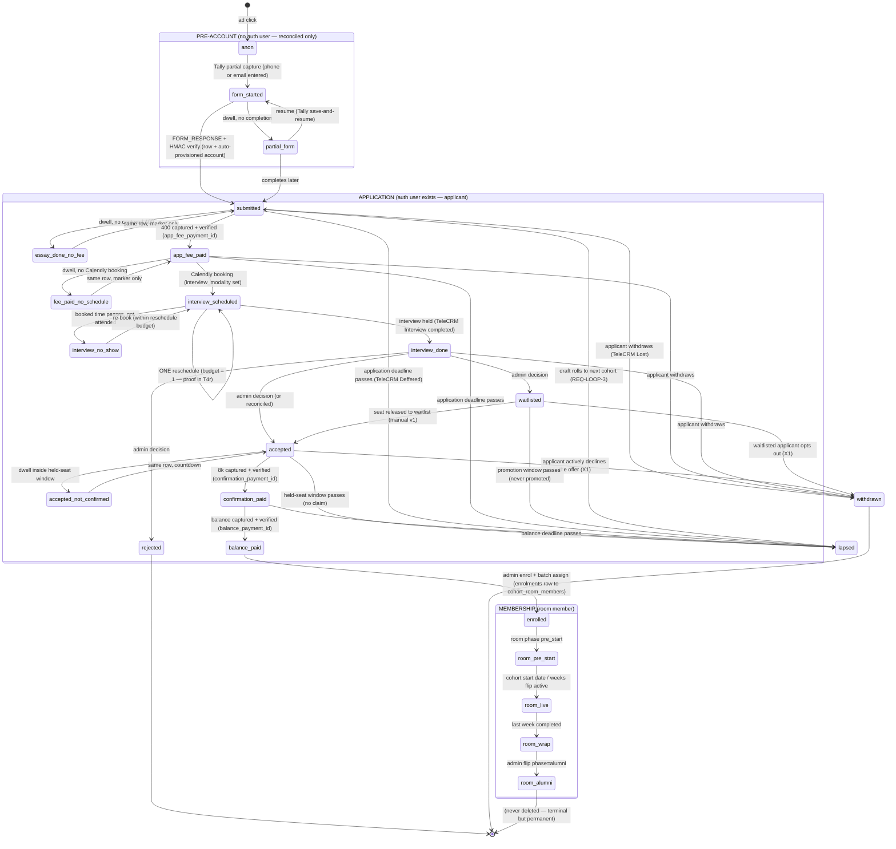
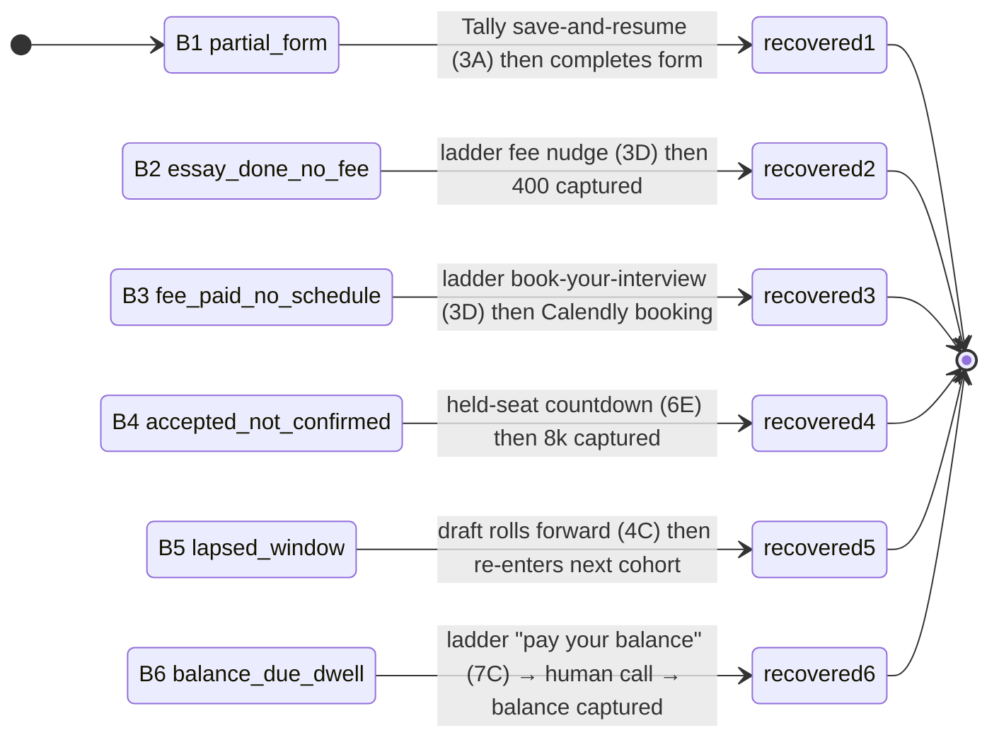

# LevelUp Live Cohorts — Funnel & Lifecycle State Machine

*Doc 02 of the cohort product docs set · authored 2026-07-18 on the live-cohort program.*
*Companion and subordinate to `docs/01-PRD.md` — where the PRD is the **what**, this document is the **referee**: the single, complete map of every state a person occupies from their first Tally keystroke to the alumni room, and every legal move between those states. If a flow-v2 screen shows a state this document does not name, or a transition this document does not permit, the flow is wrong — not this document.*

**Audience is dual, on purpose.**
- A founder new to PM/engineering should be able to read this top to bottom and understand *exactly* where a person can be in the funnel, what they can see, and what moves them forward. Every piece of jargon is defined inline the first time it appears.
- An Opus 4.8 engineering crew is graded against the **guards** and **acceptance-shaped assertions** here. A guard is the precise, checkable condition that authorizes a transition (what event triggers it, and what row/field proves it happened). Build to the guards; the QA gate checks them.

---

## 0. How to read this document

- **Grounding, not invention.** Every state name, status value, and transition cites a source file. The application-status vocabulary is the real DB CHECK constraint (`supabase/migrations/20260413100000_cohort_applications_and_staged_payments.sql:16-17`). The CRM vocabulary is the real TeleCRM picklist measured in `design/cohorts/funnel/FUNNEL-DATA-AUDIT.md §3`. The room phase vocabulary is `design/cohorts/ROOMS-ARCHITECTURE.md §3`. Nothing here is a hypothetical status.
- **Three coordinate systems, one person.** A single human is simultaneously located in three different systems that do **not** share a hard key (§1). This document's core job is to align them: for every lifecycle state it names the **app status**, the **TeleCRM status**, the **v2 screen/surface**, and the **entitlement level**.
- **The uncomfortable truth this doc is built around:** today the app is **not** the system of record. Across 199 recent Razorpay payments, **0** carried an application/offering/order id (`FUNNEL-DATA-AUDIT.md §2`), and the intermediate states (`interview_scheduled`, `interview_done`, `accepted`, `rejected`) **have no writer anywhere in the codebase** (ibid). So some states in this machine are, today, **reconciled** (derived by reading Tally/TeleCRM/Razorpay by phone+email, per **REQ-RECON-1**, `01-PRD.md §5.1`), not **written**. Each state is tagged with which it is.
- **RAHUL DECISION blocks** mark every place the state model depends on a scope choice Rahul has not yet confirmed. Each carries a recommended default so the crew is never blocked.
- **Tier tags** follow `CLAUDE.md`'s blast-radius model. Every guard that touches auth, payments, RLS/membership, or a Supabase migration is **🔴 Tier 1** and named as such.
- **Guard notation.** In the diagrams, a transition reads `from --> to : trigger [proof]` where *trigger* is the event and *proof* is the row/field that must exist for the move to be legal. The full guard catalogue is §5.

---

## 1. The three coordinate systems (read this before the diagrams)

A person in the LevelUp funnel exists, at once, in up to three places. **There is no foreign key between them** — the only join is phone number + email, which matches ~90% of the time (`FUNNEL-DATA-AUDIT.md §5 gap 1`). This machine reconciles all three onto one lifecycle.

| # | System | What it tracks | Vocabulary (authoritative source) | Writer today |
|---|---|---|---|---|
| **A** | **App** — `cohort_applications.status` | The clean, intended funnel status enum | `submitted · app_fee_paid · interview_scheduled · interview_done · accepted · rejected · confirmation_paid · balance_paid · enrolled · withdrawn · waitlisted` (`migration 20260413100000:16-17`) | **Payments only.** Staged verify advances `submitted→app_fee_paid→confirmation_paid→balance_paid→enrolled`. The interview/decision states have **no writer** (`FUNNEL-DATA-AUDIT.md §2`). |
| **B** | **TeleCRM** — top-level `status` picklist | The *operational* funnel — where the money actually flows | `NEW · DNP 1 · DNP Reminder · Direct Junk · WARM · HOT · Fee Link Sent · Application Fee Paid · Interview Scheduled · Need to reschedule interview · Interview completed · No show · Deffered · Converted · Lost` (`FUNNEL-DATA-AUDIT.md §3`, verbatim incl. the "Deffered" typo) | Sales reps + phone/email automation. This is the **de-facto system of record** today. |
| **C** | **Room** — `cohort_room` / `cohort_weeks` phase | The delivery lifecycle *after* enrolment | Room phase: `pre_start · live · wrap · alumni` (`ROOMS-ARCHITECTURE.md §3, line 49`). Week status: `upcoming · active · completed · archived` (`COHORT-LOGIC.md §1 step 8`). | Admin (weeks/phase advanced by hand today). |

**Two vocabulary mismatches the crew must not paper over:**

1. **TeleCRM has no `Accepted` and no `seat-confirmed` status.** Acceptance is *implicit* between `Interview completed` and `Converted`; and `Converted` collapses seat-confirm (₹8k) and paid-in-full into one value — the money-stage distinction survives only in Razorpay amounts (`FUNNEL-DATA-AUDIT.md §3, §5 gap 4`). So the app's `accepted`, `confirmation_paid`, and `balance_paid` states have **no 1:1 TeleCRM equivalent**; they are distinguished by Razorpay amount (₹8k confirm vs ₹22–32k Live balance) joined by phone/email.
2. **The PRD says "active"; the architecture says `live`.** `01-PRD.md` prose occasionally calls the running-weeks phase "active"; the authoritative room phase value is **`live`** (`ROOMS-ARCHITECTURE.md §3`). This doc uses `live`. "Active" in the PRD = `live` here.

> **RAHUL DECISION — SOR-1: Which system is the system of record going forward?** *(inherits Open Q1, `01-PRD.md §8.2`)*
> Does `cohort_applications` become the **writer** of interview/accept/reject states, or does the app stay a **reconciler** that reads TeleCRM/Razorpay/Calendly by phone+email?
> **Recommended default (v1):** the app **writes the states it controls** (provisioning via the webhook, all payment-driven states, room membership) and **reconciles most of the rest** (`interview_scheduled`, `interview_done`, `rejected`) from TeleCRM+Calendly via REQ-RECON-1. **The one exception SOR-1 must carve out: `accepted` is app-WRITTEN, not reconciled** — TeleCRM has no `Accepted` status (§1 mismatch 1; `04-INTEGRATION-CONTRACTS.md` §5.2/§9), so no external system emits it and no reconciler can produce it. `accepted` is an app-side **admin decision at Stage 06** (an `is_admin()`-gated state-transition RPC covering `accepted`/`waitlisted`/`rejected`), consistent with `03-DATA-MODEL-ERD.md` §2/§4.2 and `04-INTEGRATION-CONTRACTS.md` §9. This is an app **status write only** (not a TeleCRM write, so INTEG-CRM-1 read-only holds). Every state in §3 is tagged `[written]` or `[reconciled]` under this default; if Rahul flips to "app is sole SOR," the remaining reconciled states each need a net-new app writer (named in §5). `🔴 Tier 1` (auth + reconciliation reads).

---

## 2. The master lifecycle — one diagram, first touch to alumni

This is the whole journey as one UML state machine. Composite states group the three phases of a life: **Pre-account** (the person exists only in Tally/TeleCRM/Razorpay — the app has no auth user yet), **Application** (an auth user now exists; the person is an applicant), and **Membership** (the person is enrolled and lives in a room). Abandon/dwell branches are drawn as first-class states because recovering them is the entire top-of-funnel thesis (`01-PRD.md §1`). Guards are abbreviated here and specified fully in §5.



**Reading the diagram in one paragraph, plain-English.** A person clicks an ad and starts a Tally form (`form_started`). If they hand over phone/email and quit, they are a `partial_form` — recoverable, and today invisible (~377 sit in TeleCRM `NEW` right now, `FUNNEL-DATA-AUDIT.md §3`). If they finish the form, the webhook fires, an account is auto-provisioned with no signup screen, and they become `submitted`. They pay ₹400 (`app_fee_paid`), book an interview (`interview_scheduled`), attend it (`interview_done`), and get a decision (`accepted` / `waitlisted` / `rejected`). An accepted person pays the ₹8k confirmation (`confirmation_paid`), the balance (`balance_paid`), and is enrolled into a batch (`enrolled`) — only *now* do they gain a room, which lives through `pre_start → live → wrap → alumni` and **is never deleted**. At four points the person can dwell and leak — `partial_form`, `essay_done_no_fee`, `fee_paid_no_schedule`, `accepted_not_confirmed` — and each has a named recovery path (§4). Deadlines never delete; they roll the draft forward (`lapsed → submitted`, `REQ-LOOP-3`).

---

## 3. The state dictionary — every state, all four coordinates

Each row is one state. **App status** is the `cohort_applications.status` value (or "—" where no auth row exists yet). **TeleCRM** is the operational status it corresponds to. **v2 surface** is the flow-v2 screen(s) that render it (`01-PRD.md §5` REQ→screen map). **Entitlement** is the access level from the ladder in §6. **SOR** = `[written]` (app writes it today) or `[reconciled]` (derived via REQ-RECON-1 today).

### 3.1 Pre-account states (no auth user — reconstructed by reconciliation)

| State | App status | TeleCRM | v2 surface | Entitlement | SOR |
|---|---|---|---|---|---|
| `anon` | — | (none) | Marketing / `PublicOffering.tsx` | **E0** Public | — |
| `form_started` | — | `NEW` (empty essay) | Tally form (external); reconciled home teaser if later signed in | **E0** Public | `[reconciled]` — Tally partials read (the webhook fires only on completion, so it cannot see starts; `01-PRD.md §5.1`) |
| `partial_form` *(abandon)* | — | `NEW` (empty essay) | Tally save-and-resume link (3A) | **E0** Public | `[reconciled]` — the ~377-lead recoverable pool (`FUNNEL-DATA-AUDIT.md §3`) |

*Critical fact:* in all three pre-account states **the app has no `cohort_applications` row and no `auth.users` row** — the person is knowable only by joining Tally+TeleCRM on phone/email. `application_started` (the north-star denominator) is produced here, by REQ-RECON-1's Tally-partials read, **not** by the webhook (`01-PRD.md §2.1, §5.1`).

### 3.2 Application states (auth user exists — the applicant)

| State | App status | TeleCRM | v2 surface | Entitlement | SOR |
|---|---|---|---|---|---|
| `submitted` | `submitted` | completed-with-essay / `Fee Link Sent` | Staged home 1B (chip `applicant · draft`) → 2A/2B/2C; ApplicationStatus timeline | **E1** Applicant | `[written]` by webhook |
| `essay_done_no_fee` *(abandon)* | `submitted` | `Fee Link Sent` (no captured ₹400) | Staged home 1B (chip `fee pending`); ladder fee nudge 3D | **E1** Applicant | `[reconciled]` — the warmest recoverable lead; positive marker = essay-present **minus** captured ₹400 (`01-PRD.md §5.1`, `FUNNEL-DATA-AUDIT.md §5 gap 2`) |
| `app_fee_paid` | `app_fee_paid` | `Application Fee Paid` | Success screen 5A (three soonest slots); staged home chip `in review` | **E1** Applicant | `[written]` if via app staged verify; `[reconciled]` if via hardcoded Razorpay link (0/199 today, `FUNNEL-DATA-AUDIT.md §2`) |
| `fee_paid_no_schedule` *(abandon)* | `app_fee_paid` | `Application Fee Paid` (no `Interview Scheduled`) | Ladder "book your interview" nudge 3D | **E1** Applicant | `[reconciled]` — "born in the hour between paying and scheduling" (`01-PRD.md §5.5 REQ-INT-0`) |
| `interview_scheduled` | `interview_scheduled` | `Interview Scheduled` (or `Need to reschedule interview`) | Appointment card 5B/5C (Meet or phone variant) | **E1** Applicant | `[reconciled]` — **no app writer today**; target = Calendly webhook (`REQ-INT-1`) |
| `interview_no_show` *(branch)* | `interview_scheduled` | `No show` | Re-book prompt (within reschedule budget). **No terminal edge today** — whether repeated no-shows auto-route to `rejected` is **Open Q3 (§12)**, not a legal transition (nothing in §5 tables it, so per §5's "not in this table = illegal" rule it cannot fire yet) | **E1** Applicant | `[reconciled]` — a **guardrail metric**, not just a state; a completion win that raises no-show is a false win (`01-PRD.md §2.2`) |
| `interview_done` | `interview_done` | `Interview completed` | "Awaiting decision" state on staged home | **E1** Applicant | `[reconciled]` — no app writer today |
| `accepted` | `accepted` | *(no TeleCRM equivalent — acceptance is unreadable from TeleCRM; §1 mismatch 1)* | Sealed decision 6A → reveal → card 6C → claim 6E | **E2** Accepted-preview | `[written]` — the one carve-out: app admin decision at Stage 06 (SOR-1), not reconciled |
| `waitlisted` | `waitlisted` | *(no explicit TeleCRM value)* | Kind letter (same staging, quieter, 6A path) | **E1** Applicant | `[written]`-capable (admin); unwritten today |
| `rejected` | `rejected` | `Lost` (implicit) | Kind letter (6A path) | **E1** → terminal | `[written]`-capable; unwritten today |
| `accepted_not_confirmed` *(abandon)* | `accepted` | *(implicit)* | Claim screen 6E with held-seat countdown (persisted on scroll) | **E2** Accepted-preview | `[reconciled]` — recovered by honest countdown copy (`REQ-DEC-5`, SEAT-1) |

**On the staged-home chips.** `REQ-IDENT-4` (`01-PRD.md §5.1`) renders one of four label chips — `applicant · draft` / `fee pending` / `in review` / `decision ready` — as a **UI projection over `cohort_applications.status`**, not a new state machine. The chip mapping is: `draft`←`submitted`(pre-fee) · `fee pending`←`essay_done_no_fee` reconciled marker · `in review`←`app_fee_paid`…`interview_done` · `decision ready`←`accepted`/`waitlisted`/`rejected`. Changing the underlying status changes the chip with no other code change (that is the REQ-IDENT-4 acceptance test).

### 3.3 Membership states (room member — post-enrolment)

Under the resolved **MEMBER-1 recommended default** (§3.4; canonical statement in `03-DATA-MODEL-ERD.md` §4.6a): `accepted` grants **no** membership row (redacted preview only); `confirmation_paid` grants a **scoped `pre_member`** row — the "veil lifts" into a working pre_start lobby (flows 7B/7C, PRD REQ-DEC-5/REQ-LOCK-2) — and `enrolled` upgrades it to `member`. This supersedes `ROOMS-ARCHITECTURE.md R-D2`'s stricter "enrolled-only" line on this one point (R-D2 is lower in doc precedence than the PRD/flows; the override is flagged for Rahul in MEMBER-1). The seat-release story is preserved because a `pre_member` is scoped to the pre_start module set and a balance-due dwell is recoverable (B6), never a locked door.

| State | App status | Room phase | v2 surface | Entitlement | SOR |
|---|---|---|---|---|---|
| `confirmation_paid` | `confirmation_paid` | `pre_start` (as `pre_member`) | Confirmed state → designed unlock 7B → working pre_start lobby 7C | **E3** Pre-member lobby | `[written]` by staged verify → resolver writes `pre_member` |
| `balance_paid` | `balance_paid` | `pre_start` (still `pre_member`, membership upgrade pending admin enrol) | Enrollment details 6F/6G; payment ledger; pre_start lobby | **E3** Pre-member lobby | `[written]` by staged verify |
| `enrolled` / `room_pre_start` | `enrolled` | `pre_start` | Locked-future / induction 7A/7C (people, not numerals; "Doors open {date}") | **E4** Member | `[written]` — `enrolments` row → resolver trigger writes `cohort_room_members` |
| `room_live` | `enrolled` | `live` | Cohort room 8A–8F; commons 9A/9B; mentor desk 11 | **E4** Member | `[written]` — weeks flip `active` |
| `room_wrap` | `enrolled` | `wrap` | Transcript 12A, certificate 12B, demo gallery | **E4** Member | `[written]` — last week `completed` |
| `room_alumni` | `enrolled` | `alumni` | Alumni room 12C ("This room stays open. You keep it.") | **E5** Alumni | `[written]` — admin phase flip; role rows rename via trigger (`REQ-FINISH-2`) |

### 3.4 Exit states

| State | App status | TeleCRM | v2 surface | Entitlement | SOR |
|---|---|---|---|---|---|
| `withdrawn` | `withdrawn` | `Lost` | Ladder goes silent; graceful state | terminal | `[written]`-capable |
| `lapsed` | *(retains whatever pre-enrolment status it lapsed from: `submitted` / `app_fee_paid` / `accepted` / `confirmation_paid` / `waitlisted` — see §5 X2 and §4 B5)* | `Deffered` | Graceful close 4C ("Cohort 8 closed — your draft carries to Cohort 9") | **E1** Applicant | `[written]` — draft rolls forward, never deleted (`REQ-LOOP-3`) |

> **RAHUL DECISION — MEMBER-1: At which status is a `cohort_room_members` row written — and how does the accepted "locked future" render without membership?** `🔴 Tier 1 (access boundary)`
> **This is the single most security-load-bearing decision in the machine, and the crew must NOT pick a side implicitly.** It is stated once as the canonical version in `03-DATA-MODEL-ERD.md` §4.6a and referenced identically by `01-PRD.md` (REQ-LOCK-1/2, REQ-DEC-5). The tension: `ROOMS-ARCHITECTURE.md R-D2` says the pre-start lobby is enrolled-only ("unpaid users inside the paid room muddies the seat-release story"), yet the approved v2 flows (7B "the veil lifts," 7C a working pre_start lobby with a roll-call of joiners and a feedback pod, 6E "your cohort room unlocks") and PRD REQ-DEC-5/REQ-LOCK-2 grant a real room at `confirmation_paid`. Doc precedence puts the PRD/flows above R-D2.
> **Recommended default (aligned to the PRD/flows):** a **scoped `pre_member` `cohort_room_members` row is written at `confirmation_paid`** — the resolver upserts `role='pre_member'` on the `confirmation_payment_id` stamp (an exception-guarded AFTER trigger on the staged-payment transition, same swallow-with-WARNING safety as T9), scoping the member to the **pre_start module set only** (readiness checklist, feedback pod, roll-call, Sessions calendar, Announcements). Full-member content (recordings shelf, roster PII, the full commons) stays gated until the row is **upgraded to `role='member'` at `enrolled`** (T9/T10). The `accepted` (pre-₹8k) "locked future" is served **without a membership row** by the dedicated SECURITY DEFINER **preview RPC** (`get_cohort_room_preview`, `03-DATA-MODEL-ERD.md` §4.7a), returning module shells behind a scrim — week titles, Day-One date, faculty names, shelf skeleton — but **no roster PII, no post content, no real recording URLs**. `NFR-SEC-1` (membership server-derived, never client-claimed) still holds — a `pre_member` row is written by the resolver, not the client. This supersedes R-D2 on this one point (flagged for Rahul). **Alternative Rahul may prefer (the conservative model):** membership only at `enrolled`, and both `accepted` and `confirmation_paid`/`balance_paid` served by the preview RPC (drop `pre_member` from the role CHECK, remove the confirmation-payment resolver trigger). **Until Rahul rules, build to the recommended default behind the room feature flag.**

---

## 4. The abandon branches (the top-of-funnel thesis, drawn precisely)

81% of applicants abandon, and ~69% of abandoners are contactable (`TALLY-UX-ANALYSIS.md §3/§4`). Recovering them is REQ-RECON-1 + the reminder ladder. There are **six** abandon/dwell branches. Each is a *dwell condition on a live state* (not a separate enum value), detected by reconciliation + a time threshold, and each has one named recovery mechanism and one silence condition. (B1–B4 are the pre-payment/decision drops the automated ladder fully owns; B5 is the deadline roll-forward; **B6 is the balance-due dwell** that appears only because the MEMBER-1 recommended default places a `pre_member` in the room at `confirmation_paid` with balance still owed — flows 7C's "Balance slips · reminder ladder, then a human call · never a locked door mid-class.")



| # | Branch | Dwell on | 03 `recovery_marker` enum | Detected by | Recovery mechanism | Goes silent when | Source |
|---|---|---|---|---|---|---|---|
| **B1** | **partial-form** | `form_started` | `contactable_partial` | Tally partial exists, no `FORM_RESPONSE`; TeleCRM `NEW` + empty essay | Ladder form-incomplete rungs (T+2h, T+22h, T−24h) → **Tally save-and-resume** link (3A) | form completes / withdrawal / deadline pass | `REQ-INSTALL-3`; `TALLY-UX-ANALYSIS.md §6 rec 8` |
| **B2** | **essay-done-no-fee** | `submitted` | `completed_no_fee` | Essay present in Tally/TeleCRM **minus** a matching captured ₹400 (the positive marker REQ-RECON-1 mints) | Ladder "you're one tap from applying — complete your ₹400" (3D) | ₹400 captured (REQ-RECON-1 sees `app_fee_paid`) | `REQ-RECON-1`, `REQ-INSTALL-3`; `FUNNEL-DATA-AUDIT.md §5 gap 2` |
| **B3** | **fee-paid-no-schedule** | `app_fee_paid` | `fee_paid_no_interview` | TeleCRM `Application Fee Paid` with no `Interview Scheduled` | Ladder "you paid, book your interview" (3D); closes the CRO-2 scheduling gap | Calendly booking → `interview_scheduled` | `REQ-INT-0`, `REQ-INSTALL-3`; `FUNNEL-DATA-AUDIT.md §5` |
| **B4** | **accepted-not-confirmed** | `accepted` | *(none — decision-tier, not a recovery_marker)* | `accepted` with no `confirmation_payment_id` and within held-seat window | Honest "seat held · closes {countdown}" copy shown before Razorpay + persisted on scroll (6E) | ₹8k captured → `confirmation_paid`; or window lapses → `lapsed` | `REQ-DEC-5`, SEAT-1 |
| **B5** | **lapsed-window** | any pre-enrolment state | *(none — lapsed is a status, not a marker)* | `offerings.application_deadline` (a `date`, `migration 20260610090000`) / confirmation / balance deadline passed | Exactly one graceful close message (4C); **draft rolls to next cohort, never deleted** | one close message sent; row re-associable with next offering | `REQ-LOOP-3`; CRO #8 (lapsed ≠ lost) fast-follow |
| **B6** | **balance-due dwell** | `confirmation_paid` / `balance_paid`-pending (a `pre_member` in the room, balance owed) | *(none — derived from a `confirmation_paid` status with no `balance_payment_id`)* | `confirmation_paid` with no matching balance capture, before the balance deadline | Ladder "pay your balance before the cohort starts" **then a human call** (7C) — a **hybrid**: the automated ladder touches it, escalating to a human call; **never a locked door mid-class** (the `pre_member` keeps room access) | balance captured → `balance_paid`; or balance deadline passes → `lapsed` (B5) | `REQ-INSTALL-3` (extended), flows 7C, MEMBER-1 |

> **Note (conflict-resolution):** B6 exists **only under the MEMBER-1 recommended default** (a `pre_member` in the room at `confirmation_paid`). Under the conservative alternative (no membership until enrolled) the balance-due state is still real but is served through the preview RPC rather than a "never a locked door" in-room dwell; the ladder rung is identical either way.

**Ladder guardrails (bind on all of B1–B4, and on B6's automated rung).** Max **1 touch/day, 4 per application, none 21:30–09:00 IST**. Channels push→WhatsApp(Interakt)→email through **one idempotency ledger** (`cohort_notifications_log`) so no channel double-fires. Completion/withdrawal/deadline-pass = **instant silence within one cron cycle** (`REQ-INSTALL-3` acceptance). **B6 escalates to a human call** after its automated "pay your balance" rung — the human-call step is out-of-band (BD/ops), not an automated channel, so it is exempt from the touch-cap counter but must still respect the quiet-hours and instant-silence-on-capture rules. The close string renders from the real deadline source, which is a **date** today — copy reads "closes {date}", not a wall-clock time, unless a `timestamptz` close column is added first (`REQ-INSTALL-3` scope note).

---

## 5. The transition guard catalogue (the crew builds to these)

Every legal transition, its **trigger** (the event that fires it), its **proof** (the row/field whose existence makes the move legal and auditable), its **tier**, and its **writer today**. A transition not in this table is illegal. Order follows the journey.

| # | From → To | Trigger | Proof (what must be true) | Tier | Writer today |
|---|---|---|---|---|---|
| T1 | `anon → form_started` | First phone/email keystroke captured by Tally partials | Tally partial payload exists for that phone/email (reconciled); TeleCRM `NEW` lead created | 🟢 | Tally/TeleCRM (external) |
| T2 | `form_started → submitted` | Tally `FORM_RESPONSE` (completed only) delivered to `tally-application-webhook` | HMAC verified against `TALLY_SIGNING_SECRET` (else reject); offering matched by `tally_form_url` containing formId **AND** `payment_mode='staged'`; `cohort_applications` upserted by `(offering,email)`, **idempotent on `tally_response_id`** | 🔴 Tier 1 (webhook) | `tally-application-webhook` |
| T2a | *(side-effect of T2)* auto-provision | No `auth.users` matches email **or** phone | `auth.admin.createUser({email,phone,email_confirm:false,phone_confirm:false})` mints exactly one user carrying **both** identifiers at the **auth level**; `cohort_applications.user_id` stamped; **no signup screen** (`REQ-IDENT-1`). ⚠️ **Setting `phone` at `auth.users` is NET-NEW, not a reuse of `guest-create-order`.** That function creates the auth user with **email only** and stashes phone in `user_metadata` + the public `users` table (`guest-create-order/index.ts:248-254,271`) — it never sets `auth.users.phone`. But phone-OTP resolution keys on `auth.users.phone` (`find_login_identity`, `verify-msg91-otp/index.ts:170-176` "queries auth.users directly by the last-10 phone"). So provisioning **must** set phone at the auth level; copy `guest-create-order` verbatim and a later phone-OTP will **not** resolve to this user — breaking "one door, two keys." | 🔴 Tier 1 (auth) | webhook (target) |
| T2b | *(collision branch of T2a)* | Phone or email already belongs to a **different** auth user | **No createUser, no merge**: `user_id` left NULL, row flagged `pending_claim`; resolved later by interactive OTP claim (`REQ-IDENT-2`) | 🔴 Tier 1 (auth) | webhook (target) |
| T3 | `submitted → app_fee_paid` | ₹400 captured + verified | **App path:** `verify-razorpay-payment` stamps `app_fee_payment_id` + `app_fee_paid_at`. **Reconciled path (today):** Razorpay captured ₹400 matched by phone/email; TeleCRM `Application Fee Paid` | 🔴 Tier 1 (payments) | staged verify `[written]` / REQ-RECON-1 `[reconciled]` |
| T4 | `app_fee_paid → interview_scheduled` | Calendly booking created (on success screen 5A or later) | **Target:** Calendly webhook receiver (signature-verified) writes `interview_modality` + advances status. **Reconciled today:** TeleCRM `Interview Scheduled` | 🔴 Tier 1 (net-new Calendly webhook) | REQ-INT-1 (target) / REQ-RECON-1 `[reconciled]` |
| T4r | `interview_scheduled → interview_scheduled` | Reschedule requested | **Budget = 1.** Proof today = *no prior reschedule for this application* — derivable from the single legal TeleCRM `Need to reschedule interview` transition / the Calendly reschedule event count. **There is no `reschedule_count` field today** (`types.ts` `cohort_applications` has `interview_date`/`interview_notes`, no counter; grep across `supabase/`+`src/` returns none). A first-class durable counter is **net-new** — add `cohort_applications.reschedule_count` **only if** the derived source proves insufficient (🔴 Tier 1, migration). Copy rule: the word "free" appears nowhere; no charge copy near reschedule (`REQ-INT-3`, `NFR-COPY-4`) | 🟡 (🔴 if the net-new column is added) | reconciled / app |
| T4n | `interview_scheduled → interview_no_show` | Booked time passes, not attended | TeleCRM `No show`; **no-show rate is a §2.2 guardrail** | 🟡 | `[reconciled]` |
| T5 | `interview_scheduled → interview_done` | Interview held | TeleCRM `Interview completed` (reconciled) or admin mark | 🟡 | `[reconciled]`; no app writer today |
| T6a | `interview_done → accepted` | Admin decision (Stage 06 `is_admin()`-gated RPC) | Status set to `accepted` by the app admin decision — **this is app-written, NOT reconciled from `Converted`** (TeleCRM `Converted` maps to `confirmation_paid`/`enrolled`, a POST-confirmation state, never to the pre-confirmation `accepted`; §5.2 of `04-INTEGRATION-CONTRACTS.md`). **Notification says "decision ready" and never carries the verdict** (`REQ-DEC-1`) | 🔴 Tier 1 (admin state-write, authorized in `05-ACCESS-SECURITY.md`) | app admin `[written]` |
| T6b | `interview_done → waitlisted` | Admin decision | Status `waitlisted`; same reveal staging, quieter | 🟡 | none today |
| T6c | `interview_done → rejected` | Admin decision | Status `rejected`; kind letter; TeleCRM `Lost` | 🟡 | none today |
| T6d | `waitlisted → accepted` | Seat released to waitlist (**manual v1**, SEAT-1) | Admin action; automated release + waitlist cron is **fast-follow**, not v1 | 🔴 Tier 1 (if automated) | admin (manual) |
| T7 | `accepted → confirmation_paid` | ₹8k captured + verified | `verify-razorpay-payment` stamps `confirmation_payment_id`; **money detail shown before Razorpay opens** (`REQ-DEC-5`, `NFR-COPY-5`); `isIOS()` staged-payment guard **sacred, untouched** (`NFR-SEC-5`); TeleCRM `Converted` | 🔴 Tier 1 (payments) | staged verify `[written]` |
| T7u | *(side-effect of T7)* designed unlock | `confirmation_paid` reached | Unlock animation fires **exactly once** per confirmation, ≤900ms, transform/opacity only; reduced-motion = instant swap (`REQ-LOCK-2`). **Under the MEMBER-1 recommended default this is the "veil lifts" into a real pre_start lobby**, backed by T7m below (not merely a preview sharpen). | 🟡 | app (target) |
| T7m | *(side-effect of T7)* pre_member membership | `confirmation_paid` reached (recommended MEMBER-1 default) | AFTER trigger on the `confirmation_payment_id` staged transition upserts `cohort_room_members(role='pre_member', source='derived')` scoped to the pre_start module set; **trigger failure must NOT block the payment write** (swallow with WARNING, same rule as T9). Retracted if the seat lapses. Under the conservative alternative this transition does not exist (preview RPC serves confirmation_paid instead). | 🔴 Tier 1 (RLS/membership) | resolver `[written]` (target) |
| T8 | `confirmation_paid → balance_paid` | Balance captured + verified | `balance_payment_id` stamped; Razorpay ₹22–32k Live balance | 🔴 Tier 1 (payments) | staged verify `[written]` |
| T9 | `balance_paid → enrolled` | Admin creates enrolment + assigns batch | `enrolments` row (+`application_id`,`total_paid_inr`,`balance_due_inr`) + `cohort_batch_members` INSERT → **AFTER trigger** writes `cohort_room_members` (`NFR-SEC-1`); **AFTER-trigger failure must not block the enrolment write** (`ROOMS-BACKLOG.md R0-T1`) | 🔴 Tier 1 (RLS/membership) | admin + resolver `[written]` |
| T10 | `enrolled → room_pre_start` | Membership resolves | `cohort_room_members` row exists; room shows from `pre_start` (fixes enrolled-but-invisible window, `REQ-LOCK-3`) | 🔴 Tier 1 (RLS) | resolver `[written]` |
| T11 | `room_pre_start → room_live` | Cohort start date reached / weeks flip `active` | `cohort_weeks.status='active'` for the batch; session/assignment modules unlock cohort-wide at configured time | 🟡 | admin `[written]` |
| T12 | `room_live → room_wrap` | Last week `completed` | Wrap-phase modules (demo gallery, certificate window) visible | 🟡 | admin `[written]` |
| T13 | `room_wrap → room_alumni` | Admin flip `phase='alumni'` | Live modules retire; recordings/work/roster/gallery **retained forever**; `cohort_room_members` role rows rename via trigger; **no data deleted** (`REQ-FINISH-2`, R-D7) | 🟡 | admin `[written]` |
| X1 | `{submitted, app_fee_paid, interview_done, accepted, waitlisted} → withdrawn` | Applicant withdraws / actively declines the offer | Status `withdrawn`; ladder silent; TeleCRM `Lost`. **`accepted → withdrawn` is the admit-then-declines case** (a real change of mind) — modeled as an explicit active withdrawal, distinct from `accepted → lapsed` (passive held-seat-window expiry, X2). `waitlisted → withdrawn` is a waitlisted applicant opting out. | 🟢 | app/admin |
| X2 | `{submitted, app_fee_paid, accepted, confirmation_paid, waitlisted} → lapsed` | Application deadline / held-seat / balance deadline / waitlist-promotion window passes (matches §4 B5 "any pre-enrolment state") | Draft persists + re-associable with next offering; **exactly one** close message; TeleCRM `Deffered` (`REQ-LOOP-3`) | 🟡 | cron/app `[written]` |
| X3 | `lapsed → submitted` | Draft rolls to next cohort | Same `cohort_applications` row re-pointed at the next offering; never deleted | 🟡 | app |

**Guard-integrity rules that span the table (grep-/test-checkable):**
- **No verdict in transit.** No notification payload for T6a/T6b/T6c contains the decision; only the sealed in-app screen reveals it (`REQ-DEC-1`).
- **Idempotency everywhere money or provisioning fires.** T2 is idempotent on `tally_response_id`; the ladder is idempotent via `cohort_notifications_log`; re-delivering any webhook creates no duplicate state.
- **Membership is server-derived, never client-claimed.** T9/T10 write `cohort_room_members` only through resolver triggers + nightly reconcile; zero client INSERT/UPDATE grants (`NFR-SEC-1`).
- **The staged-payment `isIOS()` guard (`ApplicationStatus.tsx:319,337`) is do-not-touch** on T3/T7/T8 (`NFR-SEC-5`).

---

## 6. The entitlement / access ladder (state → what you can see)

Access is a strict ladder derived from state. **Security never depends on a jsonb module flag** — a disabled module simply has no rows; RLS is always membership-gated (`NFR-CONFIG-2`, `NFR-SEC-1..4`).

| Level | Who | Backing RLS / access path | Can read | Cannot read |
|---|---|---|---|---|
| **E0** Public / anon | `anon`, `form_started`, `partial_form` | none (public tables) | Marketing offering pages, application deadline countdown | Anything user-scoped |
| **E1** Applicant | `submitted`…`interview_done`, `waitlisted`, `rejected`, `lapsed` | `cohort_applications` where `user_id = auth.uid()` (`COHORT-LOGIC.md §2`) | Own application status + staged home + timeline; own payment steps | Any room content; any other applicant; roster |
| **E2** Accepted-preview | `accepted`, `accepted_not_confirmed` | **NOT membership** — the redacted preview RPC `get_cohort_room_preview` (MEMBER-1; `03-DATA-MODEL-ERD.md` §4.7a) | **Settled whitelist (aligned to PRD REQ-LOCK-1):** the room theme/wordmark, week **titles** + Day-One date, faculty **names**, a recordings-shelf **skeleton**, and the recordings/community module **frames behind a scrim** — i.e. the modules are shown as *real shells*, honouring the flows' "everything is real" (the room and faculty are genuine, not fabricated) | Roster PII, post/reply bodies, real recording/Zoom URLs, fees, funnel state, any other applicant's row, and every other cohort — **always**. "Everything is real" means the structure is authored, **not** that content rows are exposed |
| **E3** Pre-member lobby | `confirmation_paid`, `balance_paid` (pre-enrol) | **`cohort_room_members` row with `role='pre_member'`** (MEMBER-1 recommended default), read via `cohort_room_can_access()` scoped to the pre_start module set | The **working pre_start lobby**: readiness checklist, feedback pod, roll-call of joiners, Sessions calendar, Announcements, enrollment details, payment ledger | Full-member content until upgraded to `member` at `enrolled`: recordings shelf, the full commons, roster PII beyond the pre_start roll-call; any other room. *(Under the conservative MEMBER-1 alternative, E3 collapses into E2's preview RPC and grants no membership row.)* |
| **E4** Member | `enrolled` / `room_pre_start` / `room_live` / `room_wrap` | `cohort_room_members` — the **one** table every room policy reads, via `cohort_room_can_access()` (`NFR-SEC-2`) | The full room for *their* `(offering,batch)`: today/weeks, sessions, assignments, recordings, record, commons, roster | **Any other room** (cross-room read = 0 rows; the LEAK_CANARY suite, `NFR-SEC-4`) |
| **E5** Alumni | `room_alumni` | same `cohort_room_members` row (role renamed to `alumni` via trigger) | The archived room forever (recordings, work, roster, gallery); live modules retired | Live-only modules; other rooms |

**The E1→E2→E3→E4 boundary is the single most security-load-bearing line in the machine** and the reason MEMBER-1 exists. Under the recommended default the boundary is: an `accepted` person is **not** a member (their "locked future" comes from the redacted preview RPC, never a `cohort_room_members` row); a `confirmation_paid`/`balance_paid` person **is** a scoped `pre_member` (pre_start lobby only, written by the resolver never the client); a `member`'s full-room access begins at `enrolled`. Every access transition (E-anything) is `🔴 Tier 1` and gated by the adversarial access suite (`qa-harness/cohort-room-access.spec.mjs`, `NFR-SEC-4`) — which must assert that a `pre_member` reads the pre_start module set and **zero** full-member content, and that an `accepted` preview leaks no non-whitelisted field.

---

## 7. Riskiest handoff (a): Tally submit → webhook → auto-provision → ₹400 → success

This is the identity spine's most fragile seam (`01-PRD.md §5.1`, Risk R2). Two facts govern it: **the webhook fires only on completed forms** (partials never reach it), and **the collision branch cannot be resolved server-to-server** (no user is present at webhook time). Guards are named on every arrow.

```mermaid
sequenceDiagram
    autonumber
    participant U as Applicant
    participant T as Tally form
    participant W as tally-application-webhook
    participant DB as Supabase (auth.users + cohort_applications)
    participant RZ as Razorpay (₹400)
    participant V as verify-razorpay-payment
    participant R as REQ-RECON-1 reconciler

    Note over U,T: partials are captured by TeleCRM as NEW but NEVER reach W
    U->>T: Completes form (name, phone, email, craft, availability)
    T->>W: FORM_RESPONSE  [guard: HMAC over TALLY_SIGNING_SECRET — else 401 reject]
    W->>W: Match offering by tally_form_url⊇formId AND payment_mode='staged'
    W->>DB: Upsert cohort_applications by (offering,email)  [guard: idempotent on tally_response_id]
    alt no auth.users matches email OR phone
        W->>DB: auth.admin.createUser({email,phone})  [both identifiers on ONE user]
        Note over W,DB: phone MUST be set at the auth.users level (net-new vs guest-create-order, which sets email only + phone in metadata) — else phone-OTP via find_login_identity cannot resolve to this user
        DB-->>W: user_id
        W->>DB: stamp cohort_applications.user_id ; status='submitted'
    else phone/email collides with a DIFFERENT auth user
        W->>DB: leave user_id NULL ; flag pending_claim  [NO createUser, NO merge]
        Note over W,DB: resolved later by interactive OTP claim (REQ-IDENT-2)
    end
    W-->>T: 200 (redirect target)

    rect rgb(245,245,245)
    Note over U,V: PATH A — app staged checkout (the INTENDED path)
    U->>RZ: /checkout?type=app_fee&app=:id  [notes carry offering_id,user_id,payment_order_id]
    RZ-->>V: payment captured
    V->>DB: verify signature → status='app_fee_paid' ; stamp app_fee_payment_id, app_fee_paid_at
    end

    rect rgb(235,235,235)
    Note over U,R: PATH B — hardcoded Razorpay link (TODAY'S REALITY: 0/199 carry an app id)
    U->>RZ: rzp.io/... ₹400  [notes = {email,name,phone} only — no app id]
    R->>RZ: read captured ₹400 by phone/email
    R->>DB: reconcile → derive app_fee_paid ; surface orphan-rate health metric
    end

    DB-->>U: Success screen 5A — three soonest interview slots (REQ-INT-0)
```

**Why both paths are drawn.** Path A is what the code supports; Path B is what production actually does (`FUNNEL-DATA-AUDIT.md §2`). REQ-RECON-1 is the bridge that lets the state machine advance to `app_fee_paid` even when the money came through a hardcoded link — and it must **surface the join-completeness / orphan rate as a health alert** rather than silently under-counting (`REQ-RECON-1` acceptance, Risk R8). The success screen's three-slot booking (step "Success screen 5A") is the guard that prevents the `fee_paid_no_schedule` (B3) dwell.

---

## 8. Riskiest handoff (b): acceptance → confirmation fee → enrolment

This seam turns an applicant into a room member. It crosses the E1/E2→E4 access boundary (§6) and writes `cohort_room_members` — the one table all room RLS reads. Guard integrity here is where a cross-room leak or a "paid but no room" dead-end would be born.

```mermaid
sequenceDiagram
    autonumber
    participant AD as Admin (or reconciler)
    participant U as Applicant
    participant AS as App (decision + claim)
    participant O as create-razorpay-order
    participant RZ as Razorpay (₹8k)
    participant V as verify-razorpay-payment
    participant DB as Supabase
    participant TR as membership resolver (AFTER trigger)

    AD->>DB: record decision → status='accepted'  [guard: SOR-1 — admin write or reconciled from Converted]
    DB->>U: notify "your decision is ready"  [guard: NO verdict in payload — REQ-DEC-1]
    U->>AS: open sealed decision → reveal (≤2.6s, skippable; reduced-motion ≤200ms crossfade)
    AS->>U: acceptance card 6C  [no seat number, no essay text — NFR-COPY-1/3]
    U->>AS: "Claim my seat"
    AS->>U: context BEFORE Razorpay — ₹8k = part of fee (not extra) + held-seat countdown  [REQ-DEC-5, NFR-COPY-5]
    U->>O: /checkout?type=confirmation&app=:id  [guard: isIOS() staged-payment gate SACRED — NFR-SEC-5]
    O->>RZ: create order (notes: offering_id,user_id,payment_order_id)
    RZ-->>V: ₹8k captured
    V->>DB: verify signature → status='confirmation_paid' ; stamp confirmation_payment_id
    V->>AS: fire designed unlock 7B (≤900ms, once)  [NOTE: preview sharpen — still NOT a member — MEMBER-1]
    opt balance step
        U->>RZ: ₹balance  →  V: status='balance_paid' ; stamp balance_payment_id
    end
    AD->>DB: create enrolments row + cohort_batch_members INSERT  [guard: admin enrol + batch assign]
    DB->>TR: AFTER trigger fires
    TR->>DB: write cohort_room_members (source='batch', role='member')  [guard: server-derived; trigger failure must NOT block enrolment write — R0-T1]
    DB-->>U: room appears in nav from phase='pre_start' (REQ-LOCK-3)
```

**The three guards that make or break this seam:**
1. **No verdict leaks before the sealed screen** (`REQ-DEC-1`) — step 2's notification is a "ready," never a "yes/no."
2. **The `isIOS()` staged-payment guard is untouched** (`NFR-SEC-5`) — step "Claim my seat" checkout is the exact surface that guard protects; changing it to `isNative()` breaks Android staged-payment revenue and trips Apple anti-steering.
3. **Membership is written by the trigger, not the client, and its failure is non-blocking** (`NFR-SEC-1`, `ROOMS-BACKLOG.md R0-T1`) — a resolver exception must never roll back the enrolment write, or a paid student is stranded outside their room.

---

## 9. Reconciliation overlay — how "reconciled" states are actually resolved

For every `[reconciled]` state in §3, REQ-RECON-1 derives it from the three external systems keyed on the logged-in user's phone+email — the same join the whole funnel already runs on (`FUNNEL-DATA-AUDIT.md §6`). This is the referee that lets the machine advance without an app writer for the interview/decision states.

| Detected reads (phone/email) | Resolved lifecycle state | Home CTA |
|---|---|---|
| Tally partial, no completion | `partial_form` (B1) | Resume application (Tally save-and-resume) |
| Completed essay, no captured ₹400 | `essay_done_no_fee` (B2) | Pay the ₹400 application fee |
| TeleCRM `Application Fee Paid`, no `Interview Scheduled` | `fee_paid_no_schedule` (B3) | Book your interview |
| TeleCRM `Interview completed`, not `Converted` | `interview_done` | Awaiting decision |
| Razorpay ₹8k/₹15k captured, balance not paid | `confirmation_paid` | Pay your balance |
| TeleCRM `Converted` / full payment | `enrolled` | Show cohort content |

**Reconciliation invariants (from `REQ-RECON-1` acceptance):** read-only against Tally/TeleCRM/Razorpay (no external writes); secrets referenced by name only; the six mappings above each resolve to the specified CTA in a fixture; **join completeness is instrumented and the orphan rate is a visible health alert** (provisional watch line ~10%, `FUNNEL-DATA-AUDIT.md §5 gap 1`) so the north-star metric is never silently under-counted.

---

## 10. Flow-v2 coverage matrix — the referee check

**Every flow-v2 screen must map to a state in this machine.** This is the closing acceptance of the whole document: if a screen has no state, the flow invented one; if a state has no screen, the flow is missing a surface. The 41 screens across 12 stages (`01-PRD.md §5` REQ→screen map, `student-journey-flows-v2.html`):

| v2 Stage / screens | Lifecycle state(s) rendered | REQ / source |
|---|---|---|
| **01** Identity spine — railmap, 1A (OTP sign-in), 1B (staged home) | `submitted`…`interview_done`, `accepted`/`waitlisted`/`rejected` (via the four home chips) | REQ-IDENT-1..4, REQ-RECON-1 |
| **02** Application — 2A/2B/2C | `form_started` → `submitted` | REQ-APP-1..3 |
| **03** Install & web — 3A/3B/3C + ladder 3D | `partial_form` (B1), `essay_done_no_fee` (B2), `fee_paid_no_schedule` (B3) | REQ-INSTALL-1..3 |
| **04** Open loop — 4A/4B/4C | re-entry into `submitted`/`app_fee_paid`; `lapsed` (B5) close | REQ-LOOP-1..3 |
| **05** Interview — 5A/5B/5C/5D | `app_fee_paid` → `interview_scheduled` (Meet/phone), `interview_no_show`, `interview_done` | REQ-INT-0..3 |
| **06** Decision — 6A–6H + 2 storyboards | `accepted`/`waitlisted`/`rejected`; `accepted_not_confirmed` (B4) → `confirmation_paid`; public page (E0 view) | REQ-DEC-1..6 |
| **07** Locked future — 7A/7B/7C | `accepted` (**E2 preview RPC**, no membership) → 7B "veil lifts" at `confirmation_paid` → 7C working pre_start lobby (**E3 `pre_member`**); `enrolled`/`room_pre_start` induction (**E4 member**) | REQ-LOCK-1..3, MEMBER-1 |
| **08** Cohort room — 8A–8F | `room_live` (E4) | REQ-ROOM-1..6 |
| **09** Room's commons — 9A/9B + separation | `room_live` (E4); cross-room isolation (E4 boundary) | REQ-COMM-1..3 |
| **10** Many tongues — 10A/10B/10C | any room phase (labels-only skin; state-invariant) | REQ-VOCAB-1..2 |
| **11** Mentor's desk — 1 screen | `room_live` (mentor/host role, E4) | REQ-MENTOR-1 |
| **12** The finish — 12A/12B/12C | `room_wrap` → `room_alumni` (E4→E5) | REQ-FINISH-1..2 |

**States with no dedicated screen (by design):** `anon` (marketing, out of this product), `form_started` pre-account teaser (only a reconciled home hint once signed in), `withdrawn` (silence, not a screen). Every *other* state has at least one v2 surface — the machine and the flow are in bijection across the funnel and room.

---

## 11. Tier-1 flag summary (for the bugfix council + adversarial suite gate)

Per `CLAUDE.md`, these transitions/guards carry high blast radius and require council + cross-platform verify + staged rollout + Rahul's written sign-off before ship:

- **T2 / T2a / T2b — the webhook + auto-provision + collision** (auth). One auth user carries both identifiers; collisions never merge silently. Note the net-new part: provisioning must set `phone` at the `auth.users` level (not just metadata as `guest-create-order` does), or phone-OTP won't resolve (`find_login_identity`).
- **T3 / T7 / T8 — staged-payment advances** (payments) — and the sacred `isIOS()` guard (`NFR-SEC-5`, do-not-touch).
- **T4 — the Calendly webhook receiver** (net-new external→app infra + signature verification + `interview_modality` column; none exists today).
- **T9 / T10 — enrolment → `cohort_room_members` resolver trigger** (RLS/membership); AFTER-trigger failure must be non-blocking.
- **The E2 redacted preview RPC + the E3 `pre_member` resolver trigger (MEMBER-1)** — the preview RPC is a new access path for `accepted` users (no membership row); the recommended-default `pre_member` resolver trigger writes a scoped membership row at `confirmation_paid` (T7m). Both are adversarial-suite-gated; the crew must build to the recommended default behind the room flag and not pick the boundary implicitly.
- **REQ-RECON-1 reads** (auth + external credentials) — the north-star linchpin.
- **Email OTP (OTP-1)** — the one net-new auth path in the spine.

---

## 12. Open questions this machine inherits

1. **SOR-1 (§1):** app as writer vs reconciler of interview/decision states — v1 default is reconciler-plus-owns-what-it-controls; flipping it adds net-new writers to T5/T6a-c.
2. **MEMBER-1 (§3.4, 🔴 Tier 1):** the exact membership-grant threshold and how the accepted "locked future" renders. **Recommended default = a scoped `pre_member` membership at `confirmation_paid`** (the pre_start lobby of flows 7C) + a redacted preview RPC for the `accepted` (pre-₹8k) tier; alternative = enrolled-only membership with the preview RPC also serving confirmation_paid. Must be ruled before the membership resolver or preview RPC ships; build to the recommended default behind the room flag until then.
3. **No-show → decision routing (T4n):** does a `No show` auto-route toward `rejected` after N missed re-books, or stay open for manual admin decision? *Recommended default:* stay open (manual), since no-show is a guardrail the team watches, not an auto-reject; confirm with Rahul.
4. **Held-seat window length + automated release (SEAT-1):** the countdown copy ships v1; the automated release + waitlist-promotion cron (T6d automated) is fast-follow after one manual cycle.
5. **Deadline granularity (B5):** `application_deadline` is a `date`; a `timestamptz` close column is needed before copy can say a wall-clock time.

---

*End of state machine. This document is the referee the flows are validated against: every flow-v2 screen maps to a state here (§10), every transition names its guard and proof (§5), and every access boundary is a `🔴 Tier 1` line. It is subordinate to `01-PRD.md` and must never contradict it; where the PRD says "active," read `live`. Nothing here ships without Rahul's written sign-off; the staged-payment pipeline and its `isIOS()` guard stay byte-for-byte untouched.*
