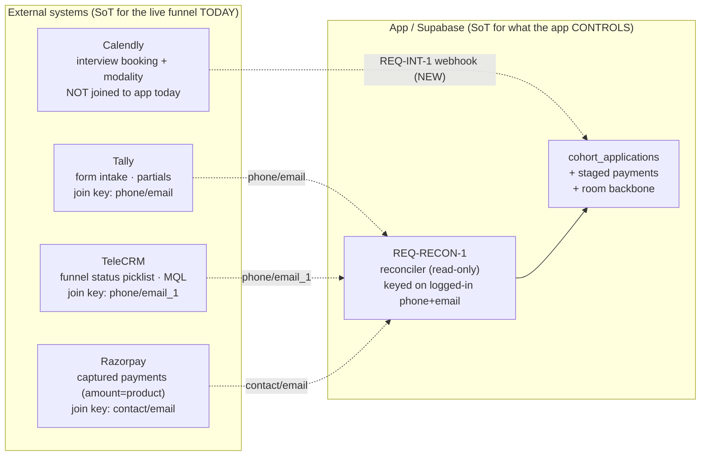
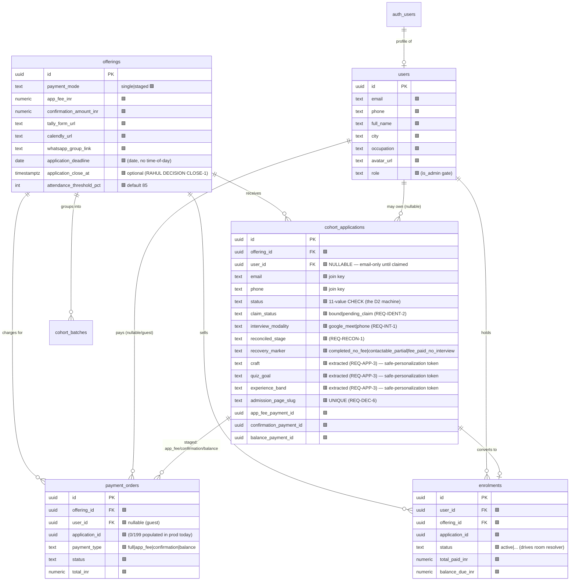
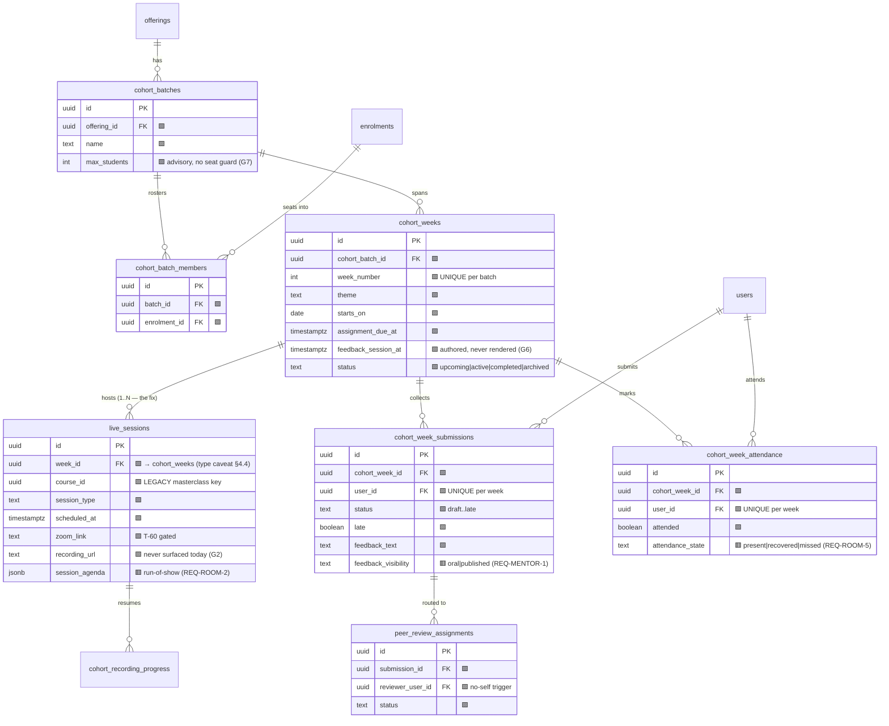
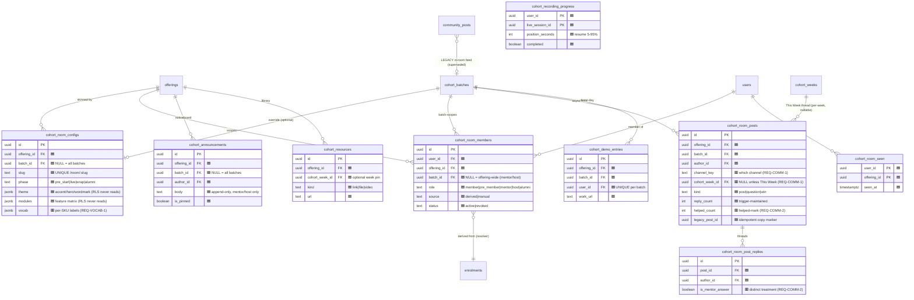
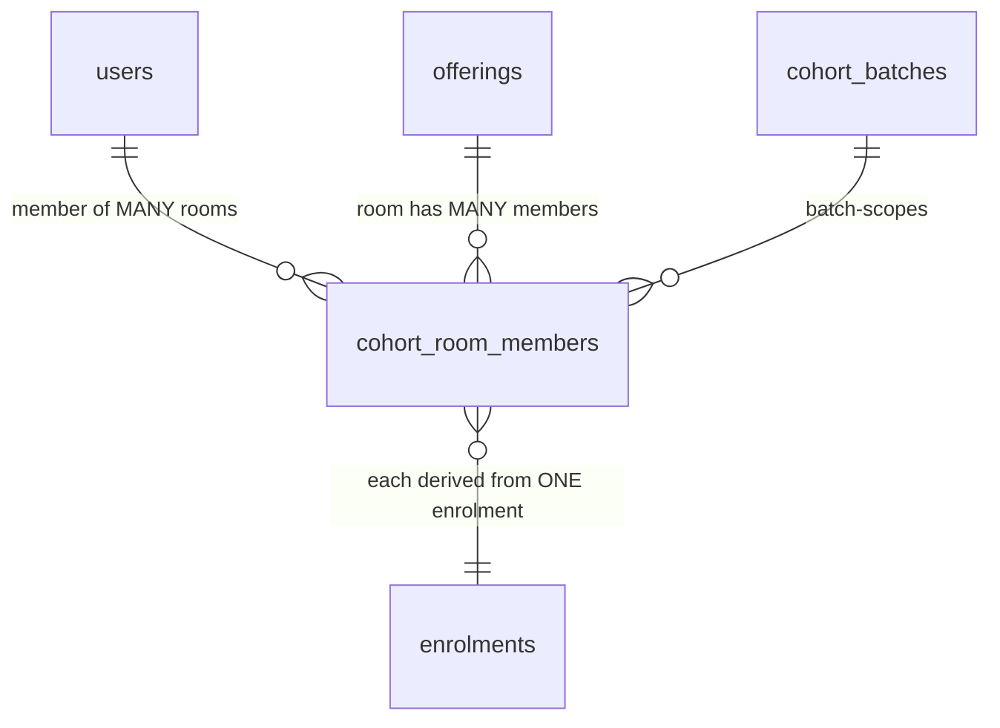
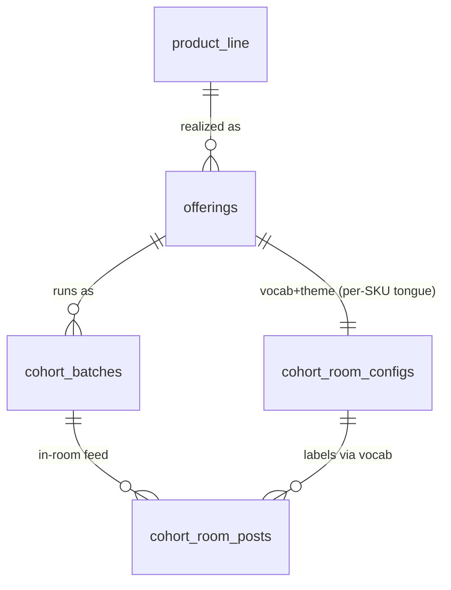

# LevelUp Live Cohorts — Data Model & Entity-Relationship Diagram

*Doc 03 of the cohort product docs set · authored 2026-07-18 on the live-cohort program.*
*Companion to `01-PRD.md` (the *what*) and the D2 state-machine doc (the *when*). This doc is the *where the facts live*: every entity, every field, every relationship, and — for each — whether it **exists in the shipped schema today**, is a **draft awaiting apply**, or is **net-new** to this product.*

**Audience is dual, on purpose.**
- If you are **new to data modelling**: read §1 (how to read an ERD) and §2 (the three source-of-truth systems) first — they teach the vocabulary the rest of the doc uses. Every table has a plain-English "what it holds and why."
- If you are the **engineering crew**: §4's field dictionaries carry exact types, nullability, and the source-of-truth system per column; §7 is the checkable state→data matrix; §8 is the corrected `get_cohort_progress` spec. Reconcile against `supabase/migrations/` before writing a single `CREATE TABLE`.

**How this doc is grounded (not invented).** Every "EXISTS" claim cites the migration that created it and/or the `src/integrations/supabase/types.ts` Row that proves it. Every "NEW" or "DRAFT" claim cites the PRD requirement that needs it. If a table or column here has no citation, treat it as a bug in this doc.

**Legend used throughout:**

| Tag | Meaning |
|---|---|
| 🟩 **EXISTS** | Live in the production schema today. Cited to its migration + `types.ts`. Do not recreate. |
| 🟦 **DRAFT** | Fully designed in `design/cohorts/migrations-draft/*.sql` but **not applied**. Moving it to `supabase/migrations/` is 🔴 Tier 1 (council + adversarial suite on a shadow project + Rahul sign-off + prod backup). |
| 🟥 **NEW** | Does not exist in any migration, draft, or `types.ts`. This product invents it. Each is tied to a PRD REQ and tier-tagged. |
| 🔴 **Tier 1** | Blast radius on RLS / migrations / auth / payments per `CLAUDE.md`. Gated on the bugfix council + adversarial access suite + staged rollout. |
| **SoT** | Source of Truth — the system that *owns* the fact. One of: **App** (Supabase, this repo), **Tally**, **TeleCRM**, **Razorpay**, **Calendly**, **VdoCipher**, or **Derived** (computed in-app, stored nowhere authoritative). |

**Cross-references (this doc must stay consistent with):**
- `design/cohorts/docs/01-PRD.md` — the requirements every table serves (REQ-IDs are cited per entity).
- `design/cohorts/docs/02-STATE-MACHINE.md` (the D2 doc) — §7 here proves every D2 state (and every REQ-COMM-1 community channel) is representable in data, conditional on the 🟥 additive columns landing.
- `design/cohorts/COHORT-LOGIC.md` — the as-is entity/RPC inventory this doc reconciles against.
- `design/cohorts/funnel/FUNNEL-DATA-AUDIT.md` — the external-system reality (Tally/TeleCRM/Razorpay join by phone/email; 0/199 payments carry an app id).
- `design/cohorts/ROOMS-ARCHITECTURE.md` + `ROOMS-BACKLOG.md` + `migrations-draft/*.sql` — the room backbone this doc turns into a field dictionary.

---

## 1. How to read an ERD (for the founder-engineer)

An **entity-relationship diagram** draws the database as boxes (**entities** = tables) joined by lines (**relationships** = foreign keys). Three things to read off it:

- **A box** is a table. Its rows are records — one `cohort_applications` row is one person's application.
- **A line** means one table points at another by storing its id (a **foreign key**, `FK`). `cohort_batch_members.enrolment_id` points at `enrolments.id` — "this membership belongs to that enrolment."
- **The crow's-foot ends** encode *how many*. `||` = exactly one; `o{` = zero-or-many; `|{` = one-or-many. So `offerings ||--o{ cohort_applications` reads "one offering has zero-or-many applications; each application belongs to exactly one offering."

Two words you'll see a lot:
- **PK (primary key)** — the column that uniquely names a row (almost always `id uuid`).
- **RLS (row-level security)** — Postgres rules deciding *which rows a given signed-in user may read/write*. In this product RLS is the entire access-control story: a member of room A must be **structurally unable** to read room B (PRD NFR-SEC-1..4). When a table is 🔴 Tier 1, RLS is usually why.

**A "many-to-many" (M:N)** relationship — e.g. a person can be in many cohorts and a cohort has many people — cannot be one FK. It needs a **join table** in the middle whose rows are the pairings (`cohort_batch_members` is exactly this: it pairs `enrolments` with `cohort_batches`). §6 collects the three M:N mappings this product depends on.

---

## 2. The three source-of-truth systems (the fact that governs everything)

The single most consequential thing about this data model, from `FUNNEL-DATA-AUDIT.md` §2: **the app is not the system of record for the live funnel today.** Across 199 recent Razorpay payments, **0 carried an application id, offering id, or order id**. The operational funnel runs **Tally → TeleCRM → hardcoded Razorpay links**, stitched together by **phone + email only** — there is no hard foreign key across systems. The app's clean `cohort_applications` pipeline is a *parallel, largely-dormant track*, and its intermediate states (`interview_scheduled`, `interview_done`, `accepted`, `rejected`) **have no writer anywhere in the codebase**.

So a data model for this product spans **four owners**, and every entity below is tagged with which one owns it:



**The design consequence** (PRD Open Q1, still open): the app **reads/reconciles** the external systems by phone/email (REQ-RECON-1) and **owns authoritatively only what it controls** — provisioning (identity spine), staged payments already flowing through the app, and the whole room backbone. The reconciled funnel stage is written to *additive* columns (§4.2), never by overwriting the sacred staged-payment path. Whether the app graduates to *writer* of the interview/accept/reject states is Open Q1; this model supports either without a schema change to the payment pipeline.

> **RAHUL DECISION — DATA-SoT-1: does the app become the funnel's writer, or stay a reconciler?**
> This is PRD Open Q1 surfaced at the data layer. **Recommended default (matches PRD §5.1):** stay a **reconciler-plus-owns-what-it-controls** in v1 — the reconciler writes derived stage to *new additive columns* (`reconciled_stage`, `reconciled_at`, `reconciliation_source`, `recovery_marker` — §4.2), and the app authoritatively writes only provisioning, staged payments it already processes, and the room backbone. It does **not** start writing most funnel statuses from app UI in v1 (interview stages, `rejected` and the payment stages stay a TeleCRM/Razorpay/reconciler fact). **The one carve-out — `accepted` — the app MUST write, even under this reconciler default:** TeleCRM has no explicit "Accepted" status (§4.2 note; `04-INTEGRATION-CONTRACTS.md` §5.2/§9), so acceptance is **unreadable** from any external system and no reconciler can produce it. `accepted` is therefore an **app-side admin decision at Stage 06** (an `is_admin()`-gated state-transition RPC that also covers `waitlisted`/`rejected`), written to `cohort_applications.status`. This is an app **status write only** — it is NOT a TeleCRM write, so the read-only-TeleCRM contract (INTEG-CRM-1) still holds. Without it the decision ceremony (COPY CD-06-REV-02/CD-06-LTR) has no verdict to render. Alternative Rahul may prefer: make the app the writer of *all* interview/decision states (needs the admin decision surfaces of Stages 05/06 to *set* status, plus a migration of TeleCRM history). Either way the payment pipeline is byte-for-byte untouched (PRD §4.4). 🔴 Tier 1 (touches the funnel status semantics; the admin state-transition RPC is authorized in `05-ACCESS-SECURITY.md`).

---

## 3. The master ERD

The full model is large, so it is drawn as **three grouped diagrams that together are the complete data model**: (A) Funnel & Identity, (B) Delivery Core, (C) Room Backbone + Content + Community. Boxes are tagged 🟩/🟦/🟥 in the entity inventory (§3.4) and in every field dictionary (§4). Attributes shown in the ERD are the **keys and the load-bearing columns**; the full column list lives in §4.

### 3.1 Group A — Funnel & Identity



*Note the two external boxes the ERD cannot draw as tables:* **Tally**, **TeleCRM**, **Razorpay** and **Calendly** are systems, not app tables. They are the SoT for the live funnel (§2) and are reconciled in by phone/email via REQ-RECON-1. Their field inventory is §4.3.

### 3.2 Group B — Delivery Core (weeks / sessions / submissions / attendance)



### 3.3 Group C — Room Backbone + Content + Community



### 3.4 Entity inventory (EXISTS / DRAFT / NEW, with SoT and the REQ it serves)

| # | Entity | Status | SoT | Serves (PRD REQ) | Migration / Draft / citation |
|---|---|---|---|---|---|
| 1 | `offerings` (+ staged cols) | 🟩 EXISTS | App | REQ-APP-2, REQ-INSTALL-3, all | `20260413100000`; `application_deadline` in `20260610090000`; `types.ts` |
| 2 | `cohort_applications` | 🟩 EXISTS (+🟥 cols §4.2) | App / reconciled | REQ-IDENT-1..4, REQ-RECON-1, REQ-INT-1, REQ-DEC-6 | `20260413100000`; idempotency `20260606120100` |
| 3 | `payment_orders` (+ staged cols) | 🟩 EXISTS | Razorpay→App | REQ-APP-2, REQ-DEC-5 | `20260413100000`; `types.ts` |
| 4 | `enrolments` (+ cohort cols) | 🟩 EXISTS | App | REQ-DEC-5, room resolver | `20260413100000`; `types.ts` |
| 5 | `users` | 🟩 EXISTS | App | REQ-IDENT-1..3, roster | `types.ts` (auth spine) |
| 6 | `cohort_batches` | 🟩 EXISTS | App | REQ-INT-3 (delivery batch ≠ review batch), rooms | `20260410140000` |
| 7 | `cohort_batch_members` | 🟩 EXISTS | App | resolver truth table | `20260410140000` |
| 8 | `cohort_weeks` | 🟩 EXISTS | App | REQ-ROOM-1/3, REQ-VOCAB-1 | `20260526180000` |
| 9 | `live_sessions` (+ week/type cols) | 🟩 EXISTS | App + VdoCipher | REQ-ROOM-2/4 | `20260408140000`; week FK `20260526180000` |
| 10 | `cohort_week_submissions` | 🟩 EXISTS | App | REQ-ROOM-3, REQ-MENTOR-1 | `20260526180000` |
| 11 | `cohort_week_attendance` | 🟩 EXISTS | App | REQ-ROOM-5, REQ-FINISH-1 | `20260526180000` |
| 12 | `peer_review_assignments` | 🟩 EXISTS | App | (retained; not primary) | `20260526180000` |
| 13 | `community_posts` (+ cohort cols) | 🟩 EXISTS | App | LEGACY in-room feed (superseded by #18) | `20260526180000`; `types.ts` |
| 14 | `cohort_notifications_log` | 🟩 EXISTS | App | REQ-INSTALL-3 idempotency | `20260526210000` |
| 15 | `notifications` | 🟩 EXISTS | App | REQ-MENTOR-1, REQ-DEC-1 | `20260410160000` |
| 16 | `certificates` (+ verify cols) | 🟩 EXISTS (+🟥 cols) | App | REQ-FINISH-1 | `types.ts` |
| 17 | `cohort_room_configs` | 🟦 DRAFT (+🟥 `vocab`) | App | REQ-ROOM-1, REQ-VOCAB-1, REQ-FINISH-2 | `migrations-draft/0001` |
| 18 | `cohort_room_members` | 🟦 DRAFT | App (derived) | REQ-COMM-3, REQ-MULTI-1, all room RLS | `migrations-draft/0002` |
| 19 | `cohort_announcements` | 🟦 DRAFT | App | REQ-COMM-1 | `migrations-draft/0003` |
| 20 | `cohort_resources` | 🟦 DRAFT | App | REQ-ROOM-1 (resources) | `migrations-draft/0003` |
| 21 | `cohort_room_posts` (+🟥 `helped_count`, `channel_key`, `cohort_week_id`) | 🟦 DRAFT | App | REQ-COMM-1/2 | `migrations-draft/0003` (channel cols NEW — CHANNEL-KEY-1, §4.7) |
| 22 | `cohort_room_post_replies` (+🟥 `is_mentor_answer`) | 🟦 DRAFT | App | REQ-COMM-2 | `migrations-draft/0003` |
| 23 | `cohort_recording_progress` | 🟦 DRAFT | App | REQ-ROOM-4 | `migrations-draft/0003` |
| 24 | `cohort_demo_entries` | 🟦 DRAFT | App | REQ-FINISH-2 | `migrations-draft/0003` |
| 25 | `cohort_room_seen` | 🟦 DRAFT | App | REQ-MULTI-1 (unseen count) | `migrations-draft/0004` |
| 26 | `review_batches` | 🟥 NEW (optional) | Derived/App | REQ-INT-3 ledger | RAHUL DECISION REVBATCH-1 (§6.4) |
| 27 | `cohort_transcripts` (view/RPC) | 🟥 NEW (computed) | Derived | REQ-FINISH-1, CRO-3 standing | §4.8 |
| — | Tally / TeleCRM / Razorpay / Calendly | external | resp. system | REQ-RECON-1, REQ-INT-1 | `FUNNEL-DATA-AUDIT.md` §2/§3/§4 |

---

## 4. Field dictionaries

Format per table: **name · type · nullable · purpose · SoT**. Only 🟥 NEW and the load-bearing 🟩/🟦 columns are given full rows; columns that are pure plumbing (`created_at`, `updated_at`, `id uuid PK DEFAULT gen_random_uuid()`) are noted once and omitted per-table.

> **Standing convention (all tables):** `id uuid PRIMARY KEY DEFAULT gen_random_uuid()` unless a composite PK is stated; `created_at timestamptz NOT NULL DEFAULT now()`; `updated_at timestamptz NOT NULL DEFAULT now()` maintained by the shared `set_updated_at()` trigger (defined in `20260413100000` and reused everywhere). SoT = App for these.

### 4.1 `offerings` (staged-cohort columns) — 🟩 EXISTS

*What it holds & why:* the product catalog row. A row with `payment_mode='staged'` and a `tally_form_url` **is** a live-cohort offering. Everything downstream (applications, batches, weeks, room config) hangs off `offerings.id`.

| Column | Type | Null | Purpose | SoT |
|---|---|---|---|---|
| `payment_mode` | text CHECK `single\|staged` | no (default `single`) | 🟩 the flag that makes an offering a live cohort | App |
| `app_fee_inr` | numeric(10,2) | no (0) | 🟩 the ₹400 application fee (amount→product map, `FUNNEL-DATA-AUDIT.md` §4) | App |
| `confirmation_amount_inr` | numeric(10,2) | no (0) | 🟩 the ₹8k seat-confirm | App |
| `confirmation_deadline_days` | int | no (2) | 🟩 held-seat window (enforcement manual, G7) | App |
| `balance_deadline_days` | int | no (15) | 🟩 balance window | App |
| `confirmation_grace_hours` | numeric | yes | 🟩 grace before lapse | App |
| `tally_form_url` | text | yes | 🟩 the form; webhook matches offering by formId-in-URL | App |
| `calendly_url` | text | yes | 🟩 interview booking link (surfaced on thank-you) | App/Calendly |
| `whatsapp_group_link` | text | yes | 🟩 the de-facto community today; sunset per R-D5 | App |
| `thankyou_show_calendly` | boolean | no (false) | 🟩 gates Calendly on thank-you | App |
| `attendance_threshold_pct` | int | no (85) | 🟩 certificate-eligibility gate (`user_is_certificate_eligible`) | App |
| `application_deadline` | **date** | yes | 🟩 review-batch close. **Date only — no time-of-day** (`20260610090000`). REQ-INSTALL-3 copy renders a *date*, and the T−24h offset computes from end-of-day. | App |
| `application_close_at` | timestamptz | yes | 🟥 **NEW, optional.** Only if Rahul wants a wall-clock close ("closes at 9 PM"). See CLOSE-1. | App |

> **RAHUL DECISION — CLOSE-1: add a time-of-day application close?**
> The live column is `application_deadline date` — no clock time. **Recommended default:** keep the date column; REQ-INSTALL-3 renders "closes {date}" and computes T−24h from end-of-day IST. Add `application_close_at timestamptz` **only if** Rahul wants "closes at 9 PM" precision — a small additive 🟢 Tier-3 schema add, not assumed. (PRD §5.3 REQ-INSTALL-3 close-time source note.)

### 4.2 `cohort_applications` — 🟩 EXISTS core + 🟥 NEW additive columns

*What it holds & why:* one row per person per offering — the funnel row. The 🟩 columns are the shipped pipeline (`20260413100000`) and are part of the **sacred, do-not-touch** payment path for status transitions. The 🟥 columns are **additive** (new nullable columns, no change to existing transition logic) and carry the reconciliation + identity-spine + interview-modality + public-page facts this product needs.

**🟩 EXISTS columns** (from `20260413100000` + `types.ts`):

| Column | Type | Null | Purpose | SoT |
|---|---|---|---|---|
| `offering_id` | uuid FK→offerings | no | 🟩 which cohort | App |
| `user_id` | uuid FK→users | **yes** | 🟩 the account — **NULL for email-only applicants until linked** (G9; REQ-IDENT-2 claim path) | App |
| `full_name` | text | no | 🟩 from Tally | Tally→App |
| `email` | text | no | 🟩 the app-side **Tally-webhook dedup key** (`(offering_id, email)`) and a **Secondary** external join key. For cross-system reconciliation, phone is Primary (see phone row + INTEG-KEY-1 in `04-INTEGRATION-CONTRACTS.md` §2.2). | Tally→App |
| `phone` | text | yes | 🟩 the **Primary external join key** (INTEG-KEY-1) — it is the MSG91 OTP login channel `find_login_identity` resolves on, and the reconciler tries phone first, email second. | Tally→App |
| `city` / `occupation` | text | yes | 🟩 structured personalization fields (essay is NOT — REQ-APP-1) | Tally→App |
| `bio` | text | yes | 🟩 the 100-word essay. **Reviewer-only; never surfaced in any applicant UI** (REQ-APP-1 / NFR-COPY-1) | Tally→App |
| `status` | text CHECK (11 values) | no (`submitted`) | 🟩 **the D2 state machine.** `submitted → app_fee_paid → interview_scheduled → interview_done → accepted → confirmation_paid → balance_paid → enrolled`; exits `rejected\|withdrawn\|waitlisted`. Intermediate states have no app writer today (§2). | App / reconciled |
| `app_fee_paid_at` | timestamptz | yes | 🟩 ₹400 stamp | Razorpay→App |
| `tally_response_id` | text | yes | 🟩 idempotency key (unique index, `20260606120100`) | Tally→App |
| `tally_data` | jsonb | yes | 🟩 full Tally payload | Tally→App |
| `interview_notes` | text | yes | 🟩 admin note | App |
| `interview_date` | timestamptz | yes | 🟩 admin-recorded; **not** Calendly-synced today | App/Calendly |
| `rejection_reason` | text | yes | 🟩 surfaced as neutral "Decision note" | App |
| `app_fee_payment_id` / `confirmation_payment_id` / `balance_payment_id` | uuid | yes | 🟩 the three staged-payment stamps | Razorpay→App |

**🟥 NEW additive columns** (each nullable, each defaults to a no-op so existing rows and the payment path are unaffected):

| Column | Type | Null | Purpose | Serves | Tier |
|---|---|---|---|---|---|
| `claim_status` | text CHECK `bound\|pending_claim` | no (default `bound`) | On a phone/email **collision** with a *different* auth user, the webhook sets `pending_claim` and leaves `user_id` NULL — never a silent merge. First interactive OTP runs the claim/verify step. | REQ-IDENT-2 | 🔴 |
| `interview_modality` | text CHECK `google_meet\|phone` | yes | The student's chosen interview modality, persisted from the **NEW Calendly webhook** (REQ-INT-1). Canonical enum is `google_meet\|phone` (matches Calendly `location.type` semantics and `04-INTEGRATION-CONTRACTS.md` §6.1/§6.3). No such column exists today. | REQ-INT-1 | 🟡 (+🔴 webhook) |
| `reconciled_stage` | text | yes | The funnel stage **derived** by REQ-RECON-1 from Tally/TeleCRM/Razorpay reads. Written to a *separate* column so the sacred `status` transitions are untouched (DATA-SoT-1). | REQ-RECON-1 | 🔴 |
| `reconciled_at` | timestamptz | yes | Last reconcile run for this row. | REQ-RECON-1 | 🔴 |
| `reconciliation_source` | text CHECK `tally\|telecrm\|razorpay\|app` | yes | Which system last set `reconciled_stage`. | REQ-RECON-1 | 🔴 |
| `recovery_marker` | text CHECK `completed_no_fee\|contactable_partial\|fee_paid_no_interview` | yes | The three previously-invisible recoverable signals (`FUNNEL-DATA-AUDIT.md` §5 gaps 1–3) that drive the REQ-INSTALL-3 ladder. Cleared when the next stage is observed. | REQ-RECON-1, REQ-INSTALL-3 | 🟡 |
| `admission_page_slug` | text UNIQUE | yes | Public admission page URL token (REQ-DEC-6). NULL = unpublished/404. | REQ-DEC-6 | 🔴 (public-read policy) |
| `admission_page_published_at` | timestamptz | yes | Publish stamp; unpublish sets NULL (link 404s). | REQ-DEC-6 | 🔴 |
| `carried_to_offering_id` | uuid FK→offerings | yes | REQ-LOOP-3 deadline roll-forward: "your draft carries to Cohort 9." Non-destructive; the row persists and re-associates. | REQ-LOOP-3 | 🟡 |
| `craft` | text | yes | Extracted structured Tally field — the applicant's craft/discipline. **Feeds COPY's `{craft}` safe-personalization token** (CD-04-FEE-02/03, CD-06-LTR-03). Extracted by the webhook (`04-INTEGRATION-CONTRACTS.md` §3.2 `extractField`), NOT read from the free-text `tally_data` blob, so personalization strings resolve from a typed column and never from the essay (REQ-APP-1). | REQ-APP-3, COPY §4 | 🟢 (extraction) |
| `quiz_goal` | text | yes | Extracted structured Tally field — the applicant's stated goal from the intake quiz. Feeds COPY's `{quiz_goal}` token. Same extraction rule as `craft`. | REQ-APP-3, COPY §4 | 🟢 (extraction) |
| `experience_band` | text | yes | Extracted structured Tally field — the applicant's self-reported experience band. Feeds COPY's `{experience_band}` token. Same extraction rule as `craft`. Exact Tally field labels confirmed as part of REQ-APP-3 form work. | REQ-APP-3, COPY §4 | 🟢 (extraction) |
| `reschedule_count` | int | yes (default 0) | Durable count backing STATE §5 T4r's **one-reschedule budget** on `interview_scheduled → interview_scheduled`. Added because there is **no reschedule field today** and the derived source (Calendly reschedule-event count / TeleCRM `Need to reschedule interview` single-transition) is not reliably countable across a re-book. If the derived source proves sufficient during Slice 2, this column may be dropped; until then it is the system of record for the budget guard. See §7 reschedule-budget row. | REQ-INT-3 | 🟡 |

> **Note on the `accepted` gap (reconciliation caveat):** TeleCRM has **no explicit "Accepted" status** — acceptance is implicit between `Interview completed` and `Converted` (`FUNNEL-DATA-AUDIT.md` §3). So `reconciled_stage` cannot resolve `accepted` from TeleCRM alone; the app owns `accepted` as an **admin decision** (Stage 06) even under the reconciler-default (DATA-SoT-1). This is the one funnel state the app must *write*, not merely reconcile, for the decision ceremony to exist.

### 4.3 External systems (SoT for the live funnel) — reconciled, not app tables

These are **not** app tables. REQ-RECON-1 reads them **read-only**, keyed on the logged-in user's phone + email, and writes only the derived `reconciled_stage` / `recovery_marker` back onto `cohort_applications`. Documented here so the crew knows the exact fields and vocab it joins against.

**Tally** (SoT: form intake, incl. partials the webhook never sees):

| Field | Purpose in reconciliation |
|---|---|
| phone, email | the join keys |
| completion vs partial | partial = essay-empty; produces `application_started` (the NSM denominator the completion-only webhook cannot see) and the resume signal |
| furthest question reached | drives "resume your application" deep-link (REQ-INSTALL-1) |
| `form_source` (`MAIN FORM`/`EXP FORM`/`NEW FORM`) | which Tally variant produced the lead |

**TeleCRM** (SoT: live funnel status today). The `status` picklist is the real stage vocabulary (`FUNNEL-DATA-AUDIT.md` §3), and REQ-RECON-1 maps it onto `reconciled_stage`:

| TeleCRM `status` | Maps to app stage |
|---|---|
| `NEW` | submitted / contactable-partial (essay-empty) |
| `Fee Link Sent` | pre-fee |
| `Application Fee Paid` | app_fee_paid |
| `Interview Scheduled` | interview_scheduled |
| `Interview completed` | interview_done |
| `No show` | interview_no_show (guardrail metric, §2.2 PRD) |
| `Need to reschedule interview` | reschedule pending |
| `Converted` | confirmed/enrolled (terminal won — no separate seat-confirm vs full-paid) |
| `Lost` / `Direct Junk` / `Deffered` | lost / disqualified / deferred |

Also read: `fields.mql` + `fields.mql_bucket` (the real MQL; top-level `score`/`rating` are always 0), `fields.email_1`, `fields.essay`, `fields.character_count`, `fields.availability`.

**Razorpay** (SoT: captured payments). **Amount = product** — 0/199 recent payments carry an app id, so the join is `contact`/`email` + amount (`FUNNEL-DATA-AUDIT.md` §2/§4): ₹400 = app fee, ₹8k = confirmation, balance = the remainder. Reconciler reads captured amounts to confirm `app_fee_paid` / `confirmation_paid` / `balance_paid` independently of the dormant app order path.

**Calendly** (SoT: interview booking + modality). **Not joined to the app today** — `calendly` appears only as `offerings.calendly_url`. REQ-INT-1 builds the **NEW webhook receiver** (signature-verified) that writes `interview_modality` + advances `reconciled_stage` to interview_scheduled. This is net-new external→app infrastructure (PRD §9.1), not "a webhook write."

### 4.4 `live_sessions` — 🟩 EXISTS (+🟥 `session_agenda`)

*What it holds & why:* one live class. Keyed to a week via `week_id`; **legacy** `course_id` is the masterclass-world key that student read-access still flows through (`offering_courses`).

| Column | Type | Null | Purpose | SoT |
|---|---|---|---|---|
| `week_id` | uuid FK→cohort_weeks | yes | 🟩 the week this session belongs to. **⚠️ 🔴 Tier-1 integrity contradiction the crew must resolve before trusting any `ls.week_id = cw.id` join:** `20260413100000` line 77 adds this column as **`text`**; `20260526180000` lines 42–45 then `DROP`/`ADD CONSTRAINT live_sessions_week_id_fkey FOREIGN KEY (week_id) REFERENCES cohort_weeks(id)` — with **no `ALTER TABLE … ALTER COLUMN week_id TYPE uuid` anywhere in that file** (or any other migration; `grep` confirms). Postgres **rejects a `text` → `uuid` foreign key**, so this FK could not have applied against a `text` column. Two possibilities, and the crew must establish which is true before shipping the room RPCs: (a) the column was coerced to `uuid` by an out-of-band step this repo does not record (uncited — must be found or reproduced in a migration), or (b) the migration/prod state has **diverged** and the FK is not actually present in prod. `types.ts` serializes the column as `string\|null`, which is consistent with *either*. **Resolution is a hard gate**, not a "read to confirm": run `\d+ live_sessions` (or the equivalent Management-API introspection) against prod, and if the column is still `text`, add an explicit `ALTER COLUMN … TYPE uuid USING week_id::uuid` migration (🔴 Tier 1 — touches an FK on the dashboard read path) before the room's `ls.week_id = cw.id` joins can be relied upon. | App |
| `course_id` | uuid | no | 🟩 LEGACY key; read-access via `offering_courses` | App |
| `session_type` | text | yes | 🟩 e.g. lecture/feedback | App |
| `scheduled_at` | timestamptz | no | 🟩 start; drives the T−60 zoom gate + countdown | App |
| `duration_minutes` | int | no | 🟩 | App |
| `zoom_link` | text | yes | 🟩 **T−60 gated server-side** — nulled in the RPC envelope before `scheduled_at − 1h` (`20260408151600`; room RPC 0004 keeps the gate) | App |
| `recording_url` | text | yes | 🟩 **exists but never selected by `get_cohort_progress` today** — the broken promise G2 that REQ-ROOM-4 closes | App/VdoCipher |
| `hero_image_url` | text | yes | 🟩 | App |
| `status` | text | no | 🟩 scheduled/…/recorded | App |
| `session_agenda` | jsonb | yes | 🟥 **NEW** minute-by-minute run-of-show for the session-as-a-moment staging (REQ-ROOM-2). Default `'[]'`. | App |

### 4.5 `cohort_week_submissions` / `cohort_week_attendance` — 🟩 EXISTS (+🟥 columns)

`cohort_week_submissions` (one per user per week; 2GB `cohort-submissions` private bucket, per-user folder RLS — `20260526180000`):

| Column | Type | Null | Purpose | SoT |
|---|---|---|---|---|
| `status` | text CHECK `draft\|submitted\|under_review\|reviewed\|cleared\|needs_revision\|late` | no | 🟩 the assignment ladder (REQ-ROOM-3 maps it 1:1 to the UI status ladder) | App |
| `late` | boolean | no (false) | 🟩 "late" lands on the record, not in a void (REQ-ROOM-3) | App |
| `file_urls` | text[] | no (`{}`) | 🟩 bucket paths | App |
| `feedback_text` / `rating` | text / smallint(1–5) | yes | 🟩 mentor review (trigger fires notification + email) | App |
| `open_to_peer_review` | boolean | no (false) | 🟩 peer-review opt-in | App |
| `feedback_visibility` | text CHECK `oral\|published` | no (default `published`) | 🟥 **NEW** — the mentor's oral-vs-published delivery toggle (REQ-MENTOR-1). `oral` = feedback not written to the student-visible record. | App |

`cohort_week_attendance` (one per user per week):

| Column | Type | Null | Purpose | SoT |
|---|---|---|---|---|
| `attended` | boolean | no (false) | 🟩 admin-marked; no Zoom auto-capture | App |
| `attendance_state` | text CHECK `present\|recovered\|missed` | no (default derived) | 🟥 **NEW** — distinguishes a **recovered** week (watched recording + posted 3-line recap within 6 days) from `present` and `missed` (REQ-ROOM-5). `recovered` counts toward the threshold but is visually distinct. Replaces the binary `attended` for display while `attended` stays for back-compat. | App |
| `notes` | text | yes | 🟩 | App |

### 4.6 Room backbone — `cohort_room_configs`, `cohort_room_members`, `cohort_room_seen` — 🟦 DRAFT

*What they hold & why:* the room's skin + feature level + lifecycle (`configs`), the **materialized membership table every room RLS policy reads** (`members`), and the last-seen marker for unseen counts (`seen`). These are the 🔴 Tier-1 heart of the room: a bad migration here touches the enrolment/login path (the resolver triggers fire on `enrolments` and `cohort_batch_members`).

`cohort_room_configs` (`migrations-draft/0001`):

| Column | Type | Null | Purpose | SoT |
|---|---|---|---|---|
| `offering_id` | uuid FK | no | 🟦 the room's offering | App |
| `batch_id` | uuid FK | yes | 🟦 NULL = offering-wide default; non-NULL = per-batch override (partial unique indexes enforce one default + one per batch) | App |
| `slug` | text UNIQUE | no | 🟦 `/room/:slug` | App |
| `phase` | text CHECK `pre_start\|live\|wrap\|alumni` | no (`pre_start`) | 🟦 lifecycle; drives the resolver's alumni flip and nav visibility from `pre_start` (REQ-LOCK-3) | App |
| `theme` | jsonb (CHECK has accent_h/s/l) | no (`{}`) | 🟦 skin: accent (one per room), hero_url, wordmark, monogram, texture, tagline. **RLS never reads this.** Contrast is admin-editor-enforced (NFR-A11Y-4). | App |
| `modules` | jsonb | no (`{}`) | 🟦 feature matrix; absent key = documented default. **RLS never reads this** — security never depends on a jsonb flag (NFR-CONFIG-2). | App |
| `vocab` | jsonb | no (`{}`) | 🟥 **NEW** — the per-SKU vocabulary key (REQ-VOCAB-1). ~10 label overrides (`member_noun`, `session_noun`, `feedback_session`, `submission_noun`, `work_verb`, `recordings_label`, `finale_label`, `tagline`, `niche_channels`, `tab_assignments`). **Labels only** — routes/tables/statuses/notifications never change; registrar surfaces (weeks/attendance/record) are never renamed. Unset key → academic base. | App |

`cohort_room_members` (`migrations-draft/0002`) — **the one table every room policy reads:**

| Column | Type | Null | Purpose | SoT |
|---|---|---|---|---|
| `user_id` | uuid FK | no | 🟦 the member | App (derived) |
| `offering_id` | uuid FK | no | 🟦 room scope | App |
| `batch_id` | uuid FK | yes | 🟦 NULL = offering-wide (mentors/hosts see all batches) | App |
| `role` | text CHECK `member\|pre_member\|mentor\|host\|alumni` | no (`member`) | 🟦 role chips + announcement-post gate; alumni flip renames via trigger | App |
| `source` | text CHECK `derived\|manual` | no (`derived`) | 🟦 `derived` rows are (re)written by the resolver from truth tables; `manual` (mentor/host) are never touched by it | App |
| `status` | text CHECK `active\|revoked` | no (`active`) | 🟦 revoked when the enrolment truth disappears | App |
| — | — | — | **UNIQUE(user_id, offering_id, batch_id).** **Zero client INSERT/UPDATE/DELETE grants** — written only by SECURITY DEFINER resolver functions (NFR-SEC-1). | — |

*Membership is server-derived, never client-claimed.* The resolver (`cohort_room_resolve_user`) upserts `member` rows from `cohort_batch_members`→`enrolments(status='active')`, retracts rows whose truth is gone, and is fired by **exception-guarded AFTER triggers** on `cohort_batch_members`, `enrolments.status`, and the alumni-flip on `cohort_room_configs.phase`. AFTER-trigger failure must **never** block an enrolment/payment write (swallowed with WARNING) — this is the specific Tier-1 argument the council must make (`ROOMS-BACKLOG.md` R0-T1).

**§4.6a — The membership boundary (`pre_member` vs `member`) — the single most security-load-bearing line in the room. 🔴 Tier 1.**

> **RAHUL DECISION — MEMBER-1: what does confirmation_paid grant — a real pre_start membership, or only a sharpened preview?** `🔴 Tier 1 (access boundary)`
> This is the one access decision the crew **must not pick implicitly**. It is stated once here and referenced identically by `01-PRD.md` (REQ-LOCK-1/2, REQ-DEC-5) and `02-STATE-MACHINE.md` (§3.3, §6, T7u). **Recommended default (aligned with the approved v2 flows 7B/7C/6E and PRD REQ-DEC-5, which are the source of truth in the doc precedence):** confirmation_paid grants a **real `pre_member` row** — the "veil lifts" into a **working pre_start lobby** (readiness checklist, feedback pod, roll-call of joiners, calendar-sync-ready Sessions, Announcements). It is a *scoped* membership: the resolver writes `role='pre_member'` on the `confirmation_payment_id` stamp, and RLS + module gating withhold full-member content (recordings shelf, roster PII, the full commons) until the row is upgraded to `role='member'` at `enrolled` (balance_paid + admin enrol). A `pre_member` with balance still due is a recoverable dwell (STATE §4 branch B6), never a locked door mid-class. **Two access tiers precede it, both without a membership row:** (a) `accepted` (offer made, ₹8k not yet paid) → the redacted **preview RPC** (§4.7a), which returns module *shells behind a scrim* — week titles, Day-One date, faculty names, shelf skeleton, and the recordings/community module frames — but **no roster PII, no real recording URLs, no post content**; the flows' "everything is real" means the room and faculty are genuine, not that content rows are exposed. **Alternative Rahul may prefer (the more access-conservative model):** grant **no** membership row until `enrolled` and serve confirmation_paid through the same preview RPC (a "preview sharpen, still not a member"). If Rahul chooses the alternative, drop `pre_member` from the CHECK above, remove the resolver-on-confirmation trigger, and route both `accepted` and `confirmation_paid` through the preview RPC. **Until Rahul rules, build to the recommended default and gate the `pre_member` resolver behind the room feature flag.**

Under the recommended default, the resolver additionally writes a `role='pre_member'` row on the `confirmation_payment_id` stamp (an exception-guarded AFTER trigger on the staged-payment status transition, same swallow-with-WARNING safety as the enrolment trigger), and **upgrades** that row to `role='member'` when the enrolment truth appears. The `pre_member` row is `source='derived'` and is retracted if the seat lapses.

`cohort_room_seen` (`migrations-draft/0004`): composite PK `(user_id, offering_id)`, `seen_at timestamptz` — powers the unseen-announcements count in `get_my_cohort_rooms()`.

### 4.7 Room content — `cohort_announcements`, `cohort_resources`, `cohort_room_posts`(+replies), `cohort_recording_progress`, `cohort_demo_entries` — 🟦 DRAFT (+🟥 columns)

All carry `(offering_id, batch_id)` container scope and route **every SELECT through the single `cohort_room_can_access()` helper** (NFR-SEC-2). Field highlights + the 🟥 additions:

- **`cohort_announcements`** (`0003`): `body text NOT NULL`, `title text`, `is_pinned bool`, `deleted_at` (soft-delete; append-only — no member edits). Insert gated by `cohort_room_can_post_announcement()` (mentor/host/admin only); the member composer is hidden (REQ-COMM-1). SoT: App.
- **`cohort_resources`** (`0003`): `kind` (`link\|file\|video`), `url`, optional `cohort_week_id` week-pin, `sort_order`. Host-writable. SoT: App/VdoCipher (for `video`).
- **`cohort_room_posts`** (`0003`): `kind` (`post\|question\|win`), `body`, `media jsonb`, `reply_count` (trigger-maintained — feeds do zero `COUNT(*)`), `last_activity_at` (keyset feed cursor), `legacy_post_id UNIQUE` (idempotent copy from `community_posts` at cutover). 🟥 **NEW `helped_count int NOT NULL DEFAULT 0`** — the "found this helpful" mark (REQ-COMM-2), trigger-maintained like `reply_count`. 🟥 **NEW `channel_key` + `cohort_week_id` — the community-channel representation (see the channel taxonomy immediately below); without these, Stage 09's channels are not buildable.**

**Channel taxonomy — 🟥 NEW, closes the gap that a post cannot be filed into a channel (REQ-COMM-1).** The draft `cohort_room_posts` has **no channel or thread column and no week link**, so as-drafted a post literally cannot be filed into "Assignments Help" vs "General," and the "This Week" per-week thread has nowhere to attach. `cohort_room_configs.vocab.niche_channels` is **labels-only** (a display list), not a post→channel mapping. REQ-COMM-1 (§5.9) requires standing channels — **Announcements, This Week (auto-minted per week), Assignments Help, Wins, General** — plus per-cohort niche channels, so two additive columns are added to `cohort_room_posts`:

| Column | Type | Null | Purpose | Serves | Tier |
|---|---|---|---|---|---|
| `channel_key` | text | no (default `general`) | Files a post into its channel. Standing keys: `this_week`, `assignments_help`, `general`; plus niche keys drawn from `cohort_room_configs.vocab.niche_channels`. **Free text, not a fixed CHECK** — niche channels are added by a config edit with no deploy (REQ-COMM-1 acceptance), so a static CHECK would block them; instead the **write RPC validates `channel_key` against the room's resolved standing+niche channel set** (server-side, not client-trusted). | REQ-COMM-1 | 🔴 (write-path gate) |
| `cohort_week_id` | uuid FK→`cohort_weeks` | yes | Non-NULL **only** for `channel_key='this_week'` posts — the FK that gives the auto-minted per-week thread a home. NULL for every other channel. `ON DELETE SET NULL`. | REQ-COMM-1 | 🟡 |

  Channel model, made unambiguous so the crew and the grader agree:
  - **Announcements** = the separate `cohort_announcements` table (mentor/host/admin append-only), *not* a `cohort_room_posts` channel — it already has its own table + post-gate. It is a channel in the UI, a distinct table in data.
  - **Wins** = the `kind='win'` view (PRD REQ-COMM-1 explicitly: "Wins rides existing `post_type='wins'`"). The Wins channel is surfaced by `kind='win'`, so `channel_key` is not what selects it (a win may carry `channel_key='general'`; the Wins tab filters on `kind`). This is the one channel keyed off `kind`, kept for legacy `post_type` back-compat.
  - **This Week** = `channel_key='this_week'` + `cohort_week_id = <the active week>`. "Auto-mints per week" means: when a new `cohort_weeks` row goes `active`, the room presents a This Week thread for that week; posts filed into it stamp `cohort_week_id`. No separate thread row is needed — the thread *is* the set of `this_week` posts sharing a `cohort_week_id` (a header/placeholder post may be minted by the same week-activation trigger if a visible anchor is wanted; optional).
  - **Assignments Help / General / niche** = `channel_key` selects them; `cohort_week_id` is NULL.
  - Feed index gains `channel_key` (and `cohort_week_id`) so a channel view is one keyset scan, no `COUNT(*)`.

> **RAHUL DECISION — CHANNEL-KEY-1: column-on-posts vs a first-class channels table?**
> **Recommended default:** the **`channel_key` + `cohort_week_id` columns on `cohort_room_posts`** above — it is additive, needs no new table or new RLS surface (posts already route through `cohort_room_can_access()`), and lets niche channels be a pure config edit. Alternative Rahul may prefer if channels ever need their own metadata (per-channel pin, per-channel mute, per-channel mentor assignment, ordering, archival): a first-class `cohort_room_channels(id, offering_id, batch_id, key, label, sort_order, is_archived)` table with `cohort_room_posts.channel_id FK` — cleaner for channel-level features but a **new table = 🔴 Tier 1** and more surface to secure. Ship the column form in v1 unless a channel-level feature in the backlog forces the table. 🔴 Tier 1 either way (the write-path validation of `channel_key`/`channel_id` is access-adjacent).
- **`cohort_room_post_replies`** (`0003`): `post_id FK`, `body`, `deleted_at`. 🟥 **NEW `is_mentor_answer boolean NOT NULL DEFAULT false`** — the visually-distinct mentor answer (REQ-COMM-2); set true only when the author's room role ∈ {mentor,host} (enforced in the write RPC, not client-trusted).
- **`cohort_recording_progress`** (`0003`): composite PK `(user_id, live_session_id)`, `position_seconds int`, `completed bool` — the resume rail (REQ-ROOM-4). Own-row RLS only. SoT: App.
- **`cohort_demo_entries`** (`0003`): `work_url`, `file_urls text[]` (rides the cohort-submissions bucket), `UNIQUE(batch_id, user_id)` — demo day (REQ-FINISH-2), members+alumni-only visibility (R-D6). SoT: App.

### 4.7a Room RPCs — the two net-new access-load-bearing functions (🔴 Tier 1)

The room's read/write surface is not plain RLS on the tables alone: two facts (the redacted **preview** for pre-membership users, and the **channel/mentor-answer** write validation) cannot be expressed as a table policy and must live in SECURITY DEFINER RPCs. Both are cross-linked from `02-STATE-MACHINE.md` §11 and authorized in `05-ACCESS-SECURITY.md` §5.3/§5.4; the crew must not build room access from the table policies alone or it will drop these controls.

**(1) `get_cohort_room_preview(p_offering uuid)` — the E2/E3-preview RPC (MEMBER-1). 🔴 Tier 1 net-new.**
- **Gate (recommended MEMBER-1 default):** the caller must have `cohort_applications.status = 'accepted'` (incl. `accepted_not_confirmed`, which is still `status='accepted'`) for `auth.uid()` on `p_offering` **and no `cohort_room_members` row**. Under the recommended default, `confirmation_paid`/`balance_paid` users are **`pre_member`s** who read the pre_start lobby via the normal member path (not this preview). **Under the conservative alternative** (no membership until enrolled), extend the gate to `status IN ('accepted','confirmation_paid','balance_paid')`. SECURITY DEFINER; asserts the gate FIRST, before any select.
- **Returns ONLY the whitelist:** room theme/wordmark, `cohort_weeks` **titles + Day-One date**, faculty **names** (from `cohort_room_members role='mentor'/'host'`, names only), a **recordings shelf skeleton** (session titles/dates, **never** `recording_url`/`zoom_link`), and a **community module frame** (channel labels only). **Never returns:** roster PII (member names/emails/phones), post/reply bodies, real recording or Zoom URLs, fees, interview or funnel state, or any other applicant's row.
- **Why an RPC, not a policy:** a plain anon/own-row SELECT on room content tables cannot express "shells but not content," and would leak either everything or nothing. The RPC is the documented data path so `accepted`/`confirmation_paid` room preview exists **without** a membership row (STATE §6 E2; PRD REQ-LOCK-1).

**(2) `cohort_room_post_write(...)` / `cohort_room_reply_write(...)` — the feed write RPCs. 🔴 Tier 1.**
- Feed and reply writes go through a SECURITY DEFINER write RPC (or an equivalent BEFORE trigger), **not** a direct client INSERT. Direct `INSERT` on `cohort_room_posts` / `cohort_room_post_replies` is **REVOKEd** from the client role.
- The RPC **validates `channel_key`** against the room's resolved standing + niche channel set (`cohort_room_configs.vocab.niche_channels` + the standing keys) — a forged/unknown `channel_key` is rejected (§4.7 CHANNEL-KEY-1).
- The RPC **stamps `is_mentor_answer`** from the caller's *resolved* `cohort_room_members.role` (true only for `mentor`/`host`) — a client cannot set it (§4.7). This is mirrored as an adversarial case in `05-ACCESS-SECURITY.md` §7 (channel-forgery + is_mentor_answer-forgery rejection).

### 4.8 Community: in-room vs legacy vs global

Three distinct things — do not conflate (PRD §4.2):

| Layer | Table(s) | Status | Scope | In this PRD? |
|---|---|---|---|---|
| **In-room commons** (v1) | `cohort_room_posts` + `cohort_room_post_replies` + `cohort_announcements` | 🟦 DRAFT | `(offering, batch)`, entitlement-gated, themed, invisible to outsiders | **YES** (Stage 09) |
| **Legacy cohort feed** | `community_posts` (`cohort_batch_id`, `post_type`, `linked_submission_id`) | 🟩 EXISTS | batch-scoped toggle on the old CommunityPage | **Superseded** — data copies into `cohort_room_posts` via `legacy_post_id` at cutover |
| **Global commons ("The Exchange")** | separate program | out | app-wide, craft-agnostic | **NO** (`design/community-v2/`) — only shares component DNA; a win can be *explicitly* re-shared out |

`community_posts` 🟩 columns of record (from `types.ts`): `content_text`, `media_urls text[]`, `post_type` (`discussion\|peer_review_request\|peer_review_response\|announcement\|wins`), `is_admin_post`, `is_pinned`, `cohort_batch_id`, `linked_submission_id`. The in-room `wins` posts ride the existing `post_type='wins'` semantics.

### 4.9 Notifications & certificates

**`cohort_notifications_log`** 🟩 (`20260526210000`) — the idempotency ledger the REQ-INSTALL-3 reminder ladder **reuses** so channels never double-fire: `template_key`, `user_id`, `related_kind` (`cohort_week\|live_session\|submission` — REQ-INSTALL-3 adds `application`), `related_id`, `channels text[]` (subset of `email\|whatsapp\|in_app`), `sent_at`, **UNIQUE(template_key, user_id, related_kind, related_id)**. New ladder touches are new template_keys + a new `related_kind='application'`, **not** a schema change. SoT: App.

**`notifications`** 🟩 (`20260410160000`) — in-app inbox: `type`, `title`, `body`, `link_url`, `is_read`. The submission-reviewed trigger and the decision-ready push (REQ-DEC-1, verdict-free payload) write here. SoT: App.

**`email_templates`** 🟩 — 4 `cohort_*` rows today (due-24h, session-1h, reviewed, missed). The ladder adds rows, not columns.

**`certificates`** 🟩 (+🟥 verify columns) — `certificate_number`, `image_url`, `metadata jsonb`, `template_id`, and **keyed by `course_id NOT NULL REFERENCES courses(id)` with `UNIQUE(user_id, course_id)`** (`20260411100000`). This is the masterclass-world key, and it is the **unresolved join the crew must close before issuing any cohort certificate**, because cohorts are `offerings`, not `courses`, and `get_cohort_transcript` is keyed `(p_user, p_offering)`.

**offering → course resolution (the missing link, made explicit).** There *is* an existing offering↔course bridge: `offering_courses` — the very join `certificate_templates`'s student-read policy already uses (`… course_id IN (SELECT oc.course_id FROM offering_courses oc JOIN enrolments e ON e.offering_id = oc.offering_id WHERE e.user_id = auth.uid() AND e.status='active')`, `20260411100000`). To issue a cohort certificate, the issuer resolves `p_offering → course_id` through `offering_courses` (the offering's backing/primary course) and then inserts the `certificates` row against that `course_id`. The transcript itself (§ below, `get_cohort_transcript`) is **computed and needs no certificate row** — the certificate is only the stored, verifiable artifact.

**The `UNIQUE(user_id, course_id)` collision (must be resolved, 🔴 Tier 1).** The constraint is safe **only if each cohort offering maps to its own dedicated `course_id`**. If **one course backs multiple cohort offerings or batches** (e.g. "Filmmaking" as a single course reused across Cohort 8 and Cohort 9), then a user who completes two of those cohorts collides on the one `(user_id, course_id)` cert row: the second issue is **blocked**, or two cohorts overwrite one cert. The transcript RPC recomputes fine per-offering, but the *stored* certificate cannot distinguish the two completions. Do not assume the dedicated-course case holds — it must be verified against how the cohort offerings' `offering_courses` rows are actually wired in prod, and reconciled per CERT-OFFER-1.

REQ-FINISH-1 needs a **verifiable, revocable** certificate; these two columns are additive-nullable:

| Column | Type | Null | Purpose | Serves |
|---|---|---|---|---|
| `public_verify_token` | text UNIQUE | yes | 🟥 **NEW** public `/verify/:token` URL backing the transcript | REQ-FINISH-1 |
| `revoked_at` | timestamptz | yes | 🟥 **NEW** student-revocable; revoked → verify page 404/private | REQ-FINISH-1 |

> **RAHUL DECISION — CERT-OFFER-1: how does a cohort certificate key, given `UNIQUE(user_id, course_id)`?**
> **Recommended default:** add a nullable `offering_id uuid REFERENCES offerings(id)` to `certificates`, and for cohort certificates issue against `(user_id, offering_id)` while masterclass certs keep keying on `(user_id, course_id)`; replace the blanket `UNIQUE(user_id, course_id)` with two partial unique indexes — `UNIQUE(user_id, course_id) WHERE offering_id IS NULL` (masterclass) and `UNIQUE(user_id, offering_id) WHERE offering_id IS NOT NULL` (cohort). This lets one course back many cohorts without cert collisions and is additive (existing masterclass certs have `offering_id IS NULL`). `course_id` stays populated (resolved via `offering_courses`) so the template/verify surfaces are unchanged. Alternative Rahul may prefer if every cohort already has a dedicated 1:1 course: keep the schema as-is and simply **enforce the 1:1 offering↔course invariant** in the issuer + an admin check (cheaper, but brittle if a course is ever reused). 🔴 Tier 1 (schema + the public-read/verify path). Confirm the actual `offering_courses` wiring before choosing.

**`cohort_transcripts`** 🟥 **NEW (computed — a view/RPC, not a stored table):** the transcript and the CRO-3 **academic standing** (Distinction/Merit/Completion) are *derived* server-side from `cohort_week_attendance` + `cohort_week_submissions` against the STANDING-1 cutoffs — **not stored**, so they recompute live from week 1 and cannot drift. RPC signature: `get_cohort_transcript(p_user uuid, p_offering uuid) → { attendance_pct, weeks[], recovered_count, submissions[], mentor_grade, standing_tier }`. Standing tier logic (STANDING-1 provisional): Distinction ≥90% attendance + all assignments on time; Merit ≥85% + ≥80% assignments; Completion = the 85% eligibility gate; below = not eligible (recovery path). SoT: Derived.

> **RAHUL DECISION — STANDING-STORE-1: compute standing live, or snapshot it at finish?**
> **Recommended default:** compute **live** (a view/RPC) so the standing line is honest week-to-week and needs zero write path; snapshot only the *final* tier into `certificates.metadata` at issue time for the immutable artifact. Alternative: a materialized `cohort_standing` table refreshed nightly (only if the live computation misses the p95<150ms budget at 200-member scale — measure first). 🟡 Tier 2.

---

## 5. Relationship / cardinality reference

| Relationship | Cardinality | Mechanism | Note |
|---|---|---|---|
| offering → applications | 1 : N | `cohort_applications.offering_id` FK | 🟩 |
| offering → batches | 1 : N | `cohort_batches.offering_id` FK | 🟩 |
| batch ↔ enrolment (roster) | **M : N** | `cohort_batch_members` join table | 🟩 the delivery-roster M:N |
| batch → weeks | 1 : N | `cohort_weeks.cohort_batch_id` FK | 🟩 UNIQUE(batch, week_number) |
| week → sessions | **1 : N** | `live_sessions.week_id` FK | 🟩 **this is the multiplicity the `get_cohort_progress` LEFT JOIN mishandles** (§8) |
| week → submissions | 1 : N | `cohort_week_submissions.cohort_week_id` | 🟩 UNIQUE(week, user) → 1 per user |
| user ↔ cohort (membership) | **M : N** | `cohort_room_members` (derived) | 🟦 the room-membership M:N (§6.1) |
| offering/batch → room config | 1 : 0..1 (+0..1 per batch) | `cohort_room_configs` partial unique indexes | 🟦 one default + one per batch override |
| post → replies | 1 : N | `cohort_room_post_replies.post_id` | 🟦 |
| user × session → resume | 1 : 1 | `cohort_recording_progress` composite PK | 🟦 |

---

## 6. Many-to-many mappings (the three that matter)

### 6.1 Multi-cohort membership (a person in many rooms)

The single biggest as-is bug (G3): `useActiveCohort()` `.find()`s the *first* active enrolment — a member of two cohorts "pays twice and sees one." The fix is a genuine M:N via `cohort_room_members` (one row per user × room), read in one round-trip by `get_my_cohort_rooms()` (draft `0004`) and consumed by `useMyCohorts()` (REQ-MULTI-1):



Nav: single room's wordmark when count=1, "My Cohorts" when >1, hidden when 0; visible from `pre_start` (not gated on weeks existing — fixes the enrolled-but-invisible window, G-item-7).

### 6.2 Product-line → community (which room a craft's people live in)

A **product line** (Filmmaking, Creator Academy, the AI cohort) is expressed as one or more `offerings`; its **in-room community** is the `(offering, batch)`-scoped `cohort_room_posts` + `cohort_announcements`, skinned by that offering's `cohort_room_configs.vocab`. So product-line→community is: **product line → offering(s) → room config (vocab/theme) → batch-scoped posts.** Nothing crosses product lines by default; the only cross-line surface is the *global* commons (out of scope, §4.8), reachable only by an owner's explicit re-share.



*`product_line` is a conceptual grouping, not a table today* — offerings are grouped by `product_tier='live_cohort'` for the catalog (`COHORT-LOGIC.md` §2). If Rahul wants a first-class product-line entity (for cross-batch alumni rooms spanning many cohorts of one craft), that is a NEW table — flagged below.

> **RAHUL DECISION — PRODLINE-1: first-class product-line entity?**
> **Recommended default:** **no** in v1 — a product line stays the set of offerings sharing a vocab/theme family; the alumni room is per-offering (`phase='alumni'`), kept forever (R-D7). Add a `product_lines` table + `offerings.product_line_id` only if Rahul wants a *single* cross-cohort alumni room spanning every Filmmaking batch. 🟡 Tier 2.

### 6.3 Batch-level config override (one room, many batches, optional per-batch skin)

`cohort_room_configs` allows an **offering-level default row** (`batch_id IS NULL`) plus **at most one override per batch** (partial unique indexes in `0001`). Config resolves **batch-row-else-offering-row-else-defaults** (NFR-CONFIG-3) — a missing config row still renders the room. This is how one offering can run identically-themed batches, or give a special batch its own accent, from data alone.

### 6.4 Review batch vs delivery batch (the REQ-INT-3 ledger)

**Two different "batch" concepts** the crew must not conflate:
- **Delivery batch** = `cohort_batches` 🟩 — a group of *enrolled* students (`offering_id, name, max_students`). No window, no admit counts.
- **Review batch** = an *application window* with interview/admit counts ("Batch 12 — 41 interviewed · 11 admitted"), used as honest FOMO on the interview prep sheet (REQ-INT-3). **No app table holds this**; the numbers live in TeleCRM (`Interview completed`/`Converted` counts by window).

> **RAHUL DECISION — REVBATCH-1: derive the review-batch ledger, or build a table?**
> **Recommended default (matches PRD REQ-INT-3):** **derive** the aggregate from REQ-RECON-1's TeleCRM read-back in v1 — **and hide the row if the source is unavailable** (never invent figures). Build a NEW `review_batches` table (`offering_id, opens_at, closes_at, interviewed_count, admitted_count`) only if the app becomes the funnel writer (DATA-SoT-1) and needs to own admit history. 🟡 Tier 2 (🔴 if it starts writing accept/reject).

---

## 7. Every D2 state is representable in data

The D2 state machine (PRD §5 diagram; `02-STATE-MACHINE.md`) must be **fully expressible in the schema** — no state that data cannot hold. This matrix is the proof and the acceptance surface: for each state, the column(s) that represent it, and whether that representation EXISTS / is DRAFT / is NEW.

| D2 state | Represented by | Status |
|---|---|---|
| `application_started` (partial) | **Derived** by REQ-RECON-1 from Tally partials → `recovery_marker='contactable_partial'` (no app row exists until webhook on completion) | 🟥 (derived) |
| `pending_claim` (identity collision) | `cohort_applications.claim_status='pending_claim'` + `user_id IS NULL` | 🟥 |
| `submitted` | `cohort_applications.status='submitted'` | 🟩 |
| `completed_no_fee` (warmest lead) | `recovery_marker='completed_no_fee'` (essay-present minus captured ₹400) | 🟥 (derived) |
| `app_fee_paid` | `status='app_fee_paid'` + `app_fee_paid_at` + `app_fee_payment_id` | 🟩 |
| `fee_paid_no_interview` | `recovery_marker='fee_paid_no_interview'` (reconciled fee, no Calendly booking) | 🟥 (derived) |
| `interview_scheduled` (+ modality) | `status='interview_scheduled'` + `interview_modality` + `interview_date` | 🟩 + 🟥(`interview_modality`) |
| Interview **reschedule budget = 1** (STATE §5 T4r) | `cohort_applications.reschedule_count int` (default 0; the guard rejects the 2nd reschedule). Derived alternative (Calendly reschedule-event count / TeleCRM `Need to reschedule interview`) evaluated in Slice 2; column is the durable fallback because no reschedule field exists today. | 🟥 (additive column, §4.2) |
| `interview_done` | `status='interview_done'` | 🟩 (no app writer today → reconciled) |
| `interview_no_show` | reconciled from TeleCRM `No show` → `reconciled_stage` (guardrail metric) | 🟥 (derived) |
| `accepted` | `status='accepted'` — **app-written admin decision** (the one state the app must own, §4.2 note) | 🟩 (writer = Stage 06) |
| `waitlisted` | `status='waitlisted'` | 🟩 |
| `rejected` | `status='rejected'` + `rejection_reason` | 🟩 |
| `confirmation_paid` | `status='confirmation_paid'` + `confirmation_payment_id` | 🟩 |
| `balance_paid` | `status='balance_paid'` + `balance_payment_id` | 🟩 |
| `enrolled` | `status='enrolled'` + `enrolments` row (`application_id`) | 🟩 |
| `withdrawn` | `status='withdrawn'` | 🟩 |
| lapsed → carried forward | `carried_to_offering_id` set; row persists (REQ-LOOP-3, not deleted) | 🟥 |
| Room: `pre_start`/`live`/`wrap`/`alumni` | `cohort_room_configs.phase` (drives `cohort_room_members.role` via triggers) | 🟦 |
| **Accepted room PREVIEW** (E2, no membership row) | **No `cohort_room_members` row.** Access is via the SECURITY DEFINER `get_cohort_room_preview(p_offering)` RPC (§4.7a) gated on `cohort_applications.status = 'accepted'` for `auth.uid()`; returns only the whitelisted preview columns. (Under the conservative MEMBER-1 alternative, the gate also covers `confirmation_paid`/`balance_paid`.) | 🟥 (net-new RPC, 🔴 Tier 1) |
| **Membership: `pre_member`** (confirmation_paid / balance_paid → pre_start lobby) | `cohort_room_members.role='pre_member'`, written by the resolver on the `confirmation_payment_id` stamp (MEMBER-1 recommended default). Scoped to the pre_start module set (readiness checklist, feedback pod, roll-call, Sessions calendar, Announcements); recordings/roster-PII stay gated until `member`. | 🟦 (role exists; resolver trigger, §4.6a) |
| Membership: active/revoked/alumni (`member`) | `cohort_room_members.status` + `role` (upgraded from `pre_member` at `enrolled`) | 🟦 |
| Assignment: draft…late | `cohort_week_submissions.status` (7-value CHECK: `draft\|submitted\|under_review\|reviewed\|cleared\|needs_revision\|late`, `20260526180000`) | 🟩 |
| Attendance: present/recovered/missed | `cohort_week_attendance.attendance_state` | 🟥 |
| Session: scheduled→…→recorded | `live_sessions.status` + `scheduled_at`/`zoom_link`/`recording_url` (T−60 gate) | 🟩 |
| Channel: Announcements | `cohort_announcements` (own table; mentor/host/admin append-only) | 🟦 |
| Channel: This Week (per week) | `cohort_room_posts.channel_key='this_week'` + `cohort_week_id=<week>` | 🟥 (channel cols, §4.7) |
| Channel: Assignments Help | `cohort_room_posts.channel_key='assignments_help'` | 🟥 (channel cols) |
| Channel: Wins | `cohort_room_posts.kind='win'` (PRD: rides `post_type='wins'`) | 🟦 |
| Channel: General | `cohort_room_posts.channel_key='general'` (default) | 🟥 (channel cols) |
| Channel: per-cohort niche | `cohort_room_posts.channel_key=<niche key>` validated against `cohort_room_configs.vocab.niche_channels` | 🟥 (channel cols) |

**Verdict:** with the 🟥 `channel_key` + `cohort_week_id` columns added to `cohort_room_posts` (§4.7, CHANNEL-KEY-1), every D2 state **and** every REQ-COMM-1 channel is representable. **Without those two columns the draft schema cannot file a post into a channel** (no channel/thread/week column exists on `cohort_room_posts` today) — so this verdict is conditional on that additive change landing. The remaining gaps are exactly the 🟥 additive columns (identity claim, interview modality, reconciled stage, recovery markers, attendance recovery, deadline carry, community channels) and the derived reconciliation markers — none of which touches the sacred payment transitions.

---

## 8. Fix the `get_cohort_progress` LEFT JOIN duplication (spec)

**The bug (`COHORT-LOGIC.md` §4 item 2, G6; PRD REQ-ROOM-6).** The shipped `get_cohort_progress` (`20260526180000`) does:

```sql
FROM public.cohort_batch_members cbm
JOIN public.enrolments e ON e.id = cbm.enrolment_id
JOIN public.cohort_batches cb ON cb.id = cbm.batch_id
JOIN public.cohort_weeks cw ON cw.cohort_batch_id = cb.id
LEFT JOIN public.live_sessions ls ON ls.week_id = cw.id      -- ← 1:N join
...
```

Because week→sessions is **1:N** (§5), a week with **two sessions produces two week rows** — the progress strip, week counts, and week list all **double**. It works in production today only because admin discipline keeps sessions 1:1 per week. This is a latent correctness bug, and the room (which explicitly supports multiple sessions per week, REQ-ROOM-2) will trip it immediately.

**The fix (per draft `0004` §4 + REQ-ROOM-6): sessions leave `get_cohort_progress` entirely.** The room-open envelope `get_cohort_room()` returns sessions as **their own aggregated set** (a `jsonb_agg` keyed on `ls.id`, so N sessions never multiply weeks), and `get_cohort_progress` is **recreated without the six session columns** — one row per week, guaranteed.

Corrected `get_cohort_progress` shape (drop the session columns; keep week × submission × attendance, still one round-trip, still self-scoping through `cohort_batch_members`→`enrolments`):

```sql
-- Postgres requires DROP before changing RETURNS TABLE (reference_ml_db_apply lesson).
DROP FUNCTION IF EXISTS public.get_cohort_progress(uuid, uuid);

CREATE FUNCTION public.get_cohort_progress(p_user_id uuid, p_offering_id uuid)
RETURNS TABLE (
  cohort_batch_id uuid, batch_label text,
  week_id uuid, week_number integer, theme text, description text,
  starts_on date, ends_on date,
  assignment_prompt text, assignment_due_at timestamptz,
  feedback_session_at timestamptz, week_status text,
  -- NO live_session_* columns — sessions now come from get_cohort_room()
  submission_id uuid, submission_status text, submission_rating smallint,
  submission_feedback text, submission_submitted_at timestamptz,
  attended boolean, attendance_marked boolean
)
LANGUAGE sql STABLE SECURITY DEFINER SET search_path = public AS $$
  SELECT
    cb.id, cb.name,
    cw.id, cw.week_number, cw.theme, cw.description,
    cw.starts_on, cw.ends_on,
    cw.assignment_prompt, cw.assignment_due_at,
    cw.feedback_session_at, cw.status,
    s.id, s.status, s.rating, s.feedback_text, s.submitted_at,
    COALESCE(a.attended, false), (a.id IS NOT NULL)
  FROM public.cohort_batch_members cbm
  JOIN public.enrolments e   ON e.id = cbm.enrolment_id
  JOIN public.cohort_batches cb ON cb.id = cbm.batch_id
  JOIN public.cohort_weeks cw ON cw.cohort_batch_id = cb.id
  LEFT JOIN public.cohort_week_submissions s
    ON s.cohort_week_id = cw.id AND s.user_id = p_user_id
  LEFT JOIN public.cohort_week_attendance a
    ON a.cohort_week_id = cw.id AND a.user_id = p_user_id
  WHERE e.user_id = p_user_id AND cb.offering_id = p_offering_id
  ORDER BY cw.week_number, cw.sort_order;
$$;
GRANT EXECUTE ON FUNCTION public.get_cohort_progress(uuid, uuid) TO authenticated;
```

**Sessions instead ride `get_cohort_room()`** (draft `0004`), which aggregates them safely and keeps the T−60 `zoom_link` gate server-side:

```sql
'sessions', (
  SELECT COALESCE(jsonb_agg(jsonb_build_object(
    'id', ls.id, 'scheduled_at', ls.scheduled_at, 'status', ls.status,
    'zoom_link', CASE WHEN ls.scheduled_at - interval '1 hour' <= now()
                      THEN ls.zoom_link END,           -- T-60 gate preserved
    'recording_url', ls.recording_url,                 -- closes G2
    'my_position', (SELECT rp.position_seconds FROM cohort_recording_progress rp
                    WHERE rp.live_session_id = ls.id AND rp.user_id = auth.uid())
  ) ORDER BY ls.scheduled_at), '[]'::jsonb)
  FROM live_sessions ls JOIN cohort_weeks w ON w.id = ls.week_id
  WHERE w.cohort_batch_id = v_batch
)
```

**Acceptance (REQ-ROOM-6, 🔴 Tier 1):** a two-sessions-in-one-week fixture renders **exactly one week row** and **both sessions**; the old `/cohort/:offeringId` page still works (RPC-compatibility verified — it must stop reading the dropped `live_session_*` columns); `EXPLAIN` plans clean and **p95 < 150ms** on shadow with 200-member/12-week fixtures. **Release coordination:** ship the recreate in the **same train** as the weeks/room module, or keep a deprecated duplicate-prone view until the room lands (council picks; default: ship together — `ROOMS-BACKLOG.md` R0-T3). Recreating a SECURITY DEFINER RPC on the dashboard read path is 🔴 Tier 1.

---

## 9. Migration & Tier-1 summary (what the crew actually applies)

**Order matters** (draft headers): `0001` (configs) → `0002` (members + resolver + helpers) → `0003` (content, references `cohort_room_can_access` from `0002`) → `0004` (RPCs + `cohort_room_seen`). All four are 🔴 Tier 1 and gate on: **bugfix council + adversarial access suite green on a shadow project + Rahul's written sign-off + prod backup + explicit `link --project-ref ivkvluezuiojovpotlyb`** (`CLAUDE.md`).

**Tier reconciliation — why some migrations below are tagged under 🔴 Tier 1 (read this before the council flags a contradiction).** There is a real tension between two governing rules: `01-PRD.md` line 9 and `CLAUDE.md`'s trigger list both say **"Supabase migrations & RLS are *always* 🔴 Tier 1."** Yet several rows below are tagged 🟢/🟡. This is a **deliberate, narrow override**, stated here so the gate is unambiguous and not an oversight the crew has to guess about:

- The Tier system gates on **blast radius, not the fact that a file is a migration** (`CLAUDE.md`, the whole point of the `clip` post-mortem). A migration that is **`ALTER TABLE … ADD COLUMN … <type> NULL` (or `NOT NULL DEFAULT <const>`), touches no RLS policy, requires no backfill, and changes no existing write/transition path** has near-zero blast radius — it cannot break a read, a login, or the payment pipeline.
- Such **additive-nullable column-adds are therefore tagged at the tier of the REQ they serve** (🟢/🟡), **not** automatically 🔴. This is the specific, bounded exception to the "migrations are always Tier 1" line. It applies **only** to additive-nullable/defaulted column-adds with no RLS and no backfill.
- **Anything else stays 🔴 by the standing rule, no exception:** new tables, new/changed RLS policies, new SECURITY DEFINER RPCs, any `ALTER COLUMN … TYPE`, any column with a public-read policy attached, any backfill/data migration, any FK that re-touches a hot path, and every row in the `migrations-draft/*.sql` set (all 🔴). That is why `admission_page_slug` (public-read), `is_mentor_answer` (role-gated write path), `public_verify_token`/`revoked_at` (public-read), the `get_cohort_progress` recreate, and the whole reconciliation column set (funnel/auth semantics) are 🔴 below even though several are "just column adds."
- **The apply *operation* is never skipped regardless of tier:** every one of these still goes through migration hygiene — explicit `link --project-ref ivkvluezuiojovpotlyb`, `migration list` diff, prod backup, and a reversible down-path (`CLAUDE.md` Supabase runbook). Below-Tier-1 means "does not require the full bugfix-council + adversarial-suite gate," **not** "apply casually."
- **Council discretion:** if the council judges any 🟡 additive column below to carry hidden blast radius (e.g. a NOT NULL default that forces a table rewrite lock on a large table), it may bump that single row to 🔴. The tags below are the *recommended* floor, not a ceiling.

**Net-new schema this product adds beyond the drafts** (each additive, each tier-tagged per the reconciliation above):

| Change | Table | Tier | REQ |
|---|---|---|---|
| `claim_status`, `reconciled_stage`, `reconciled_at`, `reconciliation_source`, `recovery_marker`, `interview_modality` (`google_meet\|phone`), `admission_page_slug`, `admission_page_published_at`, `carried_to_offering_id` | `cohort_applications` | 🔴 (funnel/auth semantics; public-read for slug) | IDENT-2, RECON-1, INT-1, DEC-6, LOOP-3 |
| `craft`, `quiz_goal`, `experience_band` (extracted structured fields for safe personalization) | `cohort_applications` | 🟢 (extraction; additive-nullable) | APP-3 / COPY §4 |
| `reschedule_count` (interview reschedule budget=1 backing, T4r) | `cohort_applications` | 🟡 | INT-3 |
| `get_cohort_room_preview()` (E2/E3 redacted preview — MEMBER-1), `cohort_room_post_write()`/`cohort_room_reply_write()` (channel + is_mentor_answer validation; REVOKE direct INSERT) | RPC (§4.7a) | 🔴 (access boundary) | LOCK-1, COMM-1/2, MEMBER-1 |
| `pre_member` resolver trigger on `confirmation_payment_id` (MEMBER-1 recommended default; behind room flag) | resolver / `cohort_room_members` | 🔴 (access boundary) | LOCK-2, MEMBER-1 |
| `application_close_at` (optional) | `offerings` | 🟢 | INSTALL-3 (CLOSE-1) |
| `session_agenda` | `live_sessions` | 🟡 | ROOM-2 |
| `feedback_visibility` | `cohort_week_submissions` | 🟡 | MENTOR-1 |
| `attendance_state` | `cohort_week_attendance` | 🟡 | ROOM-5 |
| `vocab` | `cohort_room_configs` (draft) | 🟡 | VOCAB-1 |
| `helped_count` | `cohort_room_posts` (draft) | 🟡 | COMM-2 |
| `channel_key` (write-RPC validated), `cohort_week_id` FK (This Week) | `cohort_room_posts` (draft) | 🔴 (`channel_key` write-path gate) / 🟡 (`cohort_week_id`) | COMM-1 (CHANNEL-KEY-1) |
| `is_mentor_answer` | `cohort_room_post_replies` (draft) | 🔴 (role-gated write) | COMM-2 |
| `public_verify_token`, `revoked_at`, `offering_id` (+ split unique indexes, CERT-OFFER-1) | `certificates` | 🔴 (public-read policy + changed uniqueness on the cert path) | FINISH-1 |
| `get_cohort_progress` recreate (drop session cols) | RPC | 🔴 | ROOM-6 |
| `get_cohort_transcript()` (computed standing) | RPC | 🟡 | FINISH-1, CRO-3 |
| `review_batches` (optional) | new table | 🟡/🔴 | INT-3 (REVBATCH-1) |
| Calendly webhook receiver + signing secret | edge fn | 🔴 | INT-1 |

**The do-not-touch line (PRD §4.4, NFR-SEC-5):** `ApplicationStatus.tsx:319,337` `isIOS()` staged-payment guard, and the existing `status` transition logic in `verify-razorpay-payment`/`razorpay-webhook`, are **sacred**. Every 🟥 column above is *additive and nullable* precisely so none of them changes an existing write path.

---

## 10. Open data questions (for Rahul / more data)

1. **DATA-SoT-1 (§2)** — reconciler vs writer. The whole additive-column design assumes reconciler-default; confirm before the crew wires REQ-RECON-1. Note the carve-out already settled: `accepted` is app-written (admin decision, Stage 06) even under the reconciler default, because no external system emits it.
0. **MEMBER-1 (§4.6a, 🔴 Tier 1)** — the access boundary at confirmation_paid: recommended default = a scoped `pre_member` membership row (pre_start lobby); alternative = preview-only (no row until enrolled). Must be ruled before the room membership resolver or the preview RPC ships; both are built to the recommended default behind the room flag until then.
2. **`live_sessions.week_id` FK integrity (§4.4, 🔴 Tier 1)** — the column is declared `text` (`20260413100000`) yet FK'd to `cohort_weeks(id)` uuid (`20260526180000`) with no `ALTER COLUMN … TYPE uuid` in any migration; a `text→uuid` FK cannot apply, so either the column was coerced out-of-band (uncited) or migration/prod have diverged. Introspect prod (`\d+ live_sessions`), establish which, and — if still `text` — add the explicit type-change migration before relying on `ls.week_id = cw.id` joins.
3. **CLOSE-1 (§4.1)** — date vs timestamptz application close.
4. **STANDING-STORE-1 (§4.9)** — live-computed vs snapshot standing.
5. **CERT-OFFER-1 (§4.9, 🔴 Tier 1)** — how a cohort certificate keys given `certificates.UNIQUE(user_id, course_id)` while cohorts are offerings; confirm the actual `offering_courses` wiring (dedicated course per cohort or reused?) before choosing the `offering_id`-column fix.
6. **CHANNEL-KEY-1 (§4.7 / §7)** — the community-channel representation (channel_key + `cohort_week_id` column vs a first-class `cohort_room_channels` table); confirm before the crew builds Stage 09.
7. **REVBATCH-1 (§6.4)** — derive the review-batch ledger vs build a table.
8. **PRODLINE-1 (§6.2)** — first-class product-line entity for cross-cohort alumni rooms.
9. **Legacy `community_posts` cutover** — confirm the copy-into-`cohort_room_posts` (via `legacy_post_id`) is desired vs leaving legacy data in place (`ROOMS-BACKLOG.md` R3-T3, "accept a later unification pass" — PRD REQ-COMM-2 already decided the in-room feed ships v1).

---

*End of Data Model & ERD. This document is the schema source of truth for the live-cohort program; it must stay consistent with `01-PRD.md` (requirements), `02-STATE-MACHINE.md` (the D2 states §7 proves representable), `COHORT-LOGIC.md` (the as-is it reconciles), and the `migrations-draft/*.sql` it turns into field dictionaries. Nothing here is applied without Rahul's written sign-off; the staged-payment pipeline stays byte-for-byte untouched.*
