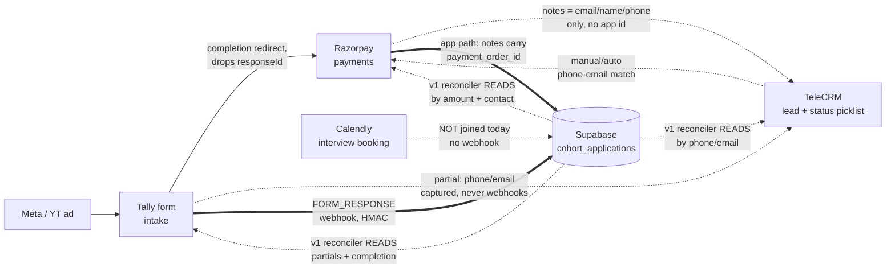
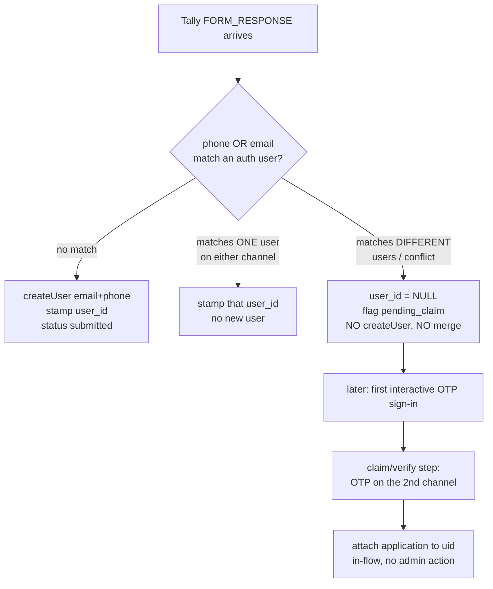
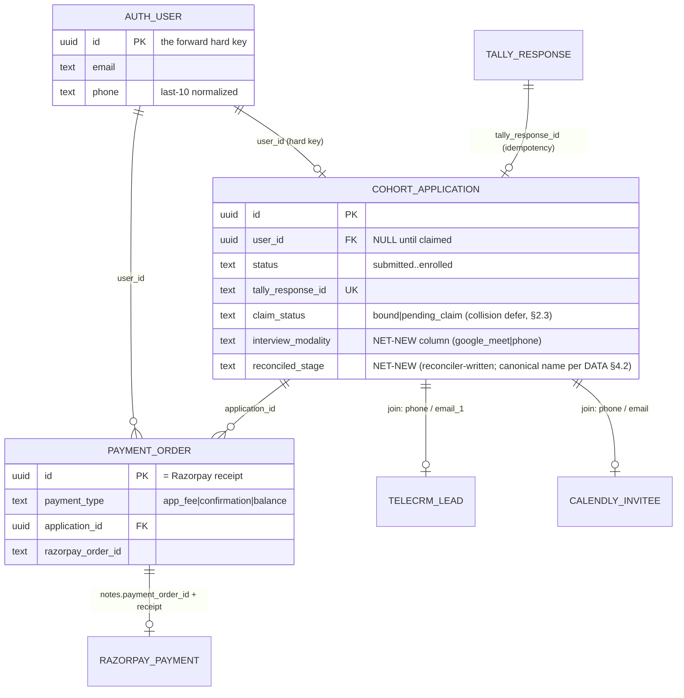
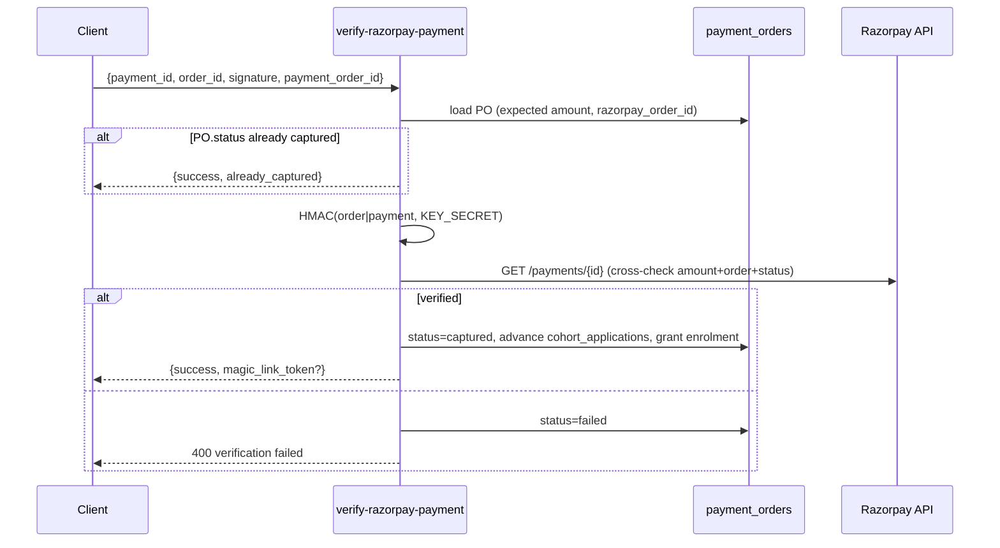

# LevelUp Live Cohorts — Integration Contracts (Forward)

*Doc 04 of the cohort product docs set · authored 2026-07-18 · companion to `01-PRD.md` (the product source of truth), `COHORT-LOGIC.md` (as-is business logic), and `funnel/FUNNEL-DATA-AUDIT.md` (the measured cross-system reality).*

*Audience is dual, like the PRD: a founder new to engineering should be able to read this top-to-bottom and understand exactly how our app talks to Tally, Razorpay, TeleCRM and Calendly and why the four systems don't currently agree on who a person is; and an Opus 4.8 engineering crew should be able to build each integration against a checkable contract — auth, payload shape, failure/retry behaviour, and the one identity key we standardise on.*

**How to read this document**
- **Forward contract.** For each external system this doc states the contract *we are building toward* (the "forward" state), always anchored to the real code that exists today. Where today's behaviour differs from the forward contract, both are shown and the delta is named. No invented behaviour: every claim cites a repo file, a migration, or the funnel audit.
- **The one hard key.** §2 is the spine of the whole document. Everything else is an application of it. Read it first.
- **Tier tags** follow `CLAUDE.md`'s blast-radius model. Every item here touches auth, payments, or an edge function on the money/login path, so nearly all of it is `🔴 Tier 1` and gated on the bugfix council + adversarial suite + Rahul's written sign-off before ship.
- **RAHUL DECISION blocks** mark every contract choice Rahul has not confirmed, each with a recommended default so the crew is never blocked.
- **Do-not-touch.** The staged-checkout pipeline (`create-razorpay-order` staged branch, `verify-razorpay-payment`, `razorpay-webhook`) and the `ApplicationStatus.tsx:319,337` `isIOS()` guard are sacred (PRD §4.4, NFR-SEC-5). This doc *reads and extends around* them; it does not modify them.

**Terms defined once (used throughout):**
- **The join.** Every cross-system link in the live funnel today is a **phone/email match**, not a foreign key. "The join" always means this phone-or-email match and its ~90% hit rate / ~10% orphan rate (`FUNNEL-DATA-AUDIT.md` §1/§5).
- **Normalized phone.** The bare last-10 digits of an Indian mobile (e.g. `9884731816`), produced by `normalizePhone()` (`guest-create-order/index.ts:60`, `verify-razorpay-payment/index.ts:16`) — 12 digits starting `91` → slice off `91`; 10 digits → as-is; anything else → `null`. `e164()` (`_shared/phone.ts`) is the same value with a leading `+91`. `phoneVariants()` enumerates historical stored formats for defensive matching.
- **The staged pipeline.** The app's own three-payment machine: `app_fee` (₹400) → `confirmation` (₹8k) → `balance` (remainder), each advancing `cohort_applications.status` (migration `20260413100000`).

---

## 1. The four systems, and the fact that governs all of them



**The one structural fact (from `FUNNEL-DATA-AUDIT.md` §1/§2):** the live funnel is stitched together by **phone number and email only**. No system passes a stable id to the next. Tally's completion redirect to the Razorpay link drops the `responseId`; the Razorpay page re-collects name/email/phone into `notes`; TeleCRM matches back on phone/`email_1`. **Across 199 recent Razorpay payments, 0 carried an `application_id`, `offering_id`, or `payment_order_id`** — the live money runs through hardcoded Razorpay Payment Links, not the app's order path. The app's clean `cohort_applications` pipeline is real code on a **parallel, largely-dormant track**.

Everything in this doc is in service of one repair: **give the four systems a hard key so they stop disagreeing about who a person is.** That repair is §2. The per-system contracts (§3–§6) each state how they participate in it. §7 is the reconciler that operates the join until the hard key is universal.

---

## 2. The ONE hard identity key (the spine) `🔴 Tier 1 (auth)`

> **This is the single most important decision in this document.** The PRD's identity spine (REQ-IDENT-1..4, §5.1) and north-star metric (§2.1) both collapse without it.

### 2.1 What we standardise on

**The forward hard key is `auth.users.id` (the Supabase app user id, a.k.a. `auth.uid`), minted at the earliest system touch and carried forward on `cohort_applications.user_id`.**

The mechanism (PRD REQ-IDENT-1/2): the moment a Tally `FORM_RESPONSE` arrives, the webhook mints **one** passwordless auth user carrying **both** email and phone, using the proven `guest-create-order` provisioning surface — `auth.admin.createUser({ email, phone, email_confirm:false, phone_confirm:false })` (`guest-create-order/index.ts:247-255` today does the email-only version; the forward contract adds `phone`). `cohort_applications.user_id` is stamped to that uid. Because both identifiers live on the one auth user, a later OTP on **either** channel resolves — via `find_login_identity(p_phone, p_email)` (`verify-msg91-otp/index.ts:175`) — to the same `auth.uid`.

From that point the app owns a hard key. It stamps that key into everything it controls (payment `notes`, Calendly invitee tracking) so downstream systems finally carry it.

### 2.2 The two external join keys (used only where `user_id` is not yet emitted)

External systems (Tally partials, TeleCRM leads, hardcoded Razorpay links) cannot emit our `user_id` today. Until they do, the reconciler (§7) joins on:

| Rank | Key | Canonical form | Why this rank |
|---|---|---|---|
| **Primary** | **Normalized phone** | last-10 digits (`normalizePhone`) / `+91`-prefixed `e164()` | It is the **OTP login key** — `find_login_identity` resolves users by last-10 phone (`verify-msg91-otp/index.ts:167-178`); it is present on TeleCRM `fields.phone` and Razorpay `contact`; it is already canonicalised by shared helpers; and phone is harder to mistype than email at a payment page. |
| **Secondary** | **Lowercased email** | `trim().toLowerCase()` | The Tally-webhook dedup key (`tally-application-webhook/index.ts:104-109`, on `(offering_id, email)`) and TeleCRM `fields.email_1`. Used when phone is absent or when the phone match is empty. |

> **RAHUL DECISION — INTEG-KEY-1: phone as the primary external join key.** `🔴 Tier 1`
> **Recommended default: phone-primary, email-secondary, as above.** Rationale: phone is the login key the whole auth stack already trusts (`find_login_identity` by last-10; `verify-msg91-otp`); the audit's ~90% match runs on phone/email jointly, and phone mistypes are rarer than email typos at the Razorpay page. Alternative Rahul may prefer: email-primary (matches the Tally-webhook dedup key and is case-insensitively stable). Recommendation stays phone-primary because it is the one identifier that already mints sessions. **Whichever is chosen, the reconciler must attempt BOTH and record which key resolved each match** (§7 join-completeness instrumentation) so we can measure the orphan rate the audit puts at ~10% (`FUNNEL-DATA-AUDIT.md` §5 gap 1).

### 2.3 The collision rule (never a silent merge) `🔴 Tier 1`

The hard-key mint has exactly one dangerous case: the incoming phone or email **already belongs to a different auth user** (typo, shared family number). This is the same class the guest checkout already guards interactively with a 403 (`guest-create-order/index.ts:118-128`: email↔phone linked to different accounts / phone-on-file mismatch). But the Tally webhook runs **server-to-server with no human present**, so it can neither surface a 403 nor safely `createUser` (unique-constraint conflict).

**Forward contract (PRD REQ-IDENT-2):** on collision the webhook **defers** — leaves `cohort_applications.user_id` NULL, flags the row `pending_claim`, creates/merges nothing. The first interactive OTP sign-in runs the claim/verify step (one additional OTP on the second channel) and only then attaches the application. This mirrors the guest-checkout mismatch guard, moved to the one moment a human is present.



**Acceptance (from REQ-IDENT-1/2, restated as an integration check):** given a completed Tally submission for an unknown email+phone, exactly one `auth.users` row exists with **both** `email` and `phone` populated and `cohort_applications.user_id` stamped; re-delivery of the same `tally_response_id` creates no duplicate; a collision leaves `user_id` NULL + `pending_claim` and mints/merges nothing; the claim completes at sign-in with zero out-of-band steps.

### 2.4 Cross-system identity map (target state)



---

## 3. Tally — the intake contract `🔴 Tier 1 (webhook) / 🟢 Tier 3 (form-builder)`

Ground truth: `supabase/functions/tally-application-webhook/index.ts`; `FUNNEL-DATA-AUDIT.md` §2; `TALLY-UX-ANALYSIS.md`.

### 3.1 Auth

- **Header:** `tally-signature`.
- **Scheme:** HMAC-SHA256 of the **raw request body**, base64-encoded, compared with `timingSafeEqual` against the header (`index.ts:8-15`, `_shared/crypto.ts` `hmacSha256Base64`).
- **Secret:** `TALLY_SIGNING_SECRET` (referenced by name only). **If unset, the webhook rejects every request** (`index.ts:9-12`) — a fail-closed posture the forward contract keeps.
- Non-POST → 405; bad/absent signature → 401.

### 3.2 Payload shape (what Tally sends)

```jsonc
{
  "eventType": "FORM_RESPONSE",          // ONLY value we act on; else {ok, skipped}
  "data": {
    "formId":     "nWLkyk",              // matched to offerings.tally_form_url (contains)
    "responseId": "…",                    // → tally_response_id (idempotency key)
    "fields": [
      { "label": "Full name",  "value": "…" },
      { "label": "Email",      "value": "…" },
      { "label": "WhatsApp",   "value": "…" },
      { "label": "City",       "value": "…" },
      { "label": "…",          "options": [{ "text": "…" }] }  // multi-select → joined
    ]
  }
}
```

**Field extraction is fuzzy label-match** (`extractField`, `index.ts:17-25`) — case-insensitive `label.includes(...)`:

| App field | Labels matched (first hit wins) | Notes |
|---|---|---|
| `full_name` | `name` → `full name` | falls back to `email.split("@")[0]` if empty (`index.ts:151`) |
| `email` | `email` | **required** — no email → 400 (`index.ts:63-68`) |
| `phone` | `phone` → `mobile` → `whatsapp` | nullable; **this is the key we most need** for the hard-key mint (§2) — the forward contract must ensure the Tally form's phone field label contains one of these tokens |
| `city` | `city` → `location` | |
| `occupation` | `occupation` → `profession` → `work` | |
| `bio` (the essay) | `about` → `bio` → `tell us` | reviewer-only forever (PRD REQ-APP-1); never rendered back to the applicant |
| `craft` | `craft` → `discipline` → `what do you make` | **NEW extraction** → typed `cohort_applications.craft`. Feeds COPY's `{craft}` safe-personalization token (`03-DATA-MODEL-ERD.md` §4.2). Confirm the exact Tally quiz-field label as part of REQ-APP-3 form work. |
| `quiz_goal` | `goal` → `what do you want` → `outcome` | **NEW extraction** → `cohort_applications.quiz_goal`; feeds `{quiz_goal}`. |
| `experience_band` | `experience` → `years` → `level` | **NEW extraction** → `cohort_applications.experience_band`; feeds `{experience_band}`. |

Full raw `data` is stored in `cohort_applications.tally_data` (jsonb) for replay/forensics. The three quiz-derived fields above are extracted into **typed columns** (not left in the jsonb blob) precisely so COPY's personalization tokens resolve from real fields and never from the free-text essay (REQ-APP-1).

### 3.3 Partial vs complete — the asymmetry that drives the reconciler

- **The webhook fires ONLY on `FORM_RESPONSE` = completed submissions. Partials never reach it** (`index.ts:46-50`; `FUNNEL-DATA-AUDIT.md` §2). So the webhook **cannot** mint the `application_started` denominator the north-star metric needs (PRD §5.1, §7).
- **Partials, and how far each got, live only in the Tally API.** The audit read "2,000 most-recent VE partials, bucketed by the furthest question each reached" (`TALLY-UX-ANALYSIS.md` §4) — that furthest-question data exists in Tally's partial-response payloads. The reconciler (§7) reads it; the webhook cannot see it.
- **Save-and-resume is Tally-native** (`TALLY-UX-ANALYSIS.md` §6 rec 8): a form-stage abandoner's recovery link is Tally's own resume link (PRD REQ-INSTALL-1), not an app deep-link. v1 does **not** promise a unified field-precise magic link (that is CRO #4, fast-follow).

### 3.4 Offering resolution & idempotency

- **Offering match:** among `offerings` with `payment_mode = 'staged'` and non-null `tally_form_url`, pick the one whose `tally_form_url` **contains** `formId` (`index.ts:73-88`). No match → 404. (Forward note: if a form serves multiple offerings, this "contains" match is ambiguous — flagged in §9.)
- **Dedup / upsert:** existing application for `(offering_id, email)` → **update** in place (`index.ts:104-143`); otherwise **insert** with `status='submitted'`.
- **Idempotency:** `tally_response_id` has a unique index; a concurrent retry of the same response raises `23505` and is absorbed as `{ ok, deduped:true }` (`index.ts:164-176`). **Re-delivering the same response never creates a duplicate.**

### 3.5 The delta from today → forward

| Aspect | Today (`index.ts`) | Forward (PRD REQ-IDENT-1/2) |
|---|---|---|
| User link | links only to a **pre-existing** `public.users` row by email; else `user_id` NULL (`index.ts:92-96, 150`) | **mints** one auth user carrying email **+ phone** when none matches; stamps `user_id` |
| Phone binding | phone stored on the application only | phone bound to the **auth user** so phone-OTP resolves to the same uid |
| Collision | not handled (no createUser at all today) | defer → `pending_claim`, interactive claim at sign-in (§2.3) |
| Partials | invisible | read by the reconciler (§7) for the NSM denominator + resume signal |

**Tier note:** the webhook change is `🔴 Tier 1` (auth/provisioning on the login path). The form-builder shortening (REQ-APP-3: progress bar, cut the quiz block, split contact page, optional Q7/Q9, forward-dated availability) is `🟢 Tier 3` Tally-side and touches **no** field order or the payment gate.

---

## 4. Razorpay — the payments contract `🔴 Tier 1 (do-not-touch core)`

Ground truth: `create-razorpay-order`, `guest-create-order`, `verify-razorpay-payment`, `razorpay-webhook`; `_shared/pricing.ts`; `FUNNEL-DATA-AUDIT.md` §4; migration `20260413100000`.

> **The core of this section is sacred.** The staged-order branch, both verification functions, and the `isIOS()` guard must not change (PRD §4.4, NFR-SEC-5). The forward contract here is about **making the payment carry the hard key** (§2) and reconciling the payments that don't — not re-architecting checkout.

### 4.1 Order creation — two paths, both stamp `notes`

| Path | Auth | Who | `notes` written to Razorpay | `receipt` |
|---|---|---|---|---|
| `create-razorpay-order` | `Authorization: Bearer <supabase JWT>`; `getClaims` → `userId` (`index.ts:27-42`) | logged-in user (staged app_fee/confirmation/balance **and** single) | `{ offering_id, user_id, payment_order_id }` (`index.ts:326-330`) | `payment_orders.id` |
| `guest-create-order` | none (public), IP rate-limited 8/15min/(ip,offering) (`index.ts:77-92`) | guest checkout | `{ offering_id, guest_email, payment_order_id }` (`index.ts:334-338`) | `payment_orders.id` |

Both POST `https://api.razorpay.com/v1/orders` with HTTP Basic `RAZORPAY_KEY_ID:RAZORPAY_KEY_SECRET` (`index.ts:316-332`). Both create a `payment_orders` row **first** (status `created`), then attach `razorpay_order_id` after Razorpay responds.

**The forward contract's central Razorpay move:** every payment the app originates carries **`notes.payment_order_id` + `receipt = payment_orders.id`**, and for staged payments `payment_orders.application_id` links straight to the application. This is the hard key that fixes the "0/199 carried an app id" problem (`FUNNEL-DATA-AUDIT.md` §2) — **for payments that flow through the app**.

> **RAHUL DECISION — INTEG-PAY-1: route the live ₹400 through the app's order path (so it carries the hard key)?** `🔴 Tier 1 (revenue)`
> The 0/199 problem exists because the **live funnel's ₹400 is a hardcoded Razorpay Payment Link** in Tally's completion redirect (`FUNNEL-DATA-AUDIT.md` §1/§2), not `create-razorpay-order`. Two ways forward: **(a)** point Tally's completion redirect (or the ₹400 success screen, REQ-INT-0) at the app's `type=app_fee` staged order so the payment is born with `payment_order_id` + `application_id`; or **(b)** keep the hardcoded links and lean entirely on the reconciler (§7) to phone/email-match payments after the fact. **Recommended: (a) for NEW cohorts / the ₹400 success-screen flow, (b) as the reconciliation safety net for anything still on hardcoded links.** Rationale: (a) is the only way to get a real foreign key on the money; (b) alone perpetuates the ~10% orphan rate. This is a revenue-path change → council + staged rollout; the existing staged functions are **reused unchanged** (the ₹400 already has an `app_fee` code path — `create-razorpay-order/index.ts:121-125`). Do **not** change `verify-*` or the `isIOS()` guard to do this.

### 4.2 Staged amounts (the SKU is the amount)

Razorpay carries **no SKU**; amount **is** the product (`FUNNEL-DATA-AUDIT.md` §4). The staged machine computes each stage server-side (`create-razorpay-order/index.ts:96-144`):

| Stage | `payment_type` | Amount source | Guards (enforced server-side) |
|---|---|---|---|
| Application fee | `app_fee` | `offerings.app_fee_inr` (₹400 Live; ₹600–900 Forge) | rejects if `app_fee_payment_id` already set |
| Seat confirmation | `confirmation` | `offerings.confirmation_amount_inr` (₹8k Live; ₹15k Forge) | requires `app_fee_payment_id`; rejects if `confirmation_payment_id` set |
| Balance | `balance` | `price_inr − (app_fee + confirmation)` (`index.ts:139-142`) | requires `confirmation_payment_id`; rejects if `balance_payment_id` set |

Staged payments **skip bumps and coupons** (`index.ts:156-190`). Ownership is verified: `application_id` must belong to the requesting `userId`, else 403 (`index.ts:116-117`). The reconciler (§7) reads captured amounts to infer stage for payments that never touched this path.

### 4.3 Verification — two independent, defense-in-depth mechanisms

Both must remain byte-for-byte (do-not-touch). Contract for anyone extending around them:

**(1) Client redirect — `verify-razorpay-payment`** (`🔴 Tier 1`)
- Client posts `{ razorpay_payment_id, razorpay_order_id, razorpay_signature, payment_order_id, is_guest }`.
- **HMAC-SHA256-hex** over `` `${order_id}|${payment_id}` `` with `RAZORPAY_KEY_SECRET`, `timingSafeEqual` (`index.ts:66-73`).
- **Even when HMAC passes**, it cross-checks the payment via the Razorpay API (`verifyViaApi`, `index.ts:75-126`): status ∈ {captured, authorized}, `order_id` matches, and **amount exactly equals `payment_orders.total_inr × 100` paise**. This blocks replaying a cheap signature against an expensive order.
- Order-id mismatch or amount mismatch → mark `failed`, 400 (`index.ts:218-229, 286-292`).
- On success: capture the order, advance `cohort_applications.status` for staged payments (`index.ts:555-606`), grant enrolment (idempotent), fire the invoice/receipt pipeline (fire-and-forget).



**(2) Server-to-server — `razorpay-webhook`** (`🔴 Tier 1`)
- **Separate secret:** `RAZORPAY_WEBHOOK_SECRET` (NOT `RAZORPAY_KEY_SECRET`; the code comments call this out explicitly, `razorpay-webhook/index.ts:147-153`).
- Header `x-razorpay-signature`; **HMAC-SHA256-hex over the raw body**; `timingSafeEqual` (`index.ts:52-58, 155-158`).
- **No CORS** — deliberately empty headers; this endpoint is only hit by Razorpay's workers, never a browser (`index.ts:4-10`).
- Acts only on `event === "payment.captured"` (`index.ts:163-165`).
- **Source of truth = `payment_orders` looked up by `razorpay_order_id`, never `payment.notes`** (`index.ts:184-204`) — notes are a sanity check at most.
- Amount mismatch → `needs_review`, ack 200 (never 4xx, or Razorpay retries the same mismatch forever) (`index.ts:219-239`).

### 4.4 Idempotency & failure posture (the whole capture surface)

| Concern | Mechanism | Location |
|---|---|---|
| Duplicate order on double-click | reuse a `created` PO within 10 min matching total+bumps+coupon | `create-razorpay-order/index.ts:241-283` |
| Double capture (webhook vs redirect race) | atomic conditional UPDATE claims capture only if not already terminal | `razorpay-webhook/index.ts:272-283` |
| Duplicate enrolment | partial unique index `enrolments_unique_active`; INSERT-then-reselect on `23505` | both verify paths |
| Coupon double-redeem | `redeem_coupon()` RPC gated behind the won capture claim | `razorpay-webhook/index.ts:405-421` |
| Terminal-state re-entry | `captured` / `needs_review` exit fast; never auto-reprocess a parked order | `razorpay-webhook/index.ts:209-217` |
| Money-on-the-floor safety | any account-resolution failure → park `needs_review`, ack, human recovers; never drop the payment | `verify-razorpay-payment/index.ts:451-511` |
| Unknown order (e.g. hardcoded link) | webhook returns 200 `{skipped:"no payment_order"}` so Razorpay stops retrying | `razorpay-webhook/index.ts:193-204` |

That last row is the audit's 0/199 case at runtime: a ₹400 paid on a hardcoded Payment Link has no `payment_orders` row, so the webhook can't advance any application — **only the reconciler (§7) can attach it, by phone/email.** This is exactly why INTEG-PAY-1 matters.

### 4.5 What the reconciler reads from Razorpay (read-only)

`GET https://api.razorpay.com/v1/payments?from&to&count&skip`, HTTP Basic (`FUNNEL-DATA-AUDIT.md` §4 method notes). Per payment: `amount, status, created_at, method, contact, email, order_id, notes`. Bucketed by amount → stage (₹400 applied / ₹8k·₹15k confirmed / ≥₹40k or ₹22–32k balance). Join to a user by `notes.phone`/`notes.email` or top-level `contact`/`email` (§2.2). **No writes to Razorpay, ever.**

---

## 5. TeleCRM — the funnel-stage read contract `🔴 Tier 1 (read path)`

Ground truth: `FUNNEL-DATA-AUDIT.md` §3. **There is no TeleCRM code in the repo today** — this is a net-new read integration inside the reconciler (§7). No writes in v1.

### 5.1 Auth & endpoint

- **Base:** `https://next.telecrm.in/autoupdate/v2`.
- **Read:** `POST /enterprise/{enterpriseId}/lead/search`, body `{"fields":{"created_on":{ …window… }}}` (`FUNNEL-DATA-AUDIT.md` §3, method notes).
- **Auth:** bearer token — a new secret (e.g. `TELECRM_API_TOKEN`) + the `enterpriseId`, referenced by name only. Sourced from the iCloud LevelUp Core `.env.*` vault per `CLAUDE.md` secret rules.

### 5.2 The lead record & where the stage lives

Top-level: `{ id, status, score, rating, labelids, actions, createdBy, fields{…} }`.

- **`labelids` (tags) are empty on every lead** — the tag system is NOT the stage tracker (`§3`).
- Top-level `score`/`rating` are always 0. **The real MQL is `fields.mql`** (numeric; ≥40 = high), with `fields.mql_bucket` as a band.
- **The funnel stage is the top-level `status` picklist.** This is the answer to "what are the real stage names":

| `status` value | Meaning | Maps to `cohort_applications.status` |
|---|---|---|
| `NEW` | fresh lead / phone-captured partial (empty `essay`) | `submitted` (or pre-submit partial) |
| `DNP 1`, `DNP Reminder` | call attempts | — (CRM-internal) |
| `Direct Junk`, `Lost` | disqualified / dropped | `withdrawn` / (no direct map) |
| `WARM`, `HOT` | sales temperature | — |
| `Fee Link Sent` | ₹400 link sent, not paid | `submitted` (fee pending) |
| `Application Fee Paid` | ₹400/₹600–900 captured | `app_fee_paid` |
| `Interview Scheduled` | Calendly booked | `interview_scheduled` |
| `Need to reschedule interview` | | `interview_scheduled` (reschedule flag) |
| `Interview completed` | interview held | `interview_done` |
| `No show` | booked, didn't attend | `interview_no_show` (reconciled_stage; a branch off `interview_scheduled`, **not** interview_done — aligned with STATE §3.2 / DATA §4.3) — the **show-rate guardrail**, PRD §2.2 |
| `Deffered` *(sic)* | deferred to a later cohort | — (policy: lapsed ≠ lost, CRO #8) |
| `Converted` | **won** — seat-confirm OR full payment (collapsed) | `confirmation_paid` / `balance_paid` / `enrolled` |

**Two gaps this vocabulary can't close (`§3`, `§5` gap 4):**
1. **No explicit `Accepted` state** — acceptance is implicit between `Interview completed` and `Converted`. The app enum has `accepted`/`rejected` but **no writer anywhere** (`FUNNEL-DATA-AUDIT.md` §2). Post-interview acceptance cannot be read from TeleCRM.
2. **`Converted` collapses** ₹8k/₹15k seat-confirm and full payment into one state — the money-stage distinction survives **only in Razorpay amounts**, not TeleCRM.

So the reconciler derives stage from **TeleCRM `status` joined with Razorpay amounts** — neither alone is sufficient.

### 5.3 Partial vs complete, and the ~10% join failure

- **Partials carry no flag.** A phone-captured partial is a `NEW` lead with an **empty `essay`**; a completed application has `essay` text and `character_count > 0` (`§3`). Of `NEW` leads, ~**377 have no essay** = the recoverable partials sitting in the CRM now (`§3`).
- **`Application Fee Paid` is set by matching the Razorpay payer's phone/email back to the lead** — there is no Razorpay reference on the lead (`§3`). A payment whose phone/email doesn't cleanly match a lead **silently desyncs** the two. This is the ~10% orphan (`§5` gap 1) the reconciler must **measure and surface as a health metric** (PRD REQ-RECON-1 acceptance), not hide.

### 5.4 Write-back — out of scope in v1

> **RAHUL DECISION — INTEG-CRM-1: does the app write back to TeleCRM (or stay read-only)?** `🔴 Tier 1`
> This is the integration-level face of PRD **Open Q1** (system of record, §8.2). **Recommended default: read-only in v1.** The app becomes authoritative for the states **it controls** (provisioning, the staged payments it originates, room/enrolment) and **reconciles** TeleCRM/Razorpay/Calendly for the rest — it does not write TeleCRM statuses. Rationale: TeleCRM is the sales team's live workspace; a bidirectional sync is a much larger, higher-blast-radius contract and is unnecessary to make the app a first-party *observer* of stage (which is all the NSM needs). If Rahul later wants the app to own interview/accept/reject, that is a net-new **write** contract (status push + conflict policy) scoped after one reconciliation cycle proves the read path. Until then, the app **never** writes TeleCRM.

---

## 6. Calendly — the interview-booking contract `🔴 Tier 1 (net-new)`

Ground truth: today Calendly is **only** two config columns — `offerings.calendly_url` and `offerings.thankyou_show_calendly` (migration `20260413100000:59,61`; `types.ts:4037,4079`). **There is no Calendly webhook, no receiver, and no `interview_modality` column anywhere** (PRD REQ-INT-1 feasibility note; `FUNNEL-DATA-AUDIT.md` §5: "Calendly is the source; it is not joined to the app"). This is the largest net-new external→app surface in the funnel, comparable to the render worker (PRD §9.1).

### 6.1 What must be built (all four are prerequisites, none is a "tag")

1. **A new webhook receiver edge function** (e.g. `calendly-webhook`).
2. **Signature verification** with a new secret `CALENDLY_SIGNING_KEY`.
3. **A Calendly-side webhook subscription** (created via Calendly's API against our org/user).
4. **A new `interview_modality` column** on `cohort_applications` (`'google_meet' | 'phone'`), plus reuse of the existing `interview_date` column (`20260413100000`).

### 6.2 Auth

- **Header:** `Calendly-Webhook-Signature` — format `t=<unix>,v1=<hex>`.
- **Scheme:** HMAC-SHA256 of `` `${t}.${rawBody}` `` with `CALENDLY_SIGNING_KEY`, hex, `timingSafeEqual` — reuse `_shared/crypto.ts` `hmacSha256Hex` + `timingSafeEqual`, the same primitives `razorpay-webhook` uses. Reject on bad/absent signature (fail-closed, like Tally). Optionally reject stale `t` (replay window).
- **Posture:** server-to-server; **no CORS** (mirror `razorpay-webhook/index.ts:4-10`).

### 6.3 Payload & the modality choice

Calendly delivers `invitee.created` and `invitee.canceled`. The receiver reads:

```jsonc
{
  "event": "invitee.created",
  "payload": {
    "email": "…",                      // join key (secondary, §2.2)
    "text_reminder_number": "+91…",     // join key (primary, §2.2) when present
    "scheduled_event": {
      "start_time": "2026-07-20T13:00:00Z",   // → cohort_applications.interview_date
      "location": {
        "type": "google_conference",           // → interview_modality = 'google_meet'
        "join_url": "https://meet.google.com/…" // Meet card (link lands T−15)
        // OR type "outbound_call"/"custom" with phone → interview_modality = 'phone'
      }
    },
    "questions_and_answers": [ … ]        // may carry the student's modality pick
  }
}
```

**Modality (PRD REQ-INT-1):** the student picks **Google Meet or phone** at booking, mapped to Calendly **location** options. The receiver persists `interview_modality` (CHECK `google_meet|phone` — the canonical enum, mirrored in DATA §4.2) from the `location.type` (Meet → `join_url`; phone → the invitee's number). **Zoom is never assumed for the interview modality** (the delivered cohort-room session legitimately runs on Zoom — see COPY CD-08-SES-01; this rule binds the interview only). The appointment card renders the chosen variant exactly.

### 6.4 The fee-paid → schedule handoff (CRO #2 / REQ-INT-0)

- The ₹400 payment-success screen presents the **three soonest interview slots as one-tap buttons** ("receipt → booking, one motion", v2 Stage 05-A). Booking at peak intent closes the "fee paid, interview not scheduled" gap the audit flags (`FUNNEL-DATA-AUDIT.md` §5: leads stuck in `Application Fee Paid` never reaching `Interview Scheduled`).
- Slot embedding options: **(a)** Calendly inline embed widget, or **(b)** app-native slot buttons backed by Calendly's availability API. CRO #2's named A/B is "embed slots vs. link out"; the embed path is the v1 default.
- A student who declines still lands in the reminder ladder's "you paid, book your interview" nudge (REQ-INSTALL-3), driven off the reconciler's fee-paid-no-interview marker.

> **RAHUL DECISION — INTEG-CAL-1: subscription scope + slot mechanism.** `🔴 Tier 1`
> Two sub-choices: **(1)** webhook subscription scope — a single **org-level** subscription (one secret, all interviewers) vs **per-user** subscriptions (finer control, more secrets to manage); **(2)** slot source on the success screen — Calendly **inline embed** vs app-native buttons over the **availability API**. **Recommended: org-level subscription + inline embed for v1** (fewest moving parts, one signing key, and the embed inherits Calendly's own availability truth so we never double-book). Revisit per-user + availability-API if per-interviewer routing or a fully native booking UI becomes a requirement. Either way: signature verification is mandatory and the receiver **writes `interview_scheduled` + `interview_date` + `interview_modality`** onto `cohort_applications` — this is the writer the intermediate state has lacked (`FUNNEL-DATA-AUDIT.md` §2).

### 6.5 What the receiver writes (the state it now owns)

```mermaid
sequenceDiagram
    participant S as Student
    participant CS as ₹400 success screen (REQ-INT-0)
    participant Cal as Calendly
    participant WH as calendly-webhook (net-new)
    participant DB as cohort_applications
    S->>CS: pays ₹400 (app_fee)
    CS->>S: 3 soonest slots (Meet | phone)
    S->>Cal: books a slot, picks modality
    Cal->>WH: invitee.created (Calendly-Webhook-Signature)
    WH->>WH: verify HMAC(t.body, CALENDLY_SIGNING_KEY)
    WH->>DB: join by phone/email → status=interview_scheduled,\ninterview_date, interview_modality
    Note over Cal,WH: invitee.canceled → status back to app_fee_paid\n(or 'Need to reschedule'); one reschedule allowed (REQ-INT-3)
```

- `invitee.created` → `status='interview_scheduled'`, set `interview_date`, `interview_modality`.
- `invitee.canceled` → revert to `app_fee_paid` / flag reschedule; **one** reschedule allowed, and the word "free" never appears near it (PRD REQ-INT-3, NFR-COPY-4).
- Join to `user_id` by phone/email (§2.2); if unresolved, park + surface in the orphan-rate health metric (§7) rather than silently dropping.

---

## 7. The reconciler — operating the join until the hard key is universal `🔴 Tier 1`

This is PRD **REQ-RECON-1** (§5.1), the north-star linchpin and Slice-1's first-to-ship item. It is where the four contracts above meet. Restated as an integration contract:

### 7.1 Contract

- **Trigger key:** the **logged-in user's normalized phone + email** — exactly the join the whole funnel already runs on (§2.2).
- **Reads (all read-only, secrets by name):**
  - **Tally API** → completed submission? partial + furthest question? → the `application_started` denominator (which the completion-only webhook cannot see, §3.3) and the resume signal.
  - **TeleCRM** `POST …/lead/search` → `status` + `mql` (§5).
  - **Razorpay** `GET /payments` → captured ₹400 / ₹8k·₹15k / balance amounts (§4.5).
- **Writes:** only `cohort_applications` (a net-new reconciled-stage field + the two markers below), for states the app can own. **Never** writes Tally, TeleCRM, or Razorpay (INTEG-CRM-1).
- **Derives the stage→CTA table** (`FUNNEL-DATA-AUDIT.md` §6):

| Detected state (phone/email reads) | CTA the app renders |
|---|---|
| Tally partial, no completion | Resume application (Tally save-and-resume) |
| Completed form, no captured ₹400 | Pay the ₹400 application fee |
| `Application Fee Paid`, no `Interview Scheduled` | Book your interview (Calendly, §6.4) |
| `Interview completed`, not `Converted` | Awaiting decision / pay seat-confirm when accepted |
| ₹8k/₹15k paid, balance not paid | Pay your balance before the cohort starts |
| `Converted` / full payment | Enrolled: show cohort content |

### 7.2 The two markers that are invisible today

1. **"Completed-form, fee-not-paid"** — essay-present-in-Tally/TeleCRM **minus** a matching captured ₹400 (`FUNNEL-DATA-AUDIT.md` §5 gap 2). The warmest recoverable lead; fires the REQ-INSTALL-3 fee nudge; **clears** the moment a matching ₹400 appears.
2. **Contactable-partial** — a phone+email partial with no completion (~377 sit in TeleCRM `NEW` now, gap 3).

### 7.3 Join-completeness is instrumented and asserted (not optional)

Per REQ-RECON-1 acceptance:
- Record the share of Tally starts (and captured ₹400 payments) that resolve to a `user_id`.
- **Surface the orphan rate as a health metric** (the audit's ~10% is the provisional watch line; target set after batch 1).
- A run where join completeness drops below the watch line **raises a visible alert** rather than silently under-counting the NSM.

Without this the NSM (PRD §2.1) collapses to in-app completion rate, because the live money still flows through hardcoded links (§4.4). That is why the reconciler ships **first**.

---

## 8. Consolidated auth, secrets & failure-posture reference

### 8.1 Secrets (all referenced by name only; sourced from the iCloud LevelUp Core vault per `CLAUDE.md`)

| Secret | System | Used by | Status |
|---|---|---|---|
| `TALLY_SIGNING_SECRET` | Tally | `tally-application-webhook` (HMAC-b64, `tally-signature`) | exists |
| `RAZORPAY_KEY_ID` / `RAZORPAY_KEY_SECRET` | Razorpay | order create + HMAC-hex verify + API cross-check | exists |
| `RAZORPAY_WEBHOOK_SECRET` | Razorpay | `razorpay-webhook` only — **separate** from KEY_SECRET | exists |
| `MSG91_AUTH_KEY` | MSG91 | `verify-msg91-otp` (phone-OTP login) | exists |
| `REVIEW_LOGIN_CODE` | MSG91 bypass | App-review demo login for `+918888777666` only | exists |
| `TELECRM_API_TOKEN` + `enterpriseId` | TeleCRM | reconciler read path (§5) | **net-new** |
| `CALENDLY_SIGNING_KEY` | Calendly | `calendly-webhook` receiver (§6) | **net-new** |
| Tally API token | Tally | reconciler partials read (§7) | **net-new** (read path; distinct from the webhook signing secret) |

### 8.2 Signature scheme quick-reference (grep-checkable, so nobody copies the wrong one)

| Endpoint | Header | HMAC input | Encoding | Secret |
|---|---|---|---|---|
| `tally-application-webhook` | `tally-signature` | raw body | **base64** | `TALLY_SIGNING_SECRET` |
| `verify-razorpay-payment` | body field `razorpay_signature` | `order_id\|payment_id` | **hex** | `RAZORPAY_KEY_SECRET` |
| `razorpay-webhook` | `x-razorpay-signature` | raw body | **hex** | `RAZORPAY_WEBHOOK_SECRET` |
| `calendly-webhook` (net-new) | `Calendly-Webhook-Signature` | `t.rawBody` | **hex** | `CALENDLY_SIGNING_KEY` |

Note the deliberate split: Tally is base64, both hex ones use **different** secrets, and Calendly signs a timestamped payload. Confusing any two is a security defect.

### 8.3 Failure / retry posture (the pattern every receiver must follow)

- **Fail closed on missing signing secret** (Tally rejects, `index.ts:9-12`; the webhook and Calendly receiver do the same).
- **Ack 200 on permanent conditions** the sender would otherwise retry forever: amount mismatch → `needs_review` + 200 (`razorpay-webhook:219-239`); unknown order → 200 `skipped` (`:193-204`). Reserve 4xx/5xx for genuinely retryable failures.
- **Never drop money/identity on the floor:** account-resolution failures park `needs_review` and ack (`verify-razorpay-payment:451-511`).
- **Idempotency everywhere:** unique keys (`tally_response_id`, `enrolments_unique_active`) + terminal-state fast-exit + atomic capture claim. Re-delivery is always safe.
- **Reconciler:** read-only, secrets by name, orphan-rate alert on low join completeness (§7.3).

---

## 9. Known ambiguities & forward risks (named so none is under-planned)

- **Tally offering-match ambiguity.** `tally_form_url.includes(formId)` (`tally-application-webhook:79-81`) assumes one form ↔ one offering. If a single form ever serves multiple offerings, the match is non-deterministic. *Forward:* keep one form per staged offering, or add an explicit form→offering map. `🟡 Tier 2`.
- **The phone label must contain `phone`/`mobile`/`whatsapp`.** The hard-key mint (§2) needs the phone; `extractField` will silently return `""` if the Tally form's phone field is labelled otherwise. *Forward:* assert the label as part of REQ-APP-3 form work. `🟢 Tier 3`.
- **~10% cross-system orphans are structural**, not a bug to eliminate — they are the ~10% who switch email/phone between form and payment page (`FUNNEL-DATA-AUDIT.md` §5 gap 1). *Mitigation:* §2 binds both identifiers at the source; §7.3 measures the residue. `🔴 Tier 1` (metric integrity).
- **TeleCRM has no `Accepted` state and collapses confirm/full into `Converted`** (§5.2). Post-interview acceptance and the ₹8k-vs-full distinction are **unreadable from TeleCRM alone**; they need Razorpay amounts (confirm/full) and, for acceptance, an app-side writer (Open Q1 / INTEG-CRM-1). *Until resolved, the interview-ledger row hides rather than invents numbers* (PRD REQ-INT-3).
- **Calendly is entirely net-new** (§6). Under-planning it as "a webhook write" is the failure mode the PRD explicitly warns against (REQ-INT-1). It needs a receiver + signature + subscription + a schema column before any interview UI can honour the modality choice.
- **The hardcoded-Razorpay-link legacy** (0/199 app-linked, §4.4) is not removed in v1 — the reconciler absorbs it. INTEG-PAY-1 is the decision that begins retiring it for new cohorts. `🔴 Tier 1 (revenue)`.
- **Do-not-touch surfaces** (`verify-*`, `razorpay-webhook` core, the `isIOS()` guard, the staged-order math) stay byte-for-byte. Every forward change here is *additive* — new receivers, new read paths, new `notes` propagation, new columns — never a rewrite of the money core (PRD §4.4, NFR-SEC-5, Risk R7).

---

*End of Integration Contracts. This document is the forward contract for Tally, Razorpay, TeleCRM and Calendly; it must stay consistent with `01-PRD.md` (especially REQ-IDENT-1..4, REQ-RECON-1, REQ-INT-0/1, REQ-APP-2/3) and with the measured reality in `funnel/FUNNEL-DATA-AUDIT.md`. Nothing here ships without Rahul's written sign-off; the payment core stays untouched.*
