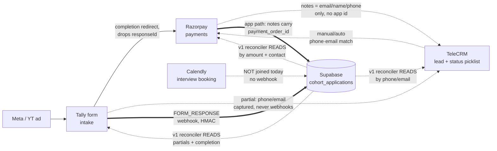
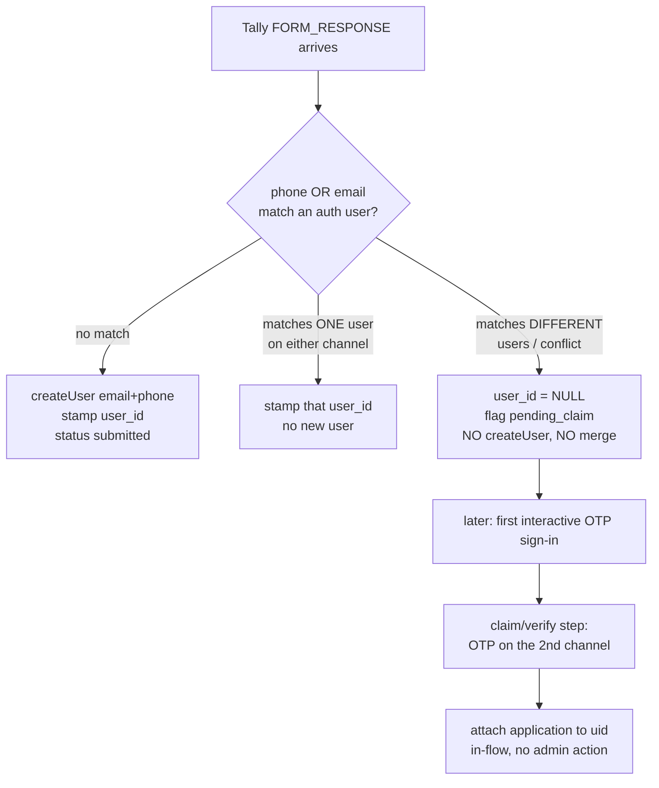
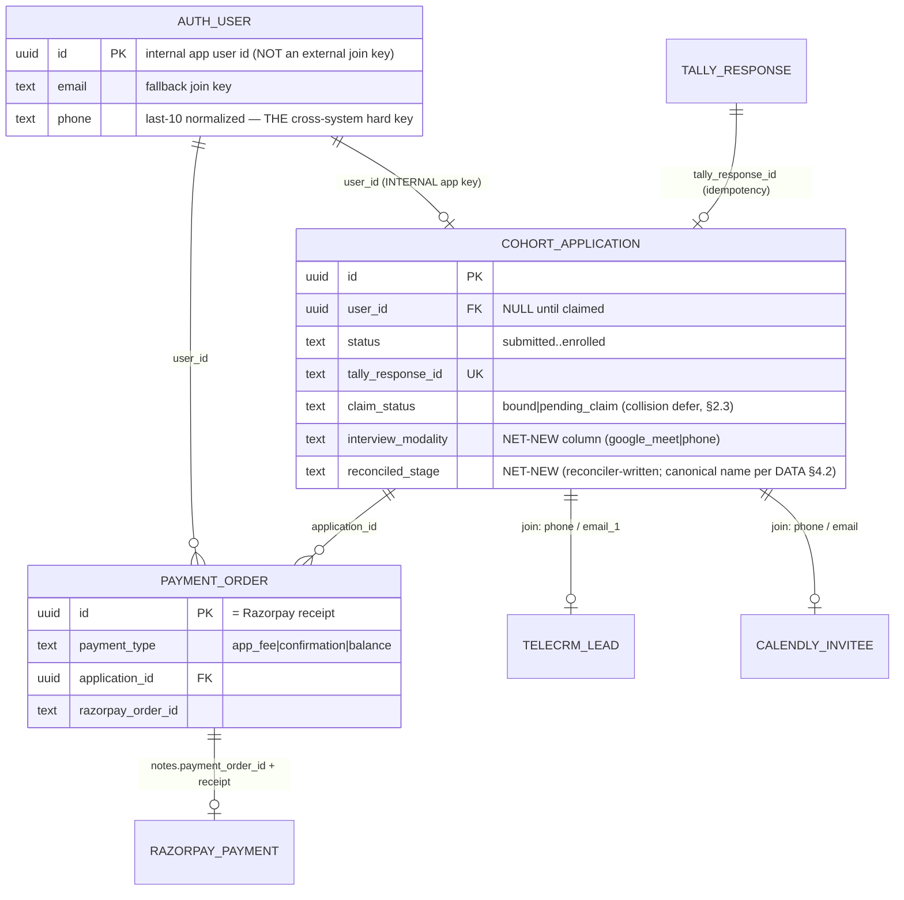
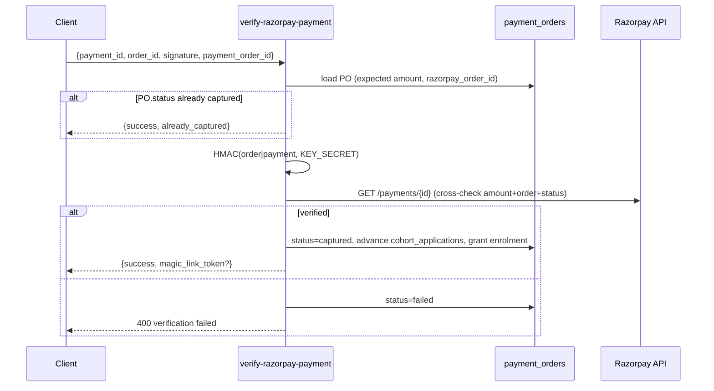

# LevelUp Live Cohorts — Integration Contracts (Forward)

*Doc 04 of the cohort product docs set · authored 2026-07-18 · companion to `01-PRD.md` (the product source of truth), `COHORT-LOGIC.md` (as-is business logic), and `funnel/FUNNEL-DATA-AUDIT.md` (the measured cross-system reality).*

*Audience is dual, like the PRD: a founder new to engineering should be able to read this top-to-bottom and understand exactly how our app talks to Tally, Razorpay, TeleCRM and Calendly and why the four systems don't currently agree on who a person is; and an Opus 4.8 engineering crew should be able to build each integration against a checkable contract — auth, payload shape, failure/retry behaviour, and the one identity key we standardise on.*

**How to read this document**
- **Forward contract.** For each external system this doc states the contract *we are building toward* (the "forward" state), always anchored to the real code that exists today. Where today's behaviour differs from the forward contract, both are shown and the delta is named. No invented behaviour: every claim cites a repo file, a migration, or the funnel audit.
- **The one hard key.** §2 is the spine of the whole document. Everything else is an application of it. Read it first.
- **Tier tags** follow `CLAUDE.md`'s blast-radius model. Every item here touches auth, payments, or an edge function on the money/login path, so nearly all of it is `🔴 Tier 1` and gated on the bugfix council + adversarial suite + Rahul's written sign-off before ship.
- **RULED blocks** carry Rahul's Round-F decisions (2026-07-18). All four integration choices in this doc — INTEG-KEY-1 (phone primary), INTEG-PAY-1 (do not touch the intake chain), INTEG-CRM-1 (TeleCRM read-only) and INTEG-CAL-1 (org-level single Calendly account) — are now **RULED**, together with SOR-1 (TeleCRM master / app read-only mirror) and FEE-1 (₹400 non-refundable, not tuition-credited). Where a ruling reverses an earlier recommended default, a dated ⚠️ margin note marks the reversal in place.
- **Do-not-touch.** The staged-checkout pipeline (`create-razorpay-order` staged branch, `verify-razorpay-payment`, `razorpay-webhook`) and the `ApplicationStatus.tsx:319,337` `isIOS()` guard are sacred (PRD §4.4, NFR-SEC-5). This doc *reads and extends around* them; it does not modify them.

**Terms defined once (used throughout):**
- **The join.** Every cross-system link in the live funnel today is a **phone/email match**, not a foreign key. "The join" always means this phone-or-email match and its ~90% hit rate / ~10% orphan rate (`FUNNEL-DATA-AUDIT.md` §1/§5).
- **Normalized phone.** The bare last-10 digits of an Indian mobile (e.g. `9884731816`), produced by `normalizePhone()` (`guest-create-order/index.ts:60`, `verify-razorpay-payment/index.ts:16`) — 12 digits starting `91` → slice off `91`; 10 digits → as-is; anything else → `null`. `e164()` (`_shared/phone.ts`) is the same value with a leading `+91`. `phoneVariants()` enumerates historical stored formats for defensive matching.
- **The staged pipeline.** The app's own three-payment machine: `app_fee` (₹400) → `confirmation` (₹8k) → `balance` (remainder), each advancing `cohort_applications.status` (migration `20260413100000`).

---

## 1. The four systems, and the fact that governs all of them


```mermaid
flowchart LR
    Ad[Meta / YT ad] --> Tally
    Tally[Tally form\nintake] -->|completion redirect,\ndrops responseId| RZP
    Tally -.->|partial: phone/email\ncaptured, never webhooks| TCRM
    Tally ==>|FORM_RESPONSE\nwebhook, HMAC| App[(Supabase\ncohort_applications)]
    RZP[Razorpay\npayments] -.->|notes = email/name/phone\nonly, no app id| TCRM
    TCRM[TeleCRM\nlead + status picklist] -.->|manual/auto\nphone·email match| RZP
    RZP ==>|app path: notes carry\npayment_order_id| App
    Cal[Calendly\ninterview booking] -.->|NOT joined today\nno webhook| App
    App -.->|v1 reconciler READS\nby phone/email| TCRM
    App -.->|v1 reconciler READS\nby amount + contact| RZP
    App -.->|v1 reconciler READS\npartials + completion| Tally
```

**The one structural fact (from `FUNNEL-DATA-AUDIT.md` §1/§2):** the live funnel is stitched together by **phone number and email only**. No system passes a stable id to the next. Tally's completion redirect to the Razorpay link drops the `responseId`; the Razorpay page re-collects name/email/phone into `notes`; TeleCRM matches back on phone/`email_1`. **Across 199 recent Razorpay payments, 0 carried an `application_id`, `offering_id`, or `payment_order_id`** — the live money runs through hardcoded Razorpay Payment Links, not the app's order path. The app's clean `cohort_applications` pipeline is real code on a **parallel, largely-dormant track**.

Everything in this doc is in service of one repair: **standardise all four systems on the one hard identity key they already share — the phone number (email fallback) — so they stop disagreeing about who a person is.** That repair is §2. The per-system contracts (§3–§6) each state how they participate in it. §7 is the reconciler that operates the phone-first join. Note (RULED INTEG-PAY-1, 2026-07-18): because the app must not touch the intake chain, it does **not** try to push its own id outward to make it "universal" — phone is the shared key, and the app reads/reconciles on it.

---

## 2. The ONE hard identity key (the spine) `🔴 Tier 1 (auth)`

> **This is the single most important decision in this document.** The PRD's identity spine (REQ-IDENT-1..4, §5.1) and north-star metric (§2.1) both collapse without it.

### 2.1 What we standardise on

**The ONE hard identity key across all four external systems is the normalized phone number.** It is the only identifier every system in the live funnel already carries (Tally field, the in-form Razorpay `contact`, TeleCRM `fields.phone`, Calendly `text_reminder_number`) and the identifier our own auth stack mints sessions on. Email is the fallback join key where phone is absent (§2.2). Every cross-system link in this document is a phone-first, email-fallback match.

`auth.users.id` (a.k.a. `auth.uid`) remains the app's **internal** user id — the primary key of a person *inside* our own tables (`cohort_applications.user_id`, `payment_orders.user_id`). It is **not** an external join key and is **never injected into the intake chain**: per **INTEG-PAY-1** (§4.1) the app does not modify Tally, the in-form ₹400 Razorpay link, or Calendly, so our uid can never reach those systems in v1. The bridge between the internal uid and the external hard key is therefore always phone (email fallback), operated by the reconciler (§7).

> ⚠️ **Margin note — reversal (RULED 2026-07-18, Round-F INTEG-PAY-1 / INTEG-KEY-1).** Earlier drafts of this section named `auth.users.id` the "forward hard key … minted at the earliest system touch" and had the app **stamp that key into everything it controls (payment `notes`, Calendly invitee tracking) so downstream systems finally carry it.** That stance is retired for v1: the intake chain is a HARD CONSTRAINT the app must not touch, so the app cannot propagate its id into the live money or the booking flow. Phone is the one hard key that all four systems already share; the app reads/mirrors on it rather than trying to seed its own id outward.

The app still provisions its own account for a person (passwordless, carrying **both** email and phone, via the proven `guest-create-order` surface — `auth.admin.createUser({ email, phone, email_confirm:false, phone_confirm:false })`, `guest-create-order/index.ts:247-255`) so that a later OTP on **either** channel resolves — via `find_login_identity(p_phone, p_email)` (`verify-msg91-otp/index.ts:175`) — to the same `auth.uid`. Binding both identifiers to one auth user is what keeps phone (primary) and email (fallback) pointing at a single internal user. This is app-internal identity, not a write into the intake chain.

### 2.2 The two external join keys (used only where `user_id` is not yet emitted)

External systems (Tally partials, TeleCRM leads, hardcoded Razorpay links) cannot emit our `user_id` today. Until they do, the reconciler (§7) joins on:

| Rank | Key | Canonical form | Why this rank |
|---|---|---|---|
| **Primary** | **Normalized phone** | last-10 digits (`normalizePhone`) / `+91`-prefixed `e164()` | It is the **OTP login key** — `find_login_identity` resolves users by last-10 phone (`verify-msg91-otp/index.ts:167-178`); it is present on TeleCRM `fields.phone` and Razorpay `contact`; it is already canonicalised by shared helpers; and phone is harder to mistype than email at a payment page. |
| **Secondary** | **Lowercased email** | `trim().toLowerCase()` | The Tally-webhook dedup key (`tally-application-webhook/index.ts:104-109`, on `(offering_id, email)`) and TeleCRM `fields.email_1`. Used when phone is absent or when the phone match is empty. |

> **RULED — INTEG-KEY-1 (Rahul, 2026-07-18): phone is the PRIMARY join key, email is the fallback.** `🔴 Tier 1`
> Phone-primary, email-fallback, exactly as tabled above. Rationale (confirmed): phone is the login key the whole auth stack already trusts (`find_login_identity` by last-10; `verify-msg91-otp`); the audit's ~90% match runs on phone/email jointly, and phone mistypes are rarer than email typos at the payment page. **The reconciler tries phone FIRST, email SECOND, and records which key resolved each match** (§7 join-completeness instrumentation) so we can measure the orphan rate the audit puts at ~10% (`FUNNEL-DATA-AUDIT.md` §5 gap 1). *(This confirms the standing default; the email-primary alternative is closed.)*

### 2.3 The collision rule (never a silent merge) `🔴 Tier 1`

The hard-key mint has exactly one dangerous case: the incoming phone or email **already belongs to a different auth user** (typo, shared family number). This is the same class the guest checkout already guards interactively with a 403 (`guest-create-order/index.ts:118-128`: email↔phone linked to different accounts / phone-on-file mismatch). But the Tally webhook runs **server-to-server with no human present**, so it can neither surface a 403 nor safely `createUser` (unique-constraint conflict).

**Forward contract (PRD REQ-IDENT-2):** on collision the webhook **defers** — leaves `cohort_applications.user_id` NULL, flags the row `pending_claim`, creates/merges nothing. The first interactive OTP sign-in runs the claim/verify step (one additional OTP on the second channel) and only then attaches the application. This mirrors the guest-checkout mismatch guard, moved to the one moment a human is present.


```mermaid
flowchart TD
    A[Tally FORM_RESPONSE arrives] --> B{phone OR email\nmatch an auth user?}
    B -->|no match| C[createUser email+phone\nstamp user_id\nstatus submitted]
    B -->|matches ONE user\non either channel| D[stamp that user_id\nno new user]
    B -->|matches DIFFERENT\nusers / conflict| E[user_id = NULL\nflag pending_claim\nNO createUser, NO merge]
    E --> F[later: first interactive OTP sign-in]
    F --> G[claim/verify step:\nOTP on the 2nd channel]
    G --> H[attach application to uid\nin-flow, no admin action]
```

**Acceptance (from REQ-IDENT-1/2, restated as an integration check):** given a completed Tally submission for an unknown email+phone, exactly one `auth.users` row exists with **both** `email` and `phone` populated and `cohort_applications.user_id` stamped; re-delivery of the same `tally_response_id` creates no duplicate; a collision leaves `user_id` NULL + `pending_claim` and mints/merges nothing; the claim completes at sign-in with zero out-of-band steps.

### 2.4 Cross-system identity map (target state)


```mermaid
erDiagram
    AUTH_USER ||--o| COHORT_APPLICATION : "user_id (INTERNAL app key)"
    AUTH_USER ||--o{ PAYMENT_ORDER : "user_id"
    COHORT_APPLICATION ||--o{ PAYMENT_ORDER : "application_id"
    COHORT_APPLICATION ||--o| TELECRM_LEAD : "join: phone / email_1"
    COHORT_APPLICATION ||--o| CALENDLY_INVITEE : "join: phone / email"
    PAYMENT_ORDER ||--o| RAZORPAY_PAYMENT : "notes.payment_order_id + receipt"
    TALLY_RESPONSE ||--o| COHORT_APPLICATION : "tally_response_id (idempotency)"

    AUTH_USER {
        uuid id PK "internal app user id (NOT an external join key)"
        text email "fallback join key"
        text phone "last-10 normalized — THE cross-system hard key"
    }
    COHORT_APPLICATION {
        uuid id PK
        uuid user_id FK "NULL until claimed"
        text status "submitted..enrolled"
        text tally_response_id UK
        text claim_status "bound|pending_claim (collision defer, §2.3)"
        text interview_modality "NET-NEW column (google_meet|phone)"
        text reconciled_stage "NET-NEW (reconciler-written; canonical name per DATA §4.2)"
    }
    PAYMENT_ORDER {
        uuid id PK "= Razorpay receipt"
        text payment_type "app_fee|confirmation|balance"
        uuid application_id FK
        text razorpay_order_id
    }
```

---

## 3. Tally — the intake contract `🔴 Tier 1 (webhook) / 🟢 Tier 3 (form-builder)`

Ground truth: `supabase/functions/tally-application-webhook/index.ts`; `FUNNEL-DATA-AUDIT.md` §2; `TALLY-UX-ANALYSIS.md`.

> ⚠️ **RULED — INTEG-PAY-1 (2026-07-18): the Tally forms stay EXACTLY as they are.** The app inserts nothing into the intake chain: clicking "Apply" opens the EXISTING Tally form; on submit it goes to the EXISTING in-form Razorpay ₹400 link; then Calendly; then the app. **This section documents a READ/WEBHOOK contract only** — the app is a read-only mirror of what Tally already emits (the `FORM_RESPONSE` webhook Tally→app, plus the reconciler's read of partials via the Tally API). It does **not** change the form, its fields, its order, or its redirect. The form-shortening work (REQ-APP-3) and funnel inversion (CRO-1) are **OUT of v1** (parked as fast-follow — see the delta table in §3.5).

### 3.1 Auth

- **Header:** `tally-signature`.
- **Scheme:** HMAC-SHA256 of the **raw request body**, base64-encoded, compared with `timingSafeEqual` against the header (`index.ts:8-15`, `_shared/crypto.ts` `hmacSha256Base64`).
- **Secret:** `TALLY_SIGNING_SECRET` (referenced by name only). **If unset, the webhook rejects every request** (`index.ts:9-12`) — a fail-closed posture the forward contract keeps.
- Non-POST → 405; bad/absent signature → 401.

### 3.2 Payload shape (what Tally sends)

```jsonc
{
  "eventType": "FORM_RESPONSE",          // ONLY value we act on; else {ok, skipped}
  "data": {
    "formId":     "nWLkyk",              // matched to offerings.tally_form_url (contains)
    "responseId": "…",                    // → tally_response_id (idempotency key)
    "fields": [
      { "label": "Full name",  "value": "…" },
      { "label": "Email",      "value": "…" },
      { "label": "WhatsApp",   "value": "…" },
      { "label": "City",       "value": "…" },
      { "label": "…",          "options": [{ "text": "…" }] }  // multi-select → joined
    ]
  }
}
```

**Field extraction is fuzzy label-match** (`extractField`, `index.ts:17-25`) — case-insensitive `label.includes(...)`:

| App field | Labels matched (first hit wins) | Notes |
|---|---|---|
| `full_name` | `name` → `full name` | falls back to `email.split("@")[0]` if empty (`index.ts:151`) |
| `email` | `email` | **required** — no email → 400 (`index.ts:63-68`) |
| `phone` | `phone` → `mobile` → `whatsapp` | nullable; **this is the key we most need** for the hard-key mint (§2) — the forward contract must ensure the Tally form's phone field label contains one of these tokens |
| `city` | `city` → `location` | |
| `occupation` | `occupation` → `profession` → `work` | |
| `bio` (the essay) | `about` → `bio` → `tell us` | reviewer-only forever (PRD REQ-APP-1); never rendered back to the applicant |
| `craft` | `craft` → `discipline` → `what do you make` | **NEW extraction** → typed `cohort_applications.craft`. Feeds COPY's `{craft}` safe-personalization token (`03-DATA-MODEL-ERD.md` §4.2). Extraction reads whatever the EXISTING form already labels — no form change (INTEG-PAY-1); a token that finds no matching label simply stays empty. Tightening the label is deferred with REQ-APP-3 (fast-follow). |
| `quiz_goal` | `goal` → `what do you want` → `outcome` | **NEW extraction** → `cohort_applications.quiz_goal`; feeds `{quiz_goal}`. |
| `experience_band` | `experience` → `years` → `level` | **NEW extraction** → `cohort_applications.experience_band`; feeds `{experience_band}`. |

Full raw `data` is stored in `cohort_applications.tally_data` (jsonb) for replay/forensics. The three quiz-derived fields above are extracted into **typed columns** (not left in the jsonb blob) precisely so COPY's personalization tokens resolve from real fields and never from the free-text essay (REQ-APP-1).

### 3.3 Partial vs complete — the asymmetry that drives the reconciler

- **The webhook fires ONLY on `FORM_RESPONSE` = completed submissions. Partials never reach it** (`index.ts:46-50`; `FUNNEL-DATA-AUDIT.md` §2). So the webhook **cannot** mint the `application_started` denominator the north-star metric needs (PRD §5.1, §7).
- **Partials, and how far each got, live only in the Tally API.** The audit read "2,000 most-recent VE partials, bucketed by the furthest question each reached" (`TALLY-UX-ANALYSIS.md` §4) — that furthest-question data exists in Tally's partial-response payloads. The reconciler (§7) reads it; the webhook cannot see it.
- **Save-and-resume is Tally-native** (`TALLY-UX-ANALYSIS.md` §6 rec 8): a form-stage abandoner's recovery link is Tally's own resume link (PRD REQ-INSTALL-1), not an app deep-link. v1 does **not** promise a unified field-precise magic link (that is CRO #4, fast-follow).
- **The abandoned-application RE-ENTRY nudge (INTEG-PAY-1) READS, it does not rewrite.** The app's only conversion role on the intake path is a nudge: it reads partial state (via the reconciler's Tally-API read and/or the TeleCRM mirror, §5.3/§7.2), and prompts the person to come back — handing them Tally's own resume link. It **never** writes into or alters the form. The prior CRO-1 "funnel inversion" (routing the application through the app) is OUT of v1 — the app's job is a post-intake experience + this re-entry nudge, nothing that touches the chain.

### 3.4 Offering resolution & idempotency

- **Offering match:** among `offerings` with `payment_mode = 'staged'` and non-null `tally_form_url`, pick the one whose `tally_form_url` **contains** `formId` (`index.ts:73-88`). No match → 404. (Forward note: if a form serves multiple offerings, this "contains" match is ambiguous — flagged in §9.)
- **Dedup / upsert:** existing application for `(offering_id, email)` → **update** in place (`index.ts:104-143`); otherwise **insert** with `status='submitted'`.
- **Idempotency:** `tally_response_id` has a unique index; a concurrent retry of the same response raises `23505` and is absorbed as `{ ok, deduped:true }` (`index.ts:164-176`). **Re-delivering the same response never creates a duplicate.**

### 3.5 The delta from today → forward

| Aspect | Today (`index.ts`) | Forward (PRD REQ-IDENT-1/2) |
|---|---|---|
| User link | links only to a **pre-existing** `public.users` row by email; else `user_id` NULL (`index.ts:92-96, 150`) | **mints** one auth user carrying email **+ phone** when none matches; stamps `user_id` |
| Phone binding | phone stored on the application only | phone bound to the **auth user** so phone-OTP resolves to the same uid |
| Collision | not handled (no createUser at all today) | defer → `pending_claim`, interactive claim at sign-in (§2.3) |
| Partials | invisible | read by the reconciler (§7) for the NSM denominator + resume signal |

**Tier note:** the webhook change is `🔴 Tier 1` (auth/provisioning on the login path). ⚠️ **Reversal — RULED INTEG-PAY-1 (2026-07-18):** the form-builder shortening (REQ-APP-3: progress bar, cut the quiz block, split contact page, optional Q7/Q9, forward-dated availability) and CRO-1 (funnel inversion) are **OUT of v1** — the forms stay untouched. They are **parked as a fast-follow A/B** (do NOT delete the idea; it needs Tally-side form changes Rahul has deferred). Because nothing on the form changes in v1, the only Tally-side work in scope is this READ contract (webhook + reconciler partials read).

---

## 4. Razorpay — the payments contract `🔴 Tier 1 (do-not-touch core)`

Ground truth: `create-razorpay-order`, `guest-create-order`, `verify-razorpay-payment`, `razorpay-webhook`; `_shared/pricing.ts`; `FUNNEL-DATA-AUDIT.md` §4; migration `20260413100000`.

> **The core of this section is sacred.** The staged-order branch, both verification functions, and the `isIOS()` guard must not change (PRD §4.4, NFR-SEC-5).
>
> ⚠️ **RULED — INTEG-PAY-1 (2026-07-18): the app does NOT create the live ₹400 orders, and does not route the intake ₹400 (or the ₹8k seat-confirm) through its own order path.** The live intake money runs on the EXISTING in-form Razorpay ₹400 link and the existing confirmation link — untouched. The app's Razorpay role in v1 is therefore **read-only reconciliation**: the reconciler (§4.5/§7) NET-matches those existing/legacy payments back to app users **by phone (primary), email (fallback)**. This section documents (a) the sacred staged/verify core as the do-not-touch reference, and (b) the reconciler read that stitches the real money to users by phone — **not** a plan to make the app originate the intake payments.

### 4.1 Order creation — two paths, both stamp `notes`

| Path | Auth | Who | `notes` written to Razorpay | `receipt` |
|---|---|---|---|---|
| `create-razorpay-order` | `Authorization: Bearer <supabase JWT>`; `getClaims` → `userId` (`index.ts:27-42`) | logged-in user (staged app_fee/confirmation/balance **and** single) | `{ offering_id, user_id, payment_order_id }` (`index.ts:326-330`) | `payment_orders.id` |
| `guest-create-order` | none (public), IP rate-limited 8/15min/(ip,offering) (`index.ts:77-92`) | guest checkout | `{ offering_id, guest_email, payment_order_id }` (`index.ts:334-338`) | `payment_orders.id` |

Both POST `https://api.razorpay.com/v1/orders` with HTTP Basic `RAZORPAY_KEY_ID:RAZORPAY_KEY_SECRET` (`index.ts:316-332`). Both create a `payment_orders` row **first** (status `created`), then attach `razorpay_order_id` after Razorpay responds.

**How app-originated payments are keyed (unchanged reference, do-not-touch):** any payment the app *does* originate through these functions carries **`notes.payment_order_id` + `receipt = payment_orders.id`**, and for staged payments `payment_orders.application_id` links straight to the application.

⚠️ **But in v1 the intake ₹400 and the ₹8k seat-confirm do NOT flow through these functions** (INTEG-PAY-1). They run on the existing in-form Razorpay links, so they carry **no** `payment_order_id` and no `application_id` — exactly the "0/199 carried an app id" reality (`FUNNEL-DATA-AUDIT.md` §2). The v1 fix is therefore **not** to make the app originate them; it is the reconciler NET-matching them to users **by phone (primary), email (fallback)** — §4.5. The app-originated key path above stays documented as the sacred contract for any payment that legitimately runs through `create-razorpay-order` (e.g. non-intake single purchases), not as a plan to re-route the intake chain.

> **RULED — INTEG-PAY-1 (Rahul, 2026-07-18): DO NOT modify the existing intake chain. Option (b) only.** `🔴 Tier 1 (revenue)`
> ⚠️ **This REVERSES the earlier lean toward option (a).** The Tally forms stay EXACTLY as they are; clicking "Apply" opens the existing Tally form; on submit it goes to the existing in-form Razorpay ₹400 link; then Calendly; then the app. **The app inserts NOTHING into this chain and does NOT route the ₹400 through its own order path.** There is no `type=app_fee` re-route of the intake payment, no repointing of Tally's completion redirect, no app-owned ₹400 success screen in the intake flow. Option (a) is closed for v1.
> The 0/199 problem is accepted as v1 reality: because the live ₹400 is a hardcoded Razorpay Payment Link (`FUNNEL-DATA-AUDIT.md` §1/§2), it carries no app id, and the **reconciler NET-matches it (and the ₹8k seat-confirm) back to app users by phone (primary), email (fallback)** — §4.5. The residual ~10% orphan rate is measured and surfaced (§7.3), not engineered away by re-routing the money. The sacred staged/`verify-*` functions and the `isIOS()` guard are untouched. *(The idea of a first-party keyed intake payment is parked as a fast-follow that requires the Tally/link changes Rahul has deferred — do not delete it, do not build it in v1.)*

### 4.2 Staged amounts (the SKU is the amount)

Razorpay carries **no SKU**; amount **is** the product (`FUNNEL-DATA-AUDIT.md` §4). The staged machine computes each stage server-side (`create-razorpay-order/index.ts:96-144`):

| Stage | `payment_type` | Amount source | Guards (enforced server-side) |
|---|---|---|---|
| Application fee | `app_fee` | `offerings.app_fee_inr` (₹400 Live; ₹600–900 Forge) | rejects if `app_fee_payment_id` already set |
| Seat confirmation | `confirmation` | `offerings.confirmation_amount_inr` (₹8k Live; ₹15k Forge) | requires `app_fee_payment_id`; rejects if `confirmation_payment_id` set |
| Balance | `balance` | `price_inr − (app_fee + confirmation)` (`index.ts:139-142`) | requires `confirmation_payment_id`; rejects if `balance_payment_id` set |

Staged payments **skip bumps and coupons** (`index.ts:156-190`). Ownership is verified: `application_id` must belong to the requesting `userId`, else 403 (`index.ts:116-117`). The reconciler (§7) reads captured amounts to infer stage for payments that never touched this path.

> ⚠️ **Margin note — FEE-1 (RULED 2026-07-18, reverses the earlier "credit ₹400" lean).** The ₹400 is a **separate, NON-REFUNDABLE review fee, NOT credited toward tuition.** The balance formula above (`price_inr − (app_fee + confirmation)`) credits the ₹400 back against the price — that is the tuition-credit behaviour FEE-1 removes. Under FEE-1 the balance must be `price_inr − confirmation` (only the seat-confirm is tuition; the review fee sits outside the tuition ledger). This is a change to the **sacred staged math**, so it does **not** ship silently: it goes through the bugfix council + Rahul's written sign-off before any edit to `create-razorpay-order`. Two facts soften the urgency in v1: (1) per INTEG-PAY-1 the intake ₹400/₹8k don't flow through this staged path at all, so no live intake balance is being computed here yet; (2) any tuition-credit / deposit-reframe language elsewhere in the docs set is retired. Flagging here so the formula is corrected the moment the staged path is used for a real tuition balance.

### 4.3 Verification — two independent, defense-in-depth mechanisms

Both must remain byte-for-byte (do-not-touch). Contract for anyone extending around them:

**(1) Client redirect — `verify-razorpay-payment`** (`🔴 Tier 1`)
- Client posts `{ razorpay_payment_id, razorpay_order_id, razorpay_signature, payment_order_id, is_guest }`.
- **HMAC-SHA256-hex** over `` `${order_id}|${payment_id}` `` with `RAZORPAY_KEY_SECRET`, `timingSafeEqual` (`index.ts:66-73`).
- **Even when HMAC passes**, it cross-checks the payment via the Razorpay API (`verifyViaApi`, `index.ts:75-126`): status ∈ {captured, authorized}, `order_id` matches, and **amount exactly equals `payment_orders.total_inr × 100` paise**. This blocks replaying a cheap signature against an expensive order.
- Order-id mismatch or amount mismatch → mark `failed`, 400 (`index.ts:218-229, 286-292`).
- On success: capture the order, advance `cohort_applications.status` for staged payments (`index.ts:555-606`), grant enrolment (idempotent), fire the invoice/receipt pipeline (fire-and-forget).


```mermaid
sequenceDiagram
    participant C as Client
    participant V as verify-razorpay-payment
    participant DB as payment_orders
    participant RZP as Razorpay API
    C->>V: {payment_id, order_id, signature, payment_order_id}
    V->>DB: load PO (expected amount, razorpay_order_id)
    alt PO.status already captured
        V-->>C: {success, already_captured}
    end
    V->>V: HMAC(order|payment, KEY_SECRET)
    V->>RZP: GET /payments/{id} (cross-check amount+order+status)
    alt verified
        V->>DB: status=captured, advance cohort_applications, grant enrolment
        V-->>C: {success, magic_link_token?}
    else
        V->>DB: status=failed
        V-->>C: 400 verification failed
    end
```

**(2) Server-to-server — `razorpay-webhook`** (`🔴 Tier 1`)
- **Separate secret:** `RAZORPAY_WEBHOOK_SECRET` (NOT `RAZORPAY_KEY_SECRET`; the code comments call this out explicitly, `razorpay-webhook/index.ts:147-153`).
- Header `x-razorpay-signature`; **HMAC-SHA256-hex over the raw body**; `timingSafeEqual` (`index.ts:52-58, 155-158`).
- **No CORS** — deliberately empty headers; this endpoint is only hit by Razorpay's workers, never a browser (`index.ts:4-10`).
- Acts only on `event === "payment.captured"` (`index.ts:163-165`).
- **Source of truth = `payment_orders` looked up by `razorpay_order_id`, never `payment.notes`** (`index.ts:184-204`) — notes are a sanity check at most.
- Amount mismatch → `needs_review`, ack 200 (never 4xx, or Razorpay retries the same mismatch forever) (`index.ts:219-239`).

### 4.4 Idempotency & failure posture (the whole capture surface)

| Concern | Mechanism | Location |
|---|---|---|
| Duplicate order on double-click | reuse a `created` PO within 10 min matching total+bumps+coupon | `create-razorpay-order/index.ts:241-283` |
| Double capture (webhook vs redirect race) | atomic conditional UPDATE claims capture only if not already terminal | `razorpay-webhook/index.ts:272-283` |
| Duplicate enrolment | partial unique index `enrolments_unique_active`; INSERT-then-reselect on `23505` | both verify paths |
| Coupon double-redeem | `redeem_coupon()` RPC gated behind the won capture claim | `razorpay-webhook/index.ts:405-421` |
| Terminal-state re-entry | `captured` / `needs_review` exit fast; never auto-reprocess a parked order | `razorpay-webhook/index.ts:209-217` |
| Money-on-the-floor safety | any account-resolution failure → park `needs_review`, ack, human recovers; never drop the payment | `verify-razorpay-payment/index.ts:451-511` |
| Unknown order (e.g. hardcoded link) | webhook returns 200 `{skipped:"no payment_order"}` so Razorpay stops retrying | `razorpay-webhook/index.ts:193-204` |

That last row is the audit's 0/199 case at runtime: a ₹400 paid on the existing in-form Payment Link has no `payment_orders` row, so the webhook can't advance any application — **only the reconciler (§7) can attach it, by phone (primary) / email (fallback).** Under RULED INTEG-PAY-1 this is the accepted v1 design (not a gap to close by re-routing the money): the app reads and reconciles the existing links; it never originates them.

### 4.5 What the reconciler reads from Razorpay (read-only)

This is the v1 mechanism for INTEG-PAY-1: the app never creates these orders, it **reads** them.

`GET https://api.razorpay.com/v1/payments?from&to&count&skip`, HTTP Basic (`FUNNEL-DATA-AUDIT.md` §4 method notes). Per payment: `amount, status, created_at, method, contact, email, order_id, notes`. Bucketed by amount → stage:

- **₹400** (`offerings.app_fee_inr`, ₹600–900 Forge) → application fee paid — the existing in-form link's payment;
- **₹8k / ₹15k** → seat-confirm — the second existing link's payment;
- **≥₹40k or ₹22–32k** → balance.

**Join to a user by phone FIRST (`notes.phone` / top-level `contact`), email SECOND (`notes.email` / top-level `email`)** — INTEG-KEY-1 / §2.2 — recording which key resolved each match.

**Read-path idempotency & verification (the reconciler is a read, but must not double-count):**
- **Dedup by Razorpay `payment.id`.** Each captured payment is applied to app state at most once; a re-read of the same `payment.id` is a no-op (the reconciled marker is keyed on `payment.id`, not on the run).
- **Only `status ∈ {captured, authorized}` advances a stage;** pending/failed are ignored.
- **Amount → stage is the only SKU signal** (Razorpay carries no SKU, §4.2) — the reconciler records the raw amount alongside the inferred stage so a mis-bucketed edge amount is auditable, never silently promoted.
- **A payment whose phone (then email) matches no app user is parked as an orphan and counted in the join-completeness metric (§7.3), never dropped and never force-attached.**
- **No writes to Razorpay, ever.** The only write is onto `cohort_applications` (the reconciled stage), for states the app can own.

---

## 5. TeleCRM — the funnel-stage read contract `🔴 Tier 1 (read path)`

Ground truth: `FUNNEL-DATA-AUDIT.md` §3. **There is no TeleCRM code in the repo today** — this is a net-new read integration inside the reconciler (§7). No writes in v1.

> ⚠️ **RULED — SOR-1 (Rahul, 2026-07-18): TeleCRM is the MASTER system of record; the app is a READ-ONLY MIRROR.** The sales team creates every funnel event — **including acceptance** — inside TeleCRM. The app READS/mirrors those events and reacts to them; it **NEVER writes a funnel status** to any system. In particular the app's in-app acceptance experience is triggered by **detecting the flip to `accepted` in TeleCRM** (SOR-1 + MEMBER-1: the app reads `accepted` to gate the member veil, it does not write it). See §5.2 for the acceptance-read contract and its latency requirement.

### 5.1 Auth & endpoint

- **Base:** `https://next.telecrm.in/autoupdate/v2`.
- **Read:** `POST /enterprise/{enterpriseId}/lead/search`, body `{"fields":{"created_on":{ …window… }}}` (`FUNNEL-DATA-AUDIT.md` §3, method notes).
- **Auth:** bearer token — a new secret (e.g. `TELECRM_API_TOKEN`) + the `enterpriseId`, referenced by name only. Sourced from the iCloud LevelUp Core `.env.*` vault per `CLAUDE.md` secret rules.

### 5.2 The lead record & where the stage lives

Top-level: `{ id, status, score, rating, labelids, actions, createdBy, fields{…} }`.

- **`labelids` (tags) are empty on every lead** — the tag system is NOT the stage tracker (`§3`).
- Top-level `score`/`rating` are always 0. **The real MQL is `fields.mql`** (numeric; ≥40 = high), with `fields.mql_bucket` as a band.
- **The funnel stage is the top-level `status` picklist.** This is the answer to "what are the real stage names":

| `status` value | Meaning | Maps to `cohort_applications.status` |
|---|---|---|
| `NEW` | fresh lead / phone-captured partial (empty `essay`) | `submitted` (or pre-submit partial) |
| `DNP 1`, `DNP Reminder` | call attempts | — (CRM-internal) |
| `Direct Junk`, `Lost` | disqualified / dropped | `withdrawn` / (no direct map) |
| `WARM`, `HOT` | sales temperature | — |
| `Fee Link Sent` | ₹400 link sent, not paid | `submitted` (fee pending) |
| `Application Fee Paid` | ₹400/₹600–900 captured | `app_fee_paid` |
| `Interview Scheduled` | Calendly booked | `interview_scheduled` |
| `Need to reschedule interview` | | `interview_scheduled` (reschedule flag) |
| `Interview completed` | interview held | `interview_done` |
| `Accepted` *(TeleCRM-sourced, SOR-1 — sales-team set; confirm exact status/field name)* | decision made in TeleCRM | `accepted` (READ-ONLY mirror; fires the in-app acceptance experience + gates the MEMBER-1 veil) |
| `No show` | booked, didn't attend | `interview_no_show` (reconciled_stage; a branch off `interview_scheduled`, **not** interview_done — aligned with STATE §3.2 / DATA §4.3) — the **show-rate guardrail**, PRD §2.2 |
| `Deffered` *(sic)* | deferred to a later cohort | — (policy: lapsed ≠ lost, CRO #8) |
| `Converted` | **won** — seat-confirm OR full payment (collapsed) | `confirmation_paid` / `balance_paid` / `enrolled` |

**Acceptance is TeleCRM-sourced (SOR-1) — the app READS it, never writes it:**
⚠️ **Reversal (RULED 2026-07-18, SOR-1).** Earlier drafts treated `accepted` as "the one app-WRITTEN status" (with an in-app admin decision RPC, SEC-DECISION-1). **That is removed.** TeleCRM is the master: the sales team marks acceptance **in TeleCRM** (as a `status` picklist value and/or a `fields.*` flag on the lead — confirm the exact TeleCRM representation during integration; the audit shows acceptance sitting implicitly between `Interview completed` and `Converted`, so a dedicated `Accepted` value must be surfaced by the sales team's own workflow for the app to read it cleanly). The app **detects the flip to `accepted`** and fires the in-app acceptance experience; it maps that read onto its own `accepted` enum for the MEMBER-1 veil gate. There is **no app-side writer** and no admin decision RPC.

**Latency requirement (new — the acceptance experience depends on it):** the `accepted` state must reach the app **promptly** so the acceptance moment doesn't feel stale. Two delivery paths, in preference order:
1. **A TeleCRM webhook** on lead status change, if TeleCRM offers one for this org — near-real-time, the preferred path; verified + read-only like the other receivers (§6.2/§8).
2. **The reconciler poll** as the guaranteed fallback — a short poll interval (target: minutes, not hours) so acceptance surfaces within one cycle even without a webhook.
Spec this dependency explicitly: whichever path delivers it, the reconciler still treats TeleCRM as the source of truth for `accepted` and the app never round-trips a write back.

**One gap the vocabulary still can't close (`§3`, `§5` gap 4):**
- **`Converted` collapses** ₹8k/₹15k seat-confirm and full payment into one state — the money-stage distinction survives **only in Razorpay amounts**, not TeleCRM.

So the reconciler derives stage from **TeleCRM `status` (incl. the `accepted` read) joined with Razorpay amounts** — neither alone is sufficient.

### 5.3 Partial vs complete, and the ~10% join failure

- **Partials carry no flag.** A phone-captured partial is a `NEW` lead with an **empty `essay`**; a completed application has `essay` text and `character_count > 0` (`§3`). Of `NEW` leads, ~**377 have no essay** = the recoverable partials sitting in the CRM now (`§3`).
- **`Application Fee Paid` is set by matching the Razorpay payer's phone/email back to the lead** — there is no Razorpay reference on the lead (`§3`). A payment whose phone/email doesn't cleanly match a lead **silently desyncs** the two. This is the ~10% orphan (`§5` gap 1) the reconciler must **measure and surface as a health metric** (PRD REQ-RECON-1 acceptance), not hide.

### 5.4 Write-back — out of scope in v1

> **RULED — INTEG-CRM-1 (Rahul, 2026-07-18): TeleCRM read-only in v1, no write-back.** `🔴 Tier 1`
> Confirmed, and now settled at the system-of-record level by **SOR-1**: TeleCRM is the MASTER; the app is a READ-ONLY MIRROR. PRD Open Q1 is answered — the app **reconciles** TeleCRM/Razorpay/Calendly and is authoritative only for the states it genuinely owns internally (app account provisioning, room/enrolment rendering). It does **not** write any funnel status — not interview, not accept/reject, not converted. The acceptance state in particular is TeleCRM-sourced and read-only (§5.2); the earlier in-app admin decision RPC (SEC-DECISION-1) is **removed**. A future write-back would be a net-new, higher-blast-radius contract (status push + conflict policy), out of scope until Rahul re-opens it. Until then, the app **never** writes TeleCRM.

---

## 6. Calendly — the interview-booking contract `🔴 Tier 1 (net-new)`

Ground truth: today Calendly is **only** two config columns — `offerings.calendly_url` and `offerings.thankyou_show_calendly` (migration `20260413100000:59,61`; `types.ts:4037,4079`). **There is no Calendly webhook, no receiver, and no `interview_modality` column anywhere** (PRD REQ-INT-1 feasibility note; `FUNNEL-DATA-AUDIT.md` §5: "Calendly is the source; it is not joined to the app"). This is the largest net-new external→app surface in the funnel, comparable to the render worker (PRD §9.1).

> ⚠️ **RULED — INTEG-CAL-1 + INTEG-PAY-1 (Rahul, 2026-07-18):**
> - **Calendly stays in the EXISTING intake chain.** Per INTEG-PAY-1 the chain is Tally → in-form Razorpay ₹400 → **Calendly** → app; the app does **not** insert itself before Calendly and does **not** own a ₹400 success screen that books the interview (that was the retired CRO-1 / REQ-INT-0 app-owned success flow — see §6.4; **note REQ-INT-0's slot-button half was reinstated 2026-07-28, the app-owned ₹400 payment screen was NOT** — the app still originates no payment). The Calendly receiver here is a **read/mirror** into the app's own tables, not a write into the intake chain or back to Calendly/TeleCRM.
> - **v1 = ONE existing org-level Calendly account** (a single subscription, one signing key). **Dual-account availability-switch is FAST-FOLLOW** (LevelUp has two Calendly accounts; switching between them by availability is deferred, not v1).
> - **Optional in-app Calendly embed** for UI control is a **nice-to-have, not required** in v1; either path (in-app embed or the existing hosted Calendly link) must yield the **same flow and the same data**. ⚠️ **SUPERSEDED 2026-07-28 — see the reversal in §6.4:** the app-side surface is now app-native slot buttons over the availability API (REQ-INT-0 reinstated), with the embed demoted to the FALLBACK. The parity requirement in this line is unchanged and is now satisfied by both entry points mounting one component.
> - **ENTRY PARITY (new REQ):** whether a person applies via the app or via a marketing landing page, the experience and the data wiring must be **EQUIVALENT** — same Tally→₹400→Calendly→app chain, same reconciler reads, same phone-primary identity. No entry point gets a divergent flow or a divergent data path.

### 6.1 What must be built (all four are prerequisites, none is a "tag")

1. **A new webhook receiver edge function** (e.g. `calendly-webhook`).
2. **Signature verification** with a new secret `CALENDLY_SIGNING_KEY`.
3. **A Calendly-side webhook subscription** (created via Calendly's API against our org/user).
4. **A new `interview_modality` column** on `cohort_applications` (`'google_meet' | 'phone'`), plus reuse of the existing `interview_date` column (`20260413100000`).

### 6.2 Auth

- **Header:** `Calendly-Webhook-Signature` — format `t=<unix>,v1=<hex>`.
- **Scheme:** HMAC-SHA256 of `` `${t}.${rawBody}` `` with `CALENDLY_SIGNING_KEY`, hex, `timingSafeEqual` — reuse `_shared/crypto.ts` `hmacSha256Hex` + `timingSafeEqual`, the same primitives `razorpay-webhook` uses. Reject on bad/absent signature (fail-closed, like Tally). Optionally reject stale `t` (replay window).
- **Posture:** server-to-server; **no CORS** (mirror `razorpay-webhook/index.ts:4-10`).

### 6.3 Payload & the modality choice

Calendly delivers `invitee.created` and `invitee.canceled`. The receiver reads:

```jsonc
{
  "event": "invitee.created",
  "payload": {
    "email": "…",                      // join key (secondary, §2.2)
    "text_reminder_number": "+91…",     // join key (primary, §2.2) when present
    "scheduled_event": {
      "start_time": "2026-07-20T13:00:00Z",   // → cohort_applications.interview_date
      "location": {
        "type": "google_conference",           // → interview_modality = 'google_meet'
        "join_url": "https://meet.google.com/…" // Meet card (link lands T−15)
        // OR type "outbound_call"/"custom" with phone → interview_modality = 'phone'
      }
    },
    "questions_and_answers": [ … ]        // may carry the student's modality pick
  }
}
```

**Modality (PRD REQ-INT-1):** the student picks **Google Meet or phone** at booking, mapped to Calendly **location** options. The receiver persists `interview_modality` (CHECK `google_meet|phone` — the canonical enum, mirrored in DATA §4.2) from the `location.type` (Meet → `join_url`; phone → the invitee's number). **Zoom is never assumed for the interview modality** (the delivered cohort-room session legitimately runs on Zoom — see COPY CD-08-SES-01; this rule binds the interview only). The appointment card renders the chosen variant exactly.

### 6.4 The fee-paid → schedule handoff (existing chain; app nudges, does not own it)

⚠️ **Reversal — RULED INTEG-PAY-1 (2026-07-18).** Earlier drafts had **the app** own a ₹400 payment-success screen presenting the three soonest slots (CRO #2 / REQ-INT-0, "receipt → booking, one motion"). That app-owned success flow is **OUT of v1** — the app inserts nothing into the intake chain.

- **The handoff already lives in the EXISTING chain:** the in-form Razorpay ₹400 success flows straight to **Calendly** (Tally → ₹400 link → Calendly → app). Booking at peak intent is handled by that existing redirect, not by an app screen.
- **The app's only role here is the re-entry nudge (INTEG-PAY-1):** for anyone who paid ₹400 but has no Calendly booking, the reconciler's fee-paid-no-interview marker (§7.2) fires the reminder-ladder "you paid, book your interview" nudge (REQ-INSTALL-3), which hands them the existing Calendly link. The nudge **reads** state; it does not restructure the chain.
- ~~**Optional in-app Calendly embed** (INTEG-CAL-1) may render the same Calendly availability inside the app for UI polish — a nice-to-have that must yield identical flow + data to the hosted link. The retired app-native "slot buttons over the availability API" A/B is parked with CRO-1 as fast-follow.~~ **SUPERSEDED — see the reversal immediately below.**

> ⚠️ **REVERSAL — RULED REQ-INT-0 IS BACK ON (Rahul, 2026-07-28).** `🟡 Tier 2` — *shipped as PHASE IV Task Q-1; recorded here in place, the old text kept above, exactly as INTEG-PAY-1 is recorded in §3 and §4.*
>
> The park above is overridden. **Rahul wants a good-looking native UI at this step, not a third-party iframe.** The app now presents the **three soonest slots as one-tap buttons**, read from Calendly's availability API through a new server-side reader (`supabase/functions/calendly-slots`, `verify_jwt = false`, `CALENDLY_TOKEN` never leaving the function). The inline embed is **demoted to the fallback**.
>
> **What the park was protecting is still protected, and by a stronger mechanism than an iframe.** Calendly's API has **no create-a-booking call**, so the app *cannot* hold a slot: each button opens `scheduling_url`, Calendly's deep link to that exact slot, and **Calendly confirms it on its own surface**. The calendar keeps exactly one writer, so double-booking remains impossible *by construction* — the same property the embed had, obtained the same way (Calendly decides), not by our list being trusted. The residual risk a self-rendered list *does* carry is being **stale**, and that is closed where it actually happens: **every tap re-checks availability before it opens anything**, and a slot that has gone re-offers the new three rather than dead-ending. `calendly-webhook` (§6.5) still records the booking fact either way, so the reconcilable data is unchanged.
>
> **What is unchanged by this reversal:**
> - **INTEG-PAY-1 stands in full.** The app still inserts **nothing** into the intake chain: no Tally change, no app-owned ₹400 payment screen, no app-originated payment. This surface renders *after* the fee is paid, on `/thank-you/:paymentOrderId` and on the application-status page, and it hands the applicant to the **same Calendly event type** the hosted chain already uses (`offerings.calendly_url`). Slot buttons are a better door onto the existing step, not a new step.
> - **SOR-1 stands.** The reader names no funnel stage; a slot is an offer, not a state.
> - **INTEG-CAL-1's one-account rule stands.** The event type is resolved from the offering's own `scheduling_url`, never hardcoded, so the second account remains fast-follow rather than being smuggled in as a constant.
> - **ENTRY-PARITY-1 is now a property rather than a promise:** `ThankYou.tsx` and `ApplicationStatus.tsx` **mount the same component**. They differ in one stated respect — the FIRST source of the applicant's name and email (the marketing path the order, the app path the profile) — while both fall back to the session behind it. Same two fields, same event type, same join key (INTEG-KEY-1). The session fallback is required on **both** paths, because that value is also the scope the local "already booked" marker is keyed to: a null identity drops the marker into an anonymous, tab-scoped store, and reopening `/thank-you/:paymentOrderId` from the payment receipt link then serves an open calendar to somebody whose booking is still in flight — a second held slot with no `old_invitee` for the receiver to reconcile against.
>
> **The fallback ladder is mandatory, and it ends at the hosted link, never at an error:** no slots → hosted calendar; Calendly outage or 429 → hosted calendar; offering with no booking surface at all (`thankyou_show_calendly` off, non-Calendly URL, archived offering) → **render nothing**, which is the marketing gate's own behaviour and is the absence of a step rather than a dead end.
>
> **The `reason` those branches carry must stay honest, even though they land in the same place.** `no_slots` means the calendar is genuinely empty for the next fortnight; a failed availability call answers `unavailable` and is **not cached**. Filing an outage as an empty calendar costs the student nothing on the day and costs every future diagnosis and alert on this field everything.
>
> **That honesty rule binds EVERY Calendly call in the chain, not just the availability one** *(amended 2026-07-28, second pass)*. Resolving the event type costs two upstream calls — `/users/me` and `/event_types` — and a first cut collapsed "Calendly did not answer" into the same `null` as "Calendly answered and no event type matches this offering's link", then filed both as `not_configured` **and cached them for 90s**. A two-minute wobble on `/users/me` therefore recorded every offering requested during it as an admin misconfiguration and pinned that verdict past the recovery. The reader now distinguishes four outcomes — resolved / `no_match` / `rate_limited` / `failed` — and only `no_match` (a durable configuration fact, typically the second Calendly account) may answer `not_configured` or be cached. An upstream outage answers `unavailable`, uncached, exactly like a failed availability call. The student sees no difference between any of them, which is the point: the entire cost of getting it wrong is diagnostic, so the field has to be true.
>
> **The client half of that rule: an answer we did not get straight may not overwrite a list we did.** `refetchOnWindowFocus` fires precisely when the student returns from Calendly, so an `unavailable`/`rate_limited` background answer used to blank three good buttons — and the surface's post-tap hand-off panel, the **only** control that can record a booking made through a slot button, was rendered inside the slot branch and went with them. That served a fresh open calendar to somebody who had just booked: the §6.4 double-booking hazard, arriving through the fix for it. Both halves are closed — the query carries the previous list through an untrustworthy answer (dropping any opening that has since started), and the hand-off panel is rendered on **every** branch, including both fallbacks, so an honest `no_slots` costs the student the list but never the confirmation.

> **RULED — INTEG-CAL-1 (Rahul, 2026-07-18): org-level subscription, ONE existing account in v1.** `🔴 Tier 1`
> - **Subscription scope: a single ORG-LEVEL Calendly subscription** — plug in ONE existing Calendly account (one signing key, all interviewers). Per-user subscriptions are not v1.
> - **v1 uses exactly one Calendly account.** LevelUp has TWO; the **availability-based switch between the two accounts is FAST-FOLLOW**, not v1.
> - **Slot rendering:** ~~the interview is booked through the existing hosted Calendly in the intake chain (§6.4); an **optional in-app inline embed** is a nice-to-have that inherits Calendly's own availability truth (so we never double-book) and must yield identical flow + data. App-native buttons over the availability API are parked (fast-follow, with CRO-1).~~ ⚠️ **SUPERSEDED 2026-07-28 (see §6.4's reversal):** app-native buttons over the availability API are **shipped**; the inline embed is the fallback. The no-double-booking property is unchanged and holds for the same reason — Calendly's API cannot create a booking, so the confirm always happens on Calendly's surface and the calendar keeps one writer. Identical flow + data still required, and now enforced by both entry points mounting one component.
> - Signature verification is mandatory. The receiver **writes `interview_scheduled` + `interview_date` + `interview_modality` onto the app's own `cohort_applications` mirror** — a read-into-mirror, consistent with SOR-1 (it does **not** write back to Calendly or TeleCRM). This gives the intermediate interview state the mirror record it has lacked (`FUNNEL-DATA-AUDIT.md` §2), without the app becoming a funnel-status writer to any master system.

### 6.5 What the receiver records into the app's mirror (read-only mirror, SOR-1)

```mermaid
sequenceDiagram
    participant S as Student
    participant RZP as existing in-form ₹400 link (INTEG-PAY-1, not app-owned)
    participant Cal as Calendly (existing hosted; optional in-app embed)
    participant WH as calendly-webhook (net-new receiver)
    participant DB as cohort_applications (app's OWN mirror)
    S->>RZP: pays ₹400 on the existing link
    RZP->>Cal: existing chain redirects to Calendly
    S->>Cal: books a slot, picks modality (Meet | phone)
    Cal->>WH: invitee.created (Calendly-Webhook-Signature)
    WH->>WH: verify HMAC(t.body, CALENDLY_SIGNING_KEY)
    WH->>DB: join by phone (then email) → mirror interview_scheduled,\ninterview_date, interview_modality
    Note over Cal,WH: invitee.canceled → mirror back to app_fee_paid\n(or 'Need to reschedule'); one reschedule allowed (REQ-INT-3)
```

- `invitee.created` → mirror `status='interview_scheduled'`, set `interview_date`, `interview_modality` **on the app's own `cohort_applications`** (no write back to Calendly or TeleCRM).
- `invitee.canceled` → revert the mirror to `app_fee_paid` / flag reschedule; **one** reschedule allowed, and the word "free" never appears near it (PRD REQ-INT-3, NFR-COPY-4).
- Join to `user_id` by phone (primary), email (fallback) (§2.2); if unresolved, park + surface in the orphan-rate health metric (§7) rather than silently dropping.

---

## 7. The reconciler — operating the join until the hard key is universal `🔴 Tier 1`

This is PRD **REQ-RECON-1** (§5.1), the north-star linchpin and Slice-1's first-to-ship item. It is where the four contracts above meet. Restated as an integration contract:

### 7.1 Contract

- **Trigger key:** the logged-in user's **normalized phone (primary), email (fallback)** — INTEG-KEY-1, exactly the join the whole funnel already runs on (§2.2). Phone is tried first, email second, and the reconciler records which key resolved each match.
- **Reads (all read-only, secrets by name):**
  - **Tally API** → completed submission? partial + furthest question? → the `application_started` denominator (which the completion-only webhook cannot see, §3.3) and the resume signal for the re-entry nudge.
  - **TeleCRM** `POST …/lead/search` → `status` (incl. the **`accepted` read**, SOR-1 §5.2) + `mql` (§5). TeleCRM is the master; the reconciler mirrors, never writes.
  - **Razorpay** `GET /payments` → captured ₹400 / ₹8k·₹15k / balance amounts, matched by phone→email (§4.5).
- **Acceptance latency (SOR-1):** the `accepted` flip must reach the app promptly for the in-app acceptance experience. Preferred path is a **TeleCRM webhook** (near-real-time) if the org exposes one; the **reconciler poll is the guaranteed fallback** at a short interval (target minutes, not hours). Either way the app only READS `accepted` and fires the experience — it never writes the status.
- **Writes:** only the app's own `cohort_applications` mirror (a net-new reconciled-stage field + the markers below), for states the app can own. **Never** writes Tally, TeleCRM, or Razorpay (INTEG-CRM-1 / SOR-1).
- **Derives the stage→CTA table** (`FUNNEL-DATA-AUDIT.md` §6):

| Detected state (phone/email reads) | CTA the app renders |
|---|---|
| Tally partial, no completion | Resume application (Tally save-and-resume) |
| Completed form, no captured ₹400 | Pay the ₹400 application fee |
| `Application Fee Paid`, no `Interview Scheduled` | Book your interview (Calendly, §6.4) |
| `Interview completed`, not yet `accepted` in TeleCRM | Awaiting decision (no app action; app is mirroring) |
| TeleCRM flips to `accepted` (SOR-1 read) | Fire the in-app acceptance experience; surface the seat-confirm (₹8k) CTA |
| ₹8k/₹15k paid, balance not paid | Pay your balance before the cohort starts |
| `Converted` / full payment | Enrolled: show cohort content |

### 7.2 The two markers that are invisible today

1. **"Completed-form, fee-not-paid"** — essay-present-in-Tally/TeleCRM **minus** a matching captured ₹400 (`FUNNEL-DATA-AUDIT.md` §5 gap 2). The warmest recoverable lead; fires the REQ-INSTALL-3 fee nudge; **clears** the moment a matching ₹400 appears.
2. **Contactable-partial** — a phone+email partial with no completion (~377 sit in TeleCRM `NEW` now, gap 3).

### 7.3 Join-completeness is instrumented and asserted (not optional)

Per REQ-RECON-1 acceptance:
- Record the share of Tally starts (and captured ₹400 payments) that resolve to a `user_id`.
- **Surface the orphan rate as a health metric** (the audit's ~10% is the provisional watch line; target set after batch 1).
- A run where join completeness drops below the watch line **raises a visible alert** rather than silently under-counting the NSM.

Without this the NSM (PRD §2.1) collapses to in-app completion rate, because the live money still flows through hardcoded links (§4.4). That is why the reconciler ships **first**.

---

## 8. Consolidated auth, secrets & failure-posture reference

### 8.1 Secrets (all referenced by name only; sourced from the iCloud LevelUp Core vault per `CLAUDE.md`)

| Secret | System | Used by | Status |
|---|---|---|---|
| `TALLY_SIGNING_SECRET` | Tally | `tally-application-webhook` (HMAC-b64, `tally-signature`) | exists |
| `RAZORPAY_KEY_ID` / `RAZORPAY_KEY_SECRET` | Razorpay | order create + HMAC-hex verify + API cross-check | exists |
| `RAZORPAY_WEBHOOK_SECRET` | Razorpay | `razorpay-webhook` only — **separate** from KEY_SECRET | exists |
| `MSG91_AUTH_KEY` | MSG91 | `verify-msg91-otp` (phone-OTP login) | exists |
| `REVIEW_LOGIN_CODE` | MSG91 bypass | App-review demo login for `+918888777666` only | exists |
| `TELECRM_API_TOKEN` + `enterpriseId` | TeleCRM | reconciler read path incl. the `accepted` read (§5, SOR-1) | **net-new** |
| `TELECRM_WEBHOOK_SECRET` *(only if a TeleCRM status webhook is used)* | TeleCRM | verify the optional near-real-time `accepted`-flip webhook (§5.2 latency path 1) | **net-new / conditional** |
| `CALENDLY_SIGNING_KEY` | Calendly | `calendly-webhook` receiver, single org-level account (§6, INTEG-CAL-1) | **net-new** |
| Tally API token | Tally | reconciler partials read (§7) | **net-new** (read path; distinct from the webhook signing secret) |

### 8.2 Signature scheme quick-reference (grep-checkable, so nobody copies the wrong one)

| Endpoint | Header | HMAC input | Encoding | Secret |
|---|---|---|---|---|
| `tally-application-webhook` | `tally-signature` | raw body | **base64** | `TALLY_SIGNING_SECRET` |
| `verify-razorpay-payment` | body field `razorpay_signature` | `order_id\|payment_id` | **hex** | `RAZORPAY_KEY_SECRET` |
| `razorpay-webhook` | `x-razorpay-signature` | raw body | **hex** | `RAZORPAY_WEBHOOK_SECRET` |
| `calendly-webhook` (net-new) | `Calendly-Webhook-Signature` | `t.rawBody` | **hex** | `CALENDLY_SIGNING_KEY` |

Note the deliberate split: Tally is base64, both hex ones use **different** secrets, and Calendly signs a timestamped payload. Confusing any two is a security defect.

### 8.3 Failure / retry posture (the pattern every receiver must follow)

- **Fail closed on missing signing secret** (Tally rejects, `index.ts:9-12`; the webhook and Calendly receiver do the same).
- **Ack 200 on permanent conditions** the sender would otherwise retry forever: amount mismatch → `needs_review` + 200 (`razorpay-webhook:219-239`); unknown order → 200 `skipped` (`:193-204`). Reserve 4xx/5xx for genuinely retryable failures.
- **Never drop money/identity on the floor:** account-resolution failures park `needs_review` and ack (`verify-razorpay-payment:451-511`).
- **Idempotency everywhere:** unique keys (`tally_response_id`, `enrolments_unique_active`) + terminal-state fast-exit + atomic capture claim. Re-delivery is always safe.
- **Reconciler:** read-only, secrets by name, orphan-rate alert on low join completeness (§7.3).

---

## 9. Known ambiguities & forward risks (named so none is under-planned)

- **Tally offering-match ambiguity.** `tally_form_url.includes(formId)` (`tally-application-webhook:79-81`) assumes one form ↔ one offering. If a single form ever serves multiple offerings, the match is non-deterministic. *Forward:* keep one form per staged offering, or add an explicit form→offering map. `🟡 Tier 2`.
- **The phone label must contain `phone`/`mobile`/`whatsapp`.** Phone is THE hard identity key (§2); `extractField` silently returns `""` if the existing Tally form's phone field is labelled otherwise, weakening every phone-primary join. *Forward:* per INTEG-PAY-1 the forms are untouched in v1, so we **cannot** fix the label via form work now — instead verify the existing label already matches, and where it doesn't the reconciler falls back to email and the orphan-rate metric (§7.3) surfaces the loss. Tightening the label rides with the parked REQ-APP-3 fast-follow. `🟢 Tier 3`.
- **~10% cross-system orphans are structural**, not a bug to eliminate — they are the ~10% who switch email/phone between form and payment page (`FUNNEL-DATA-AUDIT.md` §5 gap 1). *Mitigation:* §2 binds both identifiers at the source; §7.3 measures the residue. `🔴 Tier 1` (metric integrity).
- **TeleCRM collapses confirm/full into `Converted`** (§5.2). The ₹8k-vs-full money distinction is **unreadable from TeleCRM alone** and needs Razorpay amounts (confirm/full). ⚠️ **Acceptance is no longer an app-writer gap (reversed by SOR-1, 2026-07-18):** acceptance is TeleCRM-sourced — the sales team sets it, the app READS the flip. The remaining work is (a) confirming the exact TeleCRM representation of `accepted` and (b) delivering it promptly (webhook preferred, poll fallback, §5.2). There is **no** app-side acceptance writer and no admin decision RPC. *Until the money-stage split is resolved, the interview-ledger row hides rather than invents numbers* (PRD REQ-INT-3).
- **Calendly is entirely net-new** (§6). Under-planning it as "a webhook write" is the failure mode the PRD explicitly warns against (REQ-INT-1). It needs a receiver + signature + subscription + a schema column before any interview UI can honour the modality choice.
- **The existing in-form Razorpay links** (0/199 app-linked, §4.4) are **kept** in v1 — INTEG-PAY-1 (RULED 2026-07-18) is now the decision NOT to touch the intake chain, so the reconciler absorbs the ₹400 and ₹8k by phone (primary) / email (fallback). A first-party keyed intake payment is parked as a fast-follow that needs the Tally/link changes Rahul has deferred; it is **not** begun in v1. `🔴 Tier 1 (revenue)`.
- **Do-not-touch surfaces** (`verify-*`, `razorpay-webhook` core, the `isIOS()` guard, the staged-order math) stay byte-for-byte. Every forward change here is *additive* — new receivers, new read paths, new `notes` propagation, new columns — never a rewrite of the money core (PRD §4.4, NFR-SEC-5, Risk R7).

---

*End of Integration Contracts. This document is the forward contract for Tally, Razorpay, TeleCRM and Calendly; it must stay consistent with `01-PRD.md` (especially REQ-IDENT-1..4, REQ-RECON-1, REQ-INT-0/1, REQ-APP-2/3) and with the measured reality in `funnel/FUNNEL-DATA-AUDIT.md`. Nothing here ships without Rahul's written sign-off; the payment core stays untouched.*
