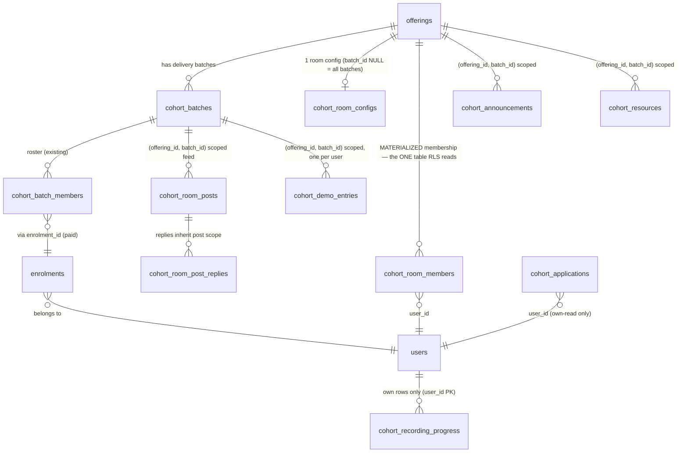
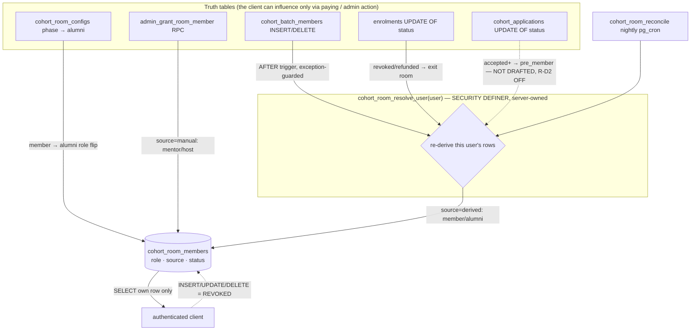
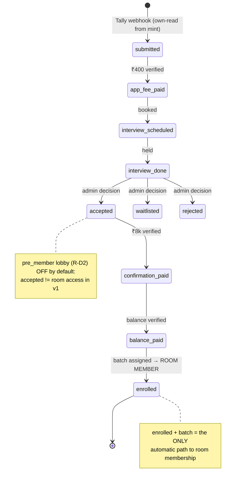
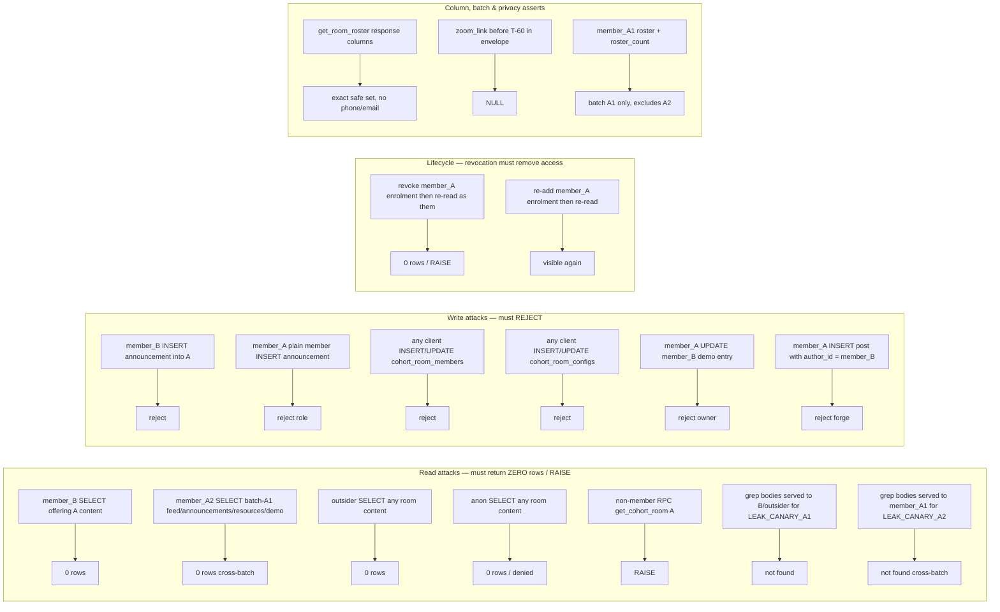

# LevelUp Live Cohorts — Access & Security Spec

*Doc 05 of the cohort product docs set · authored 2026-07-18 on the live-cohort program.*
*Audience is dual on purpose. A founder new to engineering should be able to read this top to bottom and come away understanding **who can see what, and why it is impossible for them to see anything else**. An Opus 4.8 engineering crew should be able to build the entitlement + RLS layer against the numbered **SEC-** requirements and be graded on their acceptance criteria. Where a term is jargon, it is defined inline the first time it appears.*

**How to read this document**
- **Grounding, not invention.** Every factual claim and every requirement cites a source file in this repo. If a claim has no citation, treat it as a bug in this doc.
- **This is a Tier-1 document end to end.** Everything here is access control, RLS (row-level security — the database's own per-row permission rules), auth, or payments. Per `CLAUDE.md`'s change-risk model — *gate on blast radius, not diff size* — every requirement below is `🔴 Tier 1` and cannot ship without the **bugfix council**, the **adversarial access suite green on a shadow project**, cross-platform verification, and **Rahul's written sign-off**. There is no Tier-2 or Tier-3 work in this file. A one-line RLS policy is higher-risk than a 300-line leaf component; this doc is nothing *but* one-line-policy-shaped risk.
- **RAHUL DECISION blocks** mark every access choice Rahul has not confirmed. Each carries a recommended default so the crew is never blocked, but the recommendation is a recommendation — Rahul can veto any of them before build.
- **The draft SQL is DRAFT.** Every policy quoted here lives in `design/cohorts/migrations-draft/000{1..4}_*.sql` and **NOTHING is applied.** Moving any of it to `supabase/migrations/` is the R0-T5 apply gate (`ROOMS-BACKLOG.md` R0). This doc is the *why* and the *proof obligations*; the draft SQL is the *how*.

**Companion docs (this spec must stay consistent with all of them):**
- `design/cohorts/docs/01-PRD.md` — the product requirements. This doc implements its **§6.5 Security & access control** (NFR-SEC-1..5), the Stage-01 identity spine (§5.1), and the per-stage gating in §5.5–5.13. Nothing here may contradict the PRD.
- `design/cohorts/docs/02-*` (the **state machine & data model** doc, "D2") — the canonical `cohort_applications.status` machine and the room `phase` clock. **The per-state access-level matrix in §4 of this doc is the access projection of D2's state machine and must stay 1:1 with it.** Where D2 renames a state, this matrix follows.
- `design/cohorts/ROOMS-ARCHITECTURE.md` §3/§4.2/§5/§6 — the container model, the resolver (the surviving crown jewel), the leak-proofing invariants, and the module-flags-are-UX-never-security rule.
- `design/cohorts/ROOMS-BACKLOG.md` R0 (R0-T1..T6) — the apply sequence and the adversarial suite (R0-T4) this doc's test matrix specifies.
- `design/cohorts/migrations-draft/0001..0004*.sql` — the DRAFT tables, helpers, triggers, RLS policies, and RPCs.
- `design/cohorts/COHORT-LOGIC.md` §2/§4 — the as-is entitlement posture ("RLS is consistently entitlement-derived — never client-claimed") and the `get_cohort_progress` self-scoping join.
- `design/cohorts/funnel/FUNNEL-DATA-AUDIT.md` §2/§5 — the phone/email join reality and the `~10%` orphan rate the reconciler must watch.

---

## 1. The one-paragraph security thesis

A LevelUp cohort room is a **private screening room**: the people inside paid ₹40k to be there, and everyone outside must be **unable to know it exists**, let alone read a word in it. This spec's entire job is to make two failures **structurally impossible** — not "unlikely," not "caught in code review," but impossible by the shape of the database:

1. **Cross-cohort leakage** — reading a room you are not in. Two shapes, both in scope: **cross-offering** (a member of offering A reading offering B's content) and **cross-batch** (a member of batch A1 reading batch A2's batch-scoped content or roster, *within the same offering* — offerings run multiple batches, `cohort_batches`, and content is `(offering_id, batch_id)`-scoped, so batch isolation is a first-class case, not an afterthought; `ROOMS-ARCHITECTURE.md` §3).
2. **Cross-user leakage** — one person reading another person's funnel state, another person's submission, another person's recording position, or a previous account's data lingering on a shared device.

The doctrine that achieves this is inherited verbatim from the rejected community design's one surviving crown jewel (`ROOMS-ARCHITECTURE.md` §2): **scope lives on containers, membership is server-derived and never client-claimed, every content read routes through ONE indexed helper, and the SECURITY DEFINER read paths assert access before they read.** The database is the wall. The client is never trusted to draw it.

---

## 2. Threat model — who is the attacker, and what are they after

Before any policy, name the adversary. The crew builds *against these actors*, and the adversarial suite (§7) instantiates each one as a fixture.

| Actor | Auth state | Legitimately sees | The attack we must make impossible |
|---|---|---|---|
| **`anon`** | No session | Public marketing (offering pages); **the published public-admission-page whitelist for one accepted applicant, via the `get_admission_page(slug)` RPC only** (SEC-PUBLIC-1) | Reading any `cohort_*` room content; reading any `cohort_applications` row **directly** (table SELECT); reading any **non-whitelisted** field (contact/fees/interview/funnel state) even through the admission RPC |
| **`outsider`** | Authenticated, zero rooms, zero applications | Their own (empty) surfaces, public catalog | Reading *any* room's content or *any* applicant's funnel state |
| **`applicant`** | Authenticated, has a `cohort_applications` row, not yet enrolled | **Only their own** application row + funnel stage | Reading another applicant's row; reading any enrolled room's content |
| **`member_A1`** | Enrolled in offering A, **batch A1** | Batch-A1 content, batch-A1 roster (safe columns), their own submissions/progress | Reading **offering B** (cross-offering); reading another member's *private* data (submission files, recording position, phone/email) |
| **`member_A2`** | Enrolled in offering A, **batch A2** (a *different* batch of the *same* offering) | Batch-A2 content + batch-A2 roster only | Reading **batch A1**'s batch-scoped feed/announcements/roster (cross-**batch**, same offering — the isolation the offering-wide roster RPCs currently break, §5.4) |
| **`member_B`** | Enrolled in offering B | Offering B only | Reading or writing into offering A |
| **`mentor_A`** | Manual grant, Room A | Room A content + can post announcements to A | Posting to Room B; touching membership/config tables directly |
| **A compromised or malicious client** | Any of the above, but crafting raw PostgREST/RPC calls by hand | Whatever RLS allows | Inserting a membership row for itself; forging `author_id`; UPDATE-ing someone else's row; passing a `p_offering` it isn't a member of |
| **The shared device** | Sequential real users on one phone/browser | Each their own data while signed in | The *next* user cold-starting into the *previous* user's cached data (the phase-6 lesson, §8) |

**Two design consequences fall straight out of this table:**
- The client is an attacker for RLS purposes. **Membership can never be a value the client sends** — it must be derived server-side from truth tables the client cannot write (`ROOMS-ARCHITECTURE.md` §6.1; NFR-SEC-1).
- A signed-out state is an attacker's opportunity. The client-side cache purge (§8) is as load-bearing as any RLS policy, because RLS protects the *database* but not the *bytes already sitting in localStorage from the last session*.

---

## 3. The entitlement model — how membership is derived

"Entitlement" = the server's answer to "is this user allowed into this room, and in what role." The core rule, inherited from the existing pipeline where "RLS is consistently entitlement-derived — batch membership via enrolments, never client-claimed" (`COHORT-LOGIC.md` §2): **membership is a *materialized derivation* of truth tables, written only by the server, and it is the single table every room policy reads.**

### 3.1 The container model (what scopes what)



- **Every content row carries `(offering_id, batch_id)`** FK'd to real containers (`0003_cohort_room_content.sql`). There is no client-writable "scope" string to spoof — scope is a foreign key to a row that already has its own RLS.
- **`cohort_room_members` is the single indexed table** every room policy consults (`ROOMS-ARCHITECTURE.md` §6.1). One `EXISTS` against one covering index answers every access question. This is the perf doctrine and the audit doctrine at once: **one table to secure, one table to test.**
- **The application pipeline is untouched.** `cohort_applications`, `enrolments`, staged payments, and the `ApplicationStatus.tsx:319,337` `isIOS()` guard keep their existing RLS byte-for-byte (`COHORT-LOGIC.md` "Standing guard"; PRD NFR-SEC-5). Rooms are a *delivery* layer *on top* of these tables, not a rewrite of them.

### 3.2 The four membership sources (and who may write each)

Membership rows in `cohort_room_members` are stamped with a `source` and `role`. Only the server writes them — `authenticated` has **SELECT-own and nothing else** (`0002_cohort_room_members.sql:190-195`).



| # | Source | Trigger / writer | Role stamped | Default | Cite |
|---|---|---|---|---|---|
| 1 | **Batch enrolment** | AFTER INSERT/DELETE on `cohort_batch_members` → resolver | `member` (or `alumni` if room phase = alumni) | ON | `0002:132-134` |
| 2 | **Enrolment status** | AFTER UPDATE OF status on `enrolments` → resolver revokes when `status != 'active'` (refund/revoke exits the room automatically) | retract → `status='revoked'` | ON | `0002:146-149` |
| 3 | **Application status (pre-start lobby)** | **NOT DRAFTED.** Would grant `pre_member` on `accepted/confirmation_paid/balance_paid`. The draft has only the `pre_member` value in the CHECK constraint (`0002:19`) and a *comment* describing the intent (`0002:74-77`) — **no** `cohort_applications` trigger and **no** `pre_member` INSERT exist. Enabling it is net-new (see LOBBY-1) | `pre_member` | **OFF (R-D2) — unbuilt** | `0002:19,74-77` (comment only); `ROOMS-ARCHITECTURE.md` §6.1 item 3; PRD R-D2 |
| 4 | **Manual grant** | `admin_grant_room_member(user, offering, role)` RPC, `is_admin()`-guarded | `mentor` / `host` / `member`, `source='manual'` (the resolver never touches manual rows) | as granted | `0002:198-211` |
| — | **Alumni flip** | AFTER UPDATE OF phase on `cohort_room_configs` → `member` becomes `alumni` when phase → `alumni` (membership survives, role renames — "rooms are never deleted; alumni keep them") | `alumni` | ON | `0002:152-165`; `ROOMS-ARCHITECTURE.md` §2 item 3 |
| — | **Nightly reconcile** | `cohort_room_reconcile()` via pg_cron (mirrors `cohort_notify_cron`) re-derives everyone; drift self-heals | — | ON | `0002:171-184` |

**Why derivation, not a claim (the security core):** if a member row could be *written by the client*, an attacker would simply INSERT `(their_uid, any_offering, 'member', 'active')` and walk into any room. Because the only writers are (a) triggers on tables gated by payment/admin action and (b) admin-only RPCs, **there is no client path to fabricate membership.** The resolver is `SECURITY DEFINER` (runs as its owner, not the caller) precisely so the client's own permissions never enter into it.

> **SEC-ENT-1 — Membership is server-derived; the client has zero write grants.** `🔴 Tier 1`
> - Behavior: `cohort_room_members` is written only by the resolver triggers, the alumni-flip trigger, the nightly reconcile, and the admin-only manual-grant RPC. `authenticated` holds `SELECT` on its own rows and no `INSERT/UPDATE/DELETE` (`REVOKE`d explicitly — PostgREST grants defaults, so the REVOKE is mandatory, not implied).
> - Acceptance: A raw client `INSERT`/`UPDATE`/`DELETE` on `cohort_room_members` is rejected for every non-admin actor (adversarial suite write-attack §7). `SELECT` returns only `user_id = auth.uid()` rows. Granting a mentor requires `is_admin()`; `admin_grant_room_member` raises `'admin only'` otherwise (`0002:203`).
> - Source: `ROOMS-ARCHITECTURE.md` §6.1; PRD NFR-SEC-1; `0002_cohort_room_members.sql:190-211`.

### 3.3 The trigger-safety rule (the payment path rides these triggers)

The resolver triggers fire on `enrolments` and `cohort_batch_members` — **the payment path's own tables.** A resolver that throws would roll back an enrolment. So every truth-table trigger is `AFTER` and wraps the resolver call in an exception guard that degrades to a `RAISE WARNING`, never an error (`0002:124-129, 139-143`):

```sql
BEGIN
  PERFORM public.cohort_room_resolve_user(v_user);
EXCEPTION WHEN OTHERS THEN
  RAISE WARNING 'cohort_room resolver failed for %: %', v_user, SQLERRM;
END;
```

> **SEC-ENT-2 — Room resolution can never break a payment/enrolment write.** `🔴 Tier 1`
> - Behavior: Resolver triggers are `AFTER` and exception-guarded; a resolver failure logs a warning and the enrolment/batch write commits regardless. Drift from a swallowed failure self-heals at the nightly reconcile.
> - Acceptance: A fixture that forces the resolver to throw (e.g. a NULL-user edge) still commits the enrolment/batch-member row; the warning is logged; the next `cohort_room_reconcile()` run repairs the membership. Council must specifically argue (a) AFTER-triggers cannot block/slow enrolment, (b) resolver cost < 50ms on prod-shaped fixtures, (c) reconcile duration at prod scale (`0002:3-7`).
> - Source: `0002_cohort_room_members.sql:3-7, 117-149`; `ROOMS-BACKLOG.md` R0-T2.

---

## 4. Per-state access levels (the access projection of D2)

This is the matrix the crew gates UI and RPC access on. It is the **access-control view of D2's `cohort_applications.status` machine** (`FUNNEL-DATA-AUDIT.md` §2; PRD §5 status diagram) plus the room membership roles. **It must stay 1:1 with D2** — if D2 renames or adds a status, this row set follows.



| D2 state | What the user is | Can read | Can NOT read | Room membership | Cite |
|---|---|---|---|---|---|
| *(no row)* `anon`/`outsider` | Not in the funnel | Public offering/catalog only | Every `cohort_applications` row; every room's content | none | §2 |
| `submitted` | Applicant, form in | **Own** application row + derived funnel stage | Any other applicant; any room | none | `cohort_applications` own-read (`20260413100000:47-48`) |
| `app_fee_paid` | Applicant, ₹400 paid | Own row; own "book interview" CTA | Any room; the veiled room | none | REQ-RECON-1 stage read (PRD §5.1) |
| `interview_scheduled` / `interview_done` | Applicant in review | Own row; own interview modality/slot | The decision (until admin writes it); any room | none | PRD §5.5 |
| `accepted` (not yet paid) | Admitted, unpaid | Own row; the **veiled** room via the assert-first, whitelisted **`get_cohort_room_preview` RPC** (MEMBER-1 recommended default / SEC-MEMBER-1): theme, week **titles** + Day-One date, faculty **names**, recordings-shelf **skeleton**, community-module **frames behind a scrim** | Roster PII, post/reply bodies, real recording/Zoom URLs, the `cohort_room_configs` row directly, fees, and every other applicant's row — the preview RPC returns none of them | **none** (no membership row; preview RPC only) | PRD §5.7 REQ-LOCK-1; MEMBER-1; `03` §4.7a |
| `confirmation_paid` / `balance_paid` | Paying in (seat confirmed) | Own row; the unlock animation; the **pre_start lobby** as a scoped **`pre_member`** (readiness checklist, feedback pod, roll-call, Sessions calendar, Announcements) | Full-member content until `enrolled`: recordings shelf, the full commons, roster PII beyond the roll-call; any other room | **`pre_member`** (MEMBER-1 recommended default; resolver-written on the `confirmation_payment_id` stamp) — *(conservative alternative: none until enrolled, preview RPC instead)* | PRD §5.7 REQ-LOCK-2; MEMBER-1 |
| `enrolled` + batch | **Room member** | Full room content for *their* offering+batch; roster safe columns **for their batch** (see ROSTER-SCOPE-1 — the draft roster RPCs are offering-wide today and must be batch-scoped); own submissions/progress | **Any other room** (cross-offering **and** cross-batch); other members' private data (files, recording position, phone/email) | `member` (source=derived) | `0002:84-97` |
| room phase → `alumni` | Alumnus | Same room, forever; live modules retire | Other rooms | `alumni` (role rename, membership survives) | `0002:152-165` |
| mentor/host | Staff of one room | Room content + post announcements to that room | Other rooms; membership/config tables directly | `mentor`/`host` (source=manual) | `0002:198-211` |
| admin | Ops | Everything (`is_admin()`) | — | n/a | `is_admin()` (`20260405063223:38`) |
| **public admission page** (`anon` via slug) | Anyone with a shared admission link | **Only** the published whitelist for one `accepted` applicant, via `get_admission_page(slug)` (SEC-PUBLIC-1): name, program, cohort/batch, admit date, city, faculty names, accept-ratio | Contact (phone/email), fees, interview data, funnel state, `user_id`, any other row; **any direct `cohort_applications` table SELECT** | n/a | PRD REQ-DEC-6; DATA §4.2 slug; SEC-PUBLIC-1 |

**The critical seam — what the veil can and cannot legally source (PRD §5.7).** The veil must be safe *by construction*: it renders only facts the `accepted`-but-unpaid applicant already holds, which is a strictly **offering-level** set — the offering title and poster (the same `offerings` row the public offering page renders) plus static, hard-coded module-name lock chips. Everything richer is out of reach for a non-member, and the crew must not pretend otherwise:

- **`cohort_room_configs` is member-gated** (`0001:79-81`; SEC-CFG-1). A non-member cannot read the room's theme/phase/modules row. The veil therefore **cannot** source the config row — earlier drafts of this doc wrongly said it could.
- **Week titles and session dates are week-level, not offering-level, facts.** "Week 1's title" and "Day One's date" live in `cohort_weeks`/`live_sessions`, gated by `cohort_weeks_student_read` to enrolled batch members (`20260526180000:322-330`) and by `cohort_room_can_access()`/the RPC assert respectively. A non-member gets **zero rows**. The shipped veil (R-D2 OFF) **cannot** show real week/session data — only that a room *shape* exists.
- The content tables (`cohort_announcements`/`cohort_room_posts`/`cohort_resources`/`cohort_demo_entries`) stay gated and return **zero rows** to a non-member.

**The crew must not implement the veil by loosening any content, week, or config RLS policy.** It is built from a dedicated **assert-first preview RPC** (`get_cohort_room_preview`, `03` §4.7a) or the `offerings` row + static chrome — never by widening a table policy.

> **⚠️ MEMBER-1 RESOLUTION (supersedes the recommended-OFF defaults in VEIL-SOURCE-1, SEC-STATE-1 and LOBBY-1 below).** The cross-document MEMBER-1 decision has been resolved centrally (`02-STATE-MACHINE.md` §3.4 / `03-DATA-MODEL-ERD.md` §4.6a; PRD REQ-LOCK-1/2), and the recommended default is **NOT** the pure offering-chrome veil this section originally recommended. It is: (1) VEIL-SOURCE-1 **option (b)** — the `accepted` veil is served by the whitelisted `get_cohort_room_preview` RPC (real week titles + faculty names behind a scrim, no PII/content), and (2) LOBBY-1 **turned ON at `confirmation_paid` only** — a scoped `pre_member` row (not `accepted`). The security guarantees below still bind (assert-first, no RLS loosening, membership server-derived, `member` never widened to include `pre_member`); only the *recommended default* changes. **See SEC-MEMBER-1 (§5.4) for the authoritative, resolved statement.** VEIL-SOURCE-1's "ship neither" and LOBBY-1's "OFF" remain documented as the *conservative alternative* Rahul may still choose.

> **RAHUL DECISION — VEIL-SOURCE-1: how much can the veil actually show?** This doc and PRD §5.7 REQ-LOCK-1 must be reconciled. If REQ-LOCK-1 intends the veil to tease *real* "week 1's title / Day One's date," that data is **not** legally readable by an `accepted`-but-unpaid applicant under the current (correct) RLS, and there is no non-member-readable projection carrying it. Two lawful paths, both net-new: **(a) turn on LOBBY-1** so an `accepted` applicant becomes a `pre_member` with a strict lobby read (announcements + roster preview via a dedicated `cohort_room_in_lobby()` gate — never the feed/submissions); or **(b) ship a dedicated offering-level "cohort preview" projection** (a new, non-member-readable view exposing *only* marketing-safe week-count / start-date facts the offering already advertises). **Recommended default: neither — ship the offering-chrome veil (title, poster, static module chips) with R-D2 OFF.** It is the only option that needs no new read surface and no RLS change. Do not let the veil become a reason to loosen the wall.

> **SEC-STATE-1 — Access follows D2 state exactly; `accepted != member`.** `🔴 Tier 1`
> - Behavior: Only `enrolled` + batch assignment (or an admin/manual grant) yields room-content access. `accepted`/`confirmation_paid`/`balance_paid` grant **no** room-content read by default (R-D2 OFF). The veil is rendered from the `offerings` row the applicant already owns plus static module chrome — **never** from content tables, **never** from `cohort_weeks`/`live_sessions`, and **never** from the member-gated `cohort_room_configs` row (SEC-CFG-1, VEIL-SOURCE-1).
> - Acceptance: An `accepted` (unpaid) fixture reading `cohort_announcements`/`cohort_room_posts`/`cohort_resources`/`cohort_demo_entries`/`cohort_weeks`/`cohort_room_configs` for the target offering gets **zero rows**; the veiled UI still renders from the offering row + static chrome alone (assert the client issues no read against any of those tables for a non-member). R-D2 stays OFF in the shipped default.
> - Note on turning R-D2/LOBBY-1 ON: this is **net-new work, not a flag flip.** The draft has only the `pre_member` CHECK value (`0002:19`) and a descriptive comment (`0002:74-77`) — there is no `pre_member` INSERT in the resolver body (`0002:82-111`) and no `cohort_applications` trigger anywhere. Enabling it requires a new resolver branch, a new `AFTER UPDATE OF status ON cohort_applications` trigger, and a separate `cohort_room_in_lobby()` helper (LOBBY-1).
> - Source: PRD §5.7 REQ-LOCK-1/2, R-D2; `0001:79-81`; `20260526180000:322-330`; `0002:19,74-77,82-111`; `ROOMS-ARCHITECTURE.md` §6.1.

> **RAHUL DECISION — LOBBY-1: pre-start lobby for `accepted`/`confirmation_paid` applicants (mirrors R-D2).**
> **Recommended default: OFF — enrolled-only.** An unpaid user inside the paid room muddies the seat-release story (`ROOMS-ARCHITECTURE.md` R-D2). Turning it on is **net-new work, not a flag flip** — `0002:74-77` is a *comment*, not a code branch; the resolver body (`0002:82-111`) has no `pre_member` INSERT and there is no `cohort_applications` trigger in the draft. The build is: (1) a new resolver branch that INSERTs `pre_member` rows from `accepted+` applications, (2) a new `AFTER UPDATE OF status ON public.cohort_applications` trigger to fire it, and (3) a separate `cohort_room_in_lobby()` helper. If turned on, the lobby must be its *own* access level (`cohort_room_is_member` stays enrolled-only; `cohort_room_in_lobby()` gates a strict subset: announcements + roster preview, never the feed, never submissions). Do **not** widen `member` to include `pre_member`. The `pre_start` *phase* for already-enrolled members is ON regardless — that is a different thing (an enrolled member before weeks begin), not the lobby.

---

## 5. RLS architecture — the wall, in SQL

### 5.1 The one-helper doctrine

Every content SELECT routes through **one** access function; **zero** content policies reference the membership table directly (grep-checkable — PRD NFR-SEC-2). This is invariant #2 of the surviving community doctrine (`ROOMS-ARCHITECTURE.md` §2 item 2): *one function to audit, one function to test.*

The three helpers (`0002_cohort_room_members.sql:37-69`), all `STABLE SECURITY DEFINER SET search_path = public`:

| Helper | Question it answers | Used by |
|---|---|---|
| `cohort_room_is_member(offering)` | "Is `auth.uid()` an active member of this room (any batch)?" | config read, RPC access asserts, roster |
| `cohort_room_can_access(offering, batch)` | "…and specifically of this batch (NULL batch = offering-wide, e.g. mentors)?" | every batch-scoped content SELECT |
| `cohort_room_can_post_announcement(offering)` | "…and is `auth.uid()` a `mentor`/`host` here?" | announcement + resource INSERT |

All three end in `OR is_admin()` so ops retains full access without a parallel policy set. `SET search_path = public` is not decoration: it pins the schema so a `SECURITY DEFINER` function can't be hijacked by a caller-set `search_path` — a standard Postgres privilege-escalation guard, mandatory on every definer function here.

### 5.2 The policy shape (illustrative — announcements)

From `0003_cohort_room_content.sql:29-39`, the canonical pattern every content table repeats:

```sql
ALTER TABLE public.cohort_announcements ENABLE ROW LEVEL SECURITY;

CREATE POLICY ann_admin_all ON public.cohort_announcements
  USING (is_admin()) WITH CHECK (is_admin());

CREATE POLICY ann_member_read ON public.cohort_announcements FOR SELECT
  TO authenticated
  USING (deleted_at IS NULL
         AND public.cohort_room_can_access(offering_id, batch_id));   -- the ONE helper

CREATE POLICY ann_host_insert ON public.cohort_announcements FOR INSERT
  TO authenticated
  WITH CHECK (author_id = auth.uid()                                   -- can't forge authorship
              AND public.cohort_room_can_post_announcement(offering_id)); -- mentor/host only
-- no member UPDATE/DELETE: append-only by policy; soft-delete is admin-only
```

Three properties make cross-room and cross-user leakage structural, not incidental:
1. **Read is gated by the helper**, which reads only the membership table. A `member_B` querying Room A's announcements matches no membership row → `USING` is false → **zero rows**. Not "an error the UI hides" — zero rows at the storage engine.
2. **Insert pins `author_id = auth.uid()`**, so no one can post *as* someone else, and pins the poster role, so a plain `member` cannot post an announcement (only feed posts, per the feed policy).
3. **No member UPDATE/DELETE** on append-only tables — the board is immutable to members; edits/soft-deletes are admin-only.

### 5.3 The full policy inventory (draft, Tier-1, NOT applied)

| Table | SELECT gate | INSERT gate | UPDATE/DELETE | Cite |
|---|---|---|---|---|
| `cohort_room_members` | own row (`user_id = auth.uid()`) or admin | **none (REVOKED)** — server-only | none (server-only); admin ALL | `0002:190-195` |
| `cohort_room_configs` | `cohort_room_is_member(offering)` or admin | admin only | admin only | `0001:73-81` |
| `cohort_announcements` | `cohort_room_can_access` + not deleted | `author_id=uid` + `can_post_announcement` | none for members; admin soft-delete | `0003:29-39` |
| `cohort_resources` | `cohort_room_can_access` | `can_post_announcement` (host/mentor) | admin | `0003:59-66` |
| `cohort_room_posts` (feed) | `cohort_room_can_access` + not deleted | **none from client (REVOKED)** — writes go through the `cohort_room_post_write()` SECURITY DEFINER RPC (channel_key + is_mentor_answer validation, §5.4) | **author-only** UPDATE (own posts) | `0003:122-136`; DATA §4.7a |
| `cohort_room_post_replies` | parent post is accessible (EXISTS through post) | **none from client (REVOKED)** — writes go through the `cohort_room_reply_write()` RPC | (soft-delete via counter path) | `0003:139-152`; DATA §4.7a |
| `cohort_recording_progress` | **own rows only** (`user_id=uid`); admin read | own rows | own rows (`FOR ALL` own) | `0003:165-170` |
| `cohort_demo_entries` | `cohort_room_can_access` (members see the gallery) | `user_id=uid` + `cohort_room_can_access` | **own entry only** | `0003:192-203` |
| `cohort_room_seen` | own rows (`user_id=uid`) | own rows | own rows | `0004:81-83` |
| `cohort_applications` *(existing, untouched)* | own row (`user_id=uid`); admin ALL | pipeline (webhook/edge) | admin | `20260413100000:42-48` |

**Two per-user isolations worth calling out:**
- **Recording progress is own-rows-only** (`user_id, live_session_id` PK; `FOR ALL … USING (user_id = auth.uid())`). One member cannot read where another member paused a recording. Admin gets read for support, not write.
- **Demo entries are readable by the whole room (the gallery) but writable only by their owner** (`demo_own_write`/`demo_own_update` pin `user_id = auth.uid()`; `demo_one_per_user UNIQUE (batch_id, user_id)`). `member_A` cannot edit `member_B`'s showcase entry — an explicit adversarial-suite case (§7).

### 5.4 The SECURITY DEFINER RPCs — assert access FIRST

The room's read surfaces are `SECURITY DEFINER` RPCs (they run as owner to do cross-table reads in one round-trip). Doctrine, inherited as invariant #6 (`0004:3-6`): **assert access, then read; raise for non-members, never return an empty set that a UI might misread as "no content."**

```sql
CREATE OR REPLACE FUNCTION public.get_cohort_room(p_offering uuid) ...
BEGIN
  IF NOT public.cohort_room_is_member(p_offering) THEN
    RAISE EXCEPTION 'not a member of this room';        -- assert FIRST
  END IF;
  ... -- only now read config/sessions/announcements/roster
END;
```

Two more server-side gates live inside these RPCs and must survive review:
- **The T-60 zoom-link gate is server-side** (`0004:118-119`): `zoom_link` is NULL in the envelope until `scheduled_at - interval '1 hour' <= now()`. A member cannot pull a join link early by reading the table, because the table read is mediated by the RPC that nulls it. (PRD §5.8 REQ-ROOM-2 asserts this.)
- **The roster RPC exposes safe columns only** (`0004:149-164`): `full_name, avatar_url, occupation, city, role` — **never phone or email.** The draft carries a standing `NOTE for council` to confirm the exact set against `public_user_profiles`; the adversarial suite asserts the exact column list (§7).
- **The roster and roster-count are offering-wide in the draft — a cross-batch leak (ROSTER-SCOPE-1).** `get_room_roster` (`0004:157-161`) and `get_cohort_room`'s `roster_count` (`0004:136-138`) both filter on `offering_id` only (`WHERE m.offering_id = p_offering`), with **no** `batch_id` predicate. Content feeds are already batch-isolated — `cohort_room_can_access()` enforces batch precision (`0002:56`) — but these two roster surfaces are not, so a batch-A1 member reading them sees batch-A2 members' `full_name/city/occupation`. This contradicts the §4 matrix ("roster for *their* offering+batch"). See ROSTER-SCOPE-1 for the decision; the §7 suite pins whichever scope Rahul chooses with a two-batch fixture.

> **RAHUL DECISION — ROSTER-SCOPE-1: is the roster offering-wide or batch-scoped?** The draft roster RPCs return the whole offering's roster across all batches; the §4 matrix promises batch scope. One of them must change before apply. **Recommended default: batch-scoped** — a member sees only their own batch's roster and count, matching the "private screening room" thesis (§1) and the batch precision the content feeds already enforce. This is a one-predicate fix (add `AND m.batch_id = v_batch` / the caller's batch to both RPCs, treating a NULL-batch mentor/host row as offering-wide). If Rahul instead wants a shared offering-wide roster (all batches of one cohort see each other), the §4 matrix line and the `member_A2` threat-model row change to say so, and the cross-batch suite cases (§7 R8/R9) assert *visibility* rather than isolation. Either way it is **Tier-1** and must be pinned, not left as a latent offering-wide default. `0004:136-138,157-161`; PRD REQ-MULTI-1; `ROOMS-BACKLOG.md` R0-T1 ("user in 2 batches of one offering").

> **SEC-RLS-1 — One helper, every content read; RPCs assert-first; no phone/email in roster.** `🔴 Tier 1`
> - Behavior: Every `cohort_*` content SELECT policy references `cohort_room_can_access()` (or, for replies, an EXISTS through the parent post) and **no policy references `cohort_room_members` directly.** Every room RPC calls `cohort_room_is_member()`/`can_access()` and `RAISE`s for non-members before any read. The roster RPC returns no phone/email column.
> - Acceptance: `grep` shows zero content policies naming `cohort_room_members` outside the three helpers (NFR-SEC-2). A non-member calling `get_cohort_room`/`get_room_roster`/`get_my_cohort_rooms` gets a raised error, not rows. The roster response column set equals the asserted safe list exactly (suite column-assert). Roster and `roster_count` obey the ROSTER-SCOPE-1 decision (batch-scoped by default): a batch-A1 member's roster/count excludes batch-A2 members (§7 R8/R9). `zoom_link` is NULL before T-60 and present after (clock-mocked fixture).
> - Source: `ROOMS-ARCHITECTURE.md` §2/§6.3; PRD NFR-SEC-2/3; `0004_cohort_room_rpcs.sql`.

> **SEC-CFG-1 — Room config is member-readable, admin-writable; theme/modules are not public but not secret.** `🔴 Tier 1`
> - Behavior: `cohort_room_configs` SELECT is `cohort_room_is_member(offering) OR is_admin()`; write is admin-only. **Module flags are UX only — RLS never reads the `modules` jsonb** (a disabled module's table simply has no rows for that room; access, if rows existed, is still membership-gated). Security never depends on a jsonb flag.
> - Acceptance: A non-member cannot read a room's `cohort_room_configs` row (so the veil, SEC-STATE-1, sources its facts from the `offerings` row + static chrome **only** — it issues no `cohort_room_configs` read at all for a non-member, since none would return rows; see VEIL-SOURCE-1). `grep` shows zero RLS policies reading `modules`/`theme` for access decisions (`ROOMS-ARCHITECTURE.md` §5 last bullet). Config write requires `is_admin()`.
> - Source: `0001_cohort_room_configs.sql:70-81`; `ROOMS-ARCHITECTURE.md` §5.

> **SEC-WRITE-1 — Feed/reply writes route through a SECURITY DEFINER write RPC; direct client INSERT is REVOKED; `channel_key` and `is_mentor_answer` are validated/stamped server-side.** `🔴 Tier 1`
> - Behavior: Direct client `INSERT` on `cohort_room_posts` / `cohort_room_post_replies` is **REVOKED**. Writes go through `cohort_room_post_write(...)` / `cohort_room_reply_write(...)` (`03-DATA-MODEL-ERD.md` §4.7a), which (a) assert `cohort_room_can_access()` for the caller, (b) **validate `channel_key`** against the room's resolved standing + niche channel set (`cohort_room_configs.vocab.niche_channels` + standing keys) — a forged/unknown key is rejected, and (c) **stamp `is_mentor_answer`** from the caller's *resolved* `cohort_room_members.role` (true only for `mentor`/`host`), never from client input. A plain RLS INSERT cannot express (b) or (c), which is why the write path is an RPC, not a table grant.
> - Acceptance: A raw client INSERT on `cohort_room_posts`/`_replies` is rejected (grant revoked). A `cohort_room_post_write` call with a `channel_key` not in the room's channel set raises. A non-mentor caller passing `is_mentor_answer=true` produces a row with `is_mentor_answer=false` (server overrides). Adversarial cases W8/W9 (§7).
> - Source: `03-DATA-MODEL-ERD.md` §4.7 CHANNEL-KEY-1 / §4.7a; PRD REQ-COMM-1/2.

> **SEC-MEMBER-1 — The MEMBER-1 access boundary (preview RPC for `accepted`, scoped `pre_member` at `confirmation_paid`).** `🔴 Tier 1`
> This is the access-doc face of the centrally-resolved **MEMBER-1** decision (canonical: `02-STATE-MACHINE.md` §3.4 / `03-DATA-MODEL-ERD.md` §4.6a; PRD REQ-LOCK-1/2). It **supersedes this doc's earlier conservative-default framing** in the §4 table, VEIL-SOURCE-1 and LOBBY-1: under the **recommended default now adopted**, VEIL-SOURCE-1 option (b) is taken (a dedicated preview RPC) and LOBBY-1 is turned ON but **only at `confirmation_paid`**, not `accepted`.
> - Behavior: (1) `accepted` (₹8k-unpaid) is served by the **assert-first, whitelisted `get_cohort_room_preview(p_offering)` RPC** (`03` §4.7a) — no membership row, returns only theme/wordmark, week **titles** + Day-One date, faculty **names**, a recordings-shelf **skeleton**, and community-module **frames behind a scrim**; **never** roster PII, post/reply bodies, real recording/Zoom URLs, or any other applicant's row. It never loosens content/week/config RLS. (2) `confirmation_paid`/`balance_paid` get a scoped **`pre_member`** `cohort_room_members` row, written by the resolver (a new `AFTER UPDATE OF status ON cohort_applications` branch firing on the `confirmation_payment_id` stamp, exception-guarded per SEC-ENT-2). `pre_member` gates a strict pre_start subset (readiness checklist, feedback pod, roll-call, Sessions calendar, Announcements) — it is its **own** access level; **`cohort_room_is_member` (full member) is NOT widened to include `pre_member`** (the full commons, recordings shelf, and roster PII beyond the roll-call stay `member`-only until `enrolled`). Membership is still server-derived, never client-claimed (SEC-ENT-1 holds).
> - Acceptance: an `accepted` fixture calling `get_cohort_room_preview` gets only whitelisted fields and **zero** rows for any other offering/applicant (§7 R10); a `pre_member` fixture reads the pre_start subset and **zero** full-member content — recordings/feed/roster-beyond-roll-call — until enrolled (§7 R11); a raw client INSERT of a `pre_member` row is rejected (SEC-ENT-1). Build to this default behind the room feature flag until Rahul rules; the conservative alternative (no membership until enrolled, preview RPC also serving confirmation_paid) is the documented fallback.
> - Source: MEMBER-1 (`02` §3.4 / `03` §4.6a/§4.7a); PRD §5.7 REQ-LOCK-1/2; supersedes VEIL-SOURCE-1/LOBBY-1 recommended-OFF framing above.

> **SEC-DECISION-1 — The `accepted`/`waitlisted`/`rejected` verdict is written by an `is_admin()`-gated state-transition RPC.** `🔴 Tier 1`
> Because `accepted` is unreadable from TeleCRM and no reconciler can produce it (`04-INTEGRATION-CONTRACTS.md` §5.2/§9; `03` §2), the decision ceremony's verdict is an **app write** — the one funnel status the app owns even under the reconciler default (SOR-1). Its authorization lives here.
> - Behavior: a `set_application_decision(p_application, p_outcome)` SECURITY DEFINER RPC, `is_admin()`-guarded (raises `'admin only'` otherwise, mirroring `admin_grant_room_member`), sets `cohort_applications.status ∈ {accepted, waitlisted, rejected}`. This is an **app status write only** — it never writes TeleCRM (INTEG-CRM-1 read-only holds). No verdict is ever placed in a notification payload before the sealed reveal (SEC-DEC / REQ-DEC-1).
> - Acceptance: a non-admin caller is rejected; an admin call flips the status and fires the verdict-free "decision ready" notification; the reconciler never overwrites an app-written `accepted` (write precedence: app-owned states are authoritative over reconciled reads for the decision states). §7 case W10.
> - Source: `03` §2/§4.2; `04` §9; PRD §8.2 Open Q1 carve-out; `02` §5 T6a.

> **SEC-PUBLIC-1 — The public admission page reads a whitelist through a SECURITY DEFINER RPC keyed on `admission_page_slug`; there is NO broad anon SELECT on `cohort_applications`.** `🔴 Tier 1`
> The public admission page (PRD REQ-DEC-6; COPY §4.7 6H CD-06-PUB-01..04; ROLLOUT rung 2.1; DATA §4.2 `admission_page_slug` "public-read policy") is the single most public data-exposure surface in the funnel, and this doc's threat model (§2) forbids **any** anon read of a `cohort_applications` row. Both are satisfied **only** by a narrow RPC, never a table policy.
> - Behavior: a `get_admission_page(p_slug text)` SECURITY DEFINER RPC (callable by `anon`) returns **only** the published whitelist for the one row whose `admission_page_slug = p_slug` **and** `admission_page_published_at IS NOT NULL` **and** `status='accepted'`: `full_name`, program/offering title, cohort/batch label, admit date, city, faculty names, accept-ratio line. It returns **NOTHING else** — never contact (phone/email), fees, interview data, funnel state, `user_id`, or any other row. A NULL/unknown slug or an unpublished/revoked row returns zero rows (the page 404s). **`cohort_applications` keeps its existing `own row (user_id=uid); admin ALL` RLS with NO anon/public SELECT policy** — the anon read exists solely inside this SECURITY DEFINER function, which selects only the whitelisted columns.
> - Acceptance: `anon` calling `get_admission_page` with a valid published slug gets exactly the whitelist and no non-whitelisted field; with a NULL/garbage/unpublished/revoked slug gets zero rows; a direct `anon` SELECT on `cohort_applications` (any column, any row) still returns **zero rows / denied** (the threat-model §2 `anon` invariant is preserved). §7 cases R12/R13. The RPC is **not** satisfied by a broad anon SELECT policy on the table.
> - Source: PRD REQ-DEC-6; DATA §4.2 (`admission_page_slug`/`admission_page_published_at`); COPY §4.7 (CD-06-PUB-*); ROLLOUT §4.1 rung 2.1.

### 5.5 Apply-order and Tier-1 gating (this is a migration, treat it as one)

The drafts have a hard apply order (`0001` config → `0002` members+helpers → `0003` content → `0004` RPCs); `0001`'s member-read policy references `cohort_room_is_member()`, which is defined in `0002` (`0001:78`). The R0 sequence is fixed (`ROOMS-BACKLOG.md` R0): **R0-T1→T2→T3→T4 (suite green on a shadow project)→council→R0-T5 (apply + backfill)→R0-T6 (types/hooks).** Applying follows `CLAUDE.md`'s Supabase runbook exactly: `link --project-ref ivkvluezuiojovpotlyb` explicitly (never the stale `config.toml`), `migration list` to confirm the diff, **prod backup first**, then `db push`.

> **SEC-APPLY-1 — Nothing lands without the full Tier-1 gate.** `🔴 Tier 1`
> - Behavior: The four migrations move to `supabase/migrations/` only after: bugfix council argues them, the adversarial suite (§7) is green on a shadow project, cross-platform verification, Rahul's written sign-off, prod backup, explicit link to `ivkvluezuiojovpotlyb`.
> - Acceptance: A checklist artifact records each gate passed before `db push`. The `get_cohort_progress` LEFT-JOIN fix (`0004:167-174`) uses `DROP FUNCTION` before `CREATE` (Postgres requires it to change `RETURNS TABLE`; the `reference_ml_db_apply` lesson). Reversibility (git revert + backed-up migration) is documented before apply.
> - Source: `ROOMS-BACKLOG.md` R0; `CLAUDE.md` (Tier-1 checklist + Supabase runbook); `migrations-draft/*.sql` headers.

---

## 6. Payments & auth — the sacred surfaces (Tier-1, council + Rahul sign-off)

These are the highest-blast-radius surfaces the cohort product touches. They are called out separately because a mistake here is a revenue or account-security incident, not a leaked announcement.

### 6.1 The staged-payment guard is do-not-touch

The `ApplicationStatus.tsx:319,337` `isIOS()` staged-payment guard is **sacred** and must never become `isNative()` or otherwise change (`COHORT-LOGIC.md` "Standing guard"; PRD NFR-SEC-5). It is the Apple anti-steering / Android staged-payment revenue guard. Nothing in the rooms layer, the reconciler, or the spine touches the application→staged-payment pipeline (PRD §4.4 do-not-touch).

> **SEC-PAY-1 — The staged-payment `isIOS()` guard is immutable.** `🔴 Tier 1`
> - Acceptance: `diff = 0` on `ApplicationStatus.tsx:319,337` and the staged-checkout path across the entire cohort program. Any PR touching it fails review by default.
> - Source: PRD NFR-SEC-5; `COHORT-LOGIC.md` "Standing guard".

### 6.2 The identity spine — auth provisioning and the collision-defer rule

The spine (PRD §5.1; v2 Stage 01) mints a passwordless `auth.users` row from the Tally webhook and binds phone + email so a later OTP on either channel resolves to the same uid. The security-critical rule is the **collision defer**: when the form's phone/email already belongs to a *different* auth user, the webhook must **not** `createUser` and **not** silently merge — it leaves `user_id` NULL, flags the row `pending_claim`, and lets the first interactive OTP sign-in run a claim/verify step (PRD REQ-IDENT-1/2). This reuses the proven `guest-create-order` 403 mismatch guard, which already refuses linked-to-different-accounts email/phone pairs with a 403 (`guest-create-order/index.ts:118-127`).

> **SEC-AUTH-1 — Auto-provision binds both identifiers; collisions defer to an interactive claim, never a silent merge.** `🔴 Tier 1`
> - Behavior: No-match → one `auth.users` with both `email` and `phone`, idempotent on `tally_response_id`. Collision (phone or email belongs to a different auth user) → NO create, NO merge; `user_id` NULL + `pending_claim`; first OTP sign-in runs the second-channel claim/verify, then attaches. No user-facing signup screen exists anywhere.
> - Acceptance: (a) email-keyed application + later phone-OTP with same phone → one auth user, no orphan; (b) collision leaves `user_id` NULL + `pending_claim`, creates/merges nothing; (c) the claim completes in-flow with zero out-of-band/admin steps (driven end-to-end); (d) re-delivering the same `tally_response_id` creates no duplicate. Email OTP mints a session for a valid code and rejects invalid/expired.
> - Source: PRD §5.1 REQ-IDENT-1/2/3; `guest-create-order/index.ts:118-127`; `verify-msg91-otp`.

> **SEC-AUTH-2 — Email OTP is a net-new Tier-1 auth path.** `🔴 Tier 1`
> - Behavior: The new six-digit email code (today email = magic-link/password) ships beside the untouched MSG91 phone flow. It is the one net-new edge in the auth spine and carries the full Tier-1 gate.
> - Acceptance: Phone-OTP is byte-identical to production (`verify-msg91-otp` unchanged); email-OTP mints/rejects correctly; no password field in the applicant flow. Council + adversarial suite + Rahul sign-off before ship (PRD OTP-1).
> - Source: PRD §5.1 REQ-IDENT-3, OTP-1; v2 Spine 4.

### 6.3 The reconciler reads external systems read-only

REQ-RECON-1 (PRD §5.1) reads Tally/TeleCRM/Razorpay by the logged-in user's phone+email to derive funnel stage. Security constraints: **read-only against external systems** (no writes to Tally/TeleCRM/Razorpay), **secrets referenced by name only** (`CLAUDE.md` secret rules — never echoed/committed), and **never place phone/email in URL query strings** (the privacy rule — external lookups use request bodies/headers). The join is instrumented: the orphan rate (~10% today, `FUNNEL-DATA-AUDIT.md` §5 gap 1) is surfaced as a health metric, and a drop below the watch line raises a visible alert rather than silently under-counting.

> **SEC-RECON-1 — Reconciliation is read-only, name-only secrets, phone/email never in URLs.** `🔴 Tier 1`
> - Acceptance: No writes to external systems; a secret-name grep shows only variable references (no literals); no phone/email appears in any request query string (body/header only); the orphan-rate health metric is emitted and alerts below the watch line.
> - Source: PRD §5.1 REQ-RECON-1; `CLAUDE.md` secret-handling rules; `FUNNEL-DATA-AUDIT.md` §5.

---

## 7. The adversarial access-test matrix (the proof, R0-T4)

Access control is not "reviewed," it is **proven by an executable suite that tries the attacks and must fail to breach.** This is R0-T4 (`ROOMS-BACKLOG.md` R0-T4), a **blocking QA lens from R0 onward that re-runs on every later rooms phase** (PRD NFR-SEC-4). Files: `qa-harness/cohort-room-access.spec.mjs` + `qa-harness/cohort-room-fixtures.sql`.

**Fixtures (§2's actors made concrete):** offering **A** with **two batches A1 and A2** (each with its own batch-scoped content + config default) and offering **B** with one batch; users `admin`, `member_A` (≡ `member_A1`, batch A1), `member_A2` (batch A2 of the *same* offering), `member_B` (offering B), `mentor_A` (manual grant, offering A), `outsider` (authenticated, zero rooms), `anon`. Content in every room; the sentinel **`LEAK_CANARY_A1`** is planted in every batch-A1 content body (announcement, resource, post, reply, demo entry) and a distinct **`LEAK_CANARY_A2`** in every batch-A2 body — so the canary grep proves both cross-offering *and* cross-batch isolation. (Two batches per offering is required, not optional: it is the only fixture that exercises intra-offering batch isolation — `ROOMS-BACKLOG.md` R0-T1 edge case "user in 2 batches of one offering," PRD REQ-MULTI-1.)



**The required cases (all must pass; one command, exit 0):**

| # | Attack | Expected |
|---|---|---|
| R1 | `member_B` reads offering A announcements/resources/posts/replies/demo | **0 rows** |
| R2 | `outsider` reads any room content | **0 rows** |
| R3 | `anon` reads any room content | **0 rows / denied** |
| R4 | `member_B` / `outsider` call `get_cohort_room(A)` / `get_room_roster(A)` / RPCs | **RAISE** (`'not a member of this room'`) |
| R5 | **Canary grep:** any response body served to `member_B`/`outsider`/`anon` contains `LEAK_CANARY_A1` (or `_A2`) | **never found** |
| R6 | `applicant` (own row) reads another applicant's `cohort_applications` | **0 rows** |
| R7 | `member_A` reads `member_B`'s `cohort_recording_progress` | **0 rows** |
| **R8** | **Cross-batch content:** `member_A2` reads batch-A1's batch-scoped announcements/resources/posts/demo | **0 rows** |
| **R9** | **Cross-batch canary:** any body served to `member_A1` contains `LEAK_CANARY_A2` (batch-A1 member seeing batch-A2 content) | **never found** |
| W1 | `member_B` INSERT announcement into A | **reject** |
| W2 | `member_A` (plain member, not mentor) INSERT announcement into A | **reject** (role) |
| W3 | Any non-admin client INSERT/UPDATE/DELETE on `cohort_room_members` | **reject** |
| W4 | Any non-admin client INSERT/UPDATE on `cohort_room_configs` | **reject** |
| W5 | `member_A` UPDATE `member_B`'s demo entry | **reject** (owner) |
| W6 | `member_A` INSERT feed post with `author_id = member_B` | **reject** (forge) |
| W7 | `member_B` INSERT feed post into Room A (has `can_access`? no) | **reject** |
| **L1** | **Revocation:** flip `member_A`'s enrolment `status` off `'active'` (refund/revoke), re-run every R1–R9 read as `member_A` | **0 rows / RAISE** (the resolver retract path `0002:99-110` + enrolment trigger `0002:146-149` removed access) |
| **L2** | **Re-grant:** re-activate `member_A`'s enrolment, re-run the reads | **visible again** (drift self-heals; `ROOMS-BACKLOG.md` R0-T4 step 3) |
| C1 | `get_room_roster(A)` response column set | **exact safe set; no phone/email** |
| C2 | `zoom_link` in `get_cohort_room(A)` before T-60 | **NULL** |
| **C3** | **Batch roster scope (ROSTER-SCOPE-1):** `member_A1`'s `get_room_roster(A)` rows + `get_cohort_room(A)` `roster_count` | **batch A1 only; excludes batch-A2 members** (per the chosen scope; asserts *isolation* under the recommended batch-scoped default, or *visibility* if Rahul picks offering-wide) |
| **R10** | **MEMBER-1 preview whitelist:** an `accepted` fixture calls `get_cohort_room_preview(A)`; grep the response for roster PII, post/reply bodies, real recording/Zoom URLs, `user_id`, fees | **none present** (only theme/week-titles/faculty-names/shelf-skeleton); **0 rows** for any other offering/applicant |
| **R11** | **`pre_member` scope:** a `confirmation_paid` `pre_member` fixture reads recordings shelf / full feed / roster-beyond-roll-call | **0 rows / denied** until `enrolled` (pre_start subset only) |
| **R12** | **Public admission page whitelist:** `anon` calls `get_admission_page(valid_slug)`; grep for contact/fees/interview/funnel/`user_id` | **none present** (only the published whitelist) |
| **R13** | **Public page slug guards:** `anon` calls `get_admission_page` with NULL / garbage / unpublished / revoked slug; and `anon` direct SELECT on `cohort_applications` | **0 rows / denied** in every case (no anon table SELECT exists) |
| **W8** | **Channel forgery:** `cohort_room_post_write` with a `channel_key` not in the room's standing+niche set | **reject** |
| **W9** | **Mentor-answer forgery:** non-mentor caller passes `is_mentor_answer=true` to `cohort_room_reply_write`; and any raw client INSERT on `cohort_room_posts`/`_replies` | **row stamped `is_mentor_answer=false` (server override); raw INSERT rejected (grant revoked)** |
| **W10** | **Decision-write authz:** a non-admin calls `set_application_decision(app, 'accepted')` | **reject** (`'admin only'`); an admin call flips status + fires a verdict-free notification |

> **SEC-TEST-1 — The adversarial suite is a blocking gate, green on a shadow project, re-run every rooms phase.** `🔴 Tier 1`
> - Acceptance: `qa-harness/cohort-room-access.spec.mjs` runs as one command, exit 0, with every case above passing — including the **cross-batch** cases (R8/R9/C3, on the two-batch offering-A fixture), the **lifecycle/revocation** cases (L1/L2, proving an enrolment flipped off `'active'` loses access and a re-grant restores it — the exact regression the resolver exists to prevent), and both canary strings (`LEAK_CANARY_A1`/`_A2`). Wired into `design-qa-gate` as the `room-access-leak` lens; the canary greps and the roster column-assert are part of the run. The suite is green on a shadow project **before** council and **before** any apply (SEC-APPLY-1). It re-runs on R1, R2, R3, R4.
> - Source: `ROOMS-BACKLOG.md` R0-T4 (and R1/R2 "adversarial re-run" lines); PRD NFR-SEC-4; `ROOMS-ARCHITECTURE.md` §6.3.

---

## 8. Client-side leak prevention — the phase-6 involuntary-signout purge lesson

RLS protects the *database*. It does **nothing** for the bytes already sitting in `localStorage` from the previous session on a shared device — a real risk in India where phones are shared. This is the **phase-6 lesson**, and it is already implemented in this repo; the cohort surfaces must **inherit it, not re-derive it.**

**What phase-6 established (already in `src/`):**
- **The persisted react-query cache is whitelisted, and every whitelisted key is user-scoped** (`src/lib/queryClient.ts:43-48`): only `catalog`, `enrolled-progress`, `my-courses`, `profile-sections` are ever written to disk; **everything access-deciding is deliberately excluded** — payments, coupons, auth, and critically the entitlement gate `enrolled-offering-ids` (staleTime 0) never touch disk (`queryClient.ts:37-48`).
- **Sign-out purges everything** (`AuthContext.tsx:390-407`): `clearPerUserLocalState()` + `clearCachedProfile()` + `await purgePersistedQueryCache()` (which calls `persister.removeClient()` **and** `queryClient.clear()` — disk *and* memory — `queryClient.ts:150-158`).
- **Involuntary sign-outs purge identically** — the load-bearing phase-6 council decision: expiry/revocation (`AuthContext.tsx:280-287`) and the soft-delete auto-signout (`:332-339`) run the **same full purge** as manual sign-out, because "the persisted query cache held the previous user's courses/progress on shared devices" (`:281-282`). A leak that only manual sign-out closed would be no protection at all — most session-ends are involuntary (token expiry on the next cold open).
- **Access decisions stay byte-identical with or without a cached profile** (`AuthContext.tsx:343-362`): a transient revalidation failure sets `profile = null` so `RequireRole` falls back — a stale elevated role is never left in force. Role-downgrade re-evaluates on revalidation.

**What the cohort layer must do (inherit, do not weaken):**

> **SEC-CACHE-1 — Cohort/room queries obey the phase-6 cache doctrine; no access-deciding payload touches disk.** `🔴 Tier 1`
> - Behavior: The mandated safety property is **do not persist to disk** — room content, membership, funnel-stage, and any entitlement-deciding query stays out of `PERSISTED_QUERY_ROOTS`. **Do not rely on per-user key-scoping to make these safe:** most of a room payload is *batch-shared* content, identical for every member (`get_cohort_room` returns shared `announcements`/`sessions`/`roster_count` — `0004:113-138` — and `get_room_roster` returns the whole batch's roster — `0004:149-165`), so a user-scoped cache **key** would still write the previous user's shared room data to a shared device's disk. Only a genuinely user-scoped *payload* (e.g. `my_position`, `attendance_pct`) would be key-safe, and even those are not worth persisting here. So `get_my_cohort_rooms`/`get_cohort_room`/`get_room_roster` are treated like `enrolled-offering-ids`: **not persisted to disk at all** (membership-gated live reads, not warm-paint catalog data). Room membership is never cached as an access *decision*; it is re-derived from the server on each session.
> - Acceptance: A second user cold-starting on the same device after the first signs out sees **none** of the first user's rooms, roster, or funnel stage (driven end-to-end, the phase-6 test class in `src/lib/__tests__/queryClient.persist.test.ts` extended to the room keys). `grep` confirms no room/membership/funnel key is added to `PERSISTED_QUERY_ROOTS` without a user-scoped key and a Tier-1 review. Involuntary sign-out (expiry/soft-delete) purges room caches identically to manual sign-out.
> - Source: `src/lib/queryClient.ts:37-48, 150-158`; `src/contexts/AuthContext.tsx:280-287, 332-339, 390-407`; the `lu_weeks_seen` / phase-6 lesson.

> **SEC-CACHE-2 — Every new per-user client watermark is registered for purge.** `🔴 Tier 1`
> - Behavior: Any new `localStorage` watermark the room adds (e.g. a "last room" pointer `lu_last_room` from `ROOMS-ARCHITECTURE.md` §6.2, a "weeks seen" style counter, a dismissed-nudge flag) is wiped by `clearPerUserLocalState()` on **all** sign-out paths — the same class as the `lu_weeks_seen` counter that motivated the lesson.
> - Acceptance: A grep of room-added `localStorage` keys cross-checks against `clearPerUserLocalState()`; each is purged on manual + involuntary sign-out (fixture: set the key as user 1, sign out, assert absent for user 2).
> - Source: `AuthContext.tsx:394-396`; `ROOMS-ARCHITECTURE.md` §6.2 (`lu_last_room`).

**Why this is in an access-security doc and not a perf doc:** the cache is an access surface. `enrolled-offering-ids` is deliberately never persisted precisely because it *decides entitlement* (`queryClient.ts:37-40`). Room membership is the same kind of fact. Persisting it to disk to make a room "paint faster" would reintroduce exactly the shared-device leak phase-6 closed — so the recommended default is **do not persist room membership/content; re-read it live behind the always-fresh session.**

---

## 9. Consolidated acceptance checklist (what the crew is graded on)

| Req | One-line proof obligation |
|---|---|
| SEC-ENT-1 | Client INSERT/UPDATE/DELETE on `cohort_room_members` rejected for all non-admins; SELECT own-only |
| SEC-ENT-2 | Forced resolver failure still commits enrolment; reconcile self-heals; council argues trigger cost |
| SEC-STATE-1 | `accepted` (unpaid) fixture → 0 rows on content **and** `cohort_weeks`/`cohort_room_configs`; veil renders from the `offerings` row + static chrome only (no config/week read); lobby is net-new, not a flag flip |
| SEC-RLS-1 | Zero content policies name `cohort_room_members`; RPCs RAISE for non-members; roster has no phone/email; roster + `roster_count` batch-scoped (ROSTER-SCOPE-1); `zoom_link` NULL before T-60 |
| SEC-CFG-1 | Non-member can't read config; no RLS reads `modules`/`theme`; config write admin-only |
| SEC-APPLY-1 | Full Tier-1 gate checklist recorded; `DROP FUNCTION` before RETURNS-TABLE change; link `ivkvluezuiojovpotlyb`; backup first |
| SEC-PAY-1 | `diff = 0` on `ApplicationStatus.tsx:319,337` staged-payment guard |
| SEC-AUTH-1 | No-match provisions both identifiers idempotently; collision defers to in-flow claim, never merges |
| SEC-AUTH-2 | Phone OTP byte-identical; email OTP mints/rejects; no password field; full Tier-1 gate |
| SEC-RECON-1 | Read-only externals; name-only secrets; no phone/email in URLs; orphan-rate alert |
| SEC-TEST-1 | `cohort-room-access.spec.mjs` exit 0 on shadow before council/apply; two-batch fixture proves cross-batch isolation (R8/R9/C3); lifecycle/revocation proven (L1/L2); both canary greps + column-assert; re-runs every phase |
| SEC-CACHE-1 | Second user on shared device sees none of the first's rooms/roster/stage; room keys not on disk unless user-scoped + reviewed |
| SEC-CACHE-2 | Every room-added localStorage watermark purged on manual + involuntary sign-out |

---

## 10. Open questions (need Rahul or more data)

1. **LOBBY-1 / R-D2** — pre-start lobby for `accepted`-but-unpaid applicants: ship OFF (recommended) or ON with a strict `cohort_room_in_lobby()` subset? Note this is **net-new work** (new resolver branch + new `cohort_applications` trigger + new helper), not an existing flag — the draft has only a comment (`0002:74-77`). (§4; PRD R-D2)
2. **VEIL-SOURCE-1** — reconcile this doc with PRD §5.7 REQ-LOCK-1: an `accepted`-but-unpaid applicant **cannot** legally read week/session/config rows, so a veil teasing real "week 1's title / Day One's date" is unbuildable without either LOBBY-1 ON or a new non-member-readable offering-level preview projection. Recommended: ship the offering-chrome-only veil (title, poster, static module chips), no new read surface. (§4; PRD §5.7)
3. **ROSTER-SCOPE-1** — is the room roster (and `roster_count`) **batch-scoped** (recommended, matches the §4 matrix) or **offering-wide** (all batches of one cohort see each other)? The draft RPCs are offering-wide today (`0004:136-138,157-161`) and must be changed to match whichever Rahul picks. Tier-1. (§5.4; PRD REQ-MULTI-1)
4. **System of record (PRD Open Q1)** — does the app *write* interview/accept states (becoming source of truth, which changes who can *transition* a funnel state and needs its own write-authorization policy) or stay a *reconciler*? The access model differs: a writer needs admin-gated state-transition RPCs; a reconciler needs none. v1 default: reconciler + app owns what it controls (payments, room). (`FUNNEL-DATA-AUDIT.md` §5/§6)
5. **Roster safe-column set** — confirm the exact `get_room_roster` column list against `public_user_profiles`; the draft carries a standing council note (`0004:162-163`). The suite pins whatever is chosen.
6. **Manual-grant audit trail** — should `admin_grant_room_member` write an audit row (who granted mentor/host, when)? Recommended: yes, a lightweight append-only log, since manual grants are the one membership path not derivable from truth tables. (Not in the draft; flag for council.)
7. **iOS recordings & DRM** — until VdoCipher FairPlay plays in the WKWebView, recordings degrade (link-out / "watch on web" / hidden); the chosen degradation must not leak a signed recording URL to a non-member (the RPC already gates `recording_url` behind `cohort_room_can_access`). (`CLAUDE.md` iOS DRM; PRD §4.4)

---

*End of Doc 05. This spec is Tier-1 in whole; nothing in it ships without the bugfix council, the adversarial suite green on a shadow project, cross-platform verification, and Rahul's written sign-off. The draft SQL it references remains DRAFT until R0-T5.*
