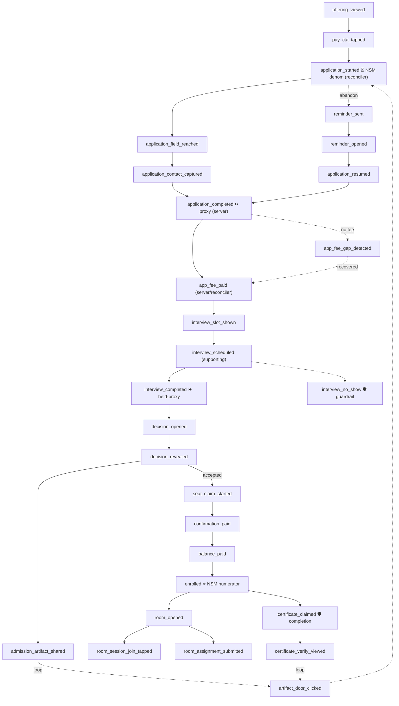

# LevelUp Live Cohorts — Analytics Tracking Plan

*Doc 06 of the cohort product docs set · authored 2026-07-17 on the live-cohort program.*
*Companion to `design/cohorts/docs/01-PRD.md` (the product source of truth). This document turns the PRD's success metrics (§7) into a concrete, buildable event set: every event's name, when it fires, what it carries, and which PRD metric / funnel stage it measures. It is the artifact that makes the CRO bets **measurable instead of arguable.***

**Audience is dual (same as the PRD).** A founder new to analytics should be able to read this top to bottom and understand *what we measure and why*; an Opus 4.8 engineering crew should be able to wire each event against a checkable acceptance criterion. Jargon is defined inline the first time it appears.

**How to read this document**
- **Grounding, not invention.** Every event traces to a PRD §7 metric row or a named requirement, and every claim about the *current* analytics layer cites `src/lib/analytics.ts` by line. If a claim has no citation, treat it as a bug in this doc.
- **This doc must not contradict the PRD.** Where the PRD §7 already names an event (e.g. `application_started`, `app_fee_paid`, `interview_scheduled`), that name is **canonical here** — verbatim — even where it breaks a naming convention (see §2.1). The finalized PRD wins; this doc elaborates it.
- **RAHUL DECISION blocks** mark every tracking scope choice Rahul has not confirmed, each with a recommended default so the crew is never blocked.
- **Tier tags** follow `CLAUDE.md`'s blast-radius model. Anything that rides the reconciliation read path, payments, auth, or handles user identifiers is flagged 🔴 Tier 1 — analytics is not exempt from the secret-handling and access rules.
- **The single most important idea in this plan:** *the funnel truth does not arrive in the browser.* Today the live money runs through hardcoded Razorpay links and TeleCRM, and **0 of 199 recent payments carried an app id** (`FUNNEL-DATA-AUDIT.md` §2). So most funnel events cannot be client-emitted — they are **derived server-side by REQ-RECON-1** (the reconciliation read path, PRD §5.1) from Tally/TeleCRM/Razorpay reads. Every event below is tagged with its **Source** (client `track()` · reconciler-derived · server edge fn) precisely because this is where naive instrumentation would silently under-count the north star.

**Companion docs (read alongside this one):**
- `design/cohorts/docs/01-PRD.md` — the requirements and the §7 success-metric table this plan instruments. **Read it first.**
- `design/cohorts/funnel/FUNNEL-DATA-AUDIT.md` — the measured funnel reality (81% abandon; TeleCRM `status` picklist; amount→product map; the phone/email join and its ~10% orphan rate; §6 stage→CTA table).
- `design/cohorts/funnel/TALLY-UX-ANALYSIS.md` — form-length completion curve (91/26/14%), the three walls, the ~69%-contactable finding.
- `design/cohorts/CRO-SUGGESTIONS.md` — the 15 CRO additions; #15 names the three A/B tests this plan wires (§4).
- `src/lib/analytics.ts` — the **existing** browser analytics layer (Meta/GA4/Twitter pixels + PostHog funnel sink). This plan **reconciles reuse-vs-new against it** (§1), never re-invents it.
- `design/cohorts/ROOMS-BACKLOG.md` R4-T4 — the **exactly seven** room engagement events, already specced; this plan reuses them verbatim (§3.7).

---

## 1. What exists today — the layer we extend, not replace

`src/lib/analytics.ts` is a thin browser-side fan-out: one `track()` API translates a small union of typed events to whichever ad pixels are enabled, plus a **PostHog funnel sink** (`analytics.ts:37-43, 355-362`). Two facts about it govern everything below.

**Fact 1 — it is browser-only, by design.** Its own header states: *"Conversions APIs (server-to-server) are deliberately not in this file — they belong in edge functions where the access tokens live"* (`analytics.ts:14-16`). So any event whose truth arrives server-side (a reconciled Razorpay payment, a Calendly booking webhook, a ladder cron send) **must not** be forced through this browser module. It fires from an edge function via PostHog **server-side capture** keyed on the user id (§2.3). This is the architectural spine of the whole plan.

**Fact 2 — PostHog is the funnel warehouse; pixels are for ad attribution.** PostHog boots off `VITE_POSTHOG_KEY`, independent of the DB pixel settings, with `autocapture:false` / `capture_pageview:false` / session-recording disabled (`analytics.ts:234-240`) — "*a pure funnel sink: no autocapture keeps the PII surface to just the events we fire (+ the identified user id)*" (`analytics.ts:232-233`). The only identity attached is the auth uid via `posthog.identify(uid)` (`analytics.ts:246-254`). **We inherit this PII posture unchanged** (§2.4).

### 1.1 Existing events — reuse map

The five **Phase-3 conversion-funnel events** already in the union (`analytics.ts:319-324`, fired via `captureFunnel()` to PostHog or pixel-custom fallback):

| Event (exists) | Payload (exists) | analytics.ts | Reuse in this plan |
|---|---|---|---|
| `offering_viewed` | `{slug}` | `:320, :423` | **Reuse as-is** — top-of-funnel awareness (§3.1) |
| `pay_cta_tapped` | `{slug, surface}` | `:321, :426` | **Reuse as-is** — intent signal (§3.1) |
| `checkout_loaded` | `{offeringId, guest}` | `:322, :429` | **Reuse** — app-path ₹400/₹8k checkout open (§3.2) |
| `payment_initiated` | `{orderId}` | `:323, :432` | **Reuse** — app-path fee initiation (§3.2); note the live-link path is invisible (§3.2) |
| `purchase_completed` | `{orderId, valueInr}` | `:324, :435` | **Reuse** — app-path capture; `valueInr` disambiguates ₹400/₹8k/balance by amount (`FUNNEL-DATA-AUDIT.md` §4) |

The seven **room engagement events** are already specified in `ROOMS-BACKLOG.md` R4-T4 ("*extend `track()`… exactly seven*") but **not yet in code**. This plan reuses that spec verbatim (§3.7) — it does not invent room events.

**Everything else below is NEW** and must be added to the `AnalyticsEvent` union (client-fired arms) or emitted from an edge function (server/reconciler-fired). §6 gives the concrete additions.

> **RAHUL DECISION — SINK-1: PostHog is the canonical funnel warehouse; add a server-side capture path for reconciler/edge events.**
> The existing layer proves PostHog is already the funnel sink (`analytics.ts:37-43`). **Recommended default:** keep PostHog as the single funnel warehouse, and stand up a **PostHog server-side capture helper in `supabase/functions/_shared/`** (POST to `/capture` with the project key, keyed on `user_id`) so reconciler-derived and webhook-derived events land in the *same* warehouse as the browser events — one funnel, one join key (`user_id`). Alternative Rahul may prefer: route server events to a separate warehouse (e.g. a Supabase `analytics_events` table) and reconcile in SQL — more control, more build. Recommendation: one warehouse (PostHog) because the NSM is a *chain across client + server + reconciler* events and splitting the sink splits the funnel. `🔴 Tier 1` (new secret — the PostHog project key — referenced by name only, per `CLAUDE.md` secret rules; it is a *write* key, low blast radius, but still edge-fn config).

---

## 2. Design principles (read once, applies to every event)

### 2.1 Naming convention

- **Canonical rule for NEW events: `noun_pasttenseverb` describing a completed state transition** — `application_started`, `app_fee_paid`, `interview_scheduled`, `seat_claim_started`, `confirmation_paid`, `enrolled`. This matches the PRD §7 vocabulary exactly and reads as a funnel ledger.
- **Room events keep their R4-T4 shape** (`room_opened`, `room_session_join_tapped`, …) — a `room_`-prefixed namespace, verb in the middle. Do not renumber or rename them.
- **The PRD names win on any conflict.** The task brief asks for `verb_noun`; the PRD §7 already ships `noun_verb` (`application_started`, not `start_application`). Since this doc *must not contradict the finalized PRD*, the PRD names are canonical and the convention is documented honestly rather than silently overriding them. Where the task brief's placeholder name differs from the PRD/this-plan canonical name, the mapping is called out inline (e.g. brief `interview_slot_booked` → canonical `interview_scheduled`).
- **snake_case, lowercase, no spaces.** Payload keys are snake_case too.

### 2.2 Source taxonomy (the column that prevents silent under-counting)

Every event carries exactly one **Source**:

- **`client`** — fired from the browser via `track()` (extends the `AnalyticsEvent` union). Only for things a signed-in user does *inside the app* (taps, screen opens, share-sheet invocations).
- **`reconciler`** — **derived server-side by REQ-RECON-1** (PRD §5.1) from a Tally/TeleCRM/Razorpay read keyed on the logged-in user's phone+email. Used for every funnel state the app does **not** own today (form starts, live-link ₹400 captures, TeleCRM interview states). Level-triggered: the reconciler *observes a state*, so the event must fire **once per (user, stage) transition**, not once per cron cycle (§2.5).
- **`server`** — fired from a specific edge function at the moment it does authoritative work: `tally-application-webhook` (form completed), `verify-razorpay-payment` (app-path capture), the new Calendly webhook receiver (booking), the reminder-ladder cron (nudge sent).

A funnel stage can have **both** a `server` writer (for app-path events) *and* a `reconciler` fallback (for the live-link path that dominates today). Where so, the event is emitted **once**, deduped on a shared idempotency key (§2.5), so the two paths never double-count.

### 2.3 Sinks & the server-side capture path

```mermaid
flowchart LR
    subgraph Browser
      C[track&#40;&#41; union<br/>client events]
    end
    subgraph Edge[Supabase edge functions]
      RW[tally-application-webhook]
      RP[verify-razorpay-payment]
      CW[calendly-webhook-receiver &#40;new&#41;]
      LAD[reminder-ladder cron]
      REC[reconciler &#40;REQ-RECON-1&#41;]
    end
    C -->|posthog.capture| PH[(PostHog<br/>funnel warehouse)]
    RW --> SH[_shared/posthog-capture.ts &#40;new, SINK-1&#41;]
    RP --> SH
    CW --> SH
    LAD --> SH
    REC --> SH
    SH -->|server capture, keyed on user_id| PH
    PH --> M[NSM + proxies + guardrails<br/>&#40;PRD §7&#41;]
```



- **Client events** → `posthog.capture()` in the browser (the existing `captureFunnel()` path, `analytics.ts:355-362`), which already falls back to pixel-custom events when PostHog is absent.
- **Server / reconciler events** → a new `_shared/posthog-capture.ts` helper (SINK-1) that POSTs to PostHog's capture endpoint with `distinct_id = user_id`, so a server event joins the *same* person timeline as their browser events.
- **Ad pixels** (Meta/GA4/Twitter) stay on the existing e-commerce events only (`view_content`/`initiate_checkout`/`purchase`, `analytics.ts:370-413`). The funnel events are deliberately **custom** events, never standard e-commerce ones, so the Purchase/ViewContent ad funnels are left untouched (`analytics.ts:352-354`). This plan does not change that.

### 2.4 PII rules (binding — `🔴 Tier 1`)

- **The only identifier in any payload is the session `user_id`** (the Supabase auth uid), attached exactly as `posthog.identify(uid)` does today (`analytics.ts:246-254`). This is the whole PII surface, and it stays that way.
- **Never in any payload:** phone, email, full name, city as free text, the 100-word essay or `bio` freeform text (**NFR-COPY-1** — the essay is never surfaced in *any* UI *or telemetry*), Razorpay contact details, TeleCRM lead identifiers.
- **The reconciler keys on phone+email server-side** to resolve the person, but it emits **only the resolved `user_id`** into the event — the join keys never leave the edge function. This is the one place the rule is easy to violate; the acceptance criterion in §9 asserts it (a grep of emitted payloads for `@` / a 10-digit run returns nothing).
- **No personal data in URLs.** Deep links and the tracked "applications open" door (CRO #13) carry `cohort`/`batch`/`artifact_type` only — never a user identifier in a query string (per the privacy rules; a shared artifact is public).
- **Consent / DNT:** the layer already skips localhost (`analytics.ts:269-275`) and PostHog runs with session-recording off. No new consent surface is introduced; if a global consent gate lands later it wraps `bootAnalytics()`, not individual events.

### 2.5 Idempotency (so reconciled + webhook paths never double-fire)

- **Reconciler events are level-triggered** — a cron re-reads the same TeleCRM `Application Fee Paid` lead every cycle. Each stage event therefore carries an **idempotency key** `{user_id}:{event_name}` (or `{user_id}:{event_name}:{week_n}` where per-week), recorded in a small ledger, so the event fires **once per transition**. Reuse the `cohort_notifications_log` idempotency discipline the reminder ladder already relies on (PRD REQ-INSTALL-3; `COHORT-LOGIC.md` §2 `notify-cohort`).
- **PostHog's own dedup:** pass a stable `$insert_id = idempotencyKey` on server captures so a retry of the same edge invocation is collapsed warehouse-side too.
- **Purchase events** already use `transaction_id` as the event id base so a `/thank-you` refresh doesn't double-count (`analytics.ts:346-348, 367-368`) — the same discipline, extended to reconciler stages.

### 2.6 Experiment exposure (A/B) — one shared primitive

All three A/B tests (§4) emit **one** exposure event — `experiment_exposed {experiment, variant}` — at the moment a user is assigned/first sees a variant (PostHog's `$feature_flag_called` convention). Every downstream funnel event is then sliced by the exposed variant in the warehouse; the variant is **not** duplicated onto every event. The **assignment engine** (feature flags / Tally form split) is fast-follow #15 (§4.4), but the **exposure event and the `variant` fields are v1-prepared** so no re-instrumentation is needed when the harness lands.

---

## 3. The event catalog

Organized to mirror the PRD §7 success-metric table, stage by stage. Each event row gives: **Trigger** · **Source** · **Payload** · **PRD metric / funnel stage it measures** · **Reuse/New**. `⏩` marks the two PRD **leading proxies** (§2.1 of the PRD) the team steers by between batch closes; `🛡️` marks a **guardrail** metric (a win that regresses it is a false win).

### 3.1 Application start & completion `Serves NSM denominator + form-complete proxy`

| Event | Trigger | Source | Payload | Measures | R/N |
|---|---|---|---|---|---|
| `offering_viewed` | Offering page view | client | `{slug}` | Awareness (top of funnel) | Reuse |
| `pay_cta_tapped` | Apply/pay CTA tap | client | `{slug, surface}` | Intent | Reuse |
| `application_started` | REQ-RECON-1 sees a **Tally partial** for this phone/email (furthest question > 0) — the completion-only webhook **cannot** see starts (PRD §5.1) | **reconciler** | `{form_id, furthest_field, source}` | **NSM denominator** — "of everyone who *starts*…" (PRD §2.1); Application-start stage | New |
| `application_field_reached` | REQ-RECON-1 records the furthest Tally question in a partial | **reconciler** | `{form_id, field_index}` | Wall diagnosis (Q3/Q13/Q17 stalls, `TALLY-UX-ANALYSIS.md` §4). *This is the honest form of the brief's `field_completed`* — see note ▼ | New |
| `application_contact_captured` | Phone **and** email both present in the Tally partial / TeleCRM lead | **reconciler** | `{form_id}` | Recoverable-abandoner pool (~69% contactable, `TALLY-UX-ANALYSIS.md` §4); Application-start stage | New |
| `application_completed` ⏩ | Tally `FORM_RESPONSE` arrives (completed submission) | **server** (`tally-application-webhook`) | `{form_id, field_count, variant, has_essay}` | **Form-complete rate by length** — the PRD's *leading proxy* (§7); 91/26/14%→target lift (`TALLY-UX-ANALYSIS.md` §1) | New |

**Note — `field_completed` / `essay_submitted` honesty.** The Tally form is **externally hosted**; the app cannot emit a true per-field client event, and the webhook fires **only on complete submissions** (PRD §5.1, `FUNNEL-DATA-AUDIT.md` §2). So:
- The brief's **`field_completed`** is realized as `application_field_reached` (furthest-question, reconciler-derived from Tally partials) — the best signal available without an app-hosted form. True per-field client telemetry would require either hosting the form in-app or reading Tally's own analytics API — out of v1 scope (noted as OPEN-Q in §8).
- The brief's **`essay_submitted`** is folded into `application_completed` as the boolean `has_essay` flag. It is **never** a standalone event carrying essay content, and the essay text never enters a payload (**NFR-COPY-1**). `has_essay` distinguishes a real completion from a contact-only partial for the "completed-no-fee" marker (§3.2).

### 3.2 Fee gate `Serves complete→₹400 + the "completed-no-fee" recovery`

| Event | Trigger | Source | Payload | Measures | R/N |
|---|---|---|---|---|---|
| `checkout_loaded` | App-path staged checkout opens | client | `{offeringId, guest}` | App-path ₹400/₹8k open | Reuse |
| `payment_initiated` | App-path Razorpay order created | client | `{orderId}` | App-path fee initiation | Reuse |
| `app_fee_paid` | ₹400 captured — **app path:** `verify-razorpay-payment` sets `app_fee_paid`; **live-link path:** REQ-RECON-1 sees the captured ₹400 by amount (`FUNNEL-DATA-AUDIT.md` §4) | **server** *or* **reconciler** (deduped, §2.5) | `{amount_inr, path}` (`path` ∈ `app`\|`link`) | **Complete→₹400-paid rate**; Fee-gate stage. Baseline: 0/199 app-linked (`FUNNEL-DATA-AUDIT.md` §2) | New |
| `app_fee_gap_detected` | REQ-RECON-1 marker: `has_essay`/`Fee Link Sent` **minus** a matching captured ₹400 (the warmest recoverable lead, `FUNNEL-DATA-AUDIT.md` §5 gap 2) | **reconciler** | `{form_id}` | "Completed form, never paid" pool size — the previously-invisible positive marker | New |
| `app_fee_gap_cleared` | A matching ₹400 later appears for a gapped user | **reconciler** | `{amount_inr}` | Recovery of the completed-no-fee pool | New |

**Honesty note — fee *initiation* on the live path is largely invisible.** An applicant who lands on the hardcoded ₹400 Razorpay page and closes it *without attempting* leaves **no Razorpay record at all** (`FUNNEL-DATA-AUDIT.md`: `created` count is 0; only ~35 *failed* attempts/7d are visible). So `payment_initiated` is meaningful **only** for the app-path; on the live-link path, initiation cannot be counted, and the funnel measures `application_completed → app_fee_paid` directly (with `app_fee_gap_detected` as the negative-space marker). Do not present a live-link "initiation rate" — it would be fabricated.

### 3.3 Re-entry & the reminder ladder `Serves abandoner→resumed`

| Event | Trigger | Source | Payload | Measures | R/N |
|---|---|---|---|---|---|
| `reminder_sent` | Ladder cron emits a touch (REQ-INSTALL-3) | **server** (ladder cron) | `{touch, channel, pool}` — `touch` ∈ `t2h`\|`t22h`\|`t_minus_24h`\|`fee_nudge`\|`book_interview`; `channel` ∈ `push`\|`whatsapp`\|`email`; `pool` ∈ `form_incomplete`\|`completed_no_fee`\|`fee_paid_no_interview` | Reminder-ladder reach; cap compliance (max 1/day, 4/app, quiet hours) | New |
| `reminder_opened` | Recovery link click | **server** (redirect handler) → optionally client on land | `{touch, channel}` | Ladder open-rate | New |
| `application_resumed` | An app-authenticated deep link lands the user at the correct step, **or** REQ-RECON-1 sees a partial advance to completion after a touch | client **or** reconciler | `{pool}` | **Abandoner→resumed rate**; Re-entry stage | New |

Cap-compliance is auditable directly off `reminder_sent`: a per-user-per-day count > 1, a per-application count > 4, or any `sent` timestamp in 21:30–09:00 IST is a defect (PRD guardrail "Notification restraint"; acceptance in §9).

### 3.4 The interview `Serves the ⏩ fee-paid→interview proxy + 🛡️ no-show guardrail`

| Event | Trigger | Source | Payload | Measures | R/N |
|---|---|---|---|---|---|
| `interview_slot_shown` | The ₹400 success screen renders the 3 soonest slots (REQ-INT-0 / CRO-2) | client | `{count, surface, variant}` — `surface` ∈ `success_screen`\|`reminder`; `variant` for the CRO-2 A/B (§4.2) | Slot-embed exposure; scheduling-gap closure | New |
| `interview_scheduled` | Booking created — Calendly webhook receiver (REQ-INT-1) fires; reconciler backstops from TeleCRM `Interview Scheduled` | **server** (calendly-webhook, new) *or* **reconciler** (deduped) | `{modality}` — `modality` ∈ `google_meet`\|`phone` (canonical enum; never assume Zoom, PRD REQ-INT-1) | **Fee-paid→interview-scheduled** — a **supporting** mid-funnel metric (booked, not attended); NOT the ⏩ proxy | New |
| `interview_reschedule_requested` | The one allowed reschedule is used (REQ-INT-3) | client | `{}` | Reschedule-guardrail usage (exactly one offered) | New |
| `interview_completed` ⏩ | TeleCRM `Interview completed` (or app writer, per Open Q1) | **reconciler** | `{modality}` — `∈ google_meet`\|`phone` | **Fee-paid→interview-HELD — the PRD ⏩ *leading proxy* (§2.1/NSM-1/§7).** "Held" = the interview actually happened, so a scheduled-but-no-show is not counted as a win; scheduled→held rate | New |
| `interview_no_show` 🛡️ | TeleCRM `No show` | **reconciler** | `{}` | **No-show rate — the PRD guardrail** (§2.2): a completion win that raises this is a *false win* (pay-first can fill the top with low-intent ₹400 payers who never show) | New |

### 3.5 The decision `Serves interview-held→accepted→confirmed + the acquisition loop`

| Event | Trigger | Source | Payload | Measures | R/N |
|---|---|---|---|---|---|
| `decision_opened` | "Open your decision" tap (REQ-DEC-1) — the sealed reveal gate | client | `{}` — **verdict is NOT in this payload** (no surface, including telemetry, carries the verdict before the reveal) | Decision-open rate | New |
| `decision_revealed` | The reveal animation resolves (or the reduced-motion crossfade, REQ-DEC-2) | client | `{outcome}` — `outcome` ∈ `accepted`\|`waitlisted`\|`rejected` | Accept/waitlist/reject mix (the user's own outcome; not PII) | New |
| `admission_artifact_shared` | OS share sheet invoked on the PNG card or on-device WebM (REQ-DEC-3) | client | `{artifact_type}` — `∈ card_png`\|`webm`\|`server_mp4` | Share rate = top of the **acquisition loop** (PRD §7 Loop); *the brief's `artifact_shared`* | New |
| `seat_claim_started` | "Claim my seat" tap → **before** Razorpay opens (REQ-DEC-5) | client | `{}` | Claim-intent (pre-payment) | New |
| `confirmation_paid` | ₹8k captured — app-path `verify-razorpay-payment` (`type=confirmation`, this path **works**) or reconciler by amount | **server** *or* **reconciler** (deduped) | `{amount_inr}` | Interview-held→confirmed; *the brief's `confirmation_fee_paid`* | New |

### 3.6 Confirm → enroll `Serves the NSM numerator + seat-lapse`

| Event | Trigger | Source | Payload | Measures | R/N |
|---|---|---|---|---|---|
| `balance_paid` | Balance captured (≥₹40k Forge / ₹22–32k Live, by amount) | **server** *or* **reconciler** | `{amount_inr}` | Confirmed→balance-paid | New |
| `remainder_scheduled` | Confirmation-fee EMI / UPI-autopay mandate set at the euphoria moment (**fast-follow #9** — event is v1-prepared, trigger ships with the feature) | **server** | `{plan}` | Autopay adoption; *the brief's `remainder_scheduled`* | New (fast-follow) |
| `enrolled` | Batch assigned → `status='enrolled'` | **server** (batch-assign) | `{}` | **NSM numerator** — "reach `enrolled`" (PRD §2.1) | New |
| `seat_released` | Seat lapses / admin releases (manual in v1 per SEAT-1; automated release is fast-follow) | **server**/admin | `{reason}` — `∈ lapsed`\|`withdrawn`\|`admin` | Seat-lapse rate | New |
| `refund_recorded` 🛡️ | A Razorpay refund is read by the reconciler (keyed on `user_id`, mirroring the `app_fee_paid` link-path read, §6.2) | **reconciler** (Razorpay refunds read-only, §4.5 of `04-INTEGRATION-CONTRACTS.md`) | `{amount_inr, payment_stage}` — `payment_stage ∈ app_fee`\|`confirmation`\|`balance` | **Refund rate — the PRD "refund / payment-dispute" guardrail (§2.2).** A conversion win that regresses this is a *false win* ("money in daylight means fewer disputes, not conversion bought with confusion") | New |
| `payment_disputed` 🛡️ | A Razorpay dispute/chargeback is read by the reconciler | **reconciler** (Razorpay disputes read-only) | `{amount_inr, payment_stage}` | **Dispute rate — the other half of the §2.2 refund/dispute guardrail;** un-instrumented today, so a false win on it would be invisible | New |

### 3.7 Room delivery — the seven R4-T4 events, verbatim `Serves weekly engagement guardrail`

These are **already specified** in `ROOMS-BACKLOG.md` R4-T4 ("exactly seven… extend `track()`"). This plan reuses them **unchanged**; they fire via `tapTick()` (the room's client emitter, PRD terms). All are `client` source, all Tier-3.

| Event | Trigger | Payload | Measures | R/N |
|---|---|---|---|---|
| `room_opened` | Room surface open | `{slug, phase}` | Room reach; *the brief's `room_entered`* | Reuse (R4-T4) |
| `room_session_join_tapped` | Join button tap (appears at T−60) | `{sessionId, state}` | Session join rate; *the brief's `session_joined`* | Reuse (R4-T4) |
| `room_recording_played` | Recording play | `{resumed}` (boolean) | Recording-resume rate (closes G2) | Reuse (R4-T4) |
| `room_assignment_submitted` | Submission | `{weekN, late}` (booleans/int) | Assignment submission; *the brief's `assignment_submitted`* | Reuse (R4-T4) |
| `room_announcement_seen` | Announcement viewed | `{}` | Announcement reach | Reuse (R4-T4) |
| `room_demo_entry_submitted` | Demo-day entry submitted | `{}` | Third-act engagement | Reuse (R4-T4) |
| `room_switched` | Multi-room switch (REQ-MULTI-1) | `{}` | Multi-cohort navigation | Reuse (R4-T4) |

**`attendance_recovered` is intentionally NOT a client event.** R4-T4 is explicit: *"Weekly engagement (the G10 gap) derives server-side from tables, not events."* Attendance, recovery ("watch recording + 3-line recap within 6 days → marked Recovered", REQ-ROOM-5), and the certificate-eligibility % are **computed from `cohort_week_submissions` / attendance tables**, not emitted. The brief's `attendance_recovered` is therefore a **server-derived metric** (§5), not an event — surfacing it as a client event would double-count against the authoritative table read and invite the gamification the registrar register forbids (NFR-COPY-6). This is a deliberate reconciliation, not an omission.

### 3.8 Completion & the loop `Serves 🛡️ completion guardrail + acquisition loop`

| Event | Trigger | Source | Payload | Measures | R/N |
|---|---|---|---|---|---|
| `certificate_claimed` | Eligible student claims the certificate (REQ-FINISH-1) | client | `{standing_tier}` — `∈ distinction`\|`merit`\|`completion` (STANDING-1 cutoffs) | Certificate claim; *the brief's `certificate_earned`* | New |
| `certificate_verify_viewed` | Public verify URL opened (recipient side) | **server**/client (public route) | `{standing_tier}` | Certificate-as-credential reach (loop) | New |
| `admission_page_viewed` | Public admission page loaded, logged-out (REQ-DEC-6) | **server**/client (public route) | `{cohort, batch}` — **no user identifier** (§2.4) | Loop: artifact→viewer | New |
| `artifact_door_clicked` | The tracked "applications open" door on card/cert/video is clicked (CRO #13) | **server**/client (public route) | `{artifact_type, cohort, batch}` | **share→application** — the loop's payoff metric (CRO #13, PRD §7 Loop) | New |
| `referral_started` | An alumni referral affordance is used (REQ-FINISH-2) | client | `{cohort}` | Alumni referral → new application | New |

> **RAHUL DECISION — CERT-1: `certificate_claimed` / `certificate_verify_viewed` extend R4-T4's "exactly seven" room events.**
> R4-T4 fixes the room-*engagement* set at seven. The completion + loop events above are **Stage-12 funnel events**, not room-engagement events, so they live outside that seven. **Recommended:** treat them as a distinct **Stage-12 event group** (not room events), so R4-T4 stays exactly seven and the certificate/loop instrumentation still ships — because the certificate is both the completion **guardrail** (PRD §2.2) and the top of the **acquisition loop** (CRO #13), and leaving it un-instrumented would make the loop "arguable not measurable" — the exact failure this plan exists to prevent. If Rahul prefers the strict seven-only room scope with no Stage-12 events in v1, the fallback is: derive completion % server-side from tables (as §5 already does) and defer the loop events (`artifact_door_clicked`, `referral_started`) to fast-follow with CRO #13.

---

## 4. The three named A/B tests (CRO #15)

CRO #15 commits to three tests: *(a) fee-position inversion, (b) success-page slot embed, (c) essay before/after payment* (`CRO-SUGGESTIONS.md` #15). This section wires each to the event set so it reads a real number, not an opinion. **All three share the `experiment_exposed` primitive (§2.6).** Per PRD §4.3, the **A/B assignment harness itself is fast-follow #15** — so these are **v1-prepared** (the exposure event + `variant` payload fields ship in v1) and **fast-follow-validated** (the harness that *assigns* and *reads* them lands in fast-follow). REQ-APP-3's straight form-shortening ships in v1 **without** the harness (PRD §5.2), so the biggest form-length lever is not blocked on any of this.

**Shared exposure event:**

| Event | Trigger | Source | Payload |
|---|---|---|---|
| `experiment_exposed` | User is assigned to / first sees a variant | client (app-side flags) or **server** (Tally form-split, resolved post-provision) | `{experiment, variant}` |

### 4.1 Test A — fee-position inversion (CRO-1)

- **Hypothesis:** moving essay/quiz/portfolio to *after* the ₹400 (pay-first) lifts completion + fee-paid without degrading show-rate.
- **Variants:** `control` = v2 baseline (essay/quiz before the ₹400 gate) · `treatment` = pay-first (~5-field pre-pay form, qualification after).
- **Assignment:** which Tally form the user enters (two forms / URL param), resolved to `user_id` at provisioning (PRD CRO-1 requires a second Tally form or in-app intake — **not** a no-op). `experiment='fee_position'`.
- **Primary metric:** `application_completed` rate **and** `app_fee_paid` rate, sliced by `variant`.
- **🛡️ Guardrail (must-not-regress):** `interview_no_show` rate and `interview_completed`/`app_fee_paid` (show-rate) — the PRD's explicit false-win trap (§2.2). Treatment can *raise* completion while *filling the top with low-intent payers*; the test **fails** if it lifts completion but tanks show-rate.
- **Segment stitch:** because assignment happens on an external form before the account fully mints, join exposure→outcome on `user_id` after REQ-RECON-1 resolves the person (the same phone/email join, PRD §5.1).

### 4.2 Test B — success-page slot embed (CRO-2)

- **Hypothesis:** embedding the three soonest interview slots as one-tap buttons on the ₹400 success screen (vs a link out to Calendly) raises fee-paid→interview-scheduled.
- **Variants:** `embed` = 3 one-tap slots (the v1 default, REQ-INT-0) · `link_out` = a Calendly link.
- **Assignment:** app-side feature flag at the success screen; `experiment='slot_embed'`. Exposure fires with `interview_slot_shown {variant}` (§3.4) so exposure and the surface are the same event.
- **Primary metric:** `interview_scheduled` within the session / within 24h of `app_fee_paid`, sliced by `variant` (the ⏩ leading proxy).
- **Guardrail:** `interview_no_show` (a slot booked in a rushed one-tap must still show).

### 4.3 Test C — essay before/after payment

- **Hypothesis:** asking the essay *after* the ₹400 (only paid, serious applicants write it) improves completion and downstream signal quality without losing admit quality.
- **Variants:** `essay_before` · `essay_after`. (Related to Test A but isolates the *essay ordering* specifically; can run nested within CRO-1's treatment arm or standalone.)
- **Assignment:** Tally form config; `experiment='essay_order'`.
- **Primary metric:** `application_completed` rate + `app_fee_paid` rate.
- **Signal-quality metric (the point of the test):** downstream `interview_completed` / `interview_no_show` and admit rate (`decision_revealed{outcome=accepted}` per applicant) — does moving the essay after payment *keep* the qualification signal the essay does today as a "commitment gate" (`TALLY-UX-ANALYSIS.md` §5)?
- **NFR-COPY-1 hold:** in *every* arm the essay text stays out of telemetry; only `has_essay` and ordering are measured.

### 4.4 Experiment reporting

Each test reads as a two-row funnel (control vs variant) over the §3 events, with the guardrail row shown beside the primary so a false win is visible at a glance. The harness (assignment + readout dashboard) is fast-follow #15; until it lands, the **exposure events accumulate** so the first post-harness read has history, and REQ-APP-3's straight wins are measured off `application_completed{field_count}` with no experiment at all.

> **RAHUL DECISION — ABTEST-1: assignment mechanism for the three tests.**
> **Recommended default:** app-side variants (Test B) via **PostHog feature flags** (already the warehouse, SINK-1); form-side variants (Tests A, C) via **Tally's native form split / URL-param forms**, resolved to `user_id` at provisioning so exposure joins outcomes on the same key the whole funnel uses. One `experiment_exposed` event regardless of mechanism. Alternative: a single app-side flag service for all three — cleaner, but it cannot assign a variant *before* the account mints on the pre-pay Tally form (Test A's whole point), so the split has to live partly Tally-side. `🟡 Tier 2` (config + a flag read; no schema, no payment change).

---

## 5. Metrics that are *derived*, not emitted (and why)

Some PRD §7 metrics are **computed server-side from authoritative tables**, never from events — emitting them as events would double-count or invite gamification. The crew must derive these in SQL/RPC, not instrument them:

| Metric | Derived from | Why not an event |
|---|---|---|
| **Weekly room engagement** (the >60% WhatsApp-sunset bar, R-D5) | `cohort_room_members` × per-week activity tables | R4-T4: *"derives server-side from tables, not events"* — the G10 gap |
| **Attendance % / recovered weeks** (`attendance_recovered`) | attendance + `cohort_week_submissions` (recovery = recording watched + recap within 6 days, REQ-ROOM-5) | Authoritative table state; an event would race the table and double-count |
| **Cohort completion / certificate-eligible %** (🛡️ guardrail) | attendance vs the 85% threshold (`user_is_certificate_eligible`, `COHORT-LOGIC.md` §2) | Server-computed gate; `certificate_claimed` (§3.8) measures *claim*, this measures *eligibility* |
| **Academic standing tier** (Distinction/Merit/Completion) | attendance + submissions vs STANDING-1 cutoffs | Computed view (PRD §5.8); the *tier* rides `certificate_claimed{standing_tier}` when claimed |
| **Reconciliation join completeness / orphan rate** (health) | REQ-RECON-1's own join instrumentation (share of Tally starts + captured ₹400 resolving to a `user_id`; ~10% orphan watch line) | A **health metric with an alert**, not a funnel event (PRD §5.1 acceptance): a drop below the watch line raises an alert rather than silently under-counting the NSM |

**The NSM itself is derived**, not an event: *application-start → enrolled* is computed over the `application_started` (denominator) → `enrolled` (numerator) chain in the warehouse, gated on REQ-RECON-1 producing both ends (PRD §2.1). The two ⏩ leading proxies (`application_completed` rate; `app_fee_paid`→`interview_completed` **held** rate — the proxy keys on *attendance*, not booking, per PRD §2.1/NSM-1) are likewise warehouse queries over §3 events, readable within days of a form/flow change. `interview_scheduled` is tracked as a **supporting** metric, not a ⏩ proxy, because a scheduled-but-no-show is a false win the no-show guardrail exists to catch.

**The refund/dispute guardrail** (PRD §2.2) is measured by the reconciler-derived `refund_recorded` / `payment_disputed` events (§3.6), computed into a **refund/dispute rate** from Razorpay refund/dispute reads keyed on `user_id`. It belongs in this plan (not the QA-tooling guardrails) because it is analytics-shaped external-payment data; without it a conversion win that regresses disputes would be invisible.

---

## 6. Implementation — extending the layer

### 6.1 Client events → the `AnalyticsEvent` union (`analytics.ts:313-324`)

Add these arms (client-source events only), each dispatched through `captureFunnel()` exactly like the existing Phase-3 events (`analytics.ts:422-437`):

```
| { name: "application_resumed"; pool: string }
| { name: "interview_slot_shown"; count: number; surface: string; variant?: string }
| { name: "interview_reschedule_requested" }
| { name: "decision_opened" }
| { name: "decision_revealed"; outcome: "accepted" | "waitlisted" | "rejected" }
| { name: "admission_artifact_shared"; artifact_type: "card_png" | "webm" | "server_mp4" }
| { name: "seat_claim_started" }
| { name: "certificate_claimed"; standing_tier: "distinction" | "merit" | "completion" }
| { name: "referral_started"; cohort: string }
| { name: "experiment_exposed"; experiment: string; variant: string }
// room events (R4-T4) — add as specified there, fired via tapTick():
| { name: "room_opened"; slug: string; phase: string }
| { name: "room_session_join_tapped"; sessionId: string; state: string }
| { name: "room_recording_played"; resumed: boolean }
| { name: "room_assignment_submitted"; weekN: number; late: boolean }
| { name: "room_announcement_seen" }
| { name: "room_demo_entry_submitted" }
| { name: "room_switched" }
```

Each new arm gets a `case` in `track()` calling `captureFunnel(name, {...})` (the PostHog-or-pixel-fallback path, `analytics.ts:355-362`). No pixel/e-commerce mapping — these are custom funnel events by design (§2.3). This is a **🟡 Tier 2** change to one shared module; verify no regression to the existing five events.

### 6.2 Server / reconciler events → `_shared/posthog-capture.ts` (new, SINK-1)

Events sourced `server` or `reconciler` **do not** go through the browser union. They call a new shared helper that server-captures to PostHog keyed on `user_id`, with the §2.5 idempotency key as `$insert_id`:

- `application_started`, `application_field_reached`, `application_contact_captured`, `app_fee_gap_detected`, `app_fee_gap_cleared`, `app_fee_paid`(link path), `interview_scheduled`(webhook/reconciler), `interview_completed`, `interview_no_show`, `balance_paid`(reconciler), `enrolled`, `seat_released`, `refund_recorded`, `payment_disputed`, `reminder_sent`, `reminder_opened` — from the reconciler cron / ladder cron / Calendly webhook / batch-assign.
- `application_completed` from `tally-application-webhook`; `app_fee_paid`(app path) + `confirmation_paid` from `verify-razorpay-payment`.

The helper references the PostHog **project write key by name** (edge secret, `CLAUDE.md` secret rules) — never logged, never committed. This is **🔴 Tier 1** (it rides the reconciliation + payment-verification edge functions on the login/money path; and it handles the user-resolution join — the PII boundary in §2.4 lives here).

### 6.3 Where each source fires (build checklist)

| Edge fn / surface | Emits |
|---|---|
| `tally-application-webhook` (`server`) | `application_completed` |
| REQ-RECON-1 reconciler cron (`reconciler`) | `application_started`, `application_field_reached`, `application_contact_captured`, `app_fee_paid`(link), `app_fee_gap_detected/cleared`, `interview_scheduled`(backstop), `interview_completed`, `interview_no_show`, `balance_paid`(backstop), `refund_recorded`, `payment_disputed`, `application_resumed`(advance) |
| `verify-razorpay-payment` (`server`) | `app_fee_paid`(app), `confirmation_paid`, `balance_paid`(app) |
| calendly-webhook-receiver — **new** (`server`) | `interview_scheduled`(primary) |
| reminder-ladder cron (`server`) | `reminder_sent`, `reminder_opened` |
| batch-assign (`server`) | `enrolled`, `seat_released` |
| Browser `track()` (`client`) | everything in §6.1 |

---

## 7. Full funnel at a glance (event ladder → PRD §7)



*Solid = the primary conversion chain (the NSM). Dashed = recovery + the acquisition loop. `⏩` = leading proxy, `🛡️` = guardrail, `⭐` = NSM numerator, `⏳` = NSM denominator.* Every node maps to a PRD §7 row; the derived metrics (§5) sit *beside* this chain, computed from tables.

---

## 8. Open questions (tracking-specific)

1. **True per-field form telemetry.** `application_field_reached` gives *furthest question* from Tally partials (reconciler), not a per-field client stream. A true field-by-field funnel (to pinpoint sub-question drop within a wall) needs an app-hosted form or Tally's analytics API — worth it only if REQ-APP-3's straight shortening doesn't move the walls enough. **Default: ship furthest-field; revisit after batch 1.**
2. **Warehouse retention & PII audit cadence.** How long PostHog retains raw events, and who runs the periodic payload-PII grep (§9). **Default: quarterly PII audit; retention per PostHog project default until Rahul sets a policy.**
3. **Attribution window for the loop.** `artifact_door_clicked → application_started` needs an attribution rule (same session? 30-day? UTM on the door). **Default: UTM `cohort`/`batch` on the door + 30-day last-touch, no user id in the URL (§2.4).**
4. **Cross-device identity before sign-in.** A reconciler event resolves to `user_id`; a *pre-sign-in* browser event is anonymous until `identify()`. PostHog's alias-on-identify stitches them, but a user who clicks a door on a new device is a fresh anon until they start an application. **Default: accept the anon→identify stitch PostHog already does (`analytics.ts:246-254`); do not build custom cross-device identity in v1.**

## 8.1 Consolidated RAHUL DECISIONS (tracking)

| ID | Decision | Recommended default |
|---|---|---|
| **SINK-1** | Warehouse + server capture path | PostHog as the single funnel warehouse; add `_shared/posthog-capture.ts` for server/reconciler events keyed on `user_id` (§1) |
| **CERT-1** | Do completion/loop events extend R4-T4's seven? | Yes — as a distinct Stage-12 event group (not room events); R4-T4 stays exactly seven; else derive completion server-side + defer loop events to fast-follow (§3.8) |
| **ABTEST-1** | A/B assignment mechanism | PostHog flags (app-side, Test B) + Tally form-split (form-side, Tests A/C), unified by `user_id`; one `experiment_exposed` event (§4.4) |

---

## 9. Acceptance criteria for the tracking plan (how the crew is graded)

The instrumentation is "done" when a QA gate can check all of:

1. **Every §3 event fires on a scripted walk of its trigger**, visible in PostHog, with **zero console errors offline** (the existing layer's discipline — `analytics.ts` swallows failures, `:439-442`; R4-T4 acceptance). Client events also no-op cleanly when PostHog is absent (pixel-custom fallback, `analytics.ts:360-362`).
2. **PII boundary holds (🔴):** a grep of every emitted payload (client union + server-capture calls) for an `@` or a 10-digit phone run or the `bio`/essay field returns **zero** matches; the only identifier present is `user_id` (§2.4). This is a blocking, re-run-every-phase check.
3. **Source correctness:** each event fires from exactly the source in §6.3 — no funnel-truth event is client-emitted where the money/state actually lands server-side (the 0/199 trap). Specifically: `app_fee_paid` on the live-link path is reconciler-derived, and a fixture with a captured ₹400 but no app-path order still produces `app_fee_paid` (proving the reconciler, not the browser, is the source of truth).
4. **Idempotency:** running the reconciler cron **twice** over the same fixtures produces **one** event per (user, stage) — no duplicate `application_started`/`app_fee_paid`/`interview_scheduled` (§2.5).
5. **Reuse, not re-invent:** the five Phase-3 events and the seven R4-T4 events are **reused** (no renamed duplicates); a diff shows additions to the union, not rewrites of `offering_viewed`/`purchase_completed`/room events.
6. **Cap-compliance is auditable off `reminder_sent`:** a query proves no user exceeds 1 touch/day or 4/application and none fired 21:30–09:00 IST (PRD notification guardrail).
7. **The NSM is computable end-to-end:** given fixtures spanning `application_started`→`enrolled`, the warehouse returns a real application-start→enrolled rate, and both ⏩ proxies return numbers within-days (proving the chain, gated on REQ-RECON-1 — §5).
8. **Every A/B test reads a two-row funnel** (control vs variant) over §3 events with its guardrail row beside the primary (§4), even if the assignment harness is still fast-follow (exposure events accumulate).

---

*End of tracking plan. This document is subordinate to `01-PRD.md`: where they differ, the PRD wins and this doc is corrected. Nothing here changes the sacred payment pipeline or the `ApplicationStatus.tsx` `isIOS()` guard (PRD §4.4 / NFR-SEC-5); analytics only observes it. The reconciliation-derived events are gated on REQ-RECON-1 shipping first — without it the funnel events silently collapse to in-app completion rate (PRD §2.1, Risk R1).*
