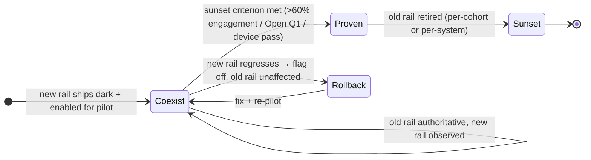
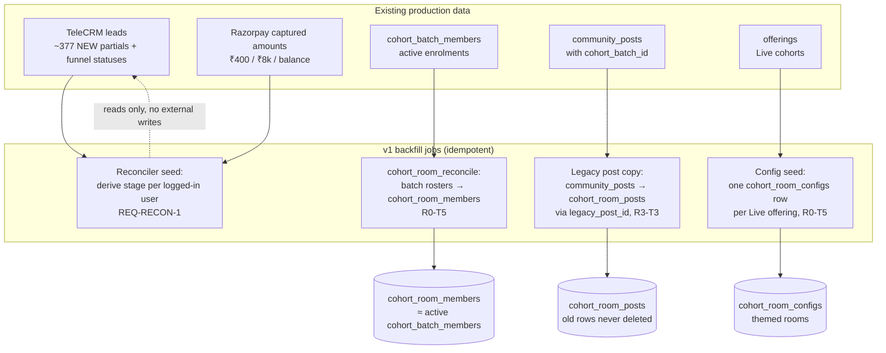
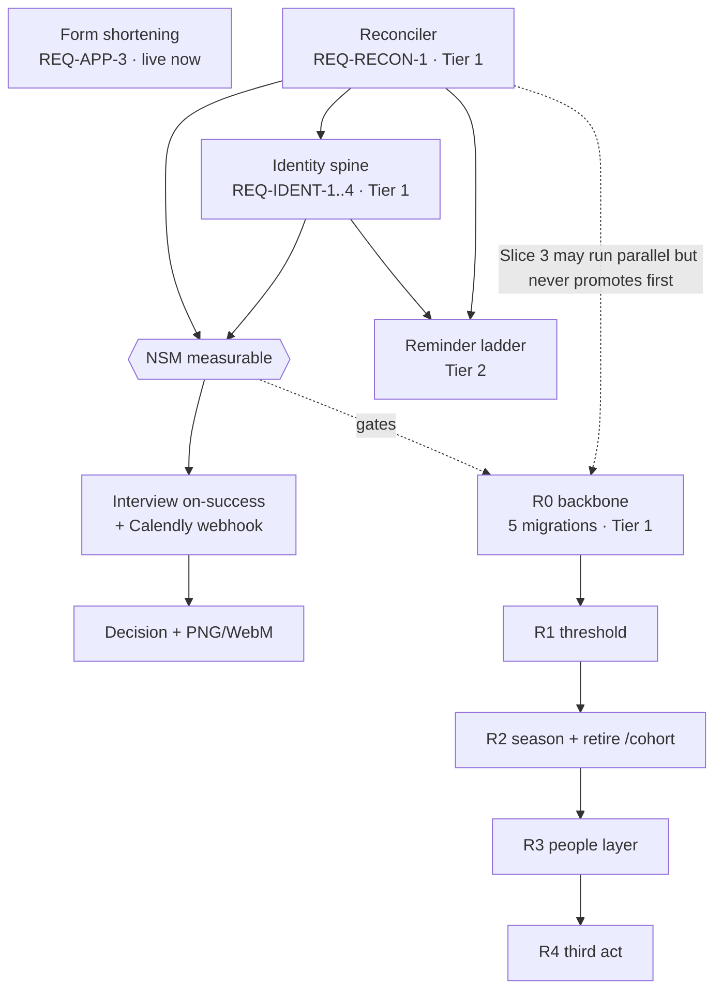

# LevelUp Live Cohorts — Rollout & Migration Plan

*Doc 08 of the cohort product docs set · authored 2026-07-18 on the live-cohort program.*
*Audience is dual on purpose: a founder new to PM/design/engineering should be able to read this top to bottom and understand **how we get from today's system to the new one without breaking a live batch**, and an Opus 4.8 engineering crew should be able to execute each cutover step against its checkable gate, flag, and rollback.*

**How to read this document**
- **This is the *sequencing* doc, not the *what* doc.** `01-PRD.md` says what the product is and carries the numbered requirements (REQ-IDs); `ROOMS-BACKLOG.md` says how the rooms get built (phases R0–R4); this doc says **in what order it all reaches real users, what runs in parallel while it does, and how we undo any step that goes wrong.** It must not contradict the PRD's scope (§4) or build order (§4.0); where it adds a claim, it cites a source file.
- **Grounding, not invention.** Every factual claim cites a source file in this repo. If a claim has no citation, treat it as a bug in this doc.
- **RAHUL DECISION blocks** mark every rollout choice Rahul has not confirmed, each with a recommended default so the crew is never blocked.
- **Tier tags** (`🔴 Tier 1 / 🟡 Tier 2 / 🟢 Tier 3`) follow `CLAUDE.md`'s change-risk model — gate on **blast radius, not diff size**. Every Tier-1 surface in this plan carries an explicit **flag** (how it ships dark) and a **rollback** (how it comes back out) below.
- **The one inviolable rule of this whole plan:** *a student who is mid-batch today must not notice we are re-platforming underneath them.* The live application→payment pipeline is byte-for-byte untouched (`COHORT-LOGIC.md` "Standing guard"; PRD §4.4), and every new surface ships **behind a flag, to a new batch, with the old path still running** until the new one proves out.

**Recurring terms (defined once):**
- **the live funnel** — today's operational path: **Tally → TeleCRM → hardcoded Razorpay links**, stitched by phone/email only (`FUNNEL-DATA-AUDIT.md` §1). *Not* the app's `cohort_applications` pipeline, which is real code but dormant (0/199 recent payments used it, ibid §2).
- **the reconciler** — REQ-RECON-1's read-only path that reads Tally/TeleCRM/Razorpay by the logged-in phone/email and derives a user's funnel stage (PRD §5.1). It is Slice 1's linchpin and this plan's first cutover.
- **shadow project** — a throwaway Supabase project that mirrors prod schema, where Tier-1 migrations + the adversarial access suite run green *before* the migration is ever applied to `ivkvluezuiojovpotlyb` (`ROOMS-BACKLOG.md` R0; `CLAUDE.md` migration runbook).
- **dark / behind a flag** — code is deployed to production but reaches no real user because a feature flag gates it (default off). "Ships dark" = the migration/edge-fn is live but the UI/writer is flag-gated. This is how a Tier-1 surface can be *deployed* long before it is *rolled out*.
- **a new batch** — a cohort intake that has **not started delivery** (in `pre_start`, no live weeks yet, PRD §5.7). The pilot rule below is that new surfaces pilot on a *new* batch, never a running one.

**Companion docs (read alongside):**
- `design/cohorts/docs/01-PRD.md` — the product source of truth; this plan sequences its §4.0 slices and §5 requirements. **Nothing here overrides the PRD.**
- `design/cohorts/ROOMS-BACKLOG.md` — the R0–R4 room execution phases this plan's Slice 3 maps to one-for-one.
- `design/cohorts/funnel/FUNNEL-DATA-AUDIT.md` — why the app is not the system of record today, and what the reconciler can read.
- `design/cohorts/COHORT-LOGIC.md` — the as-is pipeline this plan preserves and the gaps it closes.
- `CLAUDE.md` — the change-risk tiers, the staged-rollout doctrine, and the release runbooks (Play / ASC / Supabase) this plan drives.
- `ORCHESTRATION.md` — how each phase becomes a brief → build → gate → council → internal release → Rahul device pass → promote loop. **This plan lives inside that loop; it does not replace it.**

---

## 1. The doctrine: replace the engine without stopping the car

LevelUp is running a real, revenue-generating cohort business *right now* — ~30 students per Live cohort, three-payment journeys (₹400 → ₹8k → balance), interviews on Calendly, delivery over ~12 weeks, a community that lives on WhatsApp (`COHORT-LOGIC.md` §1). We are not building on a greenfield; we are re-platforming a funnel with money and humans flowing through it today. Three doctrines govern every step:

1. **The pipeline is sacred and untouched.** The staged checkout (`type=app_fee|confirmation|balance`), the server-side payment verification, the `cohort_applications` status writer, and — critically — the `ApplicationStatus.tsx:319,337` `isIOS()` staged-payment revenue guard are do-not-touch (`COHORT-LOGIC.md` "Standing guard"; PRD §4.4 / NFR-SEC-5). This plan **adds surfaces beside** the pipeline; it never modifies it. `🔴 Tier 1 (do-not-touch)`

2. **New surfaces ship dark, then to a new batch, then wide.** No new surface reaches a running batch on its first push. It is deployed behind a flag (dark), enabled for one *new* batch as a pilot, watched, then rolled to all batches. This is the PRD's funnel-first / rooms-last slicing (§4.0) expressed as a rollout, not just a build order.

3. **The old rail runs until the new rail proves out.** WhatsApp stays until the room proves it can be the place (>60% weekly engagement, R-D5). TeleCRM stays as the funnel's system of record until Open Q1 is decided. The hardcoded Razorpay links stay until — *if ever* — the app becomes the money path. **We reconcile the old systems; we do not rip them out in v1** (`FUNNEL-DATA-AUDIT.md` §6; PRD §4.4).

The reason this doctrine is not optional: the 2026-06-14 outage, where a one-word CSS change (`overflow-x: hidden`→`clip` on html/body) killed vertical scroll for *all* Android users because it *looked* trivial and shipped to 100% (`CLAUDE.md`). Blast radius, not diff size. A rollout plan that skips the flag/pilot/stage ladder on a Tier-1 surface is how that recurs.

### 1.1 Today → target, at a glance

| Capability | Where it lives **today** | Where it lives **after v1** | Cutover style |
|---|---|---|---|
| Application intake | Tally form (external) | Tally form (**unchanged**; shortened per REQ-APP-3) | In place (Tally-builder) |
| Account creation | Manual / only if email pre-exists (`COHORT-LOGIC.md` G9) | Auto-provisioned from the Tally webhook (REQ-IDENT-1) | Ships dark → new batch |
| Knowing a user's funnel stage | Nowhere in the app (`FUNNEL-DATA-AUDIT.md` §2) | The reconciler reads Tally/TeleCRM/Razorpay (REQ-RECON-1) | **First cutover** |
| Application-fee / confirm / balance money | Hardcoded Razorpay links | **Unchanged** (links stay; reconciler reads them) | No cutover in v1 |
| Funnel status of record | TeleCRM `status` picklist | **TeleCRM stays**; app reconciles + owns what it controls | Reconcile, don't replace |
| Abandoner recovery | ~nothing (69% contactable, unrecovered, `TALLY-UX-ANALYSIS.md` §4) | Reminder ladder (REQ-INSTALL-3) | Ships dark → new batch |
| Interview booking | Calendly link on thank-you page | On-success slots + modality (REQ-INT-0/1) | Net-new webhook, dark → new batch |
| Decision / acceptance | Manual admin status + email | Sealed reveal + PNG/WebM artifact (Stage 06) | Ships dark → new batch |
| Cohort delivery | `/cohort/:offeringId` homework tracker | Themed room `/room/:slug` (Rooms R0–R4) | Flag + redirect shim, new batch first |
| In-cohort community | WhatsApp (LevelUp owns nothing, `COHORT-LOGIC.md` G4) | In-room commons (Stage 09) — **WhatsApp coexists** | Parallel run, per-cohort sunset |
| Cohort ending | Weeks archive, nothing (`COHORT-LOGIC.md` G5) | Demo day → certificate → alumni room (Rooms R4) | Ships with the room |

The through-line: **almost every row is "add beside, prove, then switch" — not "replace."** The only rows with a true swap (`/cohort` → `/room`) are gated by a redirect shim that keeps old links working (`ROOMS-BACKLOG.md` R1-T1 / R2-T5).

---

## 2. Which cohort pilots first

**Recommendation: pilot on a NEW Live-cohort batch that has not yet started delivery — never a running one.** A running batch has students mid-flow whose muscle memory, WhatsApp group, and half-finished assignments are load-bearing; changing their surface mid-batch is exactly the "student notices we re-platformed underneath them" failure the doctrine forbids. A *new* batch has no such state: its members cross the funnel and enter the room on the new rails from day zero, so there is no seam to fall into.

The two slices split cleanly by population, which is why they can pilot independently (PRD §4.0):

- **Slice 1–2 (funnel) pilots on the next application intake window.** The reconciler, spine, shortened form, ladder, interview, and decision serve the *not-yet-converted applicant* — a population that turns over continuously, so the pilot is simply "the next batch of applicants sees the new funnel." No running student is touched, because a running student is already past the funnel.
- **Slice 3 (rooms) pilots on the next batch to reach `pre_start`.** The room serves the *already-converted* student. The pilot batch is the first cohort to be *enrolled after R0 lands* — it enters the themed room in `pre_start` and lives its whole ~12 weeks there, while every currently-running batch stays on `/cohort` byte-for-byte (flag off) until it completes and archives naturally.

**Why a specific SKU matters.** The Live Filmmaking cohort (`VE`, form `nWLkyk`) is the highest-volume Live intake and the one the funnel audit measured end-to-end (`TALLY-UX-ANALYSIS.md`; `FUNNEL-DATA-AUDIT.md` §3), so its funnel changes are the best-instrumented and lowest-surprise. Rooms should pilot on whichever Live cohort next reaches `pre_start` with Rahul-provided theming assets ready (`ROOMS-BACKLOG.md` R0-T5). Forge SKUs (₹600–900 app fees, ₹15k confirms — a separate account/amount map, `FUNNEL-DATA-AUDIT.md` §4) are *not* the first pilot: they share less of the measured funnel and add amount-mapping ambiguity; fold them in after the Live pilot reads.

> **RAHUL DECISION — PILOT-1: The pilot cohort(s) for funnel and for rooms.**
> **Recommended default:** funnel (Slice 1–2) pilots on the **next Live Filmmaking (`VE`) application window** — best-instrumented, highest volume, and the audit's reference funnel. Rooms (Slice 3) pilots on the **first Live cohort to reach `pre_start` after R0 is applied**, with theming assets seeded per R0-T5. All currently-running batches finish on the old `/cohort` surface untouched (flag off). Forge SKUs join after the Live pilot reads a full batch. Alternatives Rahul may prefer: (a) pilot funnel on a lower-volume SKU to limit exposure (slower read, safer); (b) pilot rooms on Creator Academy if its next batch lands first. Recommendation: keep `VE` for funnel (the data anchor) and take whichever Live cohort is soonest-to-`pre_start` for rooms.

> **RAHUL DECISION — RUNNING-BATCH-1: Do any currently-running batches migrate to the room mid-flight?**
> **Recommended default: NO — running batches finish on `/cohort` and are never mid-flight-migrated.** A running batch's members have a live WhatsApp group, in-progress submissions, and a mental model of the current surface; moving them mid-batch trades a real retention risk for a cosmetic upgrade they did not ask for. Let them complete, archive, and — if valuable — receive an *alumni* room retroactively (Rooms R4, purely additive, no live-module disruption). Only *new* batches are born in the room. Alternative: opt-in migration for a running batch whose mentor requests it (allowed, but treat as a bespoke, council-reviewed exception, not the default).

---

## 3. What runs in parallel during the transition

The transition is not a switch; it is a **coexistence window** where old and new rails run side by side and each old rail is sunset only against a *stated, checkable* criterion. Nothing is turned off on a schedule; everything is turned off on a proof.

| Old rail | Stays running because | New rail beside it | Sunset criterion (the proof) | Owner of the call |
|---|---|---|---|---|
| **WhatsApp cohort group** (`offerings.whatsapp_group_link`) | It is the actual room today; immediacy/presence live there (`COHORT-LOGIC.md` G4) | In-room commons (Stage 09, async threads, PRD §5.9) | **>60% weekly room engagement** for ≥1 full cohort run, **per cohort** (R-D5; PRD guardrail §2.2). WhatsApp link stays a logistics card until then (`ROOMS-BACKLOG.md` R1-T6) | Rahul, per cohort |
| **TeleCRM** (`status` picklist, `mql`) | It is the funnel's system of record; interview/accept states have no app writer (`FUNNEL-DATA-AUDIT.md` §2) | The reconciler reads it; the app owns only what it controls (payments, room) | **Open Q1 decision** (does the app become the writer?). Until then TeleCRM is authoritative and the app *reconciles* it (PRD §8.2 Q1) | Rahul (Open Q1) |
| **Hardcoded Razorpay links** | 0/199 payments touch the app path; the links carry the money today (`FUNNEL-DATA-AUDIT.md` §2) | The staged pipeline (already built) + reconciler reads captured amounts | **Not sunset in v1.** The reconciler reads Razorpay by phone/email; whether the app becomes the money path is a post-v1 question, not a v1 cutover (PRD §4.4) | Deferred (post-v1) |
| **Tally form** | It is the intake; the webhook and audit both depend on its shape (`FUNNEL-DATA-AUDIT.md` §2) | **Tally stays** — v1 only *shortens* it (REQ-APP-3) and reads partials (reconciler) | Not sunset in v1. CRO-1's second-form/in-app-intake inversion is a fast-follow A/B, not a replacement (PRD §4.1 CRO-1) | Deferred (fast-follow) |
| **`/cohort/:offeringId` page** | Old notification emails link `/cohort/{{offering_id}}`; running batches use it (`COHORT-LOGIC.md` §1) | `/room/:slug` themed shell | **After R2 gate-passes + Rahul device pass + one cohort cycle**; `/cohort` becomes a redirect shim, killed only per R-D9 (`ROOMS-BACKLOG.md` R2-T5; PRD §8.1 R-D9) | Rahul, per R-D9 |
| **`AdminCohort*` pages** (3 separate surfaces) | Mentors grade on them Saturdays today (`COHORT-LOGIC.md` §2) | Mentor's Desk assembles the three (Stage 11) | When the Desk reaches parity on the pilot cohort; old admin pages stay until then | Rahul |

**The coexistence contract in one line:** *every old rail keeps working, unmodified, until a specific number or human sign-off retires it — and the number is stated in advance, not discovered after.* This is what makes the transition safe: at no point is a live cohort dependent on an unproven new surface, because the old one is always still there.

---

## 4. The phase ladder — what ships, behind what flag, in what order

This ladder is the PRD's three slices (§4.0) plus the Rooms R0–R4 sequence (`ROOMS-BACKLOG.md`), expressed as a *rollout*: each rung names what it ships, whether it ships **dark (flag)** or **live**, its blast tier, its gate, and its rollback. It runs inside the `ORCHESTRATION.md` per-phase loop (brief → build → QA gate → council if Tier-1 → internal release → Rahul device pass → promote). **Promotion to production is never automatic** — internal track + TestFlight only until Rahul says "promote" (`ORCHESTRATION.md`).

```mermaid
gantt
    title Rollout ladder (order, not calendar — each rung gates the next)
    dateFormat X
    axisFormat %s
    section Slice 1 — Funnel observable
    Reconciler (REQ-RECON-1)        :s1a, 0, 2
    Identity spine (REQ-IDENT-1..4) :s1b, 1, 3
    Form shortening (REQ-APP-3)     :s1c, 0, 1
    Reminder ladder (REQ-INSTALL/LOOP) :s1d, 2, 4
    section Slice 2 — Convert middle
    Interview on-success + modality :s2a, 4, 6
    Decision reveal + PNG/WebM      :s2b, 5, 7
    section Slice 3 — Deliver room
    R0 backbone (dark)              :s3a, 3, 6
    R1 threshold                    :s3b, 6, 8
    R2 season + retire /cohort      :s3c, 8, 10
    R3 people layer                 :s3d, 10, 11
    R4 third act                    :s3e, 11, 12
```

### Slice 1 — Make the funnel observable & recoverable *(lowest blast radius, ships first)*

| Rung | Ships | Flag or live | Tier | Gate before wider rollout | Rollback |
|---|---|---|---|---|---|
| **1.0 Form shortening** (REQ-APP-3) | Tally-builder changes: progress bar, ≤2 quiz Qs, split contact page, optional Q7/Q9, forward-dated availability, ≤14 fields | **Live** (Tally-side, no deploy) | 🟢 Tier 3 | Form structure read confirms the acceptance list; no field-order/gate change (that is CRO-1's A/B, not this) | Revert Tally form to prior version (Tally keeps history); zero code impact |
| **1.1 Reconciler** (REQ-RECON-1) | Read-only edge path reading Tally/TeleCRM/Razorpay by logged-in phone/email; derives stage; join-completeness health metric | **Dark** (flag `VITE_FUNNEL_RECON`), then pilot | 🔴 Tier 1 (auth-adjacent, new external creds) | Fixture stage→CTA table resolves; **orphan-rate alert fires** below the ~10% watch line (`FUNNEL-DATA-AUDIT.md` §5); read-only asserted (zero writes to external systems); council + secrets-by-name | Flag off → app reverts to no-stage-awareness (staged home falls back to `cohort_applications.status` only) |
| **1.2 Identity spine** (REQ-IDENT-1/2/3/4) | Webhook auto-provision; phone+email bind; `pending_claim` deferred-collision path; email OTP (OTP-1); staged home | **Dark → pilot** (webhook change gated to pilot offering) | 🔴 Tier 1 (auth) | Idempotent on `tally_response_id`; collision leaves `user_id` NULL + `pending_claim`, never silent-merges; phone-OTP byte-identical to `verify-msg91-otp`; adversarial suite + council + Rahul sign-off (PRD §5.1) | Webhook: revert to the pre-spine `tally-application-webhook` (email-only link). Email OTP: flag off, phone-OTP path untouched as proven fallback (Risk R8) |
| **1.3 Reminder ladder** (REQ-INSTALL-1/2/3, REQ-LOOP-1/2/3) | Deadline-anchored ladder; Tally save-and-resume (form-stage) + app deep-link (app-stage); fee-gate + book-interview nudges; caps 1/day, 4/app, quiet hours | **Dark → pilot** (flag `VITE_REMINDER_LADDER`) | 🟡 Tier 2 | Exact copy at exact offsets; single idempotency ledger (reuse `cohort_notifications_log` pattern); goes silent within one cron cycle of next stage; nothing in quiet hours | Flag off → no reminders sent (net-neutral vs today, which sends ~none) |

**Slice 1 exit gate:** the reconciler's join-completeness is instrumented and healthy on the pilot window; the NSM (application-start → enrolled) is *measurable at all* for the first time (PRD §2.1). This is the precondition for everything downstream — the NSM is gated on it (§4.0, Risk R1).

### Slice 2 — Convert the middle *(rides Slice 1's now-observable states)*

| Rung | Ships | Flag or live | Tier | Gate | Rollback |
|---|---|---|---|---|---|
| **2.0 Interview on-success + modality** (REQ-INT-0/1/2/3) | 3 soonest slots on ₹400 success screen; **net-new Calendly webhook receiver + signature verify + `interview_modality` column**; interviewer title/selectivity; batch ledger (hidden if source unavailable) | **Dark → pilot** (flag `VITE_INTERVIEW_ONSUCCESS`) | 🟡 Tier 2 (+🔴 net-new webhook) | Slots create a booking + advance reconciled stage; modality persists from the verified webhook; ledger renders real numbers or hides (no invented figures); the new webhook signature is verified (new signing secret) | Flag off → thank-you page reverts to today's Calendly link; the webhook receiver is additive (no writer removed) |
| **2.1 Decision + artifact** (REQ-DEC-1..6) | Sealed reveal; full-viewport animation; **PNG + on-device WebM** artifact (NOT the server render worker — RENDER-1 defers it); acceptance card; claim/details flows; public admission page | **Dark → pilot** (flag `VITE_DECISION_FLOW`) | 🟡 Tier 2 (+🔴 public-read policy on the admission page) | Reveal ≤2.6s transform/opacity only; reduced-motion ≤200ms crossfade reveals verdict; no verdict in any notification payload; public page renders only whitelisted fields (adversarial probe = 0 leaked fields); seat-release stays **manual** (SEAT-1) | Flag off → decision reverts to today's manual admin status + email; public page unpublish → 404 |

**Deliberately NOT in Slice 2 (fast-follow, per PRD §5.6):** the server-rendered mp4 worker (RENDER-1 — needs a net-new chromium+ffmpeg host that neither Supabase edge nor Vercel provides) and the automated seat-release/waitlist cron (SEAT-1 — money-adjacent automation on paid seats; manual release works at ~30/cohort). These ship *after* the on-device path proves the loop, not before.

### Slice 3 — Deliver the room *(highest blast radius, ships last; maps 1:1 to Rooms R0–R4)*

| Rung | Ships (`ROOMS-BACKLOG.md`) | Flag or live | Tier | Gate | Rollback |
|---|---|---|---|---|---|
| **3.0 R0 backbone** | Config + membership + content schema **including the community `channel_key` + `cohort_week_id` columns on `cohort_room_posts` (DATA §4.7 CHANNEL-KEY-1) and the `pre_member` role path (MEMBER-1)**, RLS, the SECURITY DEFINER **write RPCs** (`cohort_room_post_write`/`cohort_room_reply_write`) + **preview RPC** (`get_cohort_room_preview`), adversarial suite, prod backfill, config seed — **zero UI**. The channel columns and the write-path validation ship **dark in R0**, not deferred to R3, so the taxonomy exists before any feed UI reads it. | **Dark** (schema only; no user-visible change) | 🔴 Tier 1 (5 migrations on the enrolment path; **+ the channel write-path gate + the MEMBER-1 access boundary**) | Adversarial access suite green on **shadow project** (incl. channel-forgery W8, is_mentor_answer-forgery W9, preview-whitelist R10, pre_member-scope R11); enrolment INSERT p95 regression <5ms; AFTER-trigger failure cannot block enrolment writes; council + Rahul written sign-off; **prod backup before apply** (R0-T1..T5) | New tables/columns only → single DROP script; `get_cohort_progress` recreate reverts to the prior definition **held verbatim in the runbook** (R0-T5) |
| **3.1 R1 threshold** | Themed shell, `RoomThemeProvider`, My Cohorts, switcher, pre-start induction | **Dark → pilot** (flag `VITE_COHORT_ROOMS` env default + localStorage override **+ a server-readable flag mirror** — see below) | 🔴 Tier 1 (routing + 2 lines in `index.css`; **native surface with no store hot-fix**) | Flag **off = zero behavioral diff** (visual spot-check); flag on = navigable skeletons; two fixture rooms render distinct accents, identical layout; council notes the routing + index.css lines; **the server mirror can force the native default off without a store release (Open Q1 resolved below)** | Flag off → `/cohort/*` stays byte-identical on the old page (R1-T1 edge case); **native: the server mirror flips the shipped binary dark instantly** |
| **3.2 R2 season + retire `/cohort`** | Weeks/sessions/recordings/assignments world-class; `get_cohort_progress` duplication killed; **`/cohort` → redirect shim** | **Pilot live, then flag-flip default** | 🔴 Tier 1 (route truth swap) | R2-T1..T4 gate-passed; **Rahul device pass Android + iOS in a real cohort fixture**; old `/cohort/{{offering_id}}` email links verified through the shim; staged store rollout | Flag off restores old page (still compiles against post-R0-T3 RPC per that task's coordination); 48h Sentry clean before widening |
| **3.3 R3 people layer** | Announcements, roster, feed **filed into the standing + niche channels** (Announcements · This Week auto-mint · Assignments Help · Wins · General · niche), resources; legacy `community_posts` copy | **Pilot live** | 🟡 Tier 2 UI **+ 🔴 Tier 1 the channel write-path validation** (the `channel_key`/`is_mentor_answer` write RPC gate — schema landed dark in R0, the write path is exercised here) | Announcement fan-out = N notifications, no duplicate unread per cap; roster exposes no phone/email (column assert); **feed writes go through the write RPC — a forged `channel_key` or client-set `is_mentor_answer` is rejected (W8/W9)**; feed ENDS; adversarial suite re-run green | Per-module flag; legacy posts copied, never deleted (R3-T3) — revert leaves both copies intact. **NOTE: `ROOMS-BACKLOG.md` R3-T3 currently specifies a FLAT feed ("Post kinds post\|question\|win", no channels) and R0-T2 "finalizes posts per draft" (no channel columns) — those backlog tasks must be corrected to build the channel taxonomy (standing + niche, This Week auto-mint) and to land the channel columns in R0-dark, matching DATA §4.7 and this rung.** |
| **3.4 R4 third act** | Demo day, certificate moment, alumni flip, 7 room analytics events | **Pilot live** (no Tier-1) | 🟡 Tier 2 | Demo loop on fixtures; certificate fires once; alumni flip retires live modules, keeps archive, **deletes no data**; events visible on a scripted walk | Per-module flag; alumni flip is additive (nothing deleted) so reversible by phase flip-back |

**Slice 3 ordering rule (from PRD §4.0):** R0 is 5 Tier-1 migrations on the login/enrolment path — the heaviest blast radius in the whole program — so it goes **last among the slices and first within Slice 3**, and it ships *dark* (schema with zero UI). Slice 3 starts in true parallel with Slice 1 *only if* Tier-1 review bandwidth allows, but its promotion never precedes Slice 1 (BUILD-1).

### 4.1 What is live vs behind a flag — the register

| Surface | Default state at first prod deploy | Enabled for whom, when |
|---|---|---|
| Form shortening (REQ-APP-3) | **Live** (Tally-side) | Everyone, immediately — no code, revert-in-Tally rollback |
| Reconciler (`VITE_FUNNEL_RECON`) | **Off (dark)** | Pilot funnel window → all after join-completeness proven |
| Identity spine / webhook provision | **Off (dark)**, pilot offering only | Pilot `VE` intake → all Live intakes after collision/claim proven |
| Email OTP (OTP-1) | **Off (dark)** | Enabled with the spine; phone-OTP is the untouched fallback |
| Reminder ladder (`VITE_REMINDER_LADDER`) | **Off (dark)** | Pilot funnel window → all |
| Interview on-success (`VITE_INTERVIEW_ONSUCCESS`) | **Off (dark)** | Pilot → all Live; Forge after amount-map confirmed |
| Decision flow (`VITE_DECISION_FLOW`) | **Off (dark)** | Pilot → all |
| Server render worker (RENDER-1) | **Not built in v1** | Fast-follow, after share→application proves the loop |
| Automated seat release (SEAT-1) | **Not built in v1** | Fast-follow, after one manual cycle proves the transitions |
| Cohort rooms (`VITE_COHORT_ROOMS`) | **Off (dark)**, localStorage override for internal | Pilot `pre_start` batch → new batches → default-on at R2-T5 |
| In-room commons (Stage 09 modules) | **Off per cohort** (config `modules`) | Pilot room; WhatsApp stays until >60% engagement (R-D5) |

The default-off column is the whole safety story: **the first production deploy of every Tier-1 surface changes nothing a user sees.** The rollout is the sequence of *enabling* flags per pilot, not the sequence of deploys.

---

## 5. Feature flags — the control surface

`src/lib/flags.ts` does not exist yet (it is net-new, first referenced at `ROOMS-BACKLOG.md` R2-T5). This plan establishes it as the single flag registry so every dark surface has one honest kill-switch. Rules:

- **Every Tier-1 surface has exactly one flag** whose *off* state is byte-identical to today, **with one explicitly-carved-out exception: the identity-spine provisioning webhook (1.2).** A server-to-server webhook has no client `VITE_` flag surface; its default-off is achieved by **per-offering pilot gating + a code-revert to the pre-spine `tally-application-webhook`** (email-only link), not a registry flip. To keep the "one honest kill-switch per Tier-1 surface" invariant true rather than aspirational, the spine additionally carries a **server-config gate** (`identity_spine_enabled`, read inside the webhook) so provisioning can be dark-switched without a redeploy — listed in the flag table below. No *other* Tier-1 surface is "half-flagged."
- **Flags are env + localStorage-overridable** (the `VITE_COHORT_ROOMS` pattern, R1-T1): env sets the prod default; localStorage lets internal testers preview without shipping to users.
- **Security never depends on a flag** (NFR-CONFIG-2): a flag hides UI, never grants access. RLS is always membership-gated regardless of any flag or config `modules` value. A disabled room module simply has no rows/surface; the access helper still governs reads (`ROOMS-ARCHITECTURE.md` §5). **Turning a flag on can never be a privilege escalation.**
- **Capacitor binaries cannot be hot-fixed**, so a native flag must be *server-readable* where the surface is login-critical — the phase-5 council's standing recommendation of a remote-toggleable restore of the legacy behavior applies here (`ORCHESTRATION.md` post-phase-5 note). For native room rollout, prefer a server-config flag over a compiled `VITE_` constant so a bad room build can be dark-switched without a store release.

| Flag | Governs | Off-state (must equal today) | Kill-switch reach |
|---|---|---|---|
| `identity_spine_enabled` (**server-config**, not `VITE_`) | The webhook auto-provision/collision-defer path (1.2) | Webhook links email-only to a pre-existing `users` row (the pre-spine `tally-application-webhook` behavior); no auth mint, no phone-bind | Server-side inside the webhook — dark-switchable without redeploy; the carved-out Tier-1 surface (see rule above) |
| `VITE_FUNNEL_RECON` | Reconciler reads + stage derivation | No app stage-awareness; staged home reads `cohort_applications.status` only | Web instant; native needs server-config mirror |
| `VITE_REMINDER_LADDER` | The nudge ladder | No reminders (≈ today) | Web instant; cron reads flag server-side |
| `VITE_INTERVIEW_ONSUCCESS` | Slots on ₹400 success | Today's Calendly link on thank-you page | Web instant |
| `VITE_DECISION_FLOW` | Sealed reveal + artifact + public page | Today's manual admin status + email | Web instant; public page unpublish is per-record |
| `VITE_COHORT_ROOMS` (+ **server-readable mirror** for native) | `/room/*` + `/rooms` + nav | `/cohort/*` byte-identical old page | Web instant; **native: the server mirror flips the shipped binary dark without a store release** (Open Q1 resolved §12; `ROOMS-BACKLOG.md` R1-T1 to be amended) |
| per-cohort `modules` (config jsonb) | Which room modules render | Module absent = no surface; RLS unchanged | Config row edit, no deploy |

---

## 6. Data backfill — existing applicants & members into the new schema

The new system does not start empty: there are applicants sitting in TeleCRM `NEW` (≈377 recoverable partials, `FUNNEL-DATA-AUDIT.md` §5), enrolled members in `cohort_batch_members` today, and cohort posts in `community_posts` with a `cohort_batch_id`. Backfill is **additive and idempotent** everywhere — it never mutates a source-of-truth row, and re-running it is safe.

**Backfill jobs, in order:**

1. **Reconciler seed (no migration).** The reconciler does not backfill a table; it derives a user's stage *on read* from phone/email against Tally/TeleCRM/Razorpay (REQ-RECON-1). The "backfill" is simply that the first time an existing applicant signs in, their stage resolves from the external systems — no bulk write, no data migration. It writes the derived stage only onto `cohort_applications` for states the app can own, and surfaces the orphan rate (users whose phone/email doesn't join) as a health metric, not a silent loss (`FUNNEL-DATA-AUDIT.md` §5 gap 1). `🔴 Tier 1` (read path). **Rollback:** flag off; no rows to unwind.

2. **Room membership backfill — `cohort_room_reconcile()` (R0-T5).** After the R0 migrations apply, run the reconcile once to derive `cohort_room_members` from existing `cohort_batch_members`; record counts (`members ≈ active cohort_batch_members`). This is how a *currently-enrolled* student — if their batch is later given a room — appears in it without re-enrolling. Membership is **server-derived, never client-claimed** (NFR-SEC-1). `🔴 Tier 1`. **Rollback:** the membership table is new; DROP unwinds it, source `cohort_batch_members` is untouched.

3. **Config seed (R0-T5).** Insert one `cohort_room_configs` row per existing Live-cohort offering (Rahul provides accents/art; defaults: accent `--accent-violet-deep`, hero = the offering poster, `phase` per real state). A missing config row still renders the room on defaults (NFR-CONFIG-3), so this seed is an enhancement, not a gate. `🔴 Tier 1` (data). **Rollback:** delete the seeded rows; rooms fall back to defaults.

4. **Legacy cohort-post copy (R3-T3).** A one-off idempotent SQL copies `community_posts` rows carrying a `cohort_batch_id` into `cohort_room_posts` via a `legacy_post_id` link (the community-draft pattern). **Old rows are never deleted**; the cutover is "stop writing to the old table," verified by a 48h audit of zero new `community_posts` writes with `cohort_batch_id`. `🟡 Tier 2`. **Rollback:** the copy is additive; both copies coexist, so revert is "keep reading the old table."

**The identity-join caveat that governs all four.** Every backfill leans on the same phone/email join the live funnel already runs on, with the same ~10% orphan rate for users who switched email/phone between systems (`FUNNEL-DATA-AUDIT.md` §5 gap 1). REQ-IDENT-2 binds *both* identifiers at the source going forward and adds the `pending_claim` interactive-claim step for collisions, so the orphan rate shrinks for *new* applicants — but **existing** orphaned records are not silently merged. The reconciler surfaces them as a health metric for manual reconciliation, never a silent merge (Risk R2; REQ-IDENT-2 acceptance).

> **RAHUL DECISION — BACKFILL-1: Do we bulk-notify the ~377 recoverable partials sitting in TeleCRM `NEW` at cutover?**
> The reconciler *makes them visible as a class* for the first time (`FUNNEL-DATA-AUDIT.md` §5 gap 3), and the reminder ladder *can* reach them. **Recommended default: NO bulk blast at cutover — enroll them into the ladder only as they re-enter, respecting the caps (1/day, 4/application, quiet hours).** A one-time blast to a 14-day-stale list of 377 risks WhatsApp/email spam-flagging the sender number (the deliverability the whole ladder depends on) and violates the "notification restraint" guardrail (PRD §2.2). Alternative Rahul may prefer: a single, hand-written, one-touch re-engagement to the *high-MQL* subset (mql ≥ 40) only, sent from a warmed channel, as a controlled experiment — acceptable if capped and measured, but not the default cutover behavior.

---

## 7. Staged-rollout doctrine, per surface type

Once a flag is enabled for the pilot and the gate passes, *widening* follows `CLAUDE.md`'s staged-rollout doctrine — the mechanics differ by where the surface runs:

- **Web (Vercel) — effectively instant + 100%.** Web `main` auto-deploys to production and students use web as the purchase path (`ORCHESTRATION.md`). So a web surface's "stage" is: ship **dark** (flag off) → enable the flag for the **pilot** cohort → fast post-deploy verification on prod → widen the flag. The safety net is the flag + `git revert`, not a percentage ramp. **Never merge a room/funnel branch to `main` before its flag is proven** — merging exposes it to all web users at once (this is why `ORCHESTRATION.md` step 7 forbids early merge).
- **Android (Play) — percentage ramp.** Store releases ship `status:"inProgress"` + `userFraction` (0.1 = 10%), watched, then widened, or **halted** to freeze (`CLAUDE.md`; `scripts/play-publish.mjs` needs its `--rollout` flag). Default any Tier-1 room train to **10–20%**, hold a few hours, then complete to 100% only after Rahul's real-device Android scroll/room pass — the same gate that guarded the phase-5 overflow retirement (`ORCHESTRATION.md` phase-5 note).
- **iOS (App Store) — phased release + TestFlight.** TestFlight is the stage before public; App Store Phased Release ramps automatic updates over 7 days (1→2→5→10→20→50→100%), pausable anytime (`CLAUDE.md`). The iOS room train additionally degrades gracefully where VdoCipher FairPlay isn't supported yet (recordings, PRD §4.4 / Open Q5).

**Every Tier-1 rung in §4 gets the full pre-ship checklist (`CLAUDE.md`):** (1) `bugfix-council` argues the change; (2) cross-platform verify *every* surface it renders on — for anything touching `src/index.css` / scroll roots, on a **real Android surface**, not just desktop Chrome (the `clip`-bug lesson); (3) known reversibility (the flag + the migration DROP/revert); (4) staged rollout for store trains; (5) if it regresses anyway, write the one-line lesson into `CLAUDE.md` + memory.

---

## 8. Rollback playbook — one undo per Tier-1 surface

Reversibility is a *precondition* of shipping a Tier-1 surface, not an afterthought (`CLAUDE.md` pre-ship item 3). Every Tier-1 surface in this plan has a single, rehearsed undo:

| Tier-1 surface | Rollback action | Verification the undo worked | Source of the undo path |
|---|---|---|---|
| Reconciler (REQ-RECON-1) | Flag `VITE_FUNNEL_RECON` off | Staged home falls back to `cohort_applications.status`; no external reads fire | §4 rung 1.1 |
| Identity webhook (REQ-IDENT-1/2) | Revert `tally-application-webhook` to pre-spine version (email-only link) | New completed submission provisions via the old code path; no `pending_claim` rows minted | PRD §5.1; `guest-create-order` pattern |
| Email OTP (OTP-1) | Flag off; phone-OTP path is **untouched** and proven | Phone-OTP login byte-identical to `verify-msg91-otp`; no email-OTP surface renders | PRD §5.1 / Risk R8 |
| Reminder ladder | Flag `VITE_REMINDER_LADDER` off | Cron emits nothing; `cohort_notifications_log` gets no new rows | §4 rung 1.3 |
| Calendly webhook (REQ-INT-1) | Disable the Calendly-side subscription; flag `VITE_INTERVIEW_ONSUCCESS` off | Thank-you page reverts to today's Calendly link; no `interview_modality` writes | PRD §5.5; §9.1 |
| Decision public page (REQ-DEC-6) | Per-record unpublish → link 404/private; flag `VITE_DECISION_FLOW` off | Logged-out probe returns nothing; no whitelisted fields served | PRD §5.6 |
| R0 backbone migrations | Single DROP script (new tables only) | Prod schema returns to pre-R0; `cohort_batch_members` untouched | `ROOMS-BACKLOG.md` R0-T5 |
| `get_cohort_progress` recreate | Re-apply the **prior definition held verbatim in the runbook** | Two-sessions-in-one-week fixture behaves as before; `/cohort` page still works | R0-T3 / R0-T5 |
| Room routing (`VITE_COHORT_ROOMS`) | Flag off (env + server-config for native) | `/cohort/*` byte-identical old page; visual spot-check zero diff | R1-T1 |
| `/cohort` retire (R2-T5) | Flag off restores the old `CohortDashboard` (still compiles against post-R0-T3 RPC) | Old deep links land on the old page; 48h Sentry clean | R2-T5 |
| Payment pipeline | **N/A — never touched, so never rolled back** | `ApplicationStatus.tsx:319,337` diff = 0 (grep) | PRD §4.4 / NFR-SEC-5 |

**The two non-negotiables of any rollback here:** (1) it never touches the payment pipeline (there is nothing to roll back because nothing changed it); (2) it never deletes data — the alumni flip, legacy post copy, and config seed are all additive, so "undo" means "stop using the new surface," not "restore lost rows."

---

## 9. Cutover sequencing & dependencies

**The hard dependencies (from PRD §9.1):**
- **The reconciler gates the NSM, and the NSM gates everything.** Without REQ-RECON-1, the north star collapses to in-app completion rate (PRD §2.1). It ships first.
- **The spine gates funnel measurability.** The webhook provisioning + phone/email bind is what makes "know your funnel stage" true for a signed-in user (PRD §9.1).
- **R0 gates Stages 07–12.** No room UI ships before the backbone lands, council-approved, shadow-green, Rahul-signed (`ROOMS-BACKLOG.md` R0).
- **`get_cohort_progress` recreate coordinates with the weeks module** — ship together, or keep a deprecated duplicate-prone view until R2 lands (R0-T3; default: ship together).
- **Net-new infra named so none is under-planned as a mere tag** (PRD §9.1): the reconciler read path; the Calendly webhook receiver + signature verify + `interview_modality` column; email OTP; and (fast-follow) the render worker's chromium+ffmpeg host. Each is a rollout risk in its own right (Risk R8).

---

## 10. Rollout-specific risks

These are the risks *of the transition itself* — distinct from the product risks in PRD §9.2, which this plan inherits.

- **RO-1 — A Tier-1 surface ships un-flagged or half-flagged.** `Severity: high.` If the room routing or reconciler reaches prod without an off-state that equals today, a bug hits all users at once (the `clip`-outage class). *Mitigation:* §4.1's default-off register + §5's one-flag-per-surface rule; the flag's off-state is a gate acceptance criterion ("flag off = zero behavioral diff," R1-T1), not an assumption.
- **RO-2 — A running batch gets migrated mid-flight.** `Severity: high` (retention). *Mitigation:* RUNNING-BATCH-1 default (running batches finish on `/cohort`); only new batches are born in the room; PILOT-1 pins the pilot to a *new* `pre_start` batch.
- **RO-3 — Backfill silently merges orphaned identities.** `Severity: medium-high.` The ~10% phone/email orphans (`FUNNEL-DATA-AUDIT.md` §5) could be wrongly merged during a membership or reconciler backfill. *Mitigation:* REQ-IDENT-2 never silent-merges; the reconciler surfaces orphan rate as a health alert; backfills are additive and idempotent (§6).
- **RO-4 — WhatsApp is sunset before the room proves out.** `Severity: medium.` Killing the WhatsApp group before >60% room engagement strands a cohort's real-time channel. *Mitigation:* R-D5 per-cohort sunset criterion; the WhatsApp link stays a logistics card through ≥1 full run (§3; `ROOMS-BACKLOG.md` R1-T6).
- **RO-5 — A native room build regresses and can't be hot-fixed.** `Severity: high.` Capacitor binaries can't be patched without a store release. *Mitigation:* server-toggleable flag for native room rollout (§5); staged store rollout at 10–20% held on Rahul's real-device pass before 100% (§7); the phase-5 council's remote-restore recommendation applies (`ORCHESTRATION.md`).
- **RO-6 — Early merge to `main` exposes a dark surface to all web users.** `Severity: high.` Web `main` auto-deploys to prod. *Mitigation:* `ORCHESTRATION.md` step 7 — phase branches ship stores directly; merge to `main` only on Rahul's "promote," and only for flag-gated or gate-passed surfaces (§7).
- **RO-7 — The reconciler under-counts the NSM by silently dropping orphans.** `Severity: medium.` If join-completeness degrades, the north-star baseline is wrong and every downstream target is built on sand. *Mitigation:* REQ-RECON-1's join-completeness assertion + orphan-rate watch-line alert (PRD §5.1); a run below the watch line raises a visible alert rather than silently under-counting.

---

## 11. Consolidated RAHUL DECISIONS (this doc)

| ID | Decision | Recommended default |
|---|---|---|
| **PILOT-1** | The pilot cohort(s) | Funnel on the next Live Filmmaking (`VE`) window; rooms on the first Live cohort to reach `pre_start` after R0; Forge later (§2) |
| **RUNNING-BATCH-1** | Migrate running batches mid-flight? | **No** — running batches finish on `/cohort`; only new batches are born in the room; alumni rooms may be added retroactively (§2) |
| **BACKFILL-1** | Bulk-notify the ~377 recoverable TeleCRM partials at cutover? | **No bulk blast** — enroll into the capped ladder as they re-enter; optional warmed one-touch to the high-MQL subset only, measured (§6) |

**Inherited decisions this plan executes (from PRD §8.1 — not re-opened here):** BUILD-1 (three-slice order), RENDER-1 (server worker = fast-follow), SEAT-1 (manual release in v1), COMM-1 (async threads only; WhatsApp until >60%), R-D5 (per-cohort WhatsApp sunset), R-D9 (`/cohort` redirect shim, kill after one cycle). This doc's ladder is the rollout expression of those decisions; if Rahul changes any, this ladder changes with it.

---

## 12. Open questions (rollout-specific)

1. **Native flag mechanism for `VITE_COHORT_ROOMS` — RESOLVED (recommended default; confirm before the native room train).** A compiled `VITE_` constant can't be hot-switched in a shipped Capacitor binary, so the native room surface would have **no real Tier-1 kill-switch** — violating RO-5 and §5's one-honest-kill-switch rule. **Resolution:** the native `VITE_COHORT_ROOMS` default is backed by a **server-readable flag mirror** (reusing the phase-5 council's remote-restore machinery, `ORCHESTRATION.md`), so a bad native room build can be dark-switched without a store release. **`ROOMS-BACKLOG.md` R1-T1 currently specifies only a compiled `VITE_COHORT_ROOMS` env + localStorage override and MUST be amended to add this server-readable mirror** (flagged — that backlog task, outside this docs set, is the one to change) so the 3.1 rung's "flag off = instant native kill" rollback is real. Rahul confirms before the native room train ships.
2. **Open Q1 (system of record) is a rollout fork, not just a design question.** If the app becomes the *writer* of interview/accept states, TeleCRM sunsets on a schedule; if it stays a *reconciler*, TeleCRM is permanent infrastructure. The pilot runs as reconciler-only (PRD §8.2 Q1 default); the decision changes what §3's TeleCRM row eventually says.
3. **`play-publish.mjs --rollout` flag.** The script ships 100% today (`CLAUDE.md`); the staged room train needs the `--rollout <fraction>` flag before any Tier-1 native room release. This is a prerequisite for §7's Android ramp, not an assumption.
4. **iOS recordings degradation during the room pilot** — until FairPlay lands, how does the Screening Shelf behave on the WKWebView (link-out / "watch on web" / hidden)? Inherited from PRD §8.2 Q5; it gates the iOS room pilot's acceptance, not the Android one.
5. **Forge SKU fold-in timing.** Forge uses a separate Razorpay account/amount map (₹600–900 / ₹15k, `FUNNEL-DATA-AUDIT.md` §4). Confirm Forge funnel surfaces enable only after the Live pilot reads a full batch and the amount→product map is verified for Forge (PILOT-1 default defers them).

---

*End of Rollout & Migration plan. This document sequences the PRD (`01-PRD.md`) — it does not change its scope. The governing rule is unchanged from the first line: a live batch must never notice the re-platforming underneath it. Every new surface ships dark, pilots on a new batch, and rolls wide only on a stated proof; the payment pipeline stays byte-for-byte untouched; and every Tier-1 surface has one rehearsed undo. Nothing here promotes to production without Rahul's written sign-off.*
