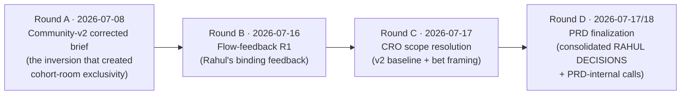

# LevelUp Live Cohorts — Decision Log

*Doc 09 of the cohort product docs set · opened 2026-07-18 on the live-cohort program.*
*Append-only. This is the single place where every product and architecture decision made across the cohort docs and the flow-feedback rounds is written down once — what was decided, when, why, what else was on the table, and whether it is settled or still Rahul's to confirm. Its job is to stop settled things being re-argued and to make unsettled things impossible to lose.*

---

## How to read this document

**If you are new to product work:** a "decision log" (sometimes called a *decision record* or *ADR ledger* — Architecture Decision Record) is a company's memory. Every time a real choice gets made — "we will do X, not Y, because Z" — it gets one dated row here. Six weeks later, when someone asks "wait, why aren't we building the video render worker in v1?", the answer is a lookup, not an argument. The discipline that makes it work is two rules: **append-only** (you never edit or delete an old entry; if a decision changes, you write a *new* entry that supersedes the old one and link them), and **one source of truth** (a decision lives here, and every other doc points at it rather than restating it).

**If you are the engineering crew:** each entry cross-references the doc and the REQ-ID(s) it governs. When a requirement's acceptance criteria and a decision here disagree, that is a bug in one of the two — surface it, do not silently pick. Nothing in this log overrides `01-PRD.md`; where the PRD is more specific, the PRD wins and this log points at it.

### The four things every entry carries
- **Decision** — the choice, in one sentence, stated as the thing that is true now.
- **Rationale** — why, grounded in a source file (never "because it's better").
- **Alternatives considered** — what else was on the table and why it lost. An entry with no alternatives is a decision nobody actually made.
- **Affects** — the doc(s) and REQ-ID(s) that must stay consistent with this entry.

### Status legend

| Status | Meaning | Who can change it |
|---|---|---|
| ✅ **DECIDED** | Settled. Either Rahul's binding instruction, or a design/architecture call the PRD makes to remove ambiguity. Build against it. | A new superseding entry only. |
| 🟠 **PENDING (default active)** | A RAHUL DECISION. A recommended default is *active* so the crew is never blocked, but Rahul can veto it before the relevant build phase. Build against the default; flag the dependency. | Rahul, before the named build phase. |
| 🔵 **OPEN** | A genuine open question — needs Rahul's input or more data before a default can even be recommended. Does not block v1 unless named as a blocker. | Rahul / data. |
| ⤴️ **SUPERSEDED** | Replaced by a later entry. Kept for the record. | — |

**Parenthetical qualifiers.** These four values are the *only* statuses. Some entries append a parenthetical to the status cell — `(framing)`, `(default)`, `(for v1)` / `(v1)`, `(pointer entry)` — which **narrows what kind of DECIDED it is without changing the status**. A reader or grep keyed on the four canonical values should treat everything up to the first `(` as the status; the qualifier is a sub-note, not a fifth status:
- **`(framing)`** — a scope/packaging call, not a per-item lock; the individual items it frames may still be PENDING (DL-024/025).
- **`(default)`** — a PRD-made default the council may vary within the decision's own guardrails (DL-047).
- **`(for v1)` / `(v1)`** — DECIDED for v1 only; a companion longer-term choice is still OPEN (DL-041 → DL-048).
- **`(pointer entry)`** — carries no new decision; it points at where earlier questions were resolved (DL-052).

### Conventions
- **DL-NNN** is this log's own stable, append-only id. It never renumbers. New decisions get the next number.
- **Canonical ID** (e.g. `BUILD-1`, `R-C1`, `R-D5`, `REQ-DEC-3`) is the handle the *source* doc uses. Both are given so either grep finds the entry.
- **Tier tags** (`🔴/🟡/🟢`) mirror `CLAUDE.md`'s blast-radius model where a decision carries build risk.
- **Dates** are the date the decision was *made at its source*, not the date this log was compiled (2026-07-18). Round A predates this log; it is recorded here because the cohort product inherits it.

### The decision rounds (chronology)

---

## Master index

Newest rounds at the bottom (append-only order). `⤴` = superseded, `→` details below.

| DL | Canonical | Decision (short) | Status | Affects |
|---|---|---|---|---|
| DL-001 | — | Specificity/exclusivity/theming belong to cohort **rooms**; the global commons is craft-agnostic | ✅ DECIDED | COMMONS-DIRECTIONS §0/§1; ROOMS-ARCHITECTURE; PRD §4.2 |
| DL-002 | R-C1 | Global commons direction = **B "The Exchange"** (recommended) | 🟠 PENDING | COMMONS-DIRECTIONS §3; PRD §8.2 Q4; ROOMS-BACKLOG R3-T3 |
| DL-003 | R-C2…R-C9 | Eight commons sub-decisions (membership, status, flairs, media, DMs…) | 🟠 PENDING | COMMONS-DIRECTIONS §4 |
| DL-004 | — | Identity spine: form → auto-provision (no signup ever) → OTP phone/email → staged applicant | ✅ DECIDED · 🔴 | PRD §5.1 REQ-IDENT-1..4; COHORT-LOGIC G9 |
| DL-005 | — | Web is fully supported; solve *why install*; install is a nudge, never a wall | ✅ DECIDED | PRD §5.3 REQ-INSTALL-1/2 |
| DL-006 | — | KEEP open-loop first screen + Duolingo-style reminder ladder | ✅ DECIDED | PRD §5.3 REQ-INSTALL-3; §5.4 REQ-LOOP |
| DL-007 | — | The 100-word essay text is **never** surfaced in any UI; personalize from structured fields | ✅ DECIDED | PRD REQ-APP-1, NFR-COPY-1 |
| DL-008 | — | KEEP two copy lines verbatim ("application is saved…", "review batch…closes…") | ✅ DECIDED | PRD REQ-LOOP-2, REQ-INSTALL-3 |
| DL-009 | — | Soften judgmental wait-screen framing; "passion to learn" is the one prerequisite | ✅ DECIDED | PRD REQ-LOOP-2, NFR-COPY |
| DL-010 | — | Interviewer = Business Development (sales); **never** "mentor"/"counselor"; real first name, no bio, selectivity line | ✅ DECIDED | PRD REQ-INT-2, NFR-COPY-4; persona P4 |
| DL-011 | — | Interview modality is the **student's choice** (Meet or phone) in Calendly; never assume Zoom | ✅ DECIDED | PRD REQ-INT-1 |
| DL-012 | — | One-reschedule guardrail; never charge for it; the word "free" is never used | ✅ DECIDED | PRD REQ-INT-3, NFR-COPY-4 |
| DL-013 | — | KEEP the three decision beats (ready → open → claim) | ✅ DECIDED | PRD REQ-DEC-1 |
| DL-014 | — | Acceptance card is Buildspace-grade shareable, personalized **without** the essay | ✅ DECIDED | PRD REQ-DEC-4 |
| DL-015 | — | "Open your decision" = full-viewport animation **and** an auto-generated shareable video artifact (not a screen recording) | ✅ DECIDED | PRD REQ-DEC-2/3 |
| DL-016 | — | Flesh out both the "Claim my seat" and "Read enrollment details" flows | ✅ DECIDED | PRD REQ-DEC-5 |
| DL-017 | — | A shared admission link opens a public admission page (recipient view) | ✅ DECIDED | PRD REQ-DEC-6 |
| DL-018 | — | **Remove seat numbers everywhere**; replace with a locked-future view | ✅ DECIDED | PRD REQ-LOCK-1, NFR-COPY-3 |
| DL-019 | — | The cohort room is not sold — redesign at world-class fidelity | ✅ DECIDED | PRD §5.8 Stage 08; ROOMS-ARCHITECTURE |
| DL-020 | — | Per-SKU vocabulary is configurable (labels only); the editorial cringe test gates terms | ✅ DECIDED | PRD REQ-VOCAB-1, NFR-COPY-2 |
| DL-021 | — | Ship room variants for the AI cohort (unlaunched) and Creator Academy (live) | ✅ DECIDED | PRD REQ-VOCAB-2 |
| DL-022 | — | The cohort room gets its own **in-room community**, distinct from the global commons | ✅ DECIDED | PRD §5.9 Stage 09; §4.2 |
| DL-023 | — | Flow Vision **v2 = the approved baseline** for screens/flows | ✅ DECIDED | PRD §4.1; student-journey-flows-v2 |
| DL-024 | — | CRO bets **#1/#2/#3 = IN** as RAHUL-DECISION-flagged recommended scope | ✅ DECIDED (framing) | CRO-SUGGESTIONS §scope; PRD §4.1 |
| DL-025 | — | CRO **#4–#15 = fast-follow / phase-2 backlog**, not v1 | ✅ DECIDED (framing) | CRO-SUGGESTIONS §scope; PRD §4.3 |
| DL-026 | BUILD-1 | v1 ships in **three slices, funnel-first, rooms-last** | 🟠 PENDING | PRD §4.0 |
| DL-027 | NSM-1 | North star = blended **application→enrolled** conversion; two leading proxies | 🟠 PENDING | PRD §2.1 |
| DL-028 | TARGET-1 | Numeric targets are provisional; instrument first, set after batch 1 | 🟠 PENDING | PRD §2.2/§7 |
| DL-029 | CRO-1 | Funnel **inversion** (pay-first, qualify-after) = IN as an A/B; v1-prepared / fast-follow-validated; not no-op eng | 🟠 PENDING | PRD §4.1, §5.2; CRO #1 |
| DL-030 | CRO-2 | Interview slots on the ₹400 success screen = IN (absorbed into v2 Stage 05) | 🟠 PENDING | PRD §5.5 REQ-INT-0; CRO #2 |
| DL-031 | CRO-3 | Certificates with **honors tiers** = IN (depends on STANDING-1 cutoffs) | 🟠 PENDING | PRD §5.8/§5.12; CRO #3 |
| DL-032 | STANDING-1 | Provisional Distinction/Merit/Completion cutoffs | 🟠 PENDING | PRD §5.8 REQ-ROOM-5 |
| DL-033 | FEE-1 | Credit the ₹400 toward tuition if accepted (fast-follow) | 🟠 PENDING | PRD §4.3 #14; CRO #5 |
| DL-034 | OTP-1 | Ship **email OTP** in v1 | 🟠 PENDING | PRD §5.1 REQ-IDENT-3 |
| DL-035 | TITLE-1 | Interviewer's title = "Admissions Interviewer" / "the admissions team" | 🟠 PENDING | PRD §5.5 REQ-INT-2 |
| DL-036 | RENDER-1 | Acceptance-video **server** render worker = **NOT in v1** (PNG + on-device WebM floor) | 🟠 PENDING | PRD §5.6 REQ-DEC-3 |
| DL-037 | SEAT-1 | Seat release = **split**: countdown copy in v1, automated release fast-follow | 🟠 PENDING | PRD §5.6 REQ-DEC-5 |
| DL-038 | COMM-1 | In-room community = **async threads only** in v1 (no realtime) | 🟠 PENDING | PRD §5.9 REQ-COMM-2 |
| DL-039 | R-D2…R-D9 | Eight rooms-architecture defaults (lobby, leaderboard, theming, WhatsApp, demo-day, retention, push, route retirement) | 🟠 PENDING | ROOMS-ARCHITECTURE §8; PRD §8.1 |
| DL-040 | REQ-APP-3 | Straight **form-shortening** is committed to v1, **not** gated on the CRO-1 A/B | ✅ DECIDED | PRD §5.2 REQ-APP-3; TALLY-UX-ANALYSIS |
| DL-041 | REQ-RECON-1 | v1 system-of-record = app **reconciles** external systems + **owns** what it controls (payments, room); reconciler is Slice-1 linchpin | ✅ DECIDED (v1) | PRD §5.1 REQ-RECON-1; FUNNEL-DATA-AUDIT §5/§6 |
| DL-042 | REQ-COMM-2 | The in-room feed **is v1** and accepts a later unification pass (not blocked on the commons pick) | ✅ DECIDED | PRD §5.9; ROOMS-BACKLOG R3-T3; PRD §8.2 Q4 |
| DL-043 | REQ-DEC-3 | v1 decision artifact = **PNG (floor) + on-device WebM**; a rendered file, never a screen recording | ✅ DECIDED | PRD §5.6 REQ-DEC-3 |
| DL-044 | REQ-INSTALL-1 | Recovery link target is **pool-specific**: Tally save-and-resume (form-stage) + app deep-link (app-stage); unified magic link is fast-follow #4 | ✅ DECIDED | PRD §5.3 REQ-INSTALL-1; §4.3 #4 |
| DL-045 | REQ-INSTALL-3 | Close-time copy reads the `application_deadline` **date** column; a `timestamptz` add is flagged, not assumed | ✅ DECIDED | PRD §5.3; migration 20260610090000 |
| DL-046 | NFR-SEC-5 | The application→staged-payment pipeline and `ApplicationStatus.tsx` `isIOS()` guard are **do-not-touch** | ✅ DECIDED | PRD §4.4, NFR-SEC-5; COHORT-LOGIC "Standing guard" |
| DL-047 | REQ-ROOM-6 | The `get_cohort_progress` LEFT-JOIN fix ships **in the same train as the weeks module** (council may keep a deprecated view) | ✅ DECIDED (default) · 🔴 | PRD §5.8 REQ-ROOM-6; ROOMS-BACKLOG R0-T3 |
| DL-048 | Open Q1 | **Long-term** system of record (app-writer vs reconciler) | 🔵 OPEN | PRD §8.2 Q1; FUNNEL-DATA-AUDIT §5/§6 |
| DL-049 | Open Q3 | Essay-order fallback if the CRO-1 A/B is inconclusive | 🔵 OPEN | PRD §8.2 Q3 |
| DL-050 | Open Q5 | How iOS recordings degrade until FairPlay lands | 🔵 OPEN | PRD §8.2 Q5; CLAUDE.md iOS DRM |
| DL-051 | Open Q7 | Per-cohort theming assets (accents/art) from Rahul for the R0-T5 seed | 🔵 OPEN | PRD §8.2 Q7; ROOMS-BACKLOG R0-T5 |
| DL-052 | Open Q2/Q4/Q6 | Three earlier open questions now **resolved** in the PRD — pointer entry | ✅ DECIDED (pointer) | PRD §8.2 |
| DL-053 | CAL-1 | Calendly-webhook receiver + `interview_modality` column = net-new Tier-1 infra (build in v1, serves DL-011) | 🟠 PENDING · 🔴 | PRD §9.1; §5.5 REQ-INT-1; DL-011 |

---

## Round A — Community-v2 corrected brief (2026-07-08)

*Why this round is in a cohort log: it contains the single decision that gave the cohort rooms their reason to exist. Rahul inverted the earlier community design, moving all specificity/exclusivity into cohort rooms. Everything the room product themes and gates flows from DL-001.*

### DL-001 — Exclusivity, theming and craft-specificity belong to cohort rooms; the commons is craft-agnostic
- **Date:** 2026-07-08 · **Status:** ✅ DECIDED (Rahul's inversion)
- **Decision:** The community is one shared, craft-agnostic commons; specificity, exclusivity, and per-craft theming live in **cohort rooms** and on offering pages, not in the community.
- **Rationale:** The rejected community design put houses-per-craft, gated edition rooms, and locked doors *inside* the community; Rahul's correction is that a commons where most doors are shut to you is "a corridor, not a home," and cross-pollination (a filmmaker asking the AI person) is the point (`COMMONS-DIRECTIONS.md` §0/§1). This is the load-bearing premise under the whole rooms program: rooms are invisible until you are in, and each room carries its own look and vocabulary.
- **Alternatives considered:** Houses per craft; editions/doors/teases inside the community; "The Programme" as the home surface — all explicitly killed (`COMMONS-DIRECTIONS.md` §1 "Killed").
- **Affects:** `COMMONS-DIRECTIONS.md` §0/§1; `ROOMS-ARCHITECTURE.md` (per-cohort theming/vocab); PRD §4.2 (the in-room vs global boundary).

### DL-002 — Global commons direction = B "The Exchange" (recommended)
- **Date:** 2026-07-08 · **Status:** 🟠 PENDING (default active: Direction B)
- **Decision:** The global commons ships as **Direction B, "The Exchange"** (asks + offers, two counters, one room), absorbing the first-note-rescue tag from A and the weekly pull-quote from C in phase 2.
- **Rationale:** It is the only direction whose *structure* answers the craft-agnostic-help brief, it beats A on out-of-the-box while staying one room, and it beats C on cold-start honesty (a ledger of 3 open asks looks alive; a thin daily edition looks dead) (`COMMONS-DIRECTIONS.md` §3/recommendation).
- **Alternatives considered:** Direction A "The Floor" (one feed — simplest, least distinctive); Direction C "The Daily Edition" (most distinctive ritual, but cold-start recycles visibly and carries streak-anxiety risk).
- **Affects:** `COMMONS-DIRECTIONS.md` §3; **PRD §8.2 Q4** (this is *out* of the PRD's scope — a sibling program — but the in-room feed must stay component-compatible); `ROOMS-BACKLOG.md` R3-T3.
- **Note:** This decision gates the *global* commons UI, not anything in this PRD — see DL-042, which decouples the in-room feed from this pick.

### DL-003 — The eight commons sub-decisions (R-C2…R-C9)
- **Date:** 2026-07-08 · **Status:** 🟠 PENDING (defaults active; tracked here so they are not re-argued when the in-room feed reuses their primitives)
- **Decision (recommended defaults, per `COMMONS-DIRECTIONS.md` §4):**

  | ID | Question | Default |
  |---|---|---|
  | R-C2 | Who's in the commons? | All authenticated members incl. ~74k legacy alumni; honest *active* counts only (90-day), never "74,000 members" |
  | R-C3 | Status mechanics v1 | Helped-marks + first-note tag only; monthly named honor from month 2; no points/XP/leaderboards ever |
  | R-C4 | Topic flair set | Admin-curated 8 (AI · Film · Writing · Editing · Content · Career · Gear · Open); no free-tagging |
  | R-C5 | Mentor presence | Post/note like anyone (wordmark shows); no promised cadence in the commons |
  | R-C6 | Media in posts v1 | Link embeds + images; no native video upload |
  | R-C7 | Old feed migration | Idempotent copy of non-cohort `community_posts` (`legacy_post_id`); cohort-scoped posts go to room feeds (R3-T3) |
  | R-C8 | DMs | No |
  | R-C9 | Anonymous asks | No in v1 |
- **Rationale / alternatives:** Each is argued in `COMMONS-DIRECTIONS.md` §4; the through-line is calm-luxury register (no gamification) and honest counts.
- **Affects:** `COMMONS-DIRECTIONS.md` §4; in-room community primitives (PRD REQ-COMM-1/2) share DNA with these (R-C6 media rules mirror PRD §4.4 "link embeds + images only").

---

## Round B — Flow-feedback R1 (2026-07-16) — Rahul's binding feedback

*Every entry in this round is ✅ DECIDED: it is Rahul's verbatim-intent instruction (`FLOW-FEEDBACK-R1.md`). "KEEP" items are approved as-is. Several of these binding decisions **spawned** a downstream open sub-choice (e.g. the interviewer title) — those are logged separately in Round D as PENDING, and cross-linked here.*

### DL-004 — The identity spine: auto-provision, no signup ever, OTP on phone or email
- **Date:** 2026-07-16 · **Status:** ✅ DECIDED · `🔴 Tier 1 (auth)`
- **Decision:** A Tally applicant who gives phone + email becomes an app user **automatically** (no signup step ever), staged as an applicant; sign-in is OTP on phone **or** email.
- **Rationale:** Removes all added friction at the top of the funnel and closes the phone/email join at the source (`FLOW-FEEDBACK-R1.md` §1; `COHORT-LOGIC.md` G9). Reuses the proven `guest-create-order` provisioning surface.
- **Alternatives considered:** A conventional signup/password step (rejected — friction, and it contradicts "no signup ever"); email = magic-link only (kept as fallback if OTP-1 is declined, DL-034).
- **Affects:** PRD §5.1 REQ-IDENT-1/2/3/4; the identity-spine sequence diagram.

### DL-005 — Web is fully supported; install is motivated and nudged, never a wall
- **Date:** 2026-07-16 · **Status:** ✅ DECIDED
- **Decision:** The entire journey completes on web; the install prompt must *earn* itself (solve "why would an abandoner install?") and appears only at value moments.
- **Rationale:** `FLOW-FEEDBACK-R1.md` §2 — an abandoner has no reason to install unless the app offers to hold their place.
- **Alternatives considered:** App-gated flows (rejected — walls the majority mobile-web population).
- **Affects:** PRD §5.3 REQ-INSTALL-1/2.

### DL-006 — KEEP the open-loop first screen + a Duolingo-style reminder ladder
- **Date:** 2026-07-16 · **Status:** ✅ DECIDED
- **Decision:** The open-loop first screen stays; add a conversion-oriented notification/reminder ladder for finishing applications.
- **Rationale:** `FLOW-FEEDBACK-R1.md` §3 (KEEP + add). ~69% of abandoners are contactable (`TALLY-UX-ANALYSIS.md` §4), so recovery is the cheapest lever.
- **Alternatives considered:** No re-engagement (rejected — leaves the recoverable pool on the table).
- **Affects:** PRD §5.3 REQ-INSTALL-3; §5.4 REQ-LOOP.

### DL-007 — The 100-word essay text is never surfaced in any UI
- **Date:** 2026-07-16 · **Status:** ✅ DECIDED
- **Decision:** The essay stays a reviewer-only admission signal; its freeform text is never rendered back to the applicant anywhere. All personalization uses structured fields (name, craft, cohort, city, quiz answers).
- **Rationale:** People rage-type garbage into freeform fields, which kills "mirror their own why" as designed (`FLOW-FEEDBACK-R1.md` §4).
- **Alternatives considered:** Personalizing from the essay ("mirror their why") — the original design, explicitly killed.
- **Affects:** PRD REQ-APP-1, REQ-LOOP-1, REQ-DEC-4, NFR-COPY-1 (grep-checkable: zero essay renders).

### DL-008 — KEEP two copy lines verbatim
- **Date:** 2026-07-16 · **Status:** ✅ DECIDED
- **Decision:** These render word-for-word: *"Your application is saved. Two taps to finish. The draft is exactly where you left it."* and *"The review batch for this cohort closes at [time] — lock your application."*
- **Rationale:** `FLOW-FEEDBACK-R1.md` §5/§6 (KEEP).
- **Alternatives considered:** Rewrites (rejected — these are approved).
- **Affects:** PRD REQ-LOOP-2, REQ-INSTALL-3. **See DL-045** — the "[time]" is rendered as a *date* in v1 because the source column is a `date`.

### DL-009 — Soften judgmental wait-screen framing
- **Date:** 2026-07-16 · **Status:** ✅ DECIDED
- **Decision:** "The one prerequisite for any cohort is the passion to learn" sets the tone; "unfinished"/"untouched" are fine, but any judgmental framing ("untouched is the only wrong answer") is removed.
- **Rationale:** `FLOW-FEEDBACK-R1.md` §9a.
- **Alternatives considered:** Guilt-nudge copy (rejected — off-register).
- **Affects:** PRD REQ-LOOP-2, NFR-COPY.

### DL-010 — The interviewer is BD (sales), never a mentor or counselor
- **Date:** 2026-07-16 · **Status:** ✅ DECIDED
- **Decision:** Interviewers are Business Development Associates; presented by real first name, **no bio**, with a per-interviewer selectivity metric ("accepts about 24% of the applicants he interviews"). Never "counselor," never "mentor."
- **Rationale:** `FLOW-FEEDBACK-R1.md` §7 — honesty about the role, and selectivity creates perform-well FOMO without a fake persona.
- **Alternatives considered:** Full bios (rejected — invites scrutiny/inconsistency); calling them mentors/counselors (explicitly banned).
- **Affects:** PRD REQ-INT-2, NFR-COPY-4, persona P4. **Spawned TITLE-1** (the exact student-facing title) → DL-035, PENDING.

### DL-011 — Interview modality is the student's choice (Meet or phone); never Zoom
- **Date:** 2026-07-16 · **Status:** ✅ DECIDED
- **Decision:** The student chooses Google Meet or a phone call in Calendly; the UI reflects the chosen modality and never assumes Zoom.
- **Rationale:** `FLOW-FEEDBACK-R1.md` §9b.
- **Alternatives considered:** Assuming Zoom / a single modality (rejected — the current default is wrong).
- **Affects:** PRD REQ-INT-1. **The net-new Calendly-webhook + `interview_modality` column infra this decision requires is logged separately as CAL-1 / DL-053** (`🔴 Tier 1`) — this entry is the *product* call; DL-053 is the *architecture* build.

### DL-012 — One-reschedule guardrail; never charge; never use "free"
- **Date:** 2026-07-16 · **Status:** ✅ DECIDED
- **Decision:** One reschedule is available; it is never charged for; the word "free" is never used near rescheduling.
- **Rationale:** `FLOW-FEEDBACK-R1.md` §9c — "free" cheapens the register.
- **Alternatives considered:** Paid reschedule / advertising it as "free reschedule" (both rejected).
- **Affects:** PRD REQ-INT-3, NFR-COPY-4 (grep: "free" appears nowhere in interview copy).

### DL-013 — KEEP the three decision beats
- **Date:** 2026-07-16 · **Status:** ✅ DECIDED
- **Decision:** The decision flow keeps *Your decision is ready → Open your decision → Claim my seat.*
- **Rationale:** `FLOW-FEEDBACK-R1.md` §9d (KEEP).
- **Alternatives considered:** Restructuring the reveal (rejected — approved as-is).
- **Affects:** PRD REQ-DEC-1.

### DL-014 — Acceptance card is Buildspace-grade shareable, without the essay
- **Date:** 2026-07-16 · **Status:** ✅ DECIDED
- **Decision:** The acceptance card is a LinkedIn-moment artifact, personalized from parameters other than the essay (name, program, cohort, class year, admit date, city, accept-rate context).
- **Rationale:** `FLOW-FEEDBACK-R1.md` §9e; personalization-without-essay follows DL-007.
- **Alternatives considered:** Essay-personalized card (killed by DL-007); seat-number status line (killed by DL-018).
- **Affects:** PRD REQ-DEC-4.

### DL-015 — "Open your decision" yields a full-viewport animation and an auto-generated shareable video
- **Date:** 2026-07-16 · **Status:** ✅ DECIDED (the *requirement*)
- **Decision:** The reveal is a brilliant full-viewport animation, and the moment must yield an auto-generated **shareable video** with the student's name — a rendered artifact, **not** a phone screen-recording.
- **Rationale:** `FLOW-FEEDBACK-R1.md` §9f — the shareable moment is an acquisition loop, and a screen-recording is not premium.
- **Alternatives considered:** Static card only (insufficient); relying on the user to screen-record (explicitly rejected).
- **Affects:** PRD REQ-DEC-2/3. **The *mechanism*** (server-rendered mp4 vs on-device WebM) was an open sub-choice → **RENDER-1/DL-036** and **DL-043** resolve it: v1 ships PNG + on-device WebM; the server worker is fast-follow.

### DL-016 — Flesh out the Claim-my-seat and Read-enrollment-details flows
- **Date:** 2026-07-16 · **Status:** ✅ DECIDED (the requirement)
- **Decision:** Both flows are fully specified — claim (context before Razorpay) and details (fees/dates/cadence, one road back to claim).
- **Rationale:** `FLOW-FEEDBACK-R1.md` §9g.
- **Alternatives considered:** Dropping straight into Razorpay (rejected — violates "money in daylight," DL/NFR-COPY-5).
- **Affects:** PRD REQ-DEC-5.

### DL-017 — A shared admission link opens a public admission page
- **Date:** 2026-07-16 · **Status:** ✅ DECIDED
- **Decision:** Wireframe and build what a recipient sees when an admission is shared as a link (card, verified admit line, three program sentences, faculty names, one "applications open" door; no contact/fee/interview/funnel data; unpublishable).
- **Rationale:** `FLOW-FEEDBACK-R1.md` §9h.
- **Alternatives considered:** No public recipient view (rejected — loses the shareable loop).
- **Affects:** PRD REQ-DEC-6 (+ the `🔴` public-read RLS policy).

### DL-018 — Remove seat numbers everywhere; replace with a locked-future view
- **Date:** 2026-07-16 · **Status:** ✅ DECIDED
- **Decision:** No seat number (or fill counter) appears anywhere; an accepted-not-confirmed student sees the *actual* room veiled with per-module locks, unlocked on confirmation.
- **Rationale:** Low seat numbers signal an empty cohort; a locked-preview builds confirm-excitement (`FLOW-FEEDBACK-R1.md` §9i).
- **Alternatives considered:** Seat numbers as scarcity/status (killed — they leak fill state).
- **Affects:** PRD REQ-LOCK-1/2/3, REQ-DEC-4, REQ-MENTOR-1, NFR-COPY-3 (grep: zero "seat #"/"student #"/fill-count strings).

### DL-019 — The cohort room is not sold; redesign at world-class fidelity
- **Date:** 2026-07-16 · **Status:** ✅ DECIDED
- **Decision:** The current room ("outdated, clunky, boring") is redesigned with higher fidelity and modern attention to detail — six surfaces at product fidelity.
- **Rationale:** `FLOW-FEEDBACK-R1.md` §9j; the delivery product is a homework tracker today (`COHORT-LOGIC.md` §3 G1–G5).
- **Alternatives considered:** Incremental polish of `CohortDashboard.tsx` (rejected — it retires).
- **Affects:** PRD §5.8 Stage 08; `ROOMS-ARCHITECTURE.md`.

### DL-020 — Per-SKU vocabulary is configurable (labels only); the cringe test gates terms
- **Date:** 2026-07-16 · **Status:** ✅ DECIDED
- **Decision:** Each SKU can carry its own configurable vocabulary (an AI-cohort mentor sees different terms than a film cohort), overriding **labels only** — never routes, tables, statuses, or the registrar surfaces. A term ships only if practitioners actually say it.
- **Rationale:** `FLOW-FEEDBACK-R1.md` §9k — per-SKU terms are wanted where they genuinely fit, but cringe film-jargon is not.
- **Alternatives considered:** One fixed vocabulary (loses SKU fit); free per-SKU restructuring (rejected — structure stays academic-base for maintainability/security).
- **Affects:** PRD REQ-VOCAB-1, NFR-COPY-2, NFR-CONFIG-1.

### DL-021 — Ship AI-cohort and Creator-Academy room variants
- **Date:** 2026-07-16 · **Status:** ✅ DECIDED
- **Decision:** Build config rows for the unlaunched AI cohort (vocabulary mined from the `/ai-cohort` page — builders/builds/ship/build-session/Demo Day) and the live Creator Academy.
- **Rationale:** `FLOW-FEEDBACK-R1.md` §9l.
- **Alternatives considered:** Per-cohort components/CSS (rejected — must be config-only, zero deploys).
- **Affects:** PRD REQ-VOCAB-2.

### DL-022 — The cohort room gets its own in-room community, distinct from the global commons
- **Date:** 2026-07-16 · **Status:** ✅ DECIDED
- **Decision:** The room needs a room-internal community (members talking to each other, sorted by topics/niches), separate from the global craft-agnostic commons.
- **Rationale:** `FLOW-FEEDBACK-R1.md` §9m — a named MISSING piece.
- **Alternatives considered:** Relying on the global commons (rejected — the room needs its own scoped, themed, entitlement-gated space); WhatsApp as the community (the thing being replaced).
- **Affects:** PRD §5.9 Stage 09 (REQ-COMM-1/2/3); the in-room-vs-global boundary §4.2 (DL-001). **See DL-042** for the v1/unification call.

---

## Round C — CRO scope resolution (2026-07-17)

*The framing that decides what the CRO additions *are* to v1. Fable's defaults, adopted so the PRD is buildable but honest (`CRO-SUGGESTIONS.md` §"Scope resolution").*

### DL-023 — Flow Vision v2 is the approved baseline
- **Date:** 2026-07-17 · **Status:** ✅ DECIDED
- **Decision:** v2 (12 stages / 41 screens) is the approved baseline for screens and flows; its R1 changelog already reflects Round B.
- **Rationale:** `CRO-SUGGESTIONS.md` §scope; the visual source of truth is `student-journey-flows-v2.html`.
- **Alternatives considered:** Treating CRO or v1 as the baseline (rejected).
- **Affects:** PRD §4.1; every §5 requirement's "Implements: v2 Stage …".

### DL-024 — CRO bets #1/#2/#3 are IN as RAHUL-DECISION-flagged recommended scope
- **Date:** 2026-07-17 · **Status:** ✅ DECIDED (framing) — each *individual* bet remains PENDING (DL-029/030/031)
- **Decision:** The three structural bets (invert the funnel, slots on the success screen, honors-tier certificates) are carried into v1 scope under explicit RAHUL DECISION banners, so the PRD is buildable but Rahul can veto each before build.
- **Rationale:** They attack the three biggest measured losses and mostly ride Tally/Razorpay config (`CRO-SUGGESTIONS.md` §three bets/§scope).
- **Alternatives considered:** Assuming them locked (dishonest); dropping them to backlog (loses the highest-leverage levers).
- **Affects:** PRD §4.1; cross-links to DL-029/030/031.

### DL-025 — CRO #4–#15 are a prioritized fast-follow / phase-2 backlog
- **Date:** 2026-07-17 · **Status:** ✅ DECIDED (framing)
- **Decision:** CRO items #4–#15 are documented as phase-2 backlog, not assumed into v1.
- **Rationale:** `CRO-SUGGESTIONS.md` §scope; keeps v1 shippable.
- **Alternatives considered:** Folding them into v1 (Risk R9 — over-scoping).
- **Affects:** PRD §4.3 (the prioritized fast-follow table); FEE-1/DL-033 lives here.

---

## Round D — PRD finalization (2026-07-17 / compiled 2026-07-18)

*The consolidated RAHUL DECISIONS (§8.1, all PENDING with active defaults), the PRD-internal calls the PRD makes to remove ambiguity (DECIDED), and the remaining open questions (§8.2, OPEN).*

### DL-026 — BUILD-1: three-slice v1 order, funnel-first, rooms-last
- **Date:** 2026-07-17 · **Status:** 🟠 PENDING (default: Slice 1 → 2 → 3)
- **Decision:** Ship Slice 1 (reconciliation + spine + form-shortening + ladder) → Slice 2 (interview + decision, PNG/WebM) → Slice 3 (rooms R0–R4).
- **Rationale:** With 0/199 payments in the app pipeline, the cheapest, lowest-blast-radius win is funnel measurability + abandoner recovery, and it unblocks the NSM baseline; the room backbone is 5 Tier-1 migrations on the enrolment path, so it earns its place last (PRD §4.0).
- **Alternatives considered:** Run Slice 3's R0 backbone in true parallel from day one (more reviewer load, faster room GA) — acceptable, but Slice 1 still promotes first.
- **Affects:** PRD §4.0; `ORCHESTRATION.md` build order.

### DL-027 — NSM-1: north star = blended application→enrolled conversion, with two leading proxies
- **Date:** 2026-07-17 · **Status:** 🟠 PENDING (default active)
- **Decision:** North star = share of application-starters who reach `status='enrolled'`; guardrails = enrolled-per-batch (volume) + completion rate; leading proxies = form-complete rate + fee-paid→interview-held rate.
- **Rationale:** It is the one number the whole product moves, and its baseline is unlocked by the identity spine; the proxies steer weekly because the NSM is lagging (PRD §2.1).
- **Alternatives considered:** (a) enrolled-per-batch as primary (volume-first); (b) completion rate as primary (moat-first) — both kept as guardrails instead.
- **Affects:** PRD §2.1/§2.2/§7; REQ-RECON-1 (the source, DL-041).

### DL-028 — TARGET-1: numeric targets are provisional until batch 1
- **Date:** 2026-07-17 · **Status:** 🟠 PENDING (default active)
- **Decision:** Instrument the event set via REQ-RECON-1 first; set real targets after the first batch closes. Only >60% weekly room engagement (the WhatsApp-sunset bar, R-D5) is inherited firm.
- **Rationale:** The NSM is "effectively unmeasurable today," so asserting targets would be invention (PRD §2.2/§7).
- **Alternatives considered:** Asserting targets now (rejected — no first-party baseline).
- **Affects:** PRD §7 (baselines firm, targets provisional).

### DL-029 — CRO-1: invert the funnel (pay-first, qualify-after) — IN as an A/B, v1-prepared / fast-follow-validated
- **Date:** 2026-07-17 · **Status:** 🟠 PENDING (default: IN as a Tally-side A/B against the v2 control; not counted as validated in v1)
- **Decision:** The *inversion* (moving essay/quiz/portfolio after the ₹400) ships as an A/B, not a hard replacement; v2 Stage 02 (essay-before-fee) stays the control until the test reads.
- **Rationale:** Attacks the biggest measured loss (form-length abandonment) and fixes essay rage-typing, but its validation depends on the fast-follow A/B harness (`CRO-SUGGESTIONS.md` #1; PRD §4.1).
- **Alternatives considered:** Hard-replace the flow with the inverted order (rejected — unvalidated, and it reverses the approved v2). **Explicit caveat:** this is *not* near-zero engineering — it needs a second Tally form or in-app post-payment intake (`🟡 Tier 2`), not just reordering.
- **Affects:** PRD §4.1, §5.2; **DL-040** (the *straight* form-shortening is committed separately and is NOT gated on this A/B); DL-049 (Open Q3 fallback).

### DL-030 — CRO-2: interview slots on the ₹400 success screen — IN
- **Date:** 2026-07-17 · **Status:** 🟠 PENDING (default: IN, absorbed into v2 Stage 05)
- **Decision:** The three soonest interview slots are one-tap buttons on the payment-success page; "embed slots vs. link out" is the second named A/B.
- **Rationale:** "Fee paid, interview not scheduled" is born in the hour between paying and scheduling; closing it is the second-biggest structural loss (`CRO-SUGGESTIONS.md` #2). Made buildable as REQ-INT-0.
- **Alternatives considered:** Link out to a booking page (kept as the A/B control arm).
- **Affects:** PRD §5.5 REQ-INT-0; §7 Interview row.

### DL-031 — CRO-3: certificates with honors tiers — IN (conditional on STANDING-1)
- **Date:** 2026-07-17 · **Status:** 🟠 PENDING (default: IN as a computed standing line from week 1)
- **Decision:** Compute Distinction / Merit / Completion from attendance + submissions and surface a live "academic standing" line in the room from week 1 — **only because STANDING-1 (DL-032) now supplies default cutoffs**.
- **Rationale:** Turns the most shareable artifact into a 12-week attendance engine; recordings reframe as recovery-that-protects-standing (`CRO-SUGGESTIONS.md` #3).
- **Alternatives considered:** Ship undefined tiers (rejected — un-buildable). **Fallback if Rahul declines cutoffs:** ship the single eligibility gate in v1, defer the tiered line to fast-follow — never ship undefined tiers.
- **Affects:** PRD §5.8 REQ-ROOM-5, §5.12 REQ-FINISH-1; depends on DL-032.

### DL-032 — STANDING-1: provisional honors-tier cutoffs
- **Date:** 2026-07-17 · **Status:** 🟠 PENDING (default active; tune before Stage-08 build)
- **Decision:** **Distinction** = attendance ≥90% AND all assignments on time (recovered weeks count as attended); **Merit** = ≥85% AND ≥80% of assignments; **Completion** = meets the 85% certificate gate without a higher tier. Below the gate = not eligible (recovery path, no shame register).
- **Rationale:** Every other unresolved choice carries a default, so this one must too, or REQ-ROOM-5 is un-buildable (PRD §5.8; existing `user_is_certificate_eligible` at 85%, `COHORT-LOGIC.md` §2).
- **Alternatives considered:** Leave cutoffs undefined (blocks the build); different thresholds (Rahul's to set).
- **Affects:** PRD §5.8 REQ-ROOM-5, §5.12 REQ-FINISH-1; DL-031.

### DL-033 — FEE-1: credit the ₹400 toward tuition if accepted
- **Date:** 2026-07-17 · **Status:** 🟠 PENDING (default: yes, credit it — deferred to fast-follow #14)
- **Decision:** Actually credit the ₹400 toward tuition on acceptance, reflected in the payment ledger and enrollment-details screen; not in v1.
- **Rationale:** Rounding error vs. conversion lift at these fee sizes (`CRO-SUGGESTIONS.md` #5).
- **Alternatives considered:** Keep the ₹400 as a non-refundable application fee (status quo).
- **Affects:** PRD §4.3 #14, REQ-DEC-5 (Stage 06-G).

### DL-034 — OTP-1: ship email OTP in v1
- **Date:** 2026-07-17 · **Status:** 🟠 PENDING (default: yes, v1) · `🔴 Tier 1`
- **Decision:** Ship a net-new six-digit email OTP path so both channels feel identical ("one door, two keys").
- **Rationale:** It is what makes the symmetric door true and closes the join for email-first applicants (PRD §5.1 REQ-IDENT-3).
- **Alternatives considered:** Phone-OTP + email magic-link only (the fallback if deferred — a less symmetric door). Gated by the Tier-1 auth council with the phone path untouched as the proven fallback.
- **Affects:** PRD §5.1 REQ-IDENT-3; DL-004.

### DL-035 — TITLE-1: the interviewer's student-facing title
- **Date:** 2026-07-17 · **Status:** 🟠 PENDING (default: "Admissions Interviewer" for the person, "the admissions team" collective)
- **Decision:** Use "Admissions Interviewer" per person; never "counselor," never "mentor."
- **Rationale:** Person-level and honest (PRD §5.5; spawned by DL-010).
- **Alternatives considered:** "Selection Panel" (hides the human); "Admissions Team" (warm but vague).
- **Affects:** PRD §5.5 REQ-INT-2; DL-010.

### DL-036 — RENDER-1: the acceptance-video server render worker is NOT in v1
- **Date:** 2026-07-17 · **Status:** 🟠 PENDING (default: NO — fast-follow) · deferred item is `🔴 Tier 1`
- **Decision:** v1 = PNG + on-device WebM (DL-043); the server-rendered 1080×1920/30fps mp4 worker is fast-follow, built only after share→application (CRO #13) proves the loop.
- **Rationale:** The PNG+WebM floor fully covers the shareable moment; the worker's payoff is unproven until share-tracking ships; and it needs a net-new chromium+ffmpeg host that exists on **neither** Supabase edge nor Vercel — building cron-scale infra on the login-adjacent path before the loop that justifies it is the wrong sequence (PRD §5.6; Risk R8). *This reverses a prior "yes, v1" recommendation, per the council sequencing lens.*
- **Alternatives considered:** Build the server worker in v1 (rejected — net-new host, unproven payoff, silent-failure at the happiest moment). If Rahul wants the mp4 artifact in v1 anyway, it stands up the render host first.
- **⚠️ Doc-consistency flag (surface, do not silently pick):** PRD §4.1's stage-6 one-liner still lists "server-rendered shareable video" as IN v1 — that phrase **contradicts this decision and DL-043** (v1 = PNG floor + on-device WebM; server render = fast-follow). The PRD §4.1 stage-6 description must be corrected to "on-device WebM (server render is fast-follow)"; until it is, §4.1 and REQ-DEC-3 disagree and REQ-DEC-3 wins.
- **Affects:** PRD §5.6 REQ-DEC-3; **PRD §4.1 stage-6 one-liner (needs the correction above)**; DL-015 (mechanism), DL-043.

### DL-037 — SEAT-1: seat release is split — countdown copy in v1, automation fast-follow
- **Date:** 2026-07-17 · **Status:** 🟠 PENDING (default: split) · deferred automation is `🔴 Tier 1`
- **Decision:** Ship the honest "seat held · closes {countdown}" copy in v1 (REQ-DEC-5); keep manual admin seat release; add the automated release + waitlist-promotion cron only after one manual cycle proves the state transitions.
- **Rationale:** The conversion lever is the countdown copy (low-risk, already in v1); auto-releasing *paid* seats is money-adjacent Tier-1 automation on an already-heavy stack, and volumes are only ~30/cohort with today's manual release working (PRD §5.6; `COHORT-LOGIC.md` G7). *This reverses a prior "yes, v1" recommendation.*
- **Alternatives considered:** Automated release in v1 (rejected — front-loads high-blast-radius payments automation before proven value).
- **Affects:** PRD §5.6 REQ-DEC-5.

### DL-038 — COMM-1: in-room community is async threads only in v1
- **Date:** 2026-07-17 · **Status:** 🟠 PENDING (default: yes — no realtime)
- **Decision:** No realtime chat, typing indicators, or presence in v1; async threads only. Keep `whatsapp_group_link` for logistics through ≥1 full cohort run; sunset per cohort at >60% weekly room engagement.
- **Rationale:** WhatsApp already serves immediacy; the room wins on structure (findable topics, the week campfire, a searchable answer library) (PRD §5.9; `ROOMS-ARCHITECTURE.md` §8 R-D1/R-D5).
- **Alternatives considered:** Realtime chat in v1 (rejected — competes with WhatsApp on its strength, heavy perf/infra cost). Revisit post-launch with data.
- **Affects:** PRD §5.9 REQ-COMM-2; NFR-PERF-4 (no realtime v1).

### DL-039 — R-D2…R-D9: the eight rooms-architecture defaults
- **Date:** 2026-07-17 · **Status:** 🟠 PENDING (defaults active, per `ROOMS-ARCHITECTURE.md` §8)
- **Decision (recommended defaults):**

  | ID | Decision | Default |
  |---|---|---|
  | R-D2 | Pre-start lobby for accepted-but-unpaid | OFF (enrolled-only); the `pre_start` *phase* for enrolled members is ON |
  | R-D3 | Leaderboard module | OFF, per-cohort opt-in; if on, names not points |
  | R-D4 | Theming authority | Admin editor with contrast guard + single accent + preset texture |
  | R-D5 | WhatsApp coexistence | Keep for logistics ≥1 cohort; sunset per-cohort at >60% room engagement |
  | R-D6 | Demo-day visibility | Members + alumni only in v1 |
  | R-D7 | Recording retention for alumni | Keep forever |
  | R-D8 | Push for room events | Ride the global push decision; doors-open is the strongest push case |
  | R-D9 | `/cohort/:offeringId` retirement | Redirect shim to `/room/:slug`; kill only after templates updated + one cohort cycle |
- **Rationale / alternatives:** Each argued in `ROOMS-ARCHITECTURE.md` §8; the through-line is calm register (R-D3), honest scarcity (R-D2/R-D6), and reversible cutover (R-D9).
- **Affects:** PRD §8.1; `ROOMS-ARCHITECTURE.md` §8; NFR-COPY-6 (leaderboard OFF), NFR-A11Y-4 (contrast guard).

### DL-040 — REQ-APP-3: straight form-shortening is committed to v1, not gated on the CRO-1 A/B
- **Date:** 2026-07-17 · **Status:** ✅ DECIDED · `🟢 Tier 3 (Tally-side)`
- **Decision:** The near-zero-engineering Tally-builder changes (progress bar; cut the quiz block to ≤2 questions; split the 9-field page; make Q7/Q9 optional; fix stale dates; lighten the essay ask to ~12–14 fields) ship straight in v1, independent of any A/B harness.
- **Rationale:** Form length is the dominant measured lever (91%→26%→14% by length; Walls 2/3 at Q13/Q17 bracket ~44% of abandonment; the 4 quiz questions collect no qualification signal) and these fixes do **not** touch field order or the payment gate, so they carry none of CRO-1's inversion risk — resolving the circular-scope trap where the biggest lever was parked outside v1 as a deferred test (PRD §5.2; `TALLY-UX-ANALYSIS.md` §1/§4/§5/§6).
- **Alternatives considered:** Bundling form-shortening into the CRO-1 A/B (rejected — needlessly parks a proven, risk-free lever behind unbuilt A/B infra).
- **Affects:** PRD §5.2 REQ-APP-3; distinct from DL-029 (CRO-1 inversion).

### DL-041 — REQ-RECON-1: v1 system-of-record = app reconciles external systems + owns what it controls
- **Date:** 2026-07-17 · **Status:** ✅ DECIDED (for v1) · `🔴 Tier 1` · long-term choice OPEN (DL-048)
- **Decision:** In v1 the app becomes a first-party *observer*: a server-side reconciliation path keyed on the logged-in user's phone+email reads Tally/TeleCRM/Razorpay to derive funnel stage, and the app *owns* (writes authoritatively) only the states it controls — payments and the room. This is Slice 1's linchpin and the NSM's precondition; it ships first.
- **Rationale:** Today 0/199 payments carry an app id and the intermediate states have no writer, so the app cannot show a user their own funnel stage; without this the NSM silently collapses to in-app completion rate (PRD §5.1; `FUNNEL-DATA-AUDIT.md` §2/§5/§6). Read-only against external systems; join completeness is instrumented and the orphan rate is surfaced as a health alert.
- **Alternatives considered:** Make the app the full writer of interview/accept/reject states in v1 (that is the *long-term* Open Q1, DL-048 — not forced in v1); leave the app blind and steer off external dashboards (rejected — the product assumes the app knows funnel stage).
- **Affects:** PRD §5.1 REQ-RECON-1; §2.1 NSM; REQ-IDENT-4, REQ-INSTALL-3, REQ-INT-3; DL-048.

### DL-042 — REQ-COMM-2: the in-room feed is v1 and accepts a later unification pass
- **Date:** 2026-07-17 · **Status:** ✅ DECIDED
- **Decision:** The in-room feed ships in v1 (Slice 3 R3) and is **not** blocked on the global-commons direction pick (DL-002); it should share component DNA with the commons where cheap, but if the commons pick has not landed, ship the in-room feed anyway and unify later.
- **Rationale:** The room community must not be blocked on a separate program that is OUT of this PRD's scope; this resolves the `ROOMS-BACKLOG.md` R3-T3 "waits on the commons pick" ambiguity and PRD Open Q4 (PRD §5.9; §8.2 Q4).
- **Alternatives considered:** Block R3 until the commons pick lands (rejected — couples two programs unnecessarily); build fully separate primitives with no sharing (wasteful).
- **Affects:** PRD §5.9 REQ-COMM-2; `ROOMS-BACKLOG.md` R3-T3; DL-002 (decoupled from it).

### DL-043 — REQ-DEC-3: v1 decision artifact = PNG floor + on-device WebM
- **Date:** 2026-07-17 · **Status:** ✅ DECIDED
- **Decision:** v1 ships the card **PNG** (always exists) plus an **on-device WebM** rendered from the same storyboard, served via the OS share sheet — a rendered file, never a client screen-recording. The server mp4 is deferred (DL-036).
- **Rationale:** Covers the shareable moment without net-new server infra that has no host in the current architecture (PRD §5.6).
- **Alternatives considered:** Server-rendered mp4 in v1 (deferred, DL-036); a client screen-recording path (explicitly banned by DL-015).
- **Affects:** PRD §5.6 REQ-DEC-3; DL-015, DL-036.

### DL-044 — REQ-INSTALL-1: recovery link target is pool-specific; unified magic link is fast-follow
- **Date:** 2026-07-17 · **Status:** ✅ DECIDED
- **Decision:** Form-stage abandoners get Tally's native save-and-resume link; app-stage abandoners get an app-authenticated deep link. v1 does **not** promise a single unified magic link that authenticates *and* lands on the exact unfinished Tally field — that is CRO #4 (fast-follow #2).
- **Rationale:** The two recoverable pools abandon in different systems, and the pool-specific targets are near-zero engineering; #4 later unifies them (PRD §5.3; `TALLY-UX-ANALYSIS.md` §6 rec 8).
- **Alternatives considered:** Promise the unified field-precise magic link in v1 (rejected — that is fast-follow #4's scope).
- **Affects:** PRD §5.3 REQ-INSTALL-1; §4.3 #4.

### DL-045 — REQ-INSTALL-3: close-time copy reads the date column; a timestamptz add is flagged, not assumed
- **Date:** 2026-07-17 · **Status:** ✅ DECIDED
- **Decision:** v1 renders the review-batch close as a **date** ("closes {date}") because `offerings.application_deadline` is a `date` column (no time-of-day). If Rahul wants a wall-clock close ("closes at 9 PM"), a `timestamptz` close column must be added first — a small schema add, flagged not assumed. The T−24h offset computes from end-of-day when the source is a date.
- **Rationale:** The kept copy line (DL-008) says "closes at [time]," but the data cannot back a time-of-day today (PRD §5.3; migration `20260610090000`).
- **Alternatives considered:** Render an invented wall-clock time (rejected — no data source); silently add a timestamptz column (rejected — schema change must be flagged for Rahul).
- **Affects:** PRD §5.3 REQ-INSTALL-3; DL-008 (the "[time]" token).

### DL-046 — NFR-SEC-5: the staged-payment pipeline and isIOS() guard are do-not-touch
- **Date:** 2026-07-17 · **Status:** ✅ DECIDED · `🔴 Tier 1 (do-not-touch)`
- **Decision:** The application→staged-payment pipeline (checkout, statuses, webhooks) and specifically the `ApplicationStatus.tsx:319,337` `isIOS()` staged-payment revenue guard are sacred; nothing in this product changes them (never to `isNative()`).
- **Rationale:** The guard is the Android staged-payment revenue guard / Apple anti-steering line; changing it breaks revenue or trips App Store review (PRD §4.4, NFR-SEC-5; `COHORT-LOGIC.md` "Standing guard"; Risk R7).
- **Alternatives considered:** None — this is a standing guard.
- **Affects:** PRD §4.4, §6.5 NFR-SEC-5; REQ-APP-2; Risk R7.

### DL-047 — REQ-ROOM-6: the get_cohort_progress LEFT-JOIN fix ships with the weeks module
- **Date:** 2026-07-17 · **Status:** ✅ DECIDED (default; council may vary) · `🔴 Tier 1 (migration on a SECURITY DEFINER RPC the live page depends on)`
- **Decision:** Recreate `get_cohort_progress` without the session columns (killing the >1-session-per-week row duplication) in the **same release train** as the weeks module; alternatively keep a deprecated duplicate-prone view until the room lands — council picks, default is ship-together.
- **Rationale:** The LEFT JOIN on `live_sessions` duplicates week rows and doubles progress counts; the room moves sessions into its own RPC envelope, so the progress RPC no longer needs them (PRD §5.8 REQ-ROOM-6; `COHORT-LOGIC.md` §4 item 2, G6; `ROOMS-BACKLOG.md` R0-T3). The old `/cohort/:offeringId` page must keep working (RPC compatibility).
- **Alternatives considered:** Fix the RPC ahead of the room (risks breaking the live page); leave the bug (doubles counts).
- **Affects:** PRD §5.8 REQ-ROOM-6; `ROOMS-BACKLOG.md` R0-T3; DL-039 R-D9 (route retirement).

### DL-048 — Open Q1: the long-term system of record
- **Date:** 2026-07-17 · **Status:** 🔵 OPEN
- **Question:** Going forward, does the app's `cohort_applications` become the funnel's source of truth (writing interview/accept/reject states), or does the app keep *reading/reconciling* TeleCRM + Razorpay + Calendly by phone/email?
- **Why open:** The spine enables either; v1 leans toward the app writing what it controls (payments, room) and reconciling the rest (DL-041), but the long-term ownership is a business/ops choice needing Rahul (PRD §8.2 Q1; `FUNNEL-DATA-AUDIT.md` §5/§6). REQ-INT-3's batch-ledger source inherits whichever this selects.
- **Affects:** PRD §8.2 Q1; REQ-RECON-1 (DL-041), REQ-INT-3.

### DL-049 — Open Q3: the essay-order fallback if the CRO-1 A/B is inconclusive
- **Date:** 2026-07-17 · **Status:** 🔵 OPEN
- **Question:** If CRO-1's fee-position/essay-order A/B does not read clearly, does the flow stay on the v2 control (essay-before-fee) or move to the inverted order?
- **Why open:** Needs the test to run and Rahul's call on an inconclusive result (PRD §8.2 Q3; DL-029).
- **Affects:** PRD §8.2 Q3; DL-029.

### DL-050 — Open Q5: how iOS recordings degrade until FairPlay lands
- **Date:** 2026-07-17 · **Status:** 🔵 OPEN
- **Question:** Until VdoCipher FairPlay plays in the iOS WKWebView, do recordings degrade via link-out, a "watch on web" prompt, or hidden?
- **Why open:** Known native gap; the recordings shelf must degrade gracefully but the exact fallback is a UX call (PRD §8.2 Q5, §4.4; `CLAUDE.md` iOS DRM).
- **Affects:** PRD §5.8 REQ-ROOM-4; Risk R6.

### DL-051 — Open Q7: per-cohort theming assets from Rahul
- **Date:** 2026-07-17 · **Status:** 🔵 OPEN (needs Rahul's input)
- **Question:** Rahul provides accents/art per offering for the R0-T5 config seed.
- **Why open:** The theming system is config-driven but needs real per-cohort assets to seed (PRD §8.2 Q7; `ROOMS-BACKLOG.md` R0-T5). Constraint: accents must pass the ≥4.5:1 contrast guard (NFR-A11Y-4, R-D4).
- **Affects:** `ROOMS-BACKLOG.md` R0-T5; NFR-A11Y-4.

### DL-052 — Pointer: three earlier open questions resolved in the PRD
- **Date:** 2026-07-18 · **Status:** ✅ DECIDED (pointer entry)
- **Decision:** Three questions that were open in earlier drafts are now resolved and should not be reopened as "open":
  - **Q2** (the "completed-form, fee-not-paid" positive marker) → produced by **REQ-RECON-1** (DL-041); only the orphan-rate watch line remains a tuning question, not a blocker.
  - **Q4** (the R3-T3 wait/unify question) → decided by **REQ-COMM-2 / DL-042**: the in-room feed is v1 and accepts a later unification pass. The *global* commons direction (DL-002) is the only thing still owned by the commons program, and it gates nothing in this PRD.
  - **Q6** (honors-tier thresholds) → now carries the **STANDING-1** default (DL-032); it is a *tuning* question, not a blocker.
- **Rationale:** Recorded so the resolutions are not lost and the questions are not re-argued as open (PRD §8.2).
- **Affects:** PRD §8.2 Q2/Q4/Q6; DL-041, DL-042, DL-032, DL-002.

### DL-053 — CAL-1: the Calendly-webhook + `interview_modality` receiver is net-new Tier-1 infra
- **Date:** 2026-07-17 · **Status:** 🟠 PENDING (default: build in v1, needed by DL-011) · `🔴 Tier 1 (net-new webhook + auth-adjacent)`
- **Decision:** Reflecting the student's chosen modality (DL-011) and knowing an interview is booked requires **net-new infrastructure**: a Calendly webhook receiver edge function with signature verification, plus a new `interview_modality` column. This is recorded as its own entry — not buried in DL-011's Affects line — because it is a first-class architecture build comparable in size to the render worker (DL-036), the email-OTP path (DL-034), and the seat-release cron (DL-037), each of which carries its own DL. Default: build it in v1 because DL-011 (modality reflected in the UI) is DECIDED for v1 and the booking event has no other writer.
- **Rationale:** Today Calendly exists only as two config columns on `offerings` — `calendly_url` and `thankyou_show_calendly` (`supabase/migrations/20260413100000_cohort_applications_and_staged_payments.sql:59/61`) — a link-out, with **no** inbound event capture: a repo-wide grep for `interview_modality` returns zero rows. So the app cannot today know an interview was booked, on which modality, or feed REQ-INT-3's interview state without this receiver. The PRD names it net-new Tier-1 infra "comparable in size to the render worker" (PRD §9.1; REQ-INT-1 tagged `🔴 net-new Calendly webhook`).
- **Alternatives considered:** Capture modality more cheaply from Calendly's redirect/query params instead of a verified webhook (rejected as the default — unsigned, lossy, and it still cannot confirm the *booked* event server-side); defer the receiver to fast-follow and ship modality display degraded (the fallback if Rahul declines the v1 build — DL-011's UI then cannot truthfully reflect the chosen channel). Signature verification is mandatory whichever timing wins (Tier-1 login-adjacent surface).
- **Affects:** PRD §9.1; §5.5 REQ-INT-1; DL-011 (the product decision this infra serves); REQ-INT-3 (DL-041 reconciler consumes the booked-event state).

---

## Currently pending — what Rahul still owns

*A one-glance list of everything not yet ✅ DECIDED, so nothing waits silently. Defaults are active where noted; Rahul confirms or vetoes before the named build phase.*

| DL | Canonical | Awaiting | Blocks if unanswered? |
|---|---|---|---|
| DL-026 | BUILD-1 | Confirm the three-slice order | No — default active; sequencing only |
| DL-027 | NSM-1 | Confirm the north star + proxies | No — instrumentation proceeds |
| DL-028 | TARGET-1 | (auto-resolves after batch 1) | No |
| DL-029 | CRO-1 | Veto or confirm the inversion A/B | No — v2 control ships regardless; DL-040 carries the lever |
| DL-030 | CRO-2 | Confirm slots-on-success | No — it is the v2 default |
| DL-031 | CRO-3 | Confirm honors tiers | No — gate-only fallback exists |
| DL-032 | STANDING-1 | Confirm/adjust cutoffs before Stage-08 | Tuning; gate-only fallback |
| DL-033 | FEE-1 | Confirm crediting the ₹400 | No — fast-follow |
| DL-034 | OTP-1 | Confirm email OTP in v1 (Tier-1 sign-off) | Partially — phone-OTP fallback works |
| DL-035 | TITLE-1 | Confirm the interviewer title | No — default active |
| DL-036 | RENDER-1 | Confirm deferring the server worker | No — PNG+WebM floor ships |
| DL-037 | SEAT-1 | Confirm the split | No — manual release + countdown copy |
| DL-038 | COMM-1 | Confirm async-only v1 | No — default active |
| DL-039 | R-D2…R-D9 | Confirm the eight room defaults | No — defaults active |
| DL-053 | CAL-1 | Confirm building the Calendly webhook in v1 (Tier-1 sign-off) | Partially — degraded modality-display fallback exists |
| DL-002 | R-C1 | Global commons direction pick | Blocks the *commons* program UI, not this PRD |
| DL-003 | R-C2…R-C9 | Eight commons sub-decisions | Commons program only |
| DL-048 | Open Q1 | Long-term system-of-record | No for v1 (reconciler default) |
| DL-049 | Open Q3 | Essay-order fallback | No — after the A/B reads |
| DL-050 | Open Q5 | iOS recordings degradation | No — shelf degrades gracefully |
| DL-051 | Open Q7 | Per-cohort theming assets | Blocks the R0-T5 theme seed only |

---

*End of decision log. This document is append-only: to change a decision, add a new DL-NNN entry that supersedes the old one (mark the old one ⤴️ SUPERSEDED and link both). Nothing here overrides `01-PRD.md`; where they differ, that is a bug to surface. The payment pipeline stays byte-for-byte untouched (DL-046).*
